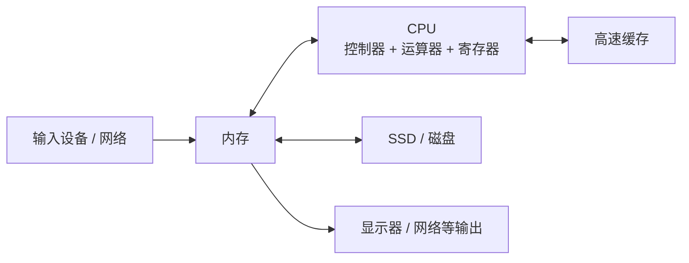
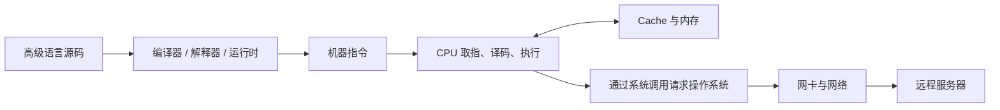

> **这一篇建立“从代码到硬件”的整体图景**
> 程序和数据怎样进入内存，CPU 怎样按指令处理它们，结果又怎样通过设备和网络离开计算机。

### 第一章 计算机里有什么

-   **基本组成**：硬件（运算器、控制器（解码指令并发出信号）、存储器、输入/输出设备）+ 软件。
-   **翻译与执行程序**：
	- **机器语言（二进制）**：这是CPU**唯一能直接听懂**的母语。比如做加法，你要给他一串电信号：`1000101111010000`（全是0和1）。
	- **汇编语言（助记符）**：为了让人好记，科学家给那一串0和1起了**英文小名**。比如把 `1000101111010000` 起名叫 `ADD AX, BX`（意思是“把BX寄存器里的数加到AX里”）。
	- **高级语言（C/Python/Java）**：这是给“人类工程师”读的。你只需要写 `a = b + c`，编译器/解释器会自动把它翻译成一大堆汇编指令，再转成机器码。
    -   **汇编器**：汇编语言 -> 机器语言。
    -   **解释器**：读取程序并借助运行时执行。它可能逐步解释，也可能先生成字节码，再由虚拟机或 JIT 编译器执行；不一定是“逐句直接翻译成机器码”。
    -   **编译器**：在运行前或运行过程中，把源码转换为机器码、目标文件、字节码或另一种语言。现代语言常混合解释、编译与 JIT，边界并非绝对。
-   **一些性能指标**：
    -   **CPU执行时间** = CPU时钟周期数 × 时钟周期。
    -   **CPI** = 执行程序所需时钟周期数 / 指令条数。
    -   **MIPS** = 指令数 / (执行时间 × 10^6)。
    -   **FLOPS** = 浮点操作次数 / 执行时间（秒）。
    -   **吞吐量**：单位时间处理的信息量；**响应时间**：从输入到响应的时间。
    -   单个指标不能代表整机性能。主频高不保证程序一定快；不同指令集的单条指令工作量不同，所以 MIPS 不适合直接比较不同架构。真实评估应使用接近实际负载的基准，并同时观察延迟、吞吐量、功耗和成本。
-   **字长概念**：
    -   **机器字长** = 运算精度（如32位/64位）。
    -   **指令字长** = 一条机器指令编码所占的位数。某些指令集定长，某些变长；它与存储字长的关系取决于具体体系结构，不能一概而论。

---

### 第二章 数据的表示和运算

-   **无符号数运算**：加法直接加；减法变加法（减数全部按位取反，末位+1）。
-   **带符号数（原/反/补/移码）范围（8bit）**：

| 类型 | 表示范围 | 零的表示 |
| :--- | :--- | :--- |
| 原码 | -127 ~ +127 | +0 / -0（两种） |
| 反码 | -127 ~ +127 | +0 / -0（两种） |
| **补码** | **-128 ~ +127** | **唯一（00000000）** |
| 移码 | -128 ~ +127 | 唯一（10000000） |

> **补码为什么重要**
> 现代计算机通常用补码表示带符号整数，因为同一套加法电路就能处理加法和减法，而且零只有一种表示。固定 bit 数意味着运算可能溢出；程序不能把有限位整数当成无限大的数学整数。

浮点数则通常采用 IEEE 754 一类格式，用符号、指数和有效数字近似表示实数。因此 `0.1 + 0.2` 可能无法精确等于十进制 `0.3`。金额、计量和科学计算要根据误差需求选择整数、十进制定点或浮点数。

---

### 第三章 存储系统

| 层级     | 名称                        | 速度             | 容量         | 谁管它       | 断电丢失？ |
| ------ | ------------------------- | -------------- | ---------- | --------- | ----- |
| **L0** | **寄存器 (Register)**        | **极快（1个时钟周期）** | 几十~几百字节    | 程序员（汇编/C） | 是     |
| **L1** | **高速缓存 (Cache L1/L2/L3)** | 很快（几个~十几个时钟周期） | 几MB~几十MB   | CPU自动控制   | 是     |
| **L2** | **主存 (内存/RAM)**           | 中等（几十纳秒）       | 8GB~128GB  | 操作系统      | 是     |
| **L3** | **外存 (硬盘/SSD)**           | 慢（毫秒级或微秒级）     | 256GB~20TB | 用户/文件系统   | **否** |

这个层级体现了一个核心取舍：**越靠近 CPU，通常越快、越小、单位容量越贵；越远则通常越慢、越大、越便宜。** Cache 通过保存近期或邻近数据，利用时间局部性和空间局部性弥合 CPU 与内存速度差距。

表中的时间和容量只是数量级示意，会随硬件代际和具体设备变化。寄存器、缓存与 RAM 都是易失性存储，断电后通常丢失；SSD 和磁盘适合长期保存。

---

### 第四章 指令系统

-   **指令格式**：通常包含操作码和操作数/地址相关字段。在固定指令长度下，操作数字段越多，每个字段可用位数可能越少；但不能概括成“地址码越多，寻址能力一定越差”。
-   **扩展操作码**：高频指令用短码，低频用长码。
-   **数据寻址方式（核心区分）**：
    -   **基址寻址**：EA = (BR) + A。BR由**操作系统**决定，内容不变（基地址），A可变（偏移量）。面向**程序重定位**。
    -   **变址寻址**：EA = (IX) + A。IX由**用户**改变（偏移量），A不变（基地址）。面向**数组/循环处理**。
    -   **相对寻址**：EA = (PC) + A。用于**转移指令**（支持程序浮动）。

---

### 第五章 中央处理器
-   **cpu=运算器+控制器**
-   **cpu功能：** 指令控制、操作控制、时间控制、数据加工、中断处理。
-   运算器的功能：对数据加工
-   控制器的功能：取指令、分析指令、执行指令
-   **指令周期**：取指 -> (间址) -> 执行 -> (中断)。
-   **数据通路（单总线）**：ALU只能一端连总线，另一端需配**暂存器**防止冲突。
-   **控制器**：
    -   **硬布线控制器**：由组合/时序逻辑直接生成控制信号，通常速度快，但复杂设计的修改成本较高。
    -   **微程序控制器**：用控制存储器中的微指令生成控制信号，设计更规整、便于实现复杂指令，但可能增加执行层次。
        -   **微命令** -> **微操作**。
        -   **微指令** = 一组微命令（存放在CM中）。
        -   **微程序** = 完成某类机器指令或公共流程的一段微指令序列。
    -   RISC/CISC 描述指令集设计取向，不能与硬布线/微程序控制器简单一一对应；现代处理器内部实现经常混合多种技术。
-   **指令流水线（五段式：IF-ID-EX-M-WB）**：
    -   **结构冒险**：争抢硬件（解决：指令Cache和数据Cache分离）。
    -   **数据冒险**：下条指令用上条结果（解决：**数据旁路技术** 或 暂停时钟）。
    -   **控制冒险**：转移指令（解决：尽早判断转移条件、预取分支指令）。
-   **并行分类**：SIMD（数据级并行），MIMD（线程级并行）。

---

### 第六章 总线

-   **分类**：
    -   **数据总线**：通常双向，宽度影响一次可并行传输的数据量，但不单独决定机器字长或存储字长。
    -   **地址总线**：单向，位数决定寻址空间。
    -   **控制总线**：有单向有双向。
-   **总线结构**：
    -   **单总线**：简单易扩展，但带宽低（不支持并发）。
    -   **双/三总线**：提高I/O吞吐量，但硬件成本增加。
-   **定时方式**：
    -   **同步通信**：统一时钟，速度快但强制同步。
    -   **异步通信**：应答方式（不互锁/半互锁/全互锁），可靠性递增，速度递减。

---

### 第七章 I/O系统

-   **编址方式**：
    -   **统一编址**：把I/O端口当内存地址（不用专门指令，但占内存空间）。
    -   **独立编址**：有专门的I/O指令（译码快，不占内存，但电路复杂）。
-   **I/O控制方式**：
    1.  **程序查询**：CPU串行等待，效率最低。
    2.  **程序中断**：CPU与外设并行（传送时串行）。
    3.  **DMA**：DMA 控制器在外设与主存之间批量传送数据，减少 CPU 逐字节搬运；它仍需竞争内存/总线资源，并非总能与主存访问完全并行。
-   **中断流程（重点）**：
    -   **中断隐指令（硬件自动完成）**：关中断 -> 保存断点（PC） -> 引出中断服务程序（向量地址）。
    -   **中断服务程序（软件执行）**：保护现场 -> 中断服务 -> 恢复现场 -> 中断返回。
-   **DMA vs 中断**：

| 比较项 | 中断 | DMA |
| :--- | :--- | :--- |
| 数据传送 | CPU程序控制 | **DMA控制器**硬件控制 |
| 响应时机 | 指令执行结束 | 总线空闲（机器周期结束） |
| 请求目的 | 请求CPU处理时间 | 请求**总线使用权** |
| 适用场景 | 低速设备 | 高速设备（磁盘等） |
| 优先级 | 低 | **高** |

> **表格中的“优先级”不是永恒规则**
> 具体中断与 DMA 仲裁策略由硬件和系统设计决定。这里想表达的是：高速批量 I/O 常需要及时获得总线资源，而不是说所有计算机里 DMA 的优先级必然高于任何中断。

---

## 从代码到一次请求

把本篇各部分串起来看：

1. 源码被转换或解释为 CPU 可执行的指令。
2. 指令和数据从存储器进入缓存与寄存器。
3. CPU 执行程序；需要文件或网络时，通过系统调用进入操作系统。
4. 操作系统和驱动控制网卡，把数据发到网络。

## 延伸阅读

- [Nand2Tetris：从逻辑门构建现代计算机](https://www.nand2tetris.org/)
- [Computer Systems: A Programmer's Perspective 配套站点](https://csapp.cs.cmu.edu/)
