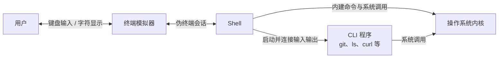
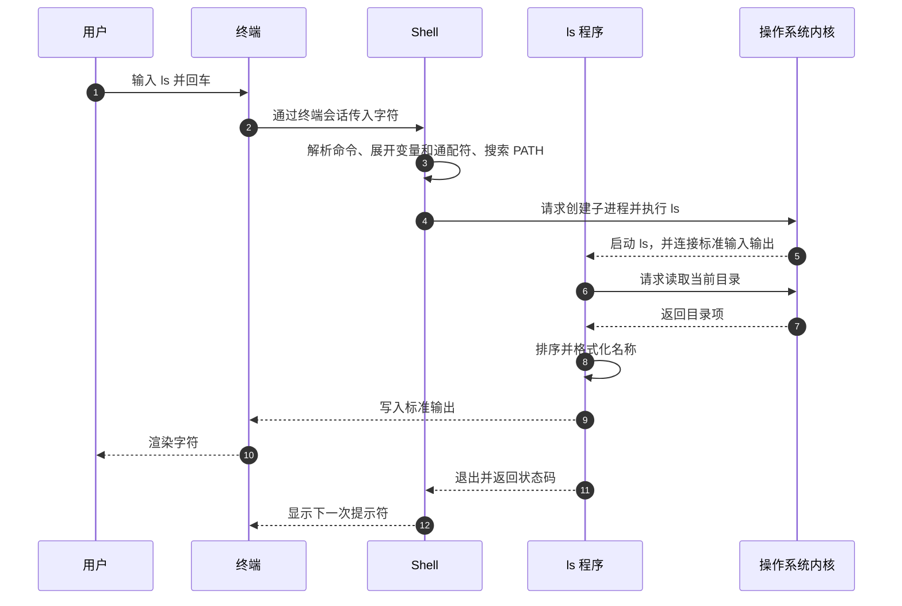

> **这一节回答了**
> - 终端、Shell 和 CLI 为什么经常一起出现，却不是同一件事？
> - 输入一条命令并回车后，Shell、程序与操作系统分别做了什么？
> - 参数、当前目录、环境变量、标准输入输出和管道如何配合？

## 1. 理清概念

| 术语               | 定义                       | 本质属性               |
| :--------------- | :----------------------- | :----------------- |
| **终端（Terminal）** | 接收键盘输入、显示字符并连接命令行会话的界面程序 | **输入输出界面 / 终端模拟器** |
| **命令行界面（CLI）**   | 用文本命令操作某个程序的交互方式         | **交互界面与命令约定**      |
| **Shell（壳）**     | 读取并解析命令，组织程序执行的命令解释器     | **程序 / 进程**        |

---
## 2. 介绍

### 终端（Terminal）
-   **历史渊源**：最早指连接大型主机的物理硬件（如键盘、打印机或显示器组合）；今天日常所说的终端通常指**终端模拟器（Terminal Emulator）**，即电脑上的一个应用程序。
-   **职责**：
    1.  **捕获输入**：捕获你的键盘敲击。
    2.  **渲染输出**：把字符画在屏幕上。
    3.  **传递数据**：通过伪终端等机制，把输入交给 Shell 或前台程序，并显示程序写出的字符与控制序列。
-   **常见软件**：Mac 的“终端.app”、Windows 的“Windows Terminal”（注意不是CMD）、Linux 的 GNOME Terminal、iTerm2 等。

### Shell（壳）
-   **职责**：
    1.  **解析命令**：把你输入的 `ls -la` 拆解成“程序名”和“参数”。
    2.  **发起调用**：向操作系统内核（Kernel）申请执行这个程序。
    3.  **组织输入输出**：设置标准输入、标准输出、管道和重定向，然后等待或管理程序。
    4.  **提供 Shell 自身能力**：变量、通配符、条件、循环、函数、作业控制以及 `cd` 等内建命令。
-   通常是被启动的具体程序（例如 `ls`）调用内核读取目录并格式化结果，Shell 主要负责找到和启动它，而不是替所有程序格式化输出。
-   **常见“类型”**：
    -   **Bash**（许多 Linux 环境和服务器中常见）。
    -   **Zsh**（现代 macOS 的默认登录 Shell）。
    -   **PowerShell**（Windows 上的现代 Shell，也可跨平台运行）。
    -   **CMD**（Windows 的传统命令解释器，功能和语法与 PowerShell 不同）。

### CLI（命令行界面）
-   **对立面**：GUI（图形用户界面，点图标那种）。
-   **特征**：主要通过文本参数和标准输入输出交互，适合精确、重复和自动化任务；它并不绝对排斥鼠标或图形内容。
-   **注意**：CLI 描述的是界面形式，但“CLI 工具”本身当然可以是可安装的软件，例如 `git`、`curl` 和 `obsidian`。你通常在终端里通过 Shell 启动这些程序，也可以由脚本或其他程序直接启动它们。

---

## 3. 几个误区

| 易混淆点            | 正确理解                                                                                                                |
| :-------------- | :------------------------------------------------------------------------------------------------------------------ |
| **终端 = Shell？** | 错误。终端负责会话的输入输出，Shell 负责解析和组织命令。关闭终端时，关联 Shell 通常会收到挂断信号而退出，但借助 `tmux`、`screen`、`nohup` 或服务管理器，进程也可以继续运行。 |
| **CMD 是终端吗？** | `cmd.exe` 的核心角色是传统 Shell；旧式控制台窗口常让两者看起来像一个东西。Windows Terminal 则可以承载 PowerShell、CMD 或 WSL 中的 Shell。 |
| **SSH 算终端吗？** | SSH 是安全远程登录与传输协议。交互登录时，本地终端显示内容，远程机器上的 Shell 执行命令，SSH 在中间加密传输数据。 |
| **Shell 就是所有命令？** | 不是。`cd` 等是 Shell 内建命令；`git`、`python`、`ls` 等通常是 Shell 启动的独立程序。 |

---

## 4. Shell 和终端的关系实验

在电脑上验证这些概念，可以试试以下操作（以 Mac 为例）：

1.  **查看当前 Shell 进程**：
    输入 `ps -p $$ -o comm=`。`$$` 是当前 Shell 的进程号。

    `echo $SHELL` 通常显示账户配置的登录 Shell，但在你临时进入另一个 Shell 后，它不一定随之改变。

2.  **确认终端应用名称**：
    输入：`echo $TERM_PROGRAM`
    *（在支持该变量的终端中，会显示 Apple_Terminal、iTerm.app 等；它不是进程号。）*

3.  **神奇的一刻：在同一个终端里“换掉”Shell**
    输入 `bash` 回车，你会发现提示符变了（比如从 `%` 变成 `$`）。
    **此时**：你的终端窗口没变，但背后的翻译官从 Zsh 换成了 Bash。输入 `exit` 可以退出当前 Bash 回到原来的 Shell。

#### 图 1：静态结构关系




---

#### 图 2：动态执行流程（按下回车键后发生了什么）




---

## 5. 一条命令的结构

```bash
git commit -m "add login page"
```

可以拆成：

| 部分 | 含义 |
| --- | --- |
| `git` | 要启动的程序 |
| `commit` | 传给 Git 的子命令 |
| `-m` | 选项，表示下一项是提交说明 |
| `"add login page"` | 一个包含空格的参数，因此用引号包住 |

Shell 负责按照自己的语法把整行拆成参数数组，再启动程序。`git` 自己负责解释 `commit` 和 `-m` 的业务含义。

### 引号为什么重要

```bash
touch My Notes.md       # Shell 会认为这是两个参数
touch "My Notes.md"     # 这是一个含空格的文件名
```

- 单引号通常原样保留其中字符；
- 双引号仍允许 `$变量` 等展开；
- 未加引号的空格、`*`、`$`、`;` 等可能被 Shell 解释。

从网页复制命令前，应先理解其中的路径、变量、重定向和命令替换，尤其不要直接运行来源不明、要求管理员权限或会递归删除文件的命令。

---

## 6. 当前目录、PATH 与环境变量

### 当前工作目录

每个进程都有当前工作目录，相对路径从这里解析：

```bash
pwd              # 显示当前目录
cd project       # 改变 Shell 自己的当前目录
ls ./src         # ./ 表示当前目录
ls ../            # ../ 表示上一级目录
```

`cd` 通常必须是 Shell 内建命令：如果由一个独立子进程改变目录，子进程退出后无法改变父 Shell 的当前目录。

### PATH

输入 `git` 时，Shell 会在 `PATH` 环境变量列出的目录中依次查找可执行程序：

```bash
echo "$PATH"
command -v git
```

如果程序已安装却提示 `command not found`，常见原因是其目录不在 PATH，或配置改变后当前 Shell 尚未重新加载。

### 环境变量

环境变量是父进程传给子进程的一组字符串配置：

```bash
export APP_ENV=development
node server.js
```

子进程通常继承一份环境；它在内部修改变量，不会反向改写已经运行的父进程。环境变量适合配置，但敏感值仍可能被进程、日志或错误报告泄露，需要配合秘密管理。

---

## 7. 标准流、重定向与管道

程序启动时通常拥有三个标准流：

| 编号 | 名称 | 默认连接到 | 用途 |
| --- | --- | --- | --- |
| 0 | stdin | 终端键盘 | 输入 |
| 1 | stdout | 终端窗口 | 正常输出 |
| 2 | stderr | 终端窗口 | 错误和诊断信息 |

Shell 可以重新连接这些流：

```bash
# 把正常输出写入文件；会覆盖目标文件
ls > files.txt

# 追加而不是覆盖
date >> history.txt

# 让一个程序的 stdout 成为下一个程序的 stdin
printf 'apple\npear\napple\n' | sort | uniq -c

# 把错误输出单独写入文件
some-command 2> errors.log
```

管道连接的是数据流，不是“把屏幕上的字复制过去”。这让许多职责单一的 CLI 工具能够组合成更复杂的处理流程。

> **重定向由 Shell 先执行**
> `command > important.txt` 会在程序运行前打开并截断目标文件。即使命令随后失败，原内容也可能已经丢失。覆盖重要路径前先确认。

---

## 8. 退出状态与命令组合

程序结束时会返回整数退出状态：通常 `0` 表示成功，非 `0` 表示某类失败。

```bash
some-command
echo "$?"       # 查看上一条命令的退出状态
```

Shell 可据此决定是否继续：

```bash
build-command && deploy-command
```

只有前一条成功时，后一条才运行。自动化脚本不应只搜索输出中的“成功”二字，而应正确检查退出状态。

---

## 9. 交互式 Shell 与 Shell 脚本

你在终端里逐条输入，是交互式使用；把命令写入文件，可形成可重复执行的 Shell 脚本：

```bash
#!/usr/bin/env bash
set -euo pipefail

npm ci
npm test
npm run build
```

脚本适合胶合工具和自动化流程，但当数据结构、错误恢复和业务逻辑变复杂时，Python、JavaScript 等通用语言通常更容易维护。

`set -euo pipefail` 能帮助 Bash 脚本更早暴露部分错误，但也有具体语义和边界，不能代替显式的错误设计与测试。

---

## 10. 常见故障的判断顺序

| 现象                          | 先检查什么                             |
| --------------------------- | --------------------------------- |
| `command not found`         | 拼写、是否安装、`command -v`、PATH         |
| `permission denied`         | 文件权限、目录权限、是否可执行；不要直接用 777         |
| `no such file or directory` | 当前目录、相对路径、大小写、引号                  |
| 命令一直不结束                     | 是否正在等待输入、网络或子进程；可先用 `Ctrl+C` 请求中断 |
| 输出被下一条命令吞掉                  | stdout/stderr 是否分别重定向，管道中哪一步失败    |
| 脚本在自己电脑正常、CI 失败             | Shell 类型、工具版本、环境变量和当前目录是否一致       |

Shell、进程、权限等底层机制可继续阅读 [1.3 操作系统](/blog/1-3-操作系统)；网络命令背后的机制见 [1.2 计算机之间的通信：网络](/blog/1-2-计算机之间的通信-网络)；Git 命令实践见 [2.0 使用Git管理代码](/blog/2-0-使用-git-管理代码)。

## 延伸阅读

- [GNU Bash 手册](https://www.gnu.org/software/bash/manual/)
- [PowerShell 官方文档](https://learn.microsoft.com/powershell/)
- [The Art of Command Line](https://github.com/jlevy/the-art-of-command-line)
