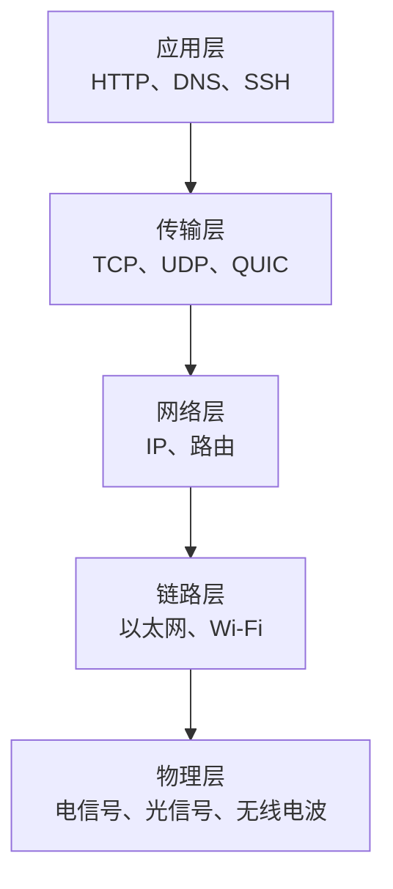
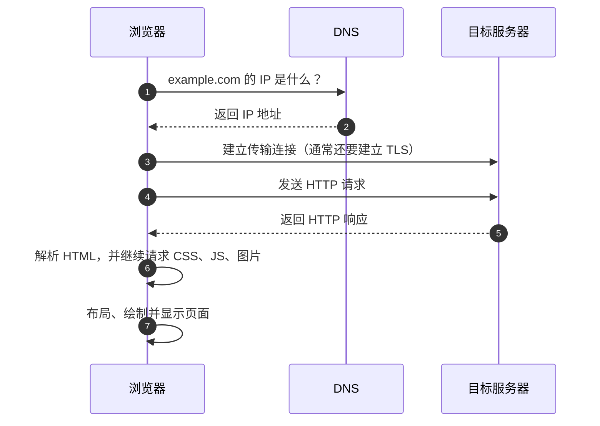

> **这一节回答了**
> - 浏览器输入网址后，数据大致经过了哪些环节？
> - IP、域名、端口、URL 分别解决什么问题？
> - TCP、UDP、HTTP、HTTPS 为什么不是同一层的东西？
> - 五层模型与 OSI 七层模型有什么区别，表示层和会话层去了哪里？
> - “网速快”究竟可能指带宽高，还是延迟低？

## 1. 网络到底是什么

计算机网络的核心目标很朴素：**让不同设备上的程序能够交换数据**。

两台电脑用一根线直接相连，是网络；家里的手机、电脑和路由器组成的是局域网；大量局域网再通过运营商和骨干网络互联，就形成了互联网（Internet）。

需要区分三个概念：

| 概念 | 含义 | 例子 |
| --- | --- | --- |
| 网络（network） | 一组能够互相通信的设备 | 家庭 Wi-Fi、公司内网 |
| 互联网（Internet） | 全球网络互联形成的基础设施 | IP、路由器、海底光缆共同构成的体系 |
| 万维网（Web） | 运行在互联网之上的一种应用 | 浏览器通过 HTTP 访问网页 |

所以，**互联网不等于 Web**。电子邮件、SSH、网络游戏也使用互联网，但它们不一定属于 Web。

---

## 2. 为什么网络要“分层”

一次网络通信涉及网线、无线电、网卡、路由、可靠传输、网页协议等许多问题。如果每个应用都自己解决全部问题，软件几乎无法复用。网络因此采用分层设计：**每一层只解决一类问题，并使用下一层提供的能力**。

实际学习中，可以先掌握下面这个五层模型：



| 层次  | 主要问题              | 常见协议或技术        | 可以理解为       |
| --- | ----------------- | -------------- | ----------- |
| 应用层 | 程序之间按什么格式交流       | HTTP、DNS、SSH   | 双方使用的“业务语言” |
| 传输层 | 数据如何送到目标机器上的正确程序  | TCP、UDP、QUIC   | 分拣到具体窗口     |
| 网络层 | 跨越多个网络后，如何找到目标机器  | IP、路由          | 跨城市规划路线     |
| 链路层 | 同一段网络里的设备如何传递一帧数据 | Ethernet、Wi-Fi | 在当前路段运输     |
| 物理层 | 比特怎样变成真实信号        | 双绞线、光纤、无线电     | 道路和车辆本身     |

发送数据时，数据通常逐层被包装成适合该层处理的形式，例如加上 TCP 首部、IP 首部和链路层首部/尾部，这叫**封装**；接收方再逐层处理，叫**解封装**。物理层主要负责把比特变成信号，并不是再加一个同类“包头”。应用只需关心“我要发送一段 JSON”，不必知道某个比特最终走了哪根光纤。

### 2.1 五层模型与 OSI 七层模型怎么对应

**OSI 是描述通信职责的七层参考模型；五层模型是便于学习互联网协议的常用教学划分。** 

OSI 自下而上编号为 1—7 层。对照起来看，主要差别在上三层：

| OSI 七层（自上而下）         | 核心职责                       | 对应五层模型           |
| -------------------- | -------------------------- | ---------------- |
| 7. 应用层（Application）  | 为应用提供通信服务，约定请求与响应等交互规则     | 应用层              |
| 6. 表示层（Presentation） | 处理数据的表示方式与转换，使双方能理解相同的数据表示 | 应用层中承担相关功能的协议或库  |
| 5. 会话层（Session）      | 组织通信对话，提供对话控制、同步点等机制       | 应用层中承担相关功能的协议或程序 |
| 4. 传输层（Transport）    | 提供端到端传输能力                  | 传输层              |
| 3. 网络层（Network）      | 跨网络寻址与转发                   | 网络层              |
| 2. 数据链路层（Data Link）  | 在相邻节点之间组织帧的传送              | 链路层              |
| 1. 物理层（Physical）     | 通过介质传送比特信号                 | 物理层              |

OSI 的标准来源是 [ITU-T X.200 基本参考模型](https://www.itu.int/rec/T-REC-X.200-199407-I/en)。

### 2.2 多出来的表示层和会话层，具体解决什么问题

**表示层关心“同一份数据怎样表示”，而不只是“有没有送到”。**

例如，发送方把中文编码成 UTF-8 字节，接收方就需要按相应编码解读；结构化数据也需要双方约定表示格式。字符编码、序列化和压缩可以帮助理解这类职责，但 JSON、UTF-8 本身不等于独立的 OSI 表示层协议，业务数据的含义仍由应用约定。

**会话层关心“这一段对话怎样组织和同步”，不只是“底层连接通没通”。**

例如，一段复杂交互可能需要约定谁在何时发送、在哪里建立同步点、发生中断后如何协调继续。实际互联网应用可能自行实现这些功能，并不一定存在一个独立的会话层模块。

> **同名词不一定是同一个层次**
> - 网站的登录 Session 是应用维护的身份状态，不等于直接实现了 OSI 第 5 层。
> - TCP 连接提供传输状态，不等于 OSI 会话；一次应用会话可能跨越多条 TCP 连接。
> - TLS 常被拿来类比表示层的安全处理，但不能因此断言“所有加密都属于第 6 层”。真实协议的功能边界不一定与 OSI 完全重合。

### 2.3 还有一种 TCP/IP 四层模型

TCP/IP 常按**应用层、传输层、互联网层、链路层**描述；本节五层模型又把底部的链路部分拆成链路层和物理层，便于分别学习帧与信号。互联网层在本节中称为网络层。[RFC 1122 第 1.1.3 节](https://www.rfc-editor.org/rfc/rfc1122.html#section-1.1.3) 给出了互联网协议族的分层描述。

所以，不宜把 TCP/IP 的历史简单说成“工程师把 OSI 删掉三层”。它们是不同的体系与抽象方式，只是在教学中可以建立对应关系。

### 2.4 放到一次网页请求中理解

以 **HTTP/1.1 over TLS over TCP** 为例，实际协议组合可以写成：

```text
HTTP 请求/响应 → TLS 保护 → TCP 传输 → IP 转发 → 链路帧 → 物理信号
```

这里列的是实际处理环节，并不是在定义一种“六层模型”。HTTP/3 则采用 QUIC，不能照搬这条 TCP 链路。

学习五层模型时，重点掌握 HTTP、TCP、IP 和链路如何协作；借助 OSI 时，可以进一步区分数据表示、对话组织与业务协议等职责。**分层是分析工具，不是要求程序中必须有七个模块。**

以后遇到“二层交换”“三层路由”“四层/七层负载均衡”，通常是在借用 OSI 编号描述主要处理依据：链路帧、IP，或者传输层信息与 HTTP 等应用内容。一个实际设备可以同时处理多个层次，并不只能属于其中一层。

---

## 3. IP、端口、域名和 URL

这些名词都与“地址”有关，但定位的对象不同。

| 名称     | 定位什么              | 示例                                  |
| ------ | ----------------- | ----------------------------------- |
| MAC 地址 | 同一链路附近的一块网络接口     | `3c:22:fb:...`                      |
| IP 地址  | 网络中的一台主机或一个网络接口   | `192.168.1.8`、`2001:db8::1`         |
| 端口     | 一台主机上的某个网络程序      | `80`、`443`、`3000`                   |
| 域名     | 便于人记忆、可映射到 IP 的名称 | `example.com`                       |
| URL    | 某种协议下一个具体资源的位置    | `https://example.com:443/docs?id=7` |

以这个 URL 为例：

```text
https://example.com:443/docs/index.html?id=7#part-2
└─协议─┘ └──主机名──┘ 端口└────路径────┘└查询┘└片段┘
```

- **DNS** 把域名解析成 IP。它更像分布式的通讯录，而不是保存网页的地方。
- **IP 地址**把数据送到某台主机附近。
- **端口**再把数据交给这台主机上正在监听的具体进程。
- **URL**不仅包含主机，还描述协议、路径和参数，因此能定位一个具体资源。

端口范围是 `0`～`65535`。端口并不是物理插孔，而是操作系统维护的逻辑编号。同一台电脑上的 Web 服务可以监听 `3000`，数据库可以监听 `5432`，互不混淆。

---

## 4. 输入网址后发生了什么

下面省略了缓存、代理和很多优化，但保留了主干流程：



更细一点看：

1. 浏览器先检查自身和系统的 DNS 缓存，没有结果才询问 DNS 解析器。
2. 操作系统根据目标 IP 和路由表，决定把数据直接发给局域网设备，还是交给默认网关（通常是家用路由器）。
3. 数据经过多个路由器。每个路由器只决定“下一跳去哪”，通常并不知道完整路径。
4. 到达服务器后，操作系统根据端口把数据交给 Web 服务进程。
5. 响应沿网络返回；往返路径不保证完全相同。

家庭路由器通常还做 **NAT**：多台内网设备共享一个公网 IP。`192.168.x.x`、`10.x.x.x` 一类地址通常只能在局域网中使用，互联网上的其他机器不能直接凭这个地址找到你的电脑。

---

## 5. TCP、UDP 与 QUIC

IP 尽力把一个个数据包送到目的地，但它不保证包一定到达、按顺序到达或只到达一次。传输层在此基础上提供不同取舍。

| 特性 | TCP | UDP | QUIC |
| --- | --- | --- | --- |
| 连接 | 有连接 | 无连接 | 有连接 |
| 可靠、有序 | 是 | 协议本身不保证 | 是 |
| 拥塞控制 | 有 | 需应用自行处理 | 有 |
| 加密 | 通常再叠加 TLS | 没有内置 | 默认集成 TLS |
| 常见用途 | HTTP/1.1、HTTP/2、SSH、数据库 | DNS、语音、实时游戏 | HTTP/3 |

- **TCP** 像一条可靠字节流：丢包会重传，乱序会整理，但这些保证会增加等待。
- **UDP** 像直接投递一份份独立消息：开销小、控制自由，可靠性要由上层按需要补充。
- **QUIC** 构建在 UDP 之上，但自己实现可靠传输、多路复用和加密。不能因为底层用了 UDP，就认为 HTTP/3“不可靠”。

选择协议不是简单的“谁更快”，而是选择**可靠性、延迟、实现复杂度与业务需求之间的平衡**。

---

## 6. 衡量网络体验的几个指标

| 指标              | 含义              | 直观影响       |
| --------------- | --------------- | ---------- |
| 带宽（bandwidth）   | 理论上单位时间最多能传多少数据 | 大文件下载上限    |
| 吞吐量（throughput） | 实际单位时间成功传输了多少数据 | 真实下载速度     |
| 延迟（latency）     | 数据从一端到另一端所需时间   | 点击后的响应速度   |
| 往返时延（RTT）       | 请求过去再回来一次的时间    | 多轮通信的累计等待  |
| 丢包率             | 数据包未成功到达的比例     | 卡顿、重传、画质下降 |
| 抖动（jitter）      | 延迟随时间波动的程度      | 语音和视频是否稳定  |

一条“千兆宽带”可能带宽很高，但如果服务器远、路由绕、往返次数多，网页仍可能感觉慢。前端性能优化不只是压缩文件，也包括减少请求轮次、合理缓存和使用离用户更近的 CDN。

---

## 7. HTTPS 在保护什么

普通 HTTP 内容可能在传输途中被查看或篡改。HTTPS 是 **HTTP 运行在 TLS 提供的安全通道之上**，主要提供：

1. **机密性**：旁观者难以读懂传输内容。
2. **完整性**：数据被篡改时能够被发现。
3. **身份认证**：浏览器通过证书验证自己连接的服务器是否有权代表该域名。

HTTPS 不代表网站本身一定可信，也不能消除服务器漏洞。它保护的是传输通道，并为服务器身份提供验证基础。

---

## 8. 在自己的电脑上观察网络

```bash
# 查询域名对应的 IP
nslookup example.com

# 测量基本连通性和往返时间；有些服务器会禁止回应 ping
ping example.com

# 查看 HTTP 响应头
curl -I https://example.com

# 查看到目标途中经过的路由节点（macOS / Linux）
traceroute example.com
```

浏览器开发者工具的 **Network** 面板更加实用：可以看到每个请求的 URL、方法、状态码、资源大小以及 DNS、连接、等待、下载分别花了多久。

---

## 9. 常见误区

| 误区 | 正确认识 |
| --- | --- |
| 域名就是服务器 | 域名是名称，可以映射到一个或多个 IP，也可以随时改指向 |
| 一个 IP 只能放一个网站 | 多个域名可以共享一个 IP，服务器根据域名区分请求 |
| 服务器一定是一台物理电脑 | 对外看到的“服务器”可能是负载均衡器、容器集群和数据库共同组成的系统 |
| TCP 有连接，所以一定先有一根专用线路 | “连接”是双方维护的通信状态，不是独占一根物理线 |
| ping 不通就是网站挂了 | ICMP 可能被防火墙屏蔽，而 HTTPS 服务仍然正常 |

---

## 10. 联系

- 网络分层与地址体系是理解 [3.1 HTTP](/blog/3-1-http) 的基础。
- 域名、DNS、HTTPS、端口会在 [2.5 把网页部署到公网上](/blog/2-5-把网页部署到公网上) 中再次出现。
- 跨域是浏览器基于“源”实施的安全规则，详见 [3.3 前后端通信、跨域问题](/blog/3-3-前后端通信-跨域问题)。

## 延伸阅读

- [MDN：HTTP 概览](https://developer.mozilla.org/zh-CN/docs/Web/HTTP/Guides/Overview)
- [MDN：URL 是什么](https://developer.mozilla.org/zh-CN/docs/Learn_web_development/Howto/Web_mechanics/What_is_a_URL)
- [Cloudflare Learning Center：DNS 是什么](https://www.cloudflare.com/zh-cn/learning/dns/what-is-dns/)
