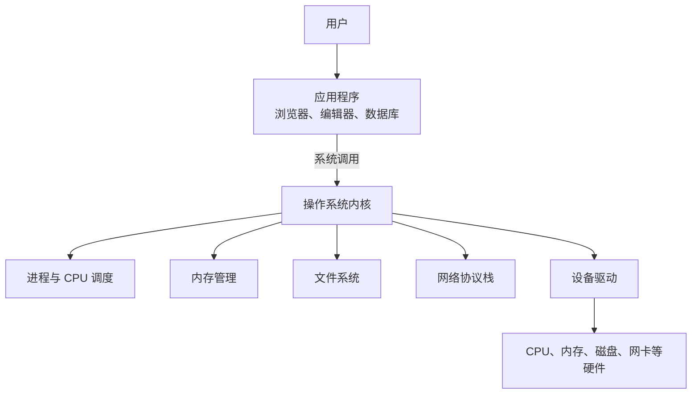
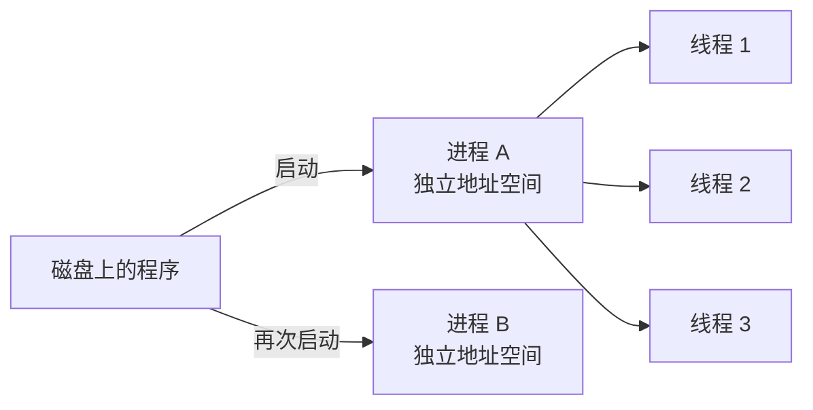

> **这一节回答了**
> - 操作系统为什么不只是“桌面和窗口”？
> - 程序、进程和线程有什么区别？
> - 虚拟内存、文件系统和系统调用分别解决什么问题？
> - Docker 容器和虚拟机为什么不是一回事？

## 1. 操作系统在做什么

操作系统（Operating System，OS）位于应用程序与硬件之间。它有两个核心角色：

1. **资源管理者**：协调 CPU、内存、磁盘、网卡和各种外设，避免程序互相抢夺和破坏。
2. **抽象提供者**：把复杂硬件包装成稳定、统一的概念，例如进程、文件、网络套接字和窗口。

应用程序想读取 SSD 上的一段数据，并不需要知道 SSD 控制器如何发出电信号。它只需请求“打开这个路径下的文件并读取 4 KB”。操作系统负责把抽象请求变成硬件操作。



macOS、Windows、Linux 的界面和生态差异很大，但它们都需要解决这些基本问题。

---

## 2. 内核、用户态与系统调用

为了安全，现代 CPU 和操作系统会区分至少两种权限级别：

- **内核态（kernel mode）**：可以访问全部内存和硬件，内核与驱动主要运行在这里。
- **用户态（user mode）**：普通应用运行在这里，权限受限。

如果每个应用都能直接改写磁盘或其他程序的内存，一个有 bug 的音乐播放器就可能让整个系统崩溃。因此，应用要通过受控入口向内核提出请求，这个入口叫**系统调用（system call）**。

常见系统调用类别包括：

- 创建进程；
- 打开、读取和写入文件；
- 申请或映射内存；
- 建立网络连接；
- 等待事件或计时器。

编程语言通常不会让你直接操作系统调用。比如 Python 的 `open()`、Node.js 的 `fs.readFile()`，最终会经过运行时和标准库调用操作系统。

> **API 不一定是网络接口**
> 系统调用也是一种 API：内核向应用提供的编程接口。Web API 只是 API 的一种，详见 [3.0 什么是API?后端是为了什么？](/blog/3-0-什么是-api-后端是为了什么)。

---

## 3. 程序、进程与线程

| 概念          | 含义                     | 例子                           |
| ----------- | ---------------------- | ---------------------------- |
| 程序（program） | 磁盘上的代码和数据，是静态文件        | `/Applications/Obsidian.app` |
| 进程（process） | 程序的一次运行实例，拥有独立的资源和地址空间 | 打开的一个 软件 进程                  |
| 线程（thread）  | 进程内部可被调度的一条执行路径        | UI 线程、后台工作线程                 |

同一个程序可以启动多个进程；一个进程也可以有多个线程。==进程之间默认隔离，而同一进程的线程通常共享代码、堆内存和打开的文件==，因此线程通信更方便，也更容易产生数据竞争。



### CPU 如何同时运行许多程序

一个 CPU 核心在某个瞬间通常只执行一条指令流。操作系统调度器把运行时间切成很短的片段，在可运行的线程之间快速切换，形成“同时运行”的体验。多核 CPU 则能真正并行执行多条指令流。

线程可能处于：

- **运行**：正在占用 CPU；
- **就绪**：可以运行，正在排队；
- **阻塞/等待**：等待磁盘、网络、锁或计时器，不需要占用 CPU。

这也解释了为什么一个 Web 服务器等待数据库时，操作系统可以让 CPU 去处理其他请求。

---

## 4. 内存与虚拟内存

程序运行时需要存放指令、变量和临时结果。操作系统为每个进程提供一个看似连续、私有的**虚拟地址空间**，再通过页表把虚拟地址映射到真实物理内存。

虚拟内存带来三个重要好处：

1. **隔离**：进程 A 通常不能随意读取进程 B 的内存。
2. **简化**：每个程序都可以假装自己拥有一大片连续地址，不必关心物理内存碎片。
3. **灵活**：暂时不用的内存页可以换出到磁盘，也可以把文件直接映射进地址空间。

典型进程地址空间可以粗略理解为：

| 区域 | 常放什么 | 常见特点 |
| --- | --- | --- |
| 代码段 | 编译后的机器指令 | 通常只读、可共享 |
| 静态数据区 | 全局变量、静态变量 | 生命周期与进程相同 |
| 堆（heap） | 动态创建的对象 | 由分配器和垃圾回收器或程序员管理 |
| 栈（stack） | 函数调用帧、局部变量 | 按调用关系增长和回收，每个线程各有一份 |

当内存紧张时频繁在内存与磁盘之间交换页面，会出现明显卡顿，这叫 **thrashing（颠簸）**。磁盘空间很多并不等于可以毫无代价地替代内存，因为 SSD 仍远慢于 RAM。

> **“内存泄漏”不一定真的丢了内存**
> 它通常是程序持续保留已经不再需要的对象，导致内存无法回收。进程结束后，操作系统会收回该进程资源。

---

## 5. 文件系统：把字节组织成文件和目录

磁盘本质上存放大量数据块。文件系统在其上提供：

- 路径和目录树；
- 文件内容与元数据（大小、时间、所有者、权限）；
- 创建、删除、移动、读取和写入操作；
- 空闲空间管理与崩溃恢复机制。

### 路径

- macOS / Linux 绝对路径示例：`/Users/alice/project/index.html`
- Windows 绝对路径示例：`本地路径`
- `.` 表示当前目录，`..` 表示上一级目录。
- 相对路径依赖当前工作目录；绝对路径从文件系统根开始定位。

文件扩展名通常只是命名约定。把 `photo.jpg` 改名为 `photo.txt` 不会把图片内容变成文本；应用还会根据文件内容或 MIME 类型判断数据格式。

### 权限

类 Unix 系统一般区分文件的所有者、所属组和其他用户，并分别控制读（`r`）、写（`w`）、执行（`x`）权限。权限问题不是“电脑莫名其妙不让我用”，而是隔离机制正在阻止越权操作。

不要把 `chmod 777` 当作通用修复。它相当于把读写执行权限开放给所有人，经常掩盖真正的所有权或部署配置问题。

---

## 6. 设备、驱动和输入输出

硬盘、显卡、键盘和网卡的控制方式各不相同。**设备驱动**把某类硬件的具体细节接入操作系统，让上层看到统一接口。

外设通常远慢于 CPU，所以 I/O 多采用中断、DMA 和异步等待：

- CPU 发起操作后可以先做别的事；
- 设备完成后通过中断通知；
- 大块数据可由 DMA 控制器在设备和内存之间传输，减少 CPU 搬运负担。

这与 [1.0 计算机组成](/blog/1-0-计算机组成) 中的 I/O 系统相呼应。在应用层看到的“异步读取文件”，底层可能横跨运行时、系统调用、驱动、中断和硬件多个环节。

---

## 7. 网络在操作系统里是什么

应用通常通过 **socket（套接字）** 使用操作系统的网络能力。套接字可以理解为一个由操作系统管理的通信端点。

服务端程序会：

1. 创建套接字；
2. 绑定本机 IP 和端口；
3. 监听连接；
4. 接收数据并返回响应。

如果出现“端口已被占用”，本质是另一个进程已经绑定了相同的 IP、端口和协议组合。网络层细节见 [1.2 计算机之间的通信：网络](/blog/1-2-计算机之间的通信-网络)。

---

## 8. 虚拟机与容器

| 对比 | 虚拟机（VM） | 容器（Container） |
| --- | --- | --- |
| 隔离边界 | 模拟/虚拟化硬件，每台 VM 有自己的客体内核 | 多个容器共享宿主机内核 |
| 启动速度 | 通常较慢 | 通常较快 |
| 资源开销 | 较大 | 较小 |
| 运行不同内核 | 可以 | 通常不可以 |
| 常见用途 | 完整系统隔离、运行另一种 OS | 打包和部署应用、统一运行环境 |

Docker 镜像不包含一台完整“迷你电脑”，而是包含应用、依赖和文件系统层；容器启动后仍使用宿主机内核提供的进程、内存、网络等能力。

容器的隔离很有用，但不是绝对安全边界。生产系统仍需最小权限、及时更新和网络隔离。

---

## 9. 从开机到运行应用


开机不是简单地“加载桌面”。桌面出现之前，固件、引导程序、内核、驱动和系统服务已经依次完成大量初始化。

---

## 10. 用命令观察操作系统

以下示例适用于 macOS / Linux：

```bash
# 查看当前进程
ps aux

# 动态查看 CPU、内存和进程
top

# 查找谁占用了 3000 端口
lsof -i :3000

# 查看磁盘文件系统空间
df -h

# 查看文件权限
ls -l
```

当某个服务无法启动时，先确认三个问题：进程是否存在、端口是否被占用、当前用户是否有权读取配置和绑定所需资源。

---

## 11. 常见误区

| 误区 | 正确认识 |
| --- | --- |
| 关闭窗口就一定结束了程序 | 有些应用仍在后台运行；窗口与进程不是同一概念 |
| CPU 使用率 100% 就一定坏了 | 它表示计算资源繁忙；是否异常取决于任务和持续时间 |
| 线程越多越快 | 线程有调度和同步成本，CPU 密集任务还受核心数限制 |
| 64 位系统表示有 64 GB 内存 | 64 位主要描述地址与运算能力，并不等于已安装内存容量 |
| Docker 可以让任意镜像无差别运行在任意系统 | 容器依赖宿主内核；CPU 架构和内核兼容性仍然重要 |

## 与后续内容的关系

- [1.1 shell，终端（Terminal），CLI](/blog/1-1-shell-终端-terminal-cli) 讲的是人如何通过命令与系统交互。
- [2.0 使用Git管理代码](/blog/2-0-使用-git-管理代码) 中的路径、文件状态与进程都建立在操作系统之上。
- Web 服务器、端口和进程是 [3.2 后端框架做了哪些事？](/blog/3-2-后端框架做了哪些事) 的运行基础。

## 延伸阅读

- [Operating Systems: Three Easy Pieces（免费英文教材）](https://pages.cs.wisc.edu/~remzi/OSTEP/)
- [Linux 内核文档](https://docs.kernel.org/)
- [Docker：容器是什么](https://docs.docker.com/get-started/docker-concepts/the-basics/what-is-a-container/)
