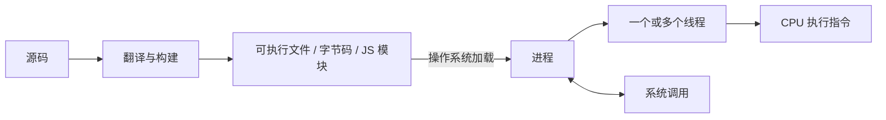
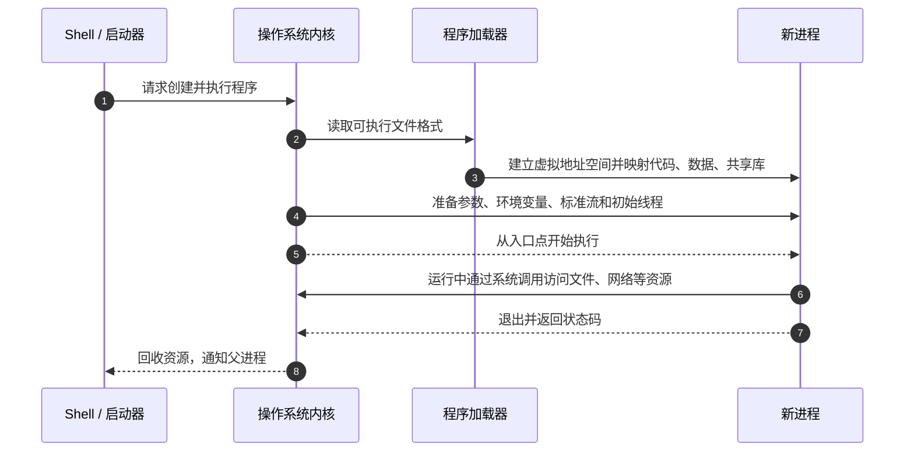
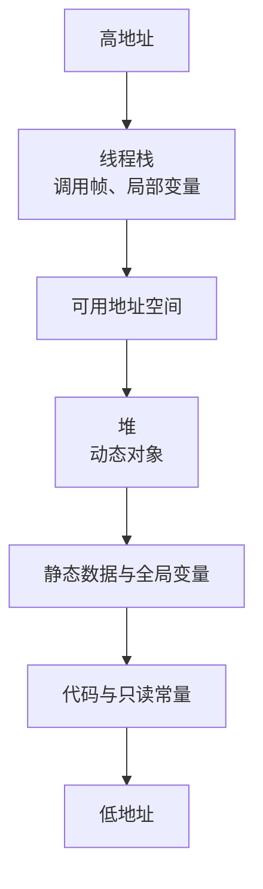
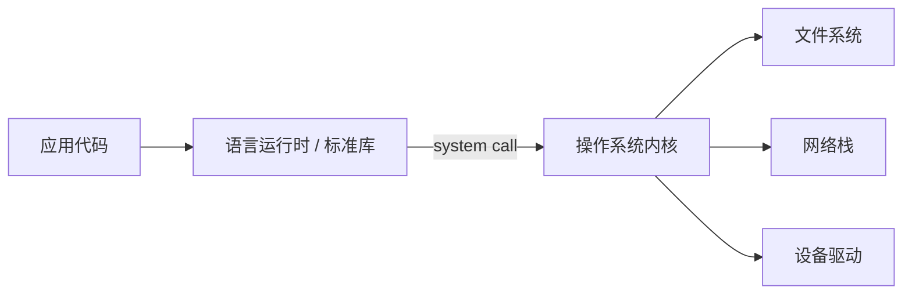

> **这一节回答了**
> - 一份源码怎样变成正在运行的进程？
> - 编译、链接、加载、解释和 JIT 分别发生在什么时候？
> - 运行时、虚拟机、操作系统和 CPU 各自承担什么职责？
> - 为什么“程序卡住”可能是在计算，也可能只是在等待 I/O？

## 1. 程序与进程不是一回事

- **程序**是磁盘上的代码和静态数据，例如一个可执行文件、一组 JavaScript 文件或一个 `.jar`。
- **进程**是程序的一次运行实例，拥有自己的虚拟地址空间、打开的文件、线程、权限和运行状态。

同一程序可以同时启动多个进程，每个进程拥有独立状态。修改磁盘上的程序文件，也不会自动改变已经加载到内存中的旧进程。



---

## 2. 从源码到可执行内容

不同语言采用不同组合，没有“编译型语言”和“解释型语言”永远不变的二分法。

| 阶段 | 主要工作 | 可能的产物 |
| --- | --- | --- |
| 词法与语法分析 | 把字符识别为 token 和语法树 | AST |
| 语义与类型检查 | 判断名称、类型和规则是否成立 | 诊断信息、带类型的中间表示 |
| 优化 | 在不改变可观察结果的前提下改写程序 | 优化后的 IR |
| 代码生成 | 转换成目标形式 | 机器码、字节码、JavaScript |
| 链接 | 把多个目标文件和库的符号连接起来 | 可执行文件或共享库 |

### 编译

C/C++ 常提前生成特定 CPU 和操作系统可执行的机器码。TypeScript 则通常“编译”为 JavaScript；这仍是编译，只是目标不是机器码。

### 解释

解释器读取程序表示并执行其含义。实现可以逐步遍历语法树，也可以先生成字节码，交给虚拟机执行。

### JIT

JIT（Just-In-Time compilation）会在运行过程中把热点代码编译成机器码。现代 JavaScript 引擎、JVM 和 .NET 运行时常混合解释、分析与 JIT。

> **语言规范与实现要分开**
> JavaScript 是一门语言；V8、SpiderMonkey 是它的实现。Python 是语言；CPython、PyPy 是不同实现。某种实现今天如何执行，不等于语言本身永远规定必须如此。

---

## 3. 链接：代码如何找到其他代码

程序通常依赖许多模块和库。编译某个文件时，调用目标可能还只有名字；链接器负责解析这些符号。

```text
main.o ─┐
math.o ─┼─> 链接器 ─> app
libc  ──┘
```

### 静态链接

所需库代码在链接时进入最终文件。

- 优点：部署时外部依赖较少；
- 代价：文件更大，库更新后通常要重新构建。

### 动态链接

程序运行时加载共享库，例如 `.so`、`.dylib`、`.dll`。

- 优点：多个进程可共享代码页，库可独立提供；
- 代价：目标机器必须有兼容版本，可能出现“找不到动态库”或 ABI 不兼容。

**ABI（应用二进制接口）**约定机器层面的调用方式、数据布局和符号格式。源代码 API 看起来相同，不代表编译后的二进制一定兼容。

前端构建也会“链接”模块依赖图，但输出和运行环境不同，详见 [2.3 前端构建](/blog/2-3-前端构建)。

---

## 4. 操作系统如何启动程序

以本地可执行程序为例：



加载不一定一次把整个文件读入 RAM。现代系统可通过虚拟内存按需调页：某段代码第一次被访问时，缺页异常触发内核把对应页载入。

启动进程时还会准备：

- 命令行参数；
- 环境变量；
- 当前工作目录；
- 标准输入、输出和错误流；
- 用户身份、权限和资源限制。

这些内容解释了为什么同一个程序在不同目录、用户或环境变量下行为可能不同。

---

## 5. 进程的虚拟地址空间

典型布局可粗略理解为：



这只是概念图；具体方向、随机化、共享库和映射区域由平台决定。

### 栈

函数调用会形成调用帧，保存参数、局部数据、返回位置等。调用结束后按后进先出方式回收。

递归太深可能耗尽有限栈空间，产生 stack overflow。

### 堆

生命周期不随单次函数调用结束的对象通常分配在堆上：

- C/C++ 常由程序员配合分配器管理；
- Java、JavaScript、Python 等常由垃圾回收器判断哪些对象仍可达。

垃圾回收减少手工释放错误，但不代表不会泄漏。只要程序仍持有引用，不再需要的对象也无法回收。

---

## 6. CPU 实际执行什么

CPU 不认识“用户”“订单”或 `for` 循环，只执行指令集定义的机器指令，例如：

- 从内存加载数据到寄存器；
- 算术与逻辑运算；
- 比较并条件跳转；
- 把结果写回内存；
- 调用函数或进入系统调用。

经典指令周期可概括为：

```text
取指 → 译码 → 执行 → 访存 → 写回
```

现代 CPU 会流水线、乱序执行、分支预测和并行发射，让多个阶段重叠。但它必须保证最终可观察行为符合指令集约定。

源码中的一行可能对应零条、一条或很多机器指令。优化器甚至可能删除无法被观察到的计算，所以不能简单用源码行数推断执行成本。

---

## 7. 用户程序为什么不能直接控制一切硬件

普通进程运行在用户态。读取文件、建立网络连接或申请映射内存时，必须通过系统调用进入内核：



这种边界提供隔离与统一接口。一个程序崩溃时，操作系统通常仍能回收它的内存和句柄，而不会任由其破坏其他进程。

详见 [1.3 操作系统](/blog/1-3-操作系统)。

---

## 8. CPU 密集与 I/O 密集

| 类型 | 时间主要花在哪里 | 例子 | 常见优化方向 |
| --- | --- | --- | --- |
| CPU 密集 | 计算和指令执行 | 视频编码、压缩、模型推理 | 更好算法、并行、向量化、专用硬件 |
| I/O 密集 | 等待网络、磁盘或数据库 | Web API、文件下载 | 异步、并发、缓存、批处理、减少往返 |

程序“不占 CPU 却很慢”可能只是阻塞等待。反过来，把 CPU 密集工作包装成 `async` 也不会自动更快。

性能分析应先测量：

- CPU 时间与墙上时间；
- 系统调用与 I/O 等待；
- 内存分配与垃圾回收；
- 锁竞争；
- 网络和数据库耗时。

不要凭直觉优化不在瓶颈上的代码。

---

## 9. 函数调用与调用栈

```js
function calculateTotal(items) {
  return sum(items) + calculateTax(items);
}
```

调用函数通常涉及：

1. 按调用约定传入参数；
2. 保存返回位置和必要寄存器；
3. 创建调用帧；
4. 执行函数；
5. 返回结果并恢复调用者状态。

异常的堆栈跟踪（stack trace）正是沿调用关系记录“谁调用了谁”。调试时应从最接近自己业务代码的位置开始，结合错误发生前的数据，而不是只看最后一句错误文字。

异步程序的逻辑调用关系可能跨越任务队列，传统栈已经退出，因此运行时和调试器需要额外记录异步调用链，详见 [2.9 异步、事件循环与 Promise](/blog/2-9-异步-事件循环与-promise)。

---

## 10. 运行时是什么

运行时（runtime）是程序执行期间提供支持的一组软件能力，可能包括：

- 内存分配和垃圾回收；
- 类型信息和异常处理；
- 模块加载；
- 线程或事件循环；
- JIT 编译；
- 标准库与操作系统接口。

| 名称 | 主要角色 |
| --- | --- |
| 浏览器 | JavaScript 引擎 + DOM、网络等 Web API + 渲染平台 |
| Node.js | JavaScript 引擎 + 服务端 I/O 与标准库 |
| JVM | 执行 JVM 字节码并提供 JIT、GC 等能力 |
| CPython | Python 的一种常用解释器和运行时实现 |
| .NET | 执行中间语言并提供运行时、库和 JIT |

“JavaScript 单线程”通常是在描述某个执行代理中的主调用栈，不代表浏览器或 Node.js 进程只创建一个操作系统线程。

---

## 11. 一个命令为何可能运行失败

| 阶段 | 典型错误 |
| --- | --- |
| 查找 | `command not found`、路径错误 |
| 加载 | 文件格式不支持、架构不匹配、共享库缺失 |
| 初始化 | 配置缺失、端口被占用、权限不足 |
| 运行 | 异常、越界、空值、资源耗尽、死锁 |
| I/O | DNS、超时、磁盘满、连接被拒绝 |
| 退出 | 未处理信号、清理失败、非零状态码 |

系统化排错时先定位失败阶段，见 [5.1 调试与系统化排错](/blog/5-1-调试与系统化排错)。

## 小结

```text
源码
  → 编译/解释/JIT
  → 可执行表示
  → 操作系统加载为进程
  → 线程被调度到 CPU
  → 通过系统调用使用文件、网络和设备
  → 退出并由系统回收资源
```

## 延伸阅读

- [1.0 计算机组成](/blog/1-0-计算机组成)
- [1.3 操作系统](/blog/1-3-操作系统)
- [Computer Systems: A Programmer's Perspective](https://csapp.cs.cmu.edu/)
- [Nand2Tetris](https://www.nand2tetris.org/)
