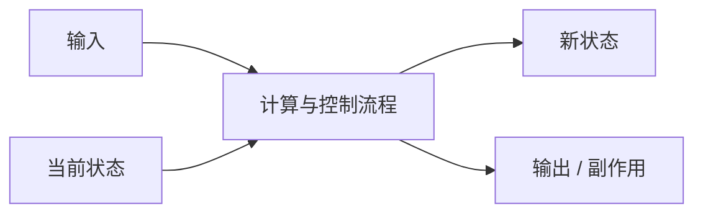

> **这一节回答了**
> - 值、变量、表达式、语句和类型是什么关系？
> - 函数、作用域、闭包与副作用分别意味着什么？
> - 为什么程序设计的核心不是记语法，而是维护状态和不变量？
> - 面向对象、函数式与事件驱动为何可以同时出现在一个项目里？

## 1. 编程是在精确描述变化

程序可以看成：**接收输入，在一组规则约束下改变状态，产生输出或副作用。**



一个订单程序的输入可以是商品与用户，状态包括库存和订单记录，输出可以是响应页面，副作用则包括写数据库和发送消息。

学习一门语言时，不要只背关键字。需要抓住几乎所有通用语言都有的模型：数据、控制、抽象、状态、错误和边界。

---

## 2. 值、变量、类型、表达式与语句

### 值

值是程序处理的信息，例如数字 `42`、字符串 `"hello"`、布尔值 `true`、用户对象或函数本身。

### 变量

变量是程序中引用某个值的名称：

```js
const price = 99;
let quantity = 2;
```

`const` 表示这个变量名不能再次绑定到另一个值，不代表引用的对象内部绝对不可变：

```js
const user = { name: '小林' };
user.name = '小周'; // 对象内部仍被修改
```

### 类型

类型描述一组可能的值和允许的操作。例如字符串支持拼接，日期可能支持比较和格式化。类型可以：

- 在运行时由值携带并检查；
- 在编译前由静态类型系统推断和验证；
- 同时存在静态与运行时规则。

### 表达式与语句

- **表达式**会求得一个值：`price * quantity`。
- **语句**执行一个动作或控制流程：`if (...) { ... }`。

不同语言边界略有区别。理解“求值”和“改变控制流程”比死记分类更重要。

---

## 3. 控制流程

程序不只是从上到下机械执行，还需要选择和重复。

### 条件

```js
if (stock >= quantity) {
  createOrder();
} else {
  showOutOfStock();
}
```

条件表达的是业务分支。复杂条件最好命名：

```js
const canPurchase = user.isActive && stock >= quantity && !product.isArchived;
```

### 循环

```js
let total = 0;
for (const item of items) {
  total += item.price * item.quantity;
}
```

循环必须清楚：

- 处理的集合是什么；
- 何时结束；
- 每轮维护什么状态；
- 空集合和边界值如何处理。

### 提前返回

```js
function withdraw(account, amount) {
  if (amount <= 0) return { ok: false, reason: 'INVALID_AMOUNT' };
  if (account.balance < amount) return { ok: false, reason: 'INSUFFICIENT_FUNDS' };

  account.balance -= amount;
  return { ok: true };
}
```

先排除异常情况，通常比多层嵌套更容易读。但过多散落的返回也可能让清理和事务边界难以追踪。

---

## 4. 函数：给一段规则建立边界

函数把输入映射为输出，并可能产生副作用：

```js
function calculateSubtotal(price, quantity) {
  return price * quantity;
}
```

一个好函数通常：

- 名称表达意图；
- 输入输出明确；
- 职责聚焦；
- 不依赖大量隐式全局状态；
- 失败方式可预测；
- 可以在较小环境中测试。

### 参数与返回值

参数是调用者提供的信息，返回值是函数明确交还的结果。修改全局变量、写文件和发网络请求不会出现在返回值里，这些叫副作用。

### 调用栈

函数 A 调用 B，B 调用 C，会形成调用栈。C 返回后才能回到 B，再回到 A。无限递归或递归过深可能耗尽栈空间。

---

## 5. 作用域与生命周期

作用域决定一个名称在代码的哪些位置可见：

```js
const taxRate = 0.13;

function total(price) {
  const tax = price * taxRate;
  return price + tax;
}
```

- `taxRate` 在外层作用域；
- `tax` 只在函数内部可见；
- 内层通常可以读取外层名称；
- 外层不能直接读取已经离开作用域的局部名称。

生命周期与作用域相关但不完全相同。一个名称不再可见时，它引用的对象可能仍被其他地方引用。

### 闭包

函数会保留其创建位置的词法环境：

```js
function createCounter() {
  let count = 0;

  return function increment() {
    count += 1;
    return count;
  };
}

const next = createCounter();
next(); // 1
next(); // 2
```

`createCounter` 已返回，但内部函数仍引用 `count`，所以这份状态继续存在。闭包适合封装状态，也是回调和前端事件处理的基础；错误地长期保留大型对象，也可能导致内存无法回收。

---

## 6. 值语义、引用与可变性

```js
const a = { score: 1 };
const b = a;
b.score = 2;

console.log(a.score); // 2
```

这里 `a` 和 `b` 引用同一个对象，并没有复制两份对象。

这类问题需要区分：

- 变量本身是否能重新赋值；
- 值是复制还是共享引用；
- 对象内部是否允许修改；
- 函数是否改变了传入对象。

不可变更新会创建新值：

```js
const updated = { ...a, score: 3 };
```

它让变化更容易追踪，但浅拷贝只复制第一层；嵌套对象仍可能共享。不可变也会带来分配成本，应根据模型和工具选择。

---

## 7. 状态与不变量

**状态**是系统当前记住的信息。**不变量**是在所有合法状态中都必须成立的规则。

例如银行账户：

```text
不变量：若不允许透支，则 balance >= 0
```

如果任何代码都能随意改 `balance`，规则很难维持。更好的做法是把变化集中在受控操作：

```js
function withdraw(account, amount) {
  if (!Number.isFinite(amount) || amount <= 0) {
    throw new Error('金额必须是正数');
  }
  if (account.balance < amount) {
    throw new Error('余额不足');
  }
  account.balance -= amount;
}
```

真实后端还需要数据库事务，防止两个并发请求同时通过余额检查，见 [4.4 事务、并发与隔离级别](/blog/4-4-事务-并发与隔离级别)。

程序设计的一个核心任务，就是找到重要不变量，并让所有状态变化都经过能保护它们的边界。

---

## 8. 纯函数与副作用

纯函数在相同输入下产生相同输出，并且不改变外部世界：

```js
function calculateTax(amount, rate) {
  return amount * rate;
}
```

副作用包括：

- 写数据库或文件；
- 发网络请求；
- 修改外部变量；
- 读取当前时间或随机数；
- 操作 DOM；
- 输出日志。

副作用并非坏事——没有副作用，程序无法保存或展示结果。关键是把纯计算与外部交互分开：


纯逻辑更容易测试，副作用集中后更容易重试、监控和处理失败。

---

## 9. 错误是控制流程的一部分

常见错误表达方式：

| 方式 | 适用情况 | 风险 |
| --- | --- | --- |
| 抛出异常 | 当前层无法正常继续的意外失败 | 捕获范围不清会隐藏问题 |
| 返回 Result / 状态对象 | 可预期的业务失败 | 调用者可能忘记检查 |
| 返回空值 | “没有结果”本身正常 | 容易与系统故障混淆 |
| 错误码 | 跨进程、系统接口 | 需要稳定文档和映射 |

```js
function parsePositiveInteger(text) {
  const value = Number(text);
  if (!Number.isInteger(value) || value <= 0) {
    return { ok: false, error: 'NOT_POSITIVE_INTEGER' };
  }
  return { ok: true, value };
}
```

不要用异常表达所有正常分支，也不要吞掉意外异常后假装成功。边界层应把内部错误转换成调用者能理解、又不泄露敏感细节的形式。

---

## 10. 抽象与接口

抽象隐藏不需要调用者关心的细节，同时保留稳定能力：

```js
// 调用者只依赖发送能力，不必知道具体邮件供应商
async function registerUser(input, mailer) {
  const user = await saveUser(input);
  await mailer.sendWelcome(user.email);
  return user;
}
```

一个好的抽象需要：

- 边界围绕真实职责；
- 名称与业务语言一致；
- 不泄露内部结构；
- 能表达失败和约束；
- 替换实现时调用者尽量不变。

过早抽象会把猜测固化。通常先允许少量重复，观察变化模式，再抽出真正共同的概念。

---

## 11. 几种编程范式不是互斥阵营

### 过程式

按步骤组织数据处理流程，适合清楚的算法和脚本。

### 面向对象

把数据与操作组合为对象，通过封装、多态等方式管理协作。适合表达有身份和生命周期的实体，但继承层级过深会增加耦合。

### 函数式

重视不可变数据、函数组合和副作用隔离。适合数据转换与并发推理，但真实 I/O 仍需明确处理。

### 事件驱动

程序注册处理器，在点击、消息或网络事件到来时运行。浏览器 UI、服务器和消息系统中很常见。

一个现代 Web 应用完全可以：用对象表示领域实体、用纯函数计算价格、用过程组织用例、用事件触发界面更新。

---

## 12. 同步、异步、并发与并行

| 概念 | 含义 |
| --- | --- |
| 同步 | 调用者按当前流程等待操作完成 |
| 异步 | 操作完成后通过 Promise、回调、事件等通知 |
| 并发 | 多个任务在时间上交错推进 |
| 并行 | 多个任务在同一时刻由多个执行单元工作 |

异步是一种控制流程表达，并发是一种任务关系，并行是一种实际执行方式。三者不能互相替代。

浏览器事件循环详见 [2.9 异步、事件循环与 Promise](/blog/2-9-异步-事件循环与-promise)。

---

## 13. 写出容易理解的程序

1. 用领域含义命名，而不是 `data1`、`temp2`。
2. 让函数输入输出明确，减少隐藏依赖。
3. 先写清不变量和失败情况，再写顺利路径。
4. 在边界验证外部输入，内部使用可信模型。
5. 分离计算与 I/O。
6. 不用注释重复代码；注释解释原因、约束和反直觉之处。
7. 让一次变化尽量局限在少数模块。
8. 用测试保存重要行为，而不是只靠记忆。

### 阅读代码的顺序

面对陌生代码，可以先问：

- 程序入口在哪里？
- 输入从哪里来，输出到哪里去？
- 核心状态存放在哪里？
- 哪些函数改变状态或外部世界？
- 错误如何向上传递？
- 哪些规则绝不能被破坏？

## 延伸阅读

- [1.4 程序是怎样运行的](/blog/1-4-程序是怎样运行的)
- [1.6 常用数据结构与复杂度](/blog/1-6-常用数据结构与复杂度)
- [2.8 JavaScript：语言核心](/blog/2-8-javascript-语言核心)
