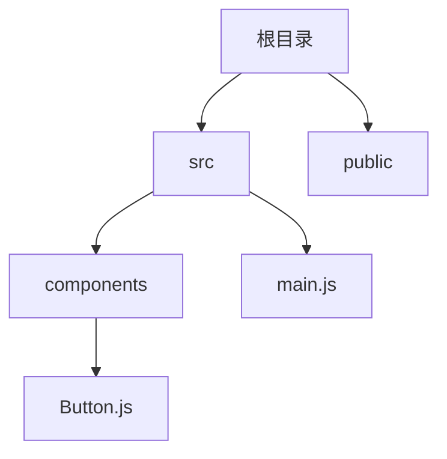
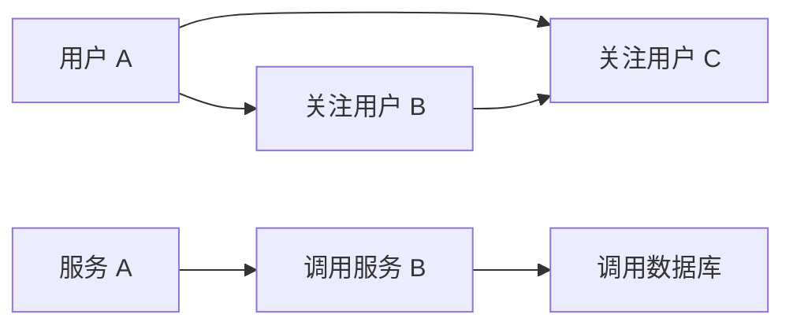

> **这一节回答了**
> - 数据结构与抽象数据类型有什么区别？
> - `O(1)`、`O(log n)`、`O(n)` 表达的是什么，而不是什么？
> - 数组、哈希表、栈、队列、树、堆和图分别擅长什么？
> - 为什么选择数据结构要同时考虑时间、内存、顺序和业务语义？

## 1. 数据结构是在安排信息

同一批数据可以用不同方式组织，而组织方式决定某类操作是否容易。

例如保存一百万个用户：

- 放在无序数组中，按 ID 查找可能要逐个比较；
- 放在以 ID 为键的哈希表中，平均可以直接定位；
- 按注册时间建立有序树或数据库索引，则更适合范围查询。

**数据结构不是为了炫技，而是让系统经常执行的操作具有合适成本。**

### 抽象数据类型（ADT）与实现

- 队列描述“先进先出”的操作语义，是一种抽象数据类型；
- 它可以由循环数组、链表或其他结构实现；
- 调用者关心 `enqueue`、`dequeue`，不必总知道内部节点如何排列。

接口描述能力，实现决定具体成本。

---

## 2. 如何讨论算法成本

令 `n` 表示输入规模。Big O 常用于描述当 `n` 增大时，操作次数增长的数量级。

| 复杂度 | 增长直觉 | 常见例子 |
| --- | --- | --- |
| `O(1)` | 与 n 无关的常数级 | 数组按下标访问、哈希表平均查找 |
| `O(log n)` | 每一步把范围显著缩小 | 有序数组二分查找、平衡树查找 |
| `O(n)` | 输入翻倍，工作量约翻倍 | 扫描列表寻找最大值 |
| `O(n log n)` | 高效通用排序常见级别 | 归并排序、许多比较排序 |
| `O(n²)` | 两层遍历全部组合 | 朴素检查所有元素对 |
| `O(2ⁿ)` | 每增加一个元素，组合近似翻倍 | 穷举子集 |


### Big O 不告诉你的事

- 不说明具体耗时是 1 微秒还是 1 秒；
- 不自动表示平均、最坏还是摊还复杂度；
- 不包含网络、缓存、磁盘和实现常数的全部影响；
- `O(1)` 可能是很大的常数；
- 小数据上简单的 `O(n²)` 可能比复杂的 `O(n log n)` 更快。

性能判断需要复杂度分析与真实测量共同完成。

---

## 3. 数组（Array）

数组把元素按顺序放置，并通过下标访问：

```text
下标:   0    1    2    3
元素: [A]  [B]  [C]  [D]
```

| 操作 | 典型成本 | 原因 |
| --- | --- | --- |
| 按下标访问 | `O(1)` | 可计算目标位置 |
| 搜索无序值 | `O(n)` | 可能要逐个比较 |
| 末尾追加 | 摊还 `O(1)` | 偶尔扩容并复制 |
| 中间插入/删除 | `O(n)` | 后续元素需要移动 |

数组适合：有顺序的数据、频繁按位置访问、批量遍历。

JavaScript 的 `Array` 是高级动态数组，元素表示和优化由引擎决定；不要把底层细节完全等同于 C 的连续定长数组。

`push`/`pop` 通常适合末尾操作；频繁用 `shift` 从头删除会导致移动或内部维护成本，任务队列较大时应使用专门队列结构。

---

## 4. 链表（Linked List）

链表节点保存值和指向下一节点的引用：

```text
[A | next] → [B | next] → [C | null]
```

已知节点位置时，插入和删除可以是 `O(1)`；但按下标访问第 `k` 个元素通常要从头走，成本 `O(k)`。

链表理论上适合频繁局部插入删除，但现代 CPU 缓存更喜欢连续内存，节点对象也有额外开销。在应用代码中，动态数组往往仍更实用。不要只看到复杂度表就忽略真实硬件和语言实现。

---

## 5. 栈与队列

### 栈：后进先出（LIFO）

```text
push → [最新]
       [较早]
       [最早] ← pop 最后才到这里
```

常见场景：

- 函数调用栈；
- 撤销操作；
- 括号匹配；
- 深度优先搜索；
- 浏览器部分导航历史模型。

### 队列：先进先出（FIFO）

```text
enqueue → [C] [B] [A] → dequeue
```

常见场景：

- 任务调度；
- 消息队列；
- 请求缓冲；
- 广度优先搜索。

队列不仅是容器，还常代表**时间和公平性策略**。真实消息系统还需考虑重试、确认、优先级、重复消费和死信队列。

---

## 6. 哈希表（Hash Map）与集合（Set）

哈希表通过哈希函数把键映射到存储位置：


平均情况下，插入、查找、删除接近 `O(1)`；最坏情况下可能退化，因此实现会处理扩容、碰撞和安全问题。

适合：

- 按 ID 快速查找对象；
- 计数；
- 缓存；
- 去重；
- 记录“是否见过”。

集合只关心成员是否存在：

```js
const permissions = new Set(['read', 'write']);
permissions.has('write'); // true
```

JavaScript 中：

- `Map` 可以使用多种类型作为键，并明确表达映射语义；
- 普通对象适合结构固定的记录；
- 使用外部输入作为对象键时，要注意原型和键转换问题；
- JSON 对象键始终是字符串。

---

## 7. 树（Tree）

树表达层级关系：



常见树：

- 文件目录；
- HTML DOM；
- 抽象语法树；
- 数据库 B-tree / B+tree 索引；
- UI 组件树。

### 二叉搜索树

若左子树键更小、右子树键更大，查找可逐层缩小范围。平衡良好时约为 `O(log n)`；退化成链时可到 `O(n)`。

数据库索引常使用适合磁盘页和范围扫描的 B-tree 家族，而不是教科书里的普通二叉搜索树，详见 [4.3 索引为什么能加速查询](/blog/4-3-索引为什么能加速查询)。

---

## 8. 堆（Heap）与优先队列

这里的 heap 是数据结构，不是进程用于动态分配对象的“堆内存”。

最小堆保证根节点是最小值，但不保证所有元素完全排序：

```text
       2
     /   \
    5     4
   / \   /
  9   7 8
```

典型成本：

- 查看最高优先级：`O(1)`；
- 插入：`O(log n)`；
- 取出最高优先级：`O(log n)`。

适合：任务调度、超时队列、Top K、最短路径算法。优先队列按优先级出队，不保证相同优先级一定按进入顺序，除非实现明确支持稳定性。

---

## 9. 图（Graph）

图由顶点和边组成，适合表达任意关系：



常见表示：

- 邻接表：只记录实际存在的边，适合稀疏图；
- 邻接矩阵：用二维表记录任意两点关系，查询边快但空间约 `O(V²)`。

遍历：

- DFS（深度优先）：常用栈或递归；
- BFS（广度优先）：使用队列，可求无权图最少边数路径。

模块依赖、社交关系、路由网络和工作流都可建模为图。循环依赖就是依赖图中的环。

---

## 10. 排序与查找

### 线性查找

无序数据逐个检查，最坏 `O(n)`。

### 二分查找

有序、可随机访问的数据中，每次排除一半，成本 `O(log n)`。

二分查找最常见 bug 是边界：左右端点是否包含、中点如何取、循环何时停止。理解不变量比背模板可靠。

### 排序

通用比较排序在常见模型下通常目标为 `O(n log n)`。选择算法还要看：

- 是否稳定；
- 是否原地；
- 数据是否几乎有序；
- 内存限制；
- 键是否能用计数/基数方法处理。

应用开发通常优先使用标准库排序，并明确比较函数。不要默认字符串、日期和数字会按你想要的方式排序。

---

## 11. 递归与迭代

递归让函数处理更小的同类问题：

```js
function walk(node) {
  visit(node);
  for (const child of node.children) {
    walk(child);
  }
}
```

适合树、图、分治算法，但要有：

- 基准情况；
- 问题规模确实缩小；
- 对深度和环的控制。

遍历未知深度的用户数据时，显式栈可能比递归更安全；遍历图时要维护 `visited`，否则遇到环会无限重复。

---

## 12. 空间换时间与局部性

缓存和索引通过额外空间换取更快查询：

```text
原始数据 + 索引/缓存
          ↑ 额外内存和维护成本
          ↓ 更少扫描与计算
```

代价包括：

- 写入时同步更新；
- 数据可能过期；
- 占用内存或磁盘；
- 增加一致性和失效逻辑。

连续数组虽然中间插入是 `O(n)`，但其缓存局部性可能让实际遍历远快于链表。算法分析必须结合数据规模、访问模式和硬件。

---

## 13. 全栈场景如何选择

| 场景 | 首先想到 | 还要问 |
| --- | --- | --- |
| 按用户 ID 查内存对象 | Map | 数据量、淘汰策略、是否需要持久化 |
| 防止重复提交 ID | Set | 保存多久、多实例如何共享 |
| 处理后台任务 | Queue | 持久化、重试、幂等、顺序 |
| 取未来最早超时任务 | Priority Queue | 时间更新、并发、故障恢复 |
| 目录或评论回复 | Tree | 深度、移动节点、权限继承 |
| 服务调用关系 | Graph | 是否有环、故障传播、可视化 |
| 数据库范围查询 | B-tree 索引 | 选择性、排序、写入成本 |

当数据需要跨进程、跨机器或重启后保留时，内存数据结构还不够，需要数据库、缓存或消息系统。

---

## 14. 常见误区

| 误区 | 正确认识 |
| --- | --- |
| `O(1)` 就一定瞬间完成 | 它只表示不随 n 增长，常数仍可能很大 |
| 哈希表永远比数组快 | 顺序遍历、内存局部性和小数据下数组可能更好 |
| 链表插入永远是 `O(1)` | 只有已经拿到正确节点位置时；先查位置可能是 `O(n)` |
| 数据库有索引就无需懂数据结构 | 索引类型、列顺序和查询模式直接决定是否有效 |
| 复杂度只看一行代码 | 标准库调用背后可能遍历、排序、复制或发网络请求 |
| 算法学习就是刷题 | 工程中更重要的是识别数据规模、访问模式和边界条件 |

## 小练习

实现一个页面访问统计器：输入一组 URL，输出每个 URL 的次数和访问最多的三个 URL。分别思考用嵌套循环、Map 和优先队列/排序实现时，时间与空间成本如何变化。

## 延伸阅读

- [1.5 编程的基本模型](/blog/1-5-编程的基本模型)
- [4.3 索引为什么能加速查询](/blog/4-3-索引为什么能加速查询)
- [MDN：Map](https://developer.mozilla.org/zh-CN/docs/Web/JavaScript/Reference/Global_Objects/Map)
- [MDN：Set](https://developer.mozilla.org/zh-CN/docs/Web/JavaScript/Reference/Global_Objects/Set)
