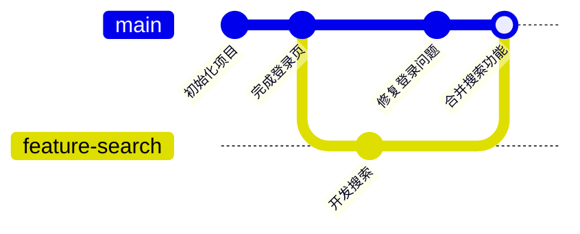
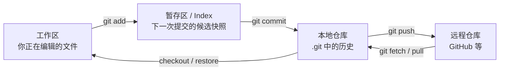

> **这一节回答了**
> - Git 保存的究竟是什么，为什么它不等于 GitHub？
> - 工作区、暂存区、本地仓库和远程仓库是什么关系？
> - `add`、`commit`、`push` 分别把变化送到了哪里？
> - 分支为什么很轻量，合并冲突又为什么会出现？

## 1. 为什么需要版本控制

没有版本控制时，项目目录很容易变成：

```text
论文-最终版.docx
论文-最终版2.docx
论文-真的最终版.docx
论文-真的最终版-老师修改.docx
```

这种方式的问题不仅是文件名混乱，还包括：

- 不知道每一版为什么改变；
- 很难只比较其中几行；
- 多人修改时容易互相覆盖；
- 想撤销一个错误时，不知道该退回哪一份；
- 无法可靠判断某个问题从何时、由哪次修改引入。

**版本控制系统（VCS）记录文件集合随时间的变化，使我们可以比较、恢复、协作和审计。** Git 是一种分布式版本控制系统，也是现代软件开发最常用的基础工具之一。

> **Git 不等于 GitHub**
> - **Git** 是运行在本地的版本控制软件，没有网络也能提交、查看历史和创建分支。
> - **GitHub / GitLab / Gitee** 是托管 Git 仓库并提供协作功能的网站。
> - 可以只用 Git 而不用 GitHub，也可以把同一仓库同步到多个远程平台。

---

## 2. Git 的核心观念：快照与历史图

可以把一次提交（commit）理解为项目在某个有意义时刻的**快照**。Git 会复用没有变化的内容，因此并非每次都粗暴复制整个项目。

每个提交主要包含：

- 项目当时的文件树；
- 作者、时间和提交说明；
- 指向父提交的引用；
- 根据内容计算出的对象标识。

提交通过父子关系形成一张有向无环图，而不只是“版本 1、版本 2、版本 3”的简单编号。



提交说明应该解释这次变更的目的，例如 `fix: prevent duplicate form submission`，而不是只写 `update` 或 `改了一些东西`。

---

## 3. 四个位置与三种常见状态



| 位置 | 作用 | 常见动作 |
| --- | --- | --- |
| 工作区（working tree） | 实际看见和编辑的文件 | 修改、创建、删除 |
| 暂存区（staging area / index） | 精确选择下一次提交要包含的变化 | `git add` |
| 本地仓库（repository） | 保存在 `.git` 中的提交历史 | `git commit` |
| 远程仓库（remote） | 用于备份与协作的另一份仓库 | `git push`、`git fetch` |

被 Git 跟踪的文件常见有三种状态：

- **modified**：工作区已修改，但未加入暂存区；
- **staged**：变化已放入暂存区，准备进入下一次提交；
- **committed**：快照已写入本地仓库。

因此：

- `git add` 不是“上传”；
- `git commit` 默认也不会发到互联网；
- `git push` 才会把本地已有提交发送到远程仓库。

---

## 4. 从零开始的一次完整操作

```bash
# 进入项目目录
cd my-project

# 把当前目录初始化为 Git 仓库，只需执行一次
git init

# 查看当前状态——这是最值得经常使用的命令
git status

# 将指定文件的当前版本放入暂存区
git add index.html styles.css

# 查看暂存区将提交什么
git diff --staged

# 创建本地提交
git commit -m "feat: add home page"

# 查看简洁历史
git log --oneline --graph --decorate --all
```

如果项目已经存在于远程：

```bash
# 第一次取得完整仓库
git clone https://example.com/user/project.git

# 获取并整合远程分支的新提交
git pull

# 将自己的本地提交推到对应远程分支
git push
```

`git pull` 通常相当于“先 `fetch` 获取远程信息，再把远程变化整合到当前分支”。初学时遇到问题，可以分开执行 `git fetch` 和 `git status`，先看清状态再决定如何整合。

---

## 5. 暂存区为什么不是多余的一步

假设你同时：

- 修复了登录按钮；
- 写到一半一个搜索功能；
- 在日志中加入了临时调试信息。

你可以只暂存登录修复，形成一个干净、可独立理解的提交，而不把半成品和调试代码混进去：

```bash
git add src/login.js
git commit -m "fix: prevent duplicate login requests"
```

更精细时可使用 `git add -p` 按代码片段选择。一个好的提交应该尽量满足：

1. 只解决一件相对完整的事；
2. 提交后项目仍能构建或测试；
3. 说明“为什么改”，而不只是重复代码表面变化。

---

## 6. 分支和 HEAD 是什么

分支不是一整份项目副本。它本质上是一个**可移动的指针**，指向某个提交；创建分支因此很轻量。

- `main`：一个常见的主分支名称；
- `feature/login`：可以指向登录功能的最新提交；
- `HEAD`：表示你当前检出的提交，通常间接指向当前分支。

```text
A --- B --- C  main, HEAD
       \
        D --- E  feature/search
```

常见操作：

```bash
# 创建并切换到新分支
git switch -c feature/search

# 切回主分支
git switch main

# 把指定分支的历史合并进当前分支
git merge feature/search
```

旧教程常用 `git checkout` 同时承担切分支和还原文件等多种职责。现代 Git 提供更清晰的 `git switch` 与 `git restore`；读旧项目时仍会频繁看到 `checkout`。

---

## 7. 合并冲突并不等于 Git 坏了

如果两个分支修改了同一文件的同一片区域，Git 无法替人判断最终意图，就会暂停合并并标出冲突：

```text
<<<<<<< HEAD
当前分支的内容
=======
要合并进来的内容
>>>>>>> feature/search
```

解决流程是：

1. 阅读两边代码和需求；
2. 手工编辑成最终应保留的内容，并删除冲突标记；
3. 运行测试或实际验证；
4. `git add` 标记该文件已经解决；
5. 完成合并提交。

冲突不是谁“输”谁“赢”，而是两个正确或错误的意图需要人来整合。越早同步、分支越小、提交越聚焦，冲突通常越容易处理。

---

## 8. 远程仓库与协作

`origin` 通常只是克隆时自动创建的远程仓库别名，并不具有特殊魔法。

```bash
# 查看远程仓库
git remote -v

# 获取远程的新提交和分支引用，但不修改当前工作区
git fetch origin

# 第一次推送并建立跟踪关系
git push -u origin feature/search
```

典型团队协作流程：


Pull Request（或 Merge Request）不是 Git 协议本身的一部分，而是代码托管平台提供的评审协作功能。

---

## 9. `.gitignore` 与秘密信息

不应提交的常见内容：

```gitignore
# 依赖可由清单重新安装
node_modules/

# 构建产物可重新生成
dist/

# 本地配置和秘密
.env
.env.*

# 操作系统或编辑器临时文件
.DS_Store
```

> **`.gitignore` 不能抹掉已经提交的秘密**
> 如果 API 密钥进入过提交历史，仅在下一次提交中删除仍不安全。应立即吊销并更换密钥，再按实际情况清理历史。Git 仓库也不能替代专门的密码管理工具。

锁文件（如 `package-lock.json`、`pnpm-lock.yaml`）通常应提交，因为它帮助团队和部署环境安装一致的依赖版本。

---

## 10. 更安全地撤销错误

撤销前先运行 `git status` 和 `git diff`，判断变化在哪一层。

| 目标 | 相对安全的做法 | 说明 |
| --- | --- | --- |
| 取消暂存，但保留工作区修改 | `git restore --staged file` | 只把变化移出暂存区 |
| 丢弃某文件尚未提交的修改 | `git restore file` | 会覆盖工作区内容，执行前确认 |
| 撤销一个已共享的提交 | `git revert <commit>` | 新建一个反向提交，不改写公共历史 |
| 修正最近一次提交说明或补文件 | `git commit --amend` | 未推送时更合适；会生成新提交 |

`git reset --hard`、强制推送和清理未跟踪文件都可能造成难以恢复的数据丢失。不了解当前状态时，不要把它们当作“让报错消失”的快捷键。

---

## 11. 一套够用的日常心法

1. 开始前：`git status`，再同步远程变化。
2. 创建短生命周期的功能分支。
3. 小步修改，及时运行测试。
4. 提交前看 `git diff` 与 `git diff --staged`。
5. 提交信息说明目的。
6. 推送并通过代码审查合并。
7. 任何撤销操作前，先确认工作区是否有未保存成果。

### 小练习

创建一个只含 `index.html` 的目录，依次完成：初始化仓库、第一次提交、创建分支、修改标题、第二次提交、切回主分支，然后观察文件和提交图如何变化。最后再合并分支。

## 与后续内容的关系

- Shell 命令的运行方式见 [1.1 shell，终端（Terminal），CLI](/blog/1-1-shell-终端-terminal-cli)。
- 构建产生的 `dist/` 与依赖目录见 [2.3 前端构建](/blog/2-3-前端构建)。
- 把 Git 仓库交给托管平台自动发布，见 [2.5 把网页部署到公网上](/blog/2-5-把网页部署到公网上)。

## 延伸阅读

- [Pro Git 中文版](https://git-scm.com/book/zh/v2)
- [Git 官方命令速查表](https://git-scm.com/cheat-sheet.pdf)
