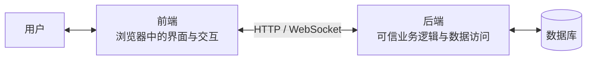
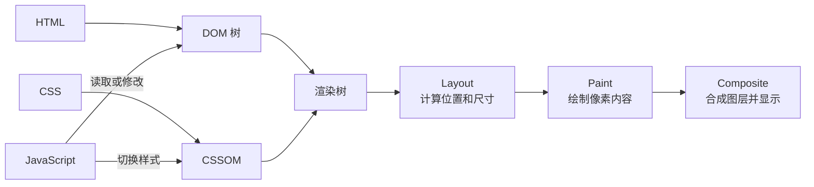
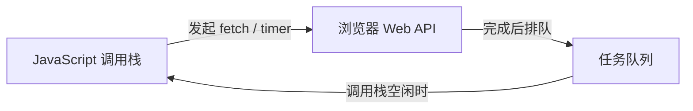

> **这一节回答了**
> - 前端负责了什么？
> - HTML、CSS、JavaScript 分别负责什么？
> - 浏览器收到文件后，如何变成屏幕上的页面？
> - CSR、SSR、SSG 说的是哪一部分发生在什么地方？

## 1. 前端的边界

**前端是直接运行在用户设备上、负责呈现信息并接收交互的应用部分。** 在 Web 开发中，它通常指运行在浏览器里的 HTML、CSS、JavaScript 及其资源。

前端不只是“美工”或“写页面”，它还要处理：

- 信息结构和视觉呈现；
- 鼠标、键盘、触摸和表单交互；
- 页面状态与数据同步；
- 调用后端 API；
- 路由与导航；
- 性能、兼容性、可访问性与一部分安全问题。

前端与后端的边界也不是由文件后缀决定的，而是由**代码在哪个信任环境执行、承担什么职责**决定的。浏览器里的 JavaScript 属于前端；服务器上的 JavaScript（Node.js）属于后端。



---

## 2. HTML、CSS 和 JavaScript

| 技术 | 主要职责 | 典型内容 |
| --- | --- | --- |
| HTML | 描述内容的结构与语义 | 标题、段落、表单、导航、按钮 |
| CSS | 描述视觉样式与布局 | 颜色、字体、间距、响应式布局、动画 |
| JavaScript | 描述行为与动态逻辑 | 事件、请求数据、更新界面、状态管理 |

一个最小示例：

```html
<!doctype html>
<html lang="zh-CN">
  <head>
    <meta charset="UTF-8" />
    <meta name="viewport" content="width=device-width, initial-scale=1" />
    <title>计数器</title>
    <style>
      button { font-size: 1.2rem; padding: 0.5rem 1rem; }
    </style>
  </head>
  <body>
    <p>点击次数：<span id="count">0</span></p>
    <button id="add">加一</button>

    <script>
      let count = 0;
      document.querySelector('#add').addEventListener('click', () => {
        count += 1;
        document.querySelector('#count').textContent = count;
      });
    </script>
  </body>
</html>
```

这里 HTML 给按钮和数字提供语义结构，CSS 改变按钮外观，JavaScript 在点击事件发生后更新状态和页面。

> **语义化 HTML 不是形式主义**
> 使用真正的 `<button>`，浏览器就天然知道它可聚焦、可被键盘触发，并能向辅助技术表达“这是按钮”。用一个 `<div>` 模仿按钮，往往要自己补回这些能力。

---

## 3. 浏览器其实是一套运行平台

浏览器不仅显示文档，它还包括：

- HTML/CSS 解析器与渲染引擎；
- JavaScript 引擎；
- 网络栈、缓存和 Cookie 管理；
- DOM、Fetch、Storage 等 Web API；
- 音视频、图形、字体和可访问性能力；
- 沙箱、同源策略和权限系统；
- 开发者工具。

这与操作系统很相似：前端代码面对的是浏览器提供的抽象，而浏览器再调用操作系统。`fetch()` 不是 JavaScript 语言本身的语法，而是运行环境提供的 Web API。

---

## 4. 文件如何变成画面

浏览器从服务器收到 HTML 后，大致经历：



几个重要概念：

- **DOM**：浏览器把 HTML 解析成的对象树，JavaScript 可以读取和修改它。
- **CSSOM**：浏览器理解后的样式规则结构。
- **Layout（布局）**：计算元素的几何位置和尺寸。
- **Paint（绘制）**：决定文字、颜色、边框等如何画成像素。
- **Composite（合成）**：把不同图层组合为最终画面。

频繁读取布局信息、随后修改样式，再读取、再修改，可能迫使浏览器反复布局，造成卡顿。性能优化的一个本质，就是减少无意义工作并让关键内容尽早完成。

---

## 5. JavaScript 如何处理交互

浏览器页面中的 JavaScript 通常在一个主线程上执行。主线程还承担部分布局、绘制和用户事件工作。某段 JavaScript 如果连续计算数秒，页面就无法及时响应点击和滚动。

异步操作并不是让一切自动并行，而是：

1. JavaScript 发起网络、计时器等任务；
2. 浏览器或系统在其他机制中等待；
3. 任务完成后，对应回调进入任务队列；
4. 调用栈空闲时，事件循环安排回调执行。



`Promise`、`async/await` 让异步代码更容易表达，但不会把 CPU 密集计算变得免费。大量计算可以考虑 Web Worker，或放到服务器处理。

---

## 6. 状态、视图与事件

交互式前端可以抽象成一个循环：

```text
当前状态  ──渲染──>  用户看到的视图
   ▲                     │
   └──── 状态更新 <── 用户事件 / 网络结果
```

例如购物车页面的状态可能包括：商品列表、数量、加载中、错误信息和登录用户。界面只是这些状态在某一时刻的呈现。

常见 bug 往往来自“真实状态有多份”：DOM 中一份、全局变量一份、缓存又一份，彼此没有同步。React、Vue 等工具的价值之一，就是提供更系统的组件和状态更新模型，详见 [2.4 什么是框架？前端框架有哪些？为什么react不是框架？](/blog/2-4-什么是框架-前端框架有哪些-为什么react不是框架)。

---

## 7. 页面如何获得数据

最传统的页面由服务器直接返回完整 HTML。现代页面也常在加载后通过 `fetch()` 请求 JSON：

```js
async function loadUser() {
  const response = await fetch('/api/users/42');

  if (!response.ok) {
    throw new Error(`请求失败：${response.status}`);
  }

  const user = await response.json();
  document.querySelector('#name').textContent = user.name;
}
```

前端不能假设网络永远成功，至少要考虑：

- 加载中如何显示；
- 失败后如何提示和重试；
- 响应过慢或用户连续点击怎么办；
- 返回数据是否符合预期；
- 页面离开后，旧请求结果是否还应更新界面。

前后端通信与跨域规则详见 [3.3 前后端通信、跨域问题](/blog/3-3-前后端通信-跨域问题)。

---

## 8. CSR、SSR 与 SSG

这些术语描述“HTML 在哪里、何时生成”，不是三种互斥编程语言。

| 模式 | HTML 主要何时生成 | 优点 | 代价或难点 |
| --- | --- | --- | --- |
| CSR（客户端渲染） | 浏览器运行 JS 后 | 交互灵活，前后端分离清晰 | 首屏可能等待 JS，SEO 与弱设备体验需处理 |
| SSR（服务端渲染） | 每次请求时在服务器生成 | 首屏内容较早出现，可带请求相关数据 | 服务器负担和缓存策略更复杂；还要水合交互 |
| SSG（静态生成） | 构建时预先生成 | 访问快、便于 CDN 缓存、运行成本低 | 内容更新通常需要重建，页面数量可能影响构建 |

现代框架常在同一应用中混合使用这些策略。一个新闻首页可以定时静态生成，用户中心按请求服务端渲染，登录后的复杂交互再由客户端接管。

**水合（hydration）**是指浏览器在服务器生成的 HTML 上加载 JavaScript，把静态内容连接成可交互组件。服务端已经输出 HTML，不代表浏览器完全不需要 JavaScript。

---

## 9. 前端质量不只看“能不能点”

### 可访问性（Accessibility）

- 使用语义化 HTML；
- 保证键盘可操作和焦点清晰；
- 图片提供合适的替代文本；
- 色彩对比度足够，不只用颜色传达状态；
- 表单输入有对应标签，错误提示能被辅助技术识别。

### 性能

- 减少不必要的 JavaScript 和大图片；
- 对静态资源压缩、缓存和按需加载；
- 避免主线程长任务和反复布局；
- 关注真实用户体验，而不只是在自己电脑上“感觉挺快”。

### 安全

- 不把密码、私钥或真正的 API 秘钥打包到前端；用户能下载和检查全部前端代码。
- 默认把来自用户、URL 和后端的数据视为不可信，输出 HTML 时防范 XSS。
- 身份验证与权限判断必须在后端再次执行，不能只靠隐藏按钮。

---

## 10. 浏览器开发者工具是前端的显微镜

| 面板 | 适合观察什么 |
| --- | --- |
| Elements | DOM、CSS、盒模型、可访问性属性 |
| Console | 日志、异常、临时执行 JavaScript |
| Network | 请求、响应、状态码、缓存、耗时和 CORS |
| Sources | 源文件、断点和逐步调试 |
| Performance | 主线程任务、布局、绘制和帧率 |
| Application | Cookie、Storage、Service Worker、缓存 |

遇到“页面没反应”时，不要只反复刷新。先看 Console 是否有异常，再看 Network 请求是否发出、状态码是什么、响应内容是否符合预期。

---

## 11. 常见误区

| 误区 | 正确认识 |
| --- | --- |
| 前端就是切图和调 CSS | 前端同时涉及程序结构、状态、网络、性能、安全与人机交互 |
| JavaScript 与 Java 是同一种语言 | 两者是不同语言，名称相似但生态和设计不同 |
| 页面上看不见的数据就是安全的 | 前端代码和网络请求都可被用户检查，安全边界必须放在服务端 |
| 使用框架就不用学 HTML/CSS/JS | 框架建立在 Web 平台之上，基础越薄弱，越难定位问题 |
| 做成 SPA 就一定更先进 | 渲染方式应服务于内容、交互、性能和运维目标 |

## 学习顺序建议

1. HTML 语义、表单与可访问性基础；
2. CSS 盒模型、布局、响应式设计；
3. JavaScript 语言、DOM、事件与异步；
4. 网络、HTTP 和浏览器调试；
5. 模块化、构建工具；
6. 再学习一个组件化方案或全栈框架。

## 延伸阅读

- [MDN：Web 入门](https://developer.mozilla.org/zh-CN/docs/Learn_web_development/Getting_started)
- [MDN：浏览器如何加载网站](https://developer.mozilla.org/zh-CN/docs/Learn_web_development/Getting_started/Web_standards/How_browsers_load_websites)
- [web.dev：关键渲染路径](https://web.dev/learn/performance/understanding-the-critical-path)
