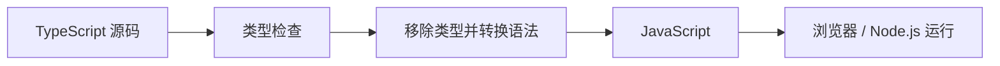

> **学完这一节，你应该能回答**
> - TypeScript 在运行前能发现什么，又绝对保证不了什么？
> - 类型推断、联合类型、缩小、泛型和结构化类型如何配合？
> - `any`、`unknown`、类型断言和运行时验证为什么不能混用？
> - 怎样让类型表达合法业务状态，而不只是给变量贴标签？

## 1. TypeScript 是什么

TypeScript 在 JavaScript 之上加入静态类型系统和相关语法。工具在运行前检查代码，再生成 JavaScript：



TypeScript 的主要价值：

- 在运行前发现一类类型不匹配和遗漏；
- 为编辑器提供补全、跳转、重命名和重构依据；
- 把模块之间的契约写入代码；
- 让不合法状态更难表示；
- 帮助大型代码库在修改时找到影响范围。

它不是新的运行时安全沙箱，也不会自动验证网络、JSON、数据库或用户输入。

---

## 2. 类型检查发生在编译期

```ts
function double(value: number): number {
  return value * 2;
}

double('5'); // 类型错误
```

生成的 JavaScript 不再含 `: number`：

```js
function double(value) {
  return value * 2;
}
```

如果不可信请求在运行时传入字符串，JavaScript 仍会执行。必须在边界做运行时验证：

```ts
function isNumber(value: unknown): value is number {
  return typeof value === 'number' && Number.isFinite(value);
}
```

> **类型声明不是数据消毒**
> `const user = response.json() as User` 只是让编译器相信你，它不会检查响应真的符合 User。类型断言不能替代 schema 验证。

---

## 3. 类型推断：不必给每个变量写类型

```ts
const count = 3;          // 推断为 3 或 number，取决于上下文
let total = 0;            // 通常推断为 number
const names = ['A', 'B']; // string[]
```

类型系统可以从初始值、返回值和上下文推断。显式类型最有价值的地方通常是：

- 公共函数和模块边界；
- 数据模型；
- 回调难以推断时；
- 希望限制实现，而不是接受更窄字面量时；
- 类型本身解释业务意图时。

过度注解会增加噪声和重复，也可能把本可推断的精确信息写宽。

---

## 4. 对象类型、interface 与 type

```ts
interface User {
  id: string;
  name: string;
  email?: string;
  readonly createdAt: string;
}
```

- `email?` 表示属性可缺失，不一定等同于“属性必有但值可为 undefined”；
- `readonly` 阻止 TypeScript 代码通过该引用赋值，不代表运行时深度冻结。

`type` 也能描述对象，并适合联合、交叉和映射类型：

```ts
type UserId = string;

type ApiResult<T> =
  | { ok: true; data: T }
  | { ok: false; error: string };
```

`interface` 支持声明合并并常用于可扩展对象契约；`type` 表达能力更广。多数项目可以制定简单一致规则，不必把选择变成信仰之争。

---

## 5. 结构化类型：看形状，不只看名字

```ts
interface Named {
  name: string;
}

const user = { id: 42, name: '小林' };

function greet(value: Named) {
  return `你好，${value.name}`;
}

greet(user); // user 至少具有 Named 要求的结构
```

TypeScript 主要采用结构化类型：只要结构兼容，就可赋值。这让普通 JavaScript 对象容易组合，但也意味着两个业务含义不同、底层都是 `string` 的 ID 可能被混用。

可以使用品牌化类型等技术增加名义区分：

```ts
type UserId = string & { readonly __brand: 'UserId' };
type OrderId = string & { readonly __brand: 'OrderId' };
```

品牌只存在于类型层，仍需要受控构造和运行时验证。

---

## 6. 联合类型与缩小（narrowing）

```ts
function formatId(id: string | number) {
  if (typeof id === 'string') {
    return id.toUpperCase();
  }

  return id.toFixed(0);
}
```

`typeof` 检查后，控制流分析把分支中的类型缩小。

常用缩小方式：

- `typeof`；
- `instanceof`；
- 属性存在检查 `in`；
- 等值比较；
- 自定义类型守卫；
- 判别联合。

### 判别联合表达业务状态

不理想的模型：

```ts
interface RequestState<T> {
  loading: boolean;
  data?: T;
  error?: string;
}
```

它允许 `loading: true`、同时有 data 和 error 的矛盾状态。

更清楚的模型：

```ts
type RequestState<T> =
  | { status: 'idle' }
  | { status: 'loading' }
  | { status: 'success'; data: T }
  | { status: 'error'; error: string };
```

每个分支只包含合法字段。

```ts
function render<T>(state: RequestState<T>) {
  switch (state.status) {
    case 'idle':
      return '尚未开始';
    case 'loading':
      return '加载中';
    case 'success':
      return state.data;
    case 'error':
      return state.error;
  }
}
```

---

## 7. `never` 与穷尽检查

当某个位置不可能存在值时，类型为 `never`。可以用它确保所有联合成员都被处理：

```ts
function assertNever(value: never): never {
  throw new Error(`未处理的状态：${JSON.stringify(value)}`);
}

function describe(state: RequestState<unknown>): string {
  switch (state.status) {
    case 'idle': return '尚未开始';
    case 'loading': return '加载中';
    case 'success': return '成功';
    case 'error': return state.error;
    default: return assertNever(state);
  }
}
```

以后新增 `cancelled` 状态而忘记处理时，编译器会在 `assertNever` 处提示。

---

## 8. `any` 与 `unknown`

### `any`

`any` 相当于让类型检查器在相关位置放弃检查：

```ts
let value: any = getSomething();
value.not.exists().still.compiles();
```

它具有传染性，容易把不确定性扩散到整个系统。

### `unknown`

`unknown` 表示“确实不知道是什么”，使用前必须缩小：

```ts
function printLength(value: unknown) {
  if (typeof value === 'string') {
    console.log(value.length);
  }
}
```

外部 JSON、catch 的错误和插件输入适合先视为 `unknown`，验证后再转为领域类型。

`unknown` 不是更麻烦的 any，而是把风险限制在边界。

---

## 9. 泛型：保留类型关系

```ts
function first<T>(items: T[]): T | undefined {
  return items[0];
}

const name = first(['A', 'B']); // string | undefined
const count = first([1, 2]);     // number | undefined
```

泛型不是“让函数接受任何东西”这么简单，而是表达输入输出之间的关系。

```ts
function getProperty<T, K extends keyof T>(object: T, key: K): T[K] {
  return object[key];
}
```

类型参数过多、约束互相引用时，API 可能比实现更难读。能用具体联合类型清楚表达的业务，不必为了通用而泛化。

---

## 10. 函数类型与回调

```ts
type Comparator<T> = (left: T, right: T) => number;

function sortCopy<T>(items: readonly T[], compare: Comparator<T>): T[] {
  return [...items].sort(compare);
}
```

- `readonly T[]` 表达函数不会修改输入数组；
- 返回新 `T[]`；
- 比较函数的输入输出契约明确。

可选参数、默认参数和 `undefined` 要结合：

```ts
function greet(name = '访客') {}
```

默认值在参数为 `undefined` 时生效，传入 `null` 不会触发。

---

## 11. Utility Types

TypeScript 提供映射现有类型的工具：

```ts
interface User {
  id: string;
  name: string;
  email: string;
}

type UserPatch = Partial<Pick<User, 'name' | 'email'>>;
type PublicUser = Omit<User, 'email'>;
type UserById = Record<string, User>;
```

| 工具 | 含义 |
| --- | --- |
| `Partial<T>` | 属性变为可选 |
| `Required<T>` | 属性变为必需 |
| `Pick<T, K>` | 选取部分属性 |
| `Omit<T, K>` | 排除部分属性 |
| `Readonly<T>` | 顶层属性只读 |
| `Record<K, V>` | 键到值的映射 |
| `Awaited<T>` | 得到 Promise 等 await 后的类型 |

不要用 `Partial<DatabaseRow>` 草率充当所有更新请求。API 允许修改的字段和业务约束通常需要独立模型。

---

## 12. `strict` 与重要编译选项

新项目应优先开启严格模式：

```json
{
  "compilerOptions": {
    "strict": true,
    "noUncheckedIndexedAccess": true,
    "exactOptionalPropertyTypes": true,
    "noImplicitOverride": true
  }
}
```

- `strict` 启用一组严格检查；
- `noUncheckedIndexedAccess` 提醒数组/字典索引可能不存在；
- `exactOptionalPropertyTypes` 更严格区分属性缺失与显式 undefined；
- `noImplicitOverride` 让覆写父类成员更明确。

选项会影响迁移成本和第三方类型兼容，应逐项理解。越早在项目中启用严格检查，通常越容易。

---

## 13. 外部数据必须运行时验证

```ts
interface User {
  id: string;
  name: string;
}

const response = await fetch('/api/user');
const raw: unknown = await response.json();
```

接下来需要 schema 或手工验证：

```ts
function isUser(value: unknown): value is User {
  if (typeof value !== 'object' || value === null) return false;

  const candidate = value as Record<string, unknown>;
  return typeof candidate.id === 'string'
    && typeof candidate.name === 'string';
}
```

大型项目常使用可同时执行验证和推导类型的 schema 工具。无论用什么库，都要考虑：

- 未知字段如何处理；
- 错误信息是否适合用户；
- 嵌套和数组大小限制；
- 日期、大整数等转换；
- 验证后对象是否真正满足业务规则。

---

## 14. 类型断言的边界

```ts
const element = document.querySelector('#save') as HTMLButtonElement;
```

`as` 告诉编译器“相信我知道得更多”，不会在运行时检查元素存在或类型正确。更稳妥：

```ts
const element = document.querySelector('#save');

if (!(element instanceof HTMLButtonElement)) {
  throw new Error('缺少保存按钮');
}
```

双重断言 `value as unknown as Target` 往往是在绕过类型系统。若经常需要，应检查模型、第三方声明或边界验证是否设计错误。

非空断言 `value!` 同样只是消除编译器警告；运行时仍可能是 null/undefined。

---

## 15. 类型与领域建模

不要只把数据库字段翻译成 TypeScript：

```ts
type Money = {
  currency: 'CNY' | 'USD';
  minorUnits: bigint;
};

type Order =
  | { status: 'draft'; items: OrderItem[] }
  | { status: 'paid'; items: OrderItem[]; paidAt: string; paymentId: string }
  | { status: 'cancelled'; items: OrderItem[]; cancelledAt: string; reason: string };
```

这样的类型让某些非法组合无法通过检查。类型系统不能保证数据库并发和权限正确，但可以让代码中的业务意图更明确。

领域模型见 [4.2 表、主键、外键与数据建模](/blog/4-2-表-主键-外键与数据建模)。

---

## 16. 常见误区

| 误区 | 正确认识 |
| --- | --- |
| 能编译就一定运行正确 | 类型系统只覆盖一部分错误，不验证真实外部数据和业务逻辑 |
| 写 `as User` 就把对象变成 User | 只改变编译器看法，不改变运行时值 |
| 类型越复杂越专业 | 无法被团队理解的类型会增加维护成本 |
| `any` 能快速完成，稍后再改即可 | any 会扩散，边界应优先使用 unknown 并尽早验证 |
| interface 总比 type 好，或反之 | 两者能力重叠，各有特性，按表达需求和团队约定选择 |
| TypeScript 替代测试 | 类型测试不了运行时集成、权限、性能和用户流程 |

## 小练习

为课程 API 建模：课程可能是草稿、已发布或已归档；只有已发布课程有 `publishedAt`，归档课程有 `archivedReason`。使用判别联合，并写一个穷尽处理的显示函数。把一段 `unknown` JSON 验证成该模型。

## 延伸阅读

- [2.8 JavaScript：语言核心](/blog/2-8-javascript-语言核心)
- [3.0 什么是API?后端是为了什么？](/blog/3-0-什么是-api-后端是为了什么)
- [TypeScript Handbook](https://www.typescriptlang.org/docs/handbook/intro.html)
- [TypeScript：Narrowing](https://www.typescriptlang.org/docs/handbook/2/narrowing.html)
