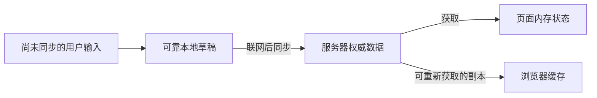
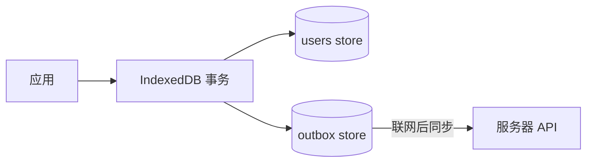
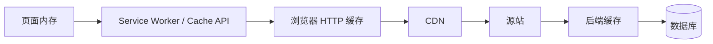
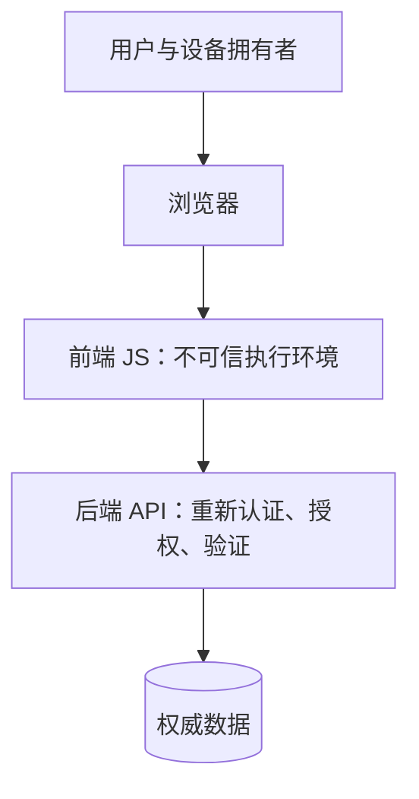

> **学完这一节，你应该能回答**
> - Cookie、localStorage、sessionStorage、IndexedDB 和 Cache API 各自适合什么？
> - “存储数据”与“缓存可重新获取的数据”为什么必须区分？
> - 浏览器按源隔离数据，但为什么前端仍不能保存真正秘密？
> - XSS、CSP、Service Worker、退出登录和离线数据之间有什么联系？

## 1. 先区分状态、持久化与缓存

- **运行状态**：页面当前使用的数据，刷新后可以消失。
- **持久化数据**：刷新或重启后仍要保留的数据。
- **缓存**：为了速度保存的可替代副本，丢失后应能从原始来源重新获得。

把缓存当唯一数据源，会在浏览器清理空间后丢失用户成果；把所有服务器数据永久复制到客户端，又会制造过期、隐私和一致性问题。



设计前先回答：哪一份是权威来源？数据丢失是否可接受？何时过期？是否含敏感信息？

---

## 2. 浏览器有哪些存储机制

| 机制 | 数据形态 | 访问方式 | 典型用途 | 主要限制 |
| --- | --- | --- | --- | --- |
| 页面内存 | 任意 JS 值 | 同步 | 当前组件状态 | 刷新即失，标签页独立 |
| Cookie | 小型字符串 | HTTP 自动携带；部分可由 JS 访问 | 会话标识、服务端状态关联 | 每次匹配请求带上，容量小，安全属性复杂 |
| localStorage | 字符串键值 | 同步 | 少量非敏感偏好 | 阻塞主线程，无查询能力，易受 XSS 读取 |
| sessionStorage | 字符串键值 | 同步 | 单标签页临时状态 | 生命周期与标签页会话相关 |
| IndexedDB | 结构化对象、索引、事务 | 异步 | 离线数据、大量结构化数据 | API 和迁移更复杂 |
| Cache API | Request/Response 对 | 异步 | 离线资源、Service Worker 缓存 | 不自动理解业务新旧与权限 |
| OPFS | 源私有文件 | 异步/Worker 能力 | 大文件、编辑器、数据库类应用 | 支持与配额策略、同步设计复杂 |

浏览器还维护自己的 HTTP 缓存、字节码缓存、图片缓存等，不一定由页面 JavaScript直接控制。

---

## 3. 存储通常按源隔离

源由协议、主机、端口组成：

```text
https://app.example.com:443
```

不同源通常拥有隔离的 Web Storage、IndexedDB 和 Cache 空间。隐私机制还可能按顶层站点进一步分区，尤其是第三方 iframe 场景。

同源隔离很重要，但不是绝对保险：

- 同一源上的任何成功执行脚本通常能访问该源 JS 可见的数据；
- 被注入的 XSS 脚本也处于你的源；
- 浏览器扩展、恶意设备环境和调试工具可能读取页面；
- 用户本人可以检查和修改自己的客户端数据。

因此，前端存储不是秘密保险箱，也不能成为权限判断依据。

---

## 4. Cookie：浏览器与服务器共同维护的小数据

服务器可设置：

```http
Set-Cookie: session=随机不可预测标识; Path=/; Secure; HttpOnly; SameSite=Lax
```

浏览器在匹配规则成立时自动发送：

```http
Cookie: session=随机不可预测标识
```

重要属性：

| 属性 | 作用 |
| --- | --- |
| `Secure` | 只通过 HTTPS 发送（localhost 有特殊实践） |
| `HttpOnly` | 阻止页面 JavaScript 读取，降低令牌被 XSS 直接窃取的风险 |
| `SameSite` | 控制跨站上下文中是否携带，帮助降低 CSRF 风险 |
| `Domain` | 扩大到匹配的子域范围；不设置通常更收敛 |
| `Path` | 限制发送路径，但不是可靠安全边界 |
| `Expires` / `Max-Age` | 持久期限；会话 Cookie 通常无明确持久期 |

`HttpOnly` 不会阻止 XSS 以当前用户身份发请求，只是让脚本难以直接读取 Cookie 值。仍需修复 XSS 并实施权限、CSRF 等防护。

认证细节见 [3.5 Cookie、Session、JWT 与 OAuth](/blog/3-5-cookie-session-jwt-与-oauth)。

---

## 5. localStorage 与 sessionStorage

```js
localStorage.setItem('theme', 'dark');
const theme = localStorage.getItem('theme');
localStorage.removeItem('theme');
```

Web Storage 只保存字符串：

```js
localStorage.setItem('settings', JSON.stringify({ density: 'compact' }));

const settings = JSON.parse(localStorage.getItem('settings') ?? '{}');
```

适合：

- 主题、密度等少量偏好；
- 可丢失、可重建的小数据；
- 不需要复杂查询和高频写入的数据。

不适合：

- 大量结构化数据；
- 主线程高频读写；
- 真正秘密；
- 作为服务端权限来源；
- 默认保存长期访问令牌而不评估 XSS 风险。

localStorage API 是同步的，大量序列化和写入会阻塞主线程。跨标签页可监听 `storage` 事件，但它不是强一致数据库或可靠消息系统。

---

## 6. IndexedDB

IndexedDB 是浏览器中的异步事务型对象数据库，支持对象存储、键和索引。

适合：

- 离线优先应用；
- 大量文档、消息或媒体元数据；
- 需要按字段索引查询的结构化数据；
- 在本地保存待同步操作。



需要设计：

- 数据库版本与 schema 迁移；
- 事务范围；
- 多标签页升级冲突；
- 配额耗尽和数据被清理；
- 本地与服务器冲突；
- 敏感数据生命周期。

“数据在本地”并不自动等于“更快”或“永远可用”，读取、索引和迁移仍有成本。

---

## 7. HTTP 缓存与 Cache API 不是同一个东西

### HTTP 缓存

浏览器根据响应头自动决定复用：

```http
Cache-Control: public, max-age=31536000, immutable
ETag: "asset-v42"
```

它与 HTTP 请求语义结合，适合静态资源和可缓存响应。

### Cache API

页面或 Service Worker 可显式保存 Request/Response：

```js
const cache = await caches.open('app-shell-v3');
await cache.addAll(['/offline.html', '/styles.css']);
```

Cache API 不会因为服务器内容变化就自动更新，也不会自动遵守你的业务权限。缓存策略必须定义何时写入、命中、重新验证和删除。

### CDN 缓存

CDN 位于用户与源站之间，是服务器侧/网络边缘缓存。浏览器缓存、Service Worker 缓存、CDN 和后端 Redis 处于不同位置，不要用“清一下缓存”笼统处理。



---

## 8. Service Worker 与离线

Service Worker 可在页面与网络之间拦截请求，执行缓存策略、离线响应和后台能力。

常见策略：

| 策略 | 行为 | 适合 |
| --- | --- | --- |
| Cache First | 先缓存，没有再网络 | 带哈希静态资源 |
| Network First | 先网络，失败再缓存 | 希望新鲜的页面或数据 |
| Stale While Revalidate | 先返回旧缓存，同时后台更新 | 可短暂陈旧的内容 |
| Network Only | 总走网络 | 高敏感或必须实时请求 |

Service Worker 更新有独立生命周期。新版本下载后可能等待旧页面关闭，造成“代码部署了但用户仍运行旧版本”。需要版本兼容、更新提示和缓存清理策略。

不要缓存包含其他用户私有信息的响应，也不要让离线重放重复创建订单。待同步写操作需要幂等 ID、状态机和冲突处理。

---

## 9. 配额、持久性与清理

浏览器存储存在配额，具体上限和回收规则随浏览器、设备、使用情境与隐私模式变化。默认存储常是 best-effort：

- 用户可以主动清除；
- 设备空间紧张时可能被驱逐；
- 隐私模式结束时通常删除；
- 第三方上下文可能被分区或限制；
- 写满时可能抛出 `QuotaExceededError`。

可以查询估算：

```js
const estimate = await navigator.storage.estimate();
console.log(estimate.usage, estimate.quota);
```

关键用户数据必须有服务器同步、导出或其他恢复路径。不要依赖某个固定 MB 数写业务逻辑。

---

## 10. 客户端数据应按敏感度分类

| 数据 | 推荐思路 |
| --- | --- |
| 主题偏好 | localStorage 或 Cookie 均可，按服务端是否需要选择 |
| 购物车草稿 | 可本地缓存，但登录后应与服务器模型同步 |
| Session 标识 | 通常优先 Secure + HttpOnly Cookie，并配合 CSRF 设计 |
| 长期访问令牌 | 避免默认放 localStorage；按威胁模型设计轮换与存储 |
| 密码、私钥、数据库凭据 | 不在浏览器持久存储 |
| 离线文档 | IndexedDB/OPFS，并设计同步、冲突和恢复 |
| 服务器私有响应 | 默认谨慎缓存，确认 Cache-Control 与用户隔离 |

没有任何客户端存储方式能让发送给浏览器的秘密对设备拥有者不可见。真正不能公开的值必须留在后端。

---

## 11. XSS 为什么威胁所有前端状态

XSS 让攻击者控制的脚本在你的源中执行。它可能：

- 读取 localStorage、IndexedDB 和 DOM；
- 监听用户输入；
- 以用户身份发同源请求；
- 修改页面诱骗操作；
- 把数据发送到外部。

核心防护：

1. 不把不可信字符串当 HTML、脚本、URL 或 CSS 解释；
2. 使用框架默认安全转义，谨慎使用 raw HTML 能力；
3. 对富文本使用经过维护的白名单清理；
4. 避免危险 DOM sink；
5. 配置 Content Security Policy 作为纵深防御；
6. 减少和审计第三方脚本。

CSP 可以限制脚本、连接、frame 等资源来源，并通过 nonce/hash 允许特定脚本。它是纵深防御，不应替代输出编码和漏洞修复。

详见 [3.6 Web 安全基础](/blog/3-6-web-安全基础)。

---

## 12. 退出登录不只是删除一个变量

退出流程应考虑：

- 服务端 Session 或刷新令牌是否失效；
- Cookie 是否以相同 Domain/Path 条件正确删除；
- 页面内存中的用户数据；
- localStorage/sessionStorage；
- IndexedDB 中的离线私有数据；
- Service Worker 和 Cache API 中的私有响应；
- 多标签页同步；
- 浏览器后退缓存是否短暂显示旧页面。

不一定要清空整个源的所有缓存，否则会丢失公开资源和其他账户无关偏好；应按数据所有权和敏感度设计键与清理范围。

共享设备上还应明确“记住我”与普通会话的差异。

---

## 13. 安全边界总结



- 浏览器沙箱帮助站点彼此隔离，不代表你的前端代码可信；
- 同源策略限制跨源读取，不替代 API 权限；
- HttpOnly 降低 Cookie 被读取风险，不阻止全部 XSS 行为；
- 本地加密若密钥也交给同一前端，无法抵抗能控制该前端的攻击者；
- 客户端检查用于体验，服务端检查建立规则。

---

## 14. 选择存储方式的检查清单

1. 数据的权威来源在哪里？
2. 刷新、关标签页、重启浏览器后要保留吗？
3. 丢失是否可接受，能否重新获取？
4. 数据量、查询方式和写入频率如何？
5. 服务器是否需要每次请求自动收到它？
6. 是否含身份、隐私或商业敏感信息？
7. XSS 得手后会造成什么损失？
8. 多标签页、多个设备和多个账户如何隔离？
9. schema 如何升级，旧数据如何迁移？
10. 配额满、离线、退出和数据冲突如何处理？

## 小练习

为一个离线任务应用设计数据去向：主题偏好、登录会话、任务列表、未同步修改、静态图标和用户头像分别放在哪里？写出权威来源、过期策略、退出时清理策略，以及浏览器存储被清空后的恢复方式。

## 延伸阅读

- [3.5 Cookie、Session、JWT 与 OAuth](/blog/3-5-cookie-session-jwt-与-oauth)
- [3.6 Web 安全基础](/blog/3-6-web-安全基础)
- [4.5 Redis、缓存与数据一致性](/blog/4-5-redis-缓存与数据一致性)
- [MDN：Web Storage API](https://developer.mozilla.org/zh-CN/docs/Web/API/Web_Storage_API)
- [MDN：IndexedDB](https://developer.mozilla.org/zh-CN/docs/Web/API/IndexedDB_API)
- [MDN：存储配额和驱逐标准](https://developer.mozilla.org/zh-CN/docs/Web/API/Storage_API/Storage_quotas_and_eviction_criteria)
- [MDN：Content Security Policy](https://developer.mozilla.org/zh-CN/docs/Web/HTTP/Guides/CSP)
