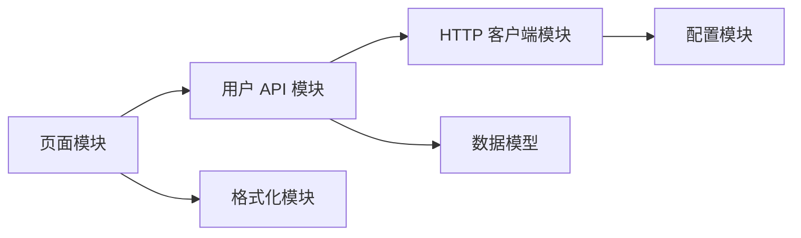

> **这一节回答了**
> - 模块化解决的核心问题是什么？
> - `import` 与 `export` 如何形成依赖图？
> - 模块、包、组件是不是同一个概念？
> - 为什么循环依赖、全局变量和“万能工具文件”会让项目越来越难改？

## 1. 从一个巨大的 JavaScript 文件说起

小页面可以把所有代码放在一个 `<script>` 里。项目变大后，这种方式会迅速遇到问题：

- 所有变量都挤在全局作用域，容易重名或被意外修改；
- 很难看出某段代码依赖什么；
- 改一个功能可能影响完全无关的部分；
- 多人同时编辑同一文件，冲突频繁；
- 无法方便地测试、复用和按需加载。

**模块化是把系统拆成边界清晰、职责聚焦、通过明确接口协作的单元。** 它的目标不是“让文件变多”，而是管理复杂度。

可以把模块看作一个小盒子：内部实现可以变化，对外只暴露经过选择的能力。



这张图也是一个**依赖图**。箭头表示“左边需要右边提供的能力”。构建工具会沿着入口文件的依赖图查找项目需要的代码。

---

## 2. ES Modules：浏览器的标准模块系统

现代 JavaScript 使用 ES Modules（ESM），核心语法是 `export` 和 `import`。

```js
// math.js：声明模块对外提供什么
export const PI = 3.1415926;

export function circleArea(radius) {
  return PI * radius ** 2;
}
```

```js
// main.js：显式声明依赖
import { circleArea } from './math.js';

console.log(circleArea(3));
```

浏览器入口需要声明为模块：

```html
<script type="module" src="./main.js"></script>
```

相较普通脚本，ES 模块具有自己的作用域，并且依赖关系可以静态分析。静态分析让工具有机会提前发现错误、删除未使用导出并拆分代码。

### 命名导出与默认导出

```js
// 命名导出：一个模块可以有多个，导入名称通常保持一致
export function parseDate() {}
export function formatDate() {}

// 默认导出：一个模块最多一个，导入者可自行命名
export default function DatePicker() {}
```

两者都合法。公共工具集合常适合命名导出，因为调用处能明确看到使用了什么；一个文件主要代表一个组件或类时，项目也可能采用默认导出。关键是团队保持一致，而不是争论唯一正确风格。

> **`import` 不是复制粘贴**
> 导入的是另一个模块导出的绑定。同一个模块通常只初始化一次，多个导入者共享该模块实例。模块顶层如果执行网络请求或修改全局对象，会产生隐蔽副作用。

---

## 3. 模块、包、组件与库

这些词经常一起出现，但层级不同：

| 概念 | 典型含义 | 示例 |
| --- | --- | --- |
| 模块（module） | 可独立导入、导出的代码单元，常对应一个文件 | `formatDate.js` |
| 包（package） | 按清单发布和安装的一组文件或模块 | npm 上的 `date-fns` |
| 组件（component） | UI 中职责相对独立、可组合的单元 | `SearchBox`、`UserCard` |
| 库（library） | 为某类问题提供可复用能力的代码集合 | React、D3 |
| 应用（application） | 面向用户交付的完整软件 | 商城前端 |

一个包可以包含很多模块；一个 UI 组件通常由 JavaScript、样式、测试等多个模块组成；模块也可能完全与 UI 无关。

---

## 4. 依赖与包管理器

当项目使用第三方包时，需要解决：去哪里下载、安装哪个版本、包又依赖哪些包。npm、pnpm、Yarn 等包管理器负责这类工作。

`package.json` 描述项目与依赖：

```json
{
  "name": "demo-app",
  "scripts": {
    "dev": "vite",
    "build": "vite build"
  },
  "dependencies": {
    "react": "^19.0.0"
  },
  "devDependencies": {
    "vite": "^7.0.0"
  }
}
```

- `dependencies`：应用运行或产物构建通常需要的依赖。
- `devDependencies`：开发、测试、检查或构建时使用的工具。
- `scripts`：项目统一的命令入口。
- `node_modules/`：安装后的依赖目录，通常不提交到 Git。
- 锁文件：记录实际解析到的依赖版本和完整依赖树，通常应该提交。

`package.json` 中的版本范围表达“允许升级的范围”，锁文件则固定一次确定的解析结果。两者解决的不是同一问题。

> **第三方依赖不是免费午餐**
> 每个依赖都会带来体积、更新、安全、许可证和供应链风险。安装前应确认它是否真的节省了足够复杂度，并查看维护状态与实际引入成本。

---

## 5. 如何划分一个好模块

好的模块边界通常体现两个原则：

- **高内聚**：模块内部的内容围绕同一个职责。
- **低耦合**：模块尽量少依赖其他模块的内部细节。

例如，用户资料功能可以按业务能力组织：

```text
features/
└── profile/
    ├── ProfilePage.js
    ├── ProfileForm.js
    ├── profileApi.js
    ├── profileValidation.js
    └── profile.test.js
```

这往往比把整个项目机械地分成一个 `components/`、一个 `api/`、一个 `utils/` 更容易理解，因为修改“资料功能”时相关文件彼此靠近。

### 一个模块应该暴露多少

只暴露调用者真正需要的最小接口：

```js
// cart.js
const items = []; // 内部状态，不直接暴露

export function addItem(product, quantity = 1) {
  // 在这里集中校验和维护规则
}

export function getTotal() {
  // 调用者无需知道总价如何计算
}
```

如果直接导出可随意修改的 `items` 数组，任何模块都能绕过规则，边界就失去了意义。

---

## 6. 常见模块化问题

### 6.1 循环依赖

```text
a.js  ──依赖──>  b.js
 ▲                │
 └──────依赖──────┘
```

ESM 能处理一部分循环依赖，但初始化顺序会变得难以推理，某些值在使用时可能仍未初始化。频繁出现循环通常意味着职责划分有问题。

常见改法：

- 抽取双方共同依赖的第三个模块；
- 用回调、事件或依赖注入反转关系；
- 重新思考两个模块是否本应合并，或其中一个职责放错位置。

### 6.2 “万能 utils”

`utils.js` 最初只有两个函数，最后可能变成数千行、被全项目依赖的垃圾抽屉。应按领域和作用命名，如 `currencyFormat.js`、`dateRange.js`、`imageResize.js`。

### 6.3 深层导入内部文件

```js
// 调用者绕过公共入口，绑定了包的内部目录结构
import helper from 'some-package/src/internal/helper.js';
```

这种代码可能在依赖升级后突然失效。优先使用包明确公开的入口。

### 6.4 隐式全局状态

一个模块导出可变单例很方便，但会让测试互相影响，也让数据从哪里改变变得难追踪。需要共享状态时，应明确其生命周期、写入入口和订阅方式。

### 6.5 过度拆分

每个三行函数都建一个文件，也会增加跳转成本。模块边界应围绕“可独立理解和变化的职责”，而不是追求文件越小越好。

---

## 7. Barrel 文件：方便与代价

Barrel 文件通常用 `index.js` 统一转出多个模块：

```js
// components/index.js
export { Button } from './Button.js';
export { Dialog } from './Dialog.js';
export { Tabs } from './Tabs.js';
```

调用者可以写：

```js
import { Button, Dialog } from './components/index.js';
```

它能提供稳定的公共入口，但滥用可能：

- 隐藏真实依赖来源；
- 引入新的循环依赖；
- 在部分工具链中影响增量构建或 tree shaking；
- 让一个小导入牵连巨大模块图。

公共组件库边界处使用较合理；项目内部每一层都建 barrel，收益往往有限。

---

## 8. 动态导入与按需加载

静态导入会在构建时进入依赖图。动态 `import()` 可以等到真正需要时再加载：

```js
button.addEventListener('click', async () => {
  const { openEditor } = await import('./large-editor.js');
  openEditor();
});
```

这常用于：

- 按路由拆分页面；
- 延迟加载大型编辑器、图表或地图；
- 只在满足某个条件时加载功能。

按需加载减少首屏资源，不代表切得越碎越好。每个额外分块仍有请求、调度和缓存成本，应该依据真实性能数据决定。

---

## 9. ESM、CommonJS 与构建工具

你可能还会看到 Node.js 生态的 CommonJS：

```js
const fs = require('node:fs');
module.exports = { /* ... */ };
```

现代前端源码通常优先使用 ESM。旧包、配置文件或特定 Node.js 项目仍可能使用 CommonJS。两种模块系统的加载方式、执行时机和互操作规则不同，不能总是机械替换语法。

浏览器原生支持 ESM，但真实项目仍常使用构建工具，因为还要处理 TypeScript、JSX、CSS、图片、兼容性、压缩和代码分块。详见 [2.3 前端构建](/blog/2-3-前端构建)。

---

## 10. 一个实用的检查清单

设计或评审模块时，问自己：

1. 能否用一句话说明它的职责？
2. 它对外暴露的是稳定能力，还是内部数据结构？
3. 调用者能否绕过规则直接修改内部状态？
4. 依赖方向是否清晰，有没有循环？
5. 测试这个模块是否需要启动半个系统？
6. 变化最可能来自哪里，这个边界能否把变化限制在局部？
7. 第三方依赖带来的收益是否大于维护成本？

模块化的最终标准不是目录看起来整齐，而是：**一个需求变化发生时，需要理解和修改的范围是否可控。**

## 与其他笔记的关系

- Git 管理模块的版本变化：[2.0 使用Git管理代码](/blog/2-0-使用-git-管理代码)。
- 构建工具消费模块依赖图：[2.3 前端构建](/blog/2-3-前端构建)。
- 组件和框架的边界：[2.4 什么是框架？前端框架有哪些？为什么react不是框架？](/blog/2-4-什么是框架-前端框架有哪些-为什么react不是框架)。

## 延伸阅读

- [MDN：JavaScript 模块](https://developer.mozilla.org/zh-CN/docs/Web/JavaScript/Guide/Modules)
- [Node.js：ECMAScript modules](https://nodejs.org/api/esm.html)
- [npm：package.json 文档](https://docs.npmjs.com/cli/configuring-npm/package-json)
