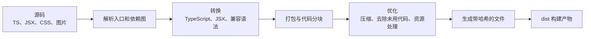
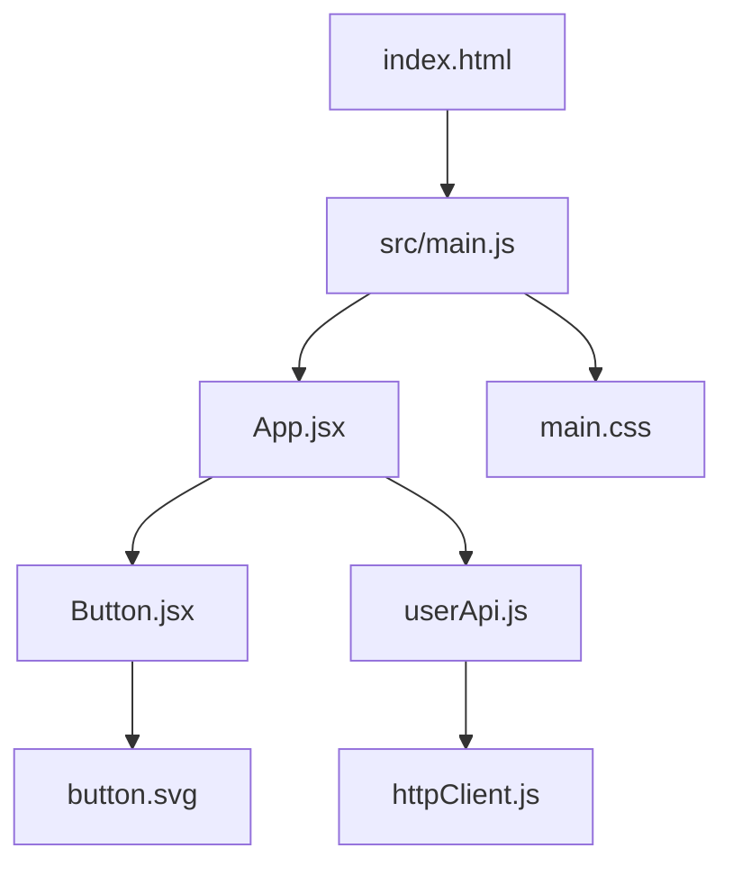

> **这一节回答了**
> - 为什么写好的源码往往不能原样交给浏览器？
> - 包管理器、编译器、转译器、打包器和开发服务器分别做什么？
> - `npm run dev` 与 `npm run build` 有什么本质区别？
> - 文件名中的哈希为什么能帮助浏览器缓存？

## 1. 什么叫“构建”

开发时写的是**源码（source code）**，最终部署的是**构建产物（build artifacts）**。把前者转换为后者的一组自动化处理，就叫构建。

简单的 HTML、CSS、JavaScript 可以不经过构建直接在浏览器运行。但现代项目常使用：

- TypeScript；
- JSX、Vue 单文件组件、Svelte 组件；
- CSS 预处理或 CSS Modules；
- 从 npm 安装的第三方包；
- 图片、字体、WebAssembly 等资源；
- 针对旧浏览器的语法兼容；
- 压缩、拆包和缓存优化。

这些内容需要被转换、组织和优化，浏览器才能高效、正确地加载。



构建不是把代码“变高级”，而是把适合开发和维护的形式，转换为适合浏览器分发和执行的形式。

---

## 2. 工具名称为什么这么多

现实中的工具经常身兼数职，但先区分职责会更容易理解。

| 工具类别 | 主要职责 | 常见例子 |
| --- | --- | --- |
| 包管理器 | 下载依赖、解析版本、运行项目脚本 | npm、pnpm、Yarn |
| 编译器 / 转译器 | 把一种源码形式转换成另一种 | TypeScript、SWC、Babel |
| 打包器 | 从入口遍历依赖图，组织输出文件 | Rollup、webpack、Rolldown、esbuild |
| 开发服务器 | 本地提供页面、快速更新、代理请求 | Vite dev server、webpack-dev-server |
| 代码检查器 | 发现潜在错误和风格问题 | ESLint |
| 格式化器 | 统一代码排版 | Prettier |
| 测试运行器 | 运行自动化测试并报告结果 | Vitest、Jest、Playwright |

Vite 这类“构建工具”对外提供一套统一体验，内部会组合多项能力。工具底层实现会演进，理解职责比死记某个品牌更持久。

---

## 3. 构建从入口文件开始

构建工具通常从 `index.html` 或某个 JavaScript 入口开始，沿 `import` 递归查找依赖：



这个依赖图让工具知道：

- 哪些代码和资源确实被使用；
- 加载顺序和模块边界；
- 哪些模块可以合并或单独拆包；
- 某个文件变化后，哪些部分需要重新处理。

如果依赖隐藏在运行时拼接的任意字符串中，工具可能无法静态发现。因此构建工具支持的动态导入通常需要遵守一定形式。

---

## 4. 构建过程中常见的处理

### 4.1 语法转换

浏览器不直接理解 TypeScript 类型和 JSX：

```tsx
function Greeting({ name }: { name: string }) {
  return <h1>Hello, {name}</h1>;
}
```

构建时会删除类型信息，并把 JSX 转成浏览器可执行的 JavaScript。类型检查与代码转换也可能由不同工具完成，所以“构建成功”不一定意味着完整类型检查已经通过，要看项目脚本如何配置。

### 4.2 Tree shaking

如果一个 ESM 包导出了十个函数，而项目只使用其中一个，工具有机会删除其余未使用代码。这叫 **tree shaking**。

它依赖可静态分析的模块结构，并会受到副作用和打包配置影响。不能因为工具宣传支持 tree shaking，就假定任何未使用代码都一定消失；应查看实际产物。

### 4.3 压缩（minification）

构建工具会删除多余空白、缩短局部变量名，并简化表达式，以减小传输体积。压缩不同于 gzip/Brotli：

- **压缩源码结构**发生在构建阶段；
- **gzip/Brotli 内容编码**通常由服务器或 CDN 在传输时处理。

两者经常同时使用。

### 4.4 代码分块（code splitting）

不必让用户第一次打开首页就下载整个后台管理系统。动态 `import()`、路由边界等可形成独立分块，在需要时再加载。

过度分块也会增加调度和请求成本。优化目标是让关键路径更快，而不是制造最多的文件。

### 4.5 资源处理与哈希

构建结果常类似：

```text
dist/
├── index.html
└── assets/
    ├── index-D7k3a91f.js
    ├── index-A2p9c442.css
    └── logo-K9s1d020.svg
```

文件内容一变，哈希文件名也会变。这允许服务器对带哈希文件设置很长缓存：

- 内容没变 → URL 不变，继续用缓存；
- 内容变了 → URL 改变，浏览器自动请求新文件。

而 `index.html` 通常不应长期强缓存，因为它负责引用最新的哈希资源。

### 4.6 Source map

压缩后代码难以调试，source map 能把产物位置映射回源码位置。生产环境是否公开 source map，需要在调试能力、源码暴露和存储成本之间权衡。

即使不公开 source map，也不要把秘密写进前端源码；构建产物始终会发送给用户。

---

## 5. 开发模式与生产构建

| 对比 | 开发服务器 | 生产构建 |
| --- | --- | --- |
| 目标 | 快速反馈和调试 | 稳定、体积小、缓存友好 |
| 启动方式 | 常见为 `npm run dev` | 常见为 `npm run build` |
| 文件提供 | 通常按需转换，可能只存在于内存 | 生成真实的 `dist/` 等目录 |
| 优化 | 少，保留调试信息 | 压缩、分块、哈希等 |
| 热更新 | 通常支持 | 不需要 |
| 是否适合公网生产 | 通常不适合 | 应交给静态服务器或部署平台 |

> **不要把开发服务器当生产服务器**
> 开发服务器为本地开发设计，安全、稳定性、缓存和性能策略通常不适合公网流量。生产环境应该部署构建产物，或使用框架明确提供的生产服务命令。

---

## 6. 一个 Vite 项目的最小流程

典型 `package.json`：

```json
{
  "scripts": {
    "dev": "vite",
    "build": "vite build",
    "preview": "vite preview"
  },
  "devDependencies": {
    "vite": "^7.0.0"
  }
}
```

常见操作：

```bash
# 根据锁文件安装依赖；CI 中 npm ci 通常比 npm install 更可复现
npm ci

# 启动本地开发服务器
npm run dev

# 生成生产构建，Vite 默认输出到 dist/
npm run build

# 在本地以接近静态部署的方式预览产物
npm run preview
```

`preview` 用于检查生产产物，不等于经过容量、安全和运维设计的正式生产服务器。

---

## 7. 环境变量：配置不等于秘密

应用在开发、测试、生产环境可能使用不同 API 地址：

```text
开发：https://api-dev.example.com
生产：https://api.example.com
```

构建工具常允许通过环境变量注入配置。但前端构建通常会把允许暴露的变量直接替换进 JavaScript 产物，所以：

- 公共 API 基础地址可以放前端环境变量；
- 数据库密码、私钥、服务端 API 密钥绝不能放前端；
- 变量名称带 `PUBLIC_`、`VITE_` 等前缀，往往正意味着它会暴露给浏览器；
- `.env` 文件是否保密，取决于内容和是否被提交，不取决于扩展名。

真正的秘密应只存在于可信后端或部署平台的秘密管理系统中。

---

## 8. 可复现构建与 CI

“我电脑能构建”不等于任何机器都能构建。可复现性依赖：

- 明确 Node.js 和包管理器版本；
- 提交锁文件；
- 不依赖本机未声明的全局工具；
- 构建脚本不偷偷读取个人目录；
- 环境变量由部署环境明确提供；
- 自动运行类型检查、测试和构建。

典型 CI 流程：


CI/CD 不是“服务器替你敲命令”这么简单，它把可重复的质量门槛和发布步骤固化下来，减少手工操作差异。

---

## 9. 常见构建与部署故障

| 现象 | 常见原因 | 排查方向 |
| --- | --- | --- |
| 本地正常，线上白屏 | 基础路径错误、资源 404、运行时异常 | Network、Console、构建 `base` 配置 |
| 刷新子页面 404 | SPA 路由未配置回退到 `index.html` | 托管平台 rewrite / fallback |
| 用户仍看到旧版本 | HTML 或 CDN 缓存策略不当 | `Cache-Control`、CDN 清理、文件哈希 |
| CI 能安装但本地版本不同 | Node/包管理器版本或锁文件不一致 | 固定版本、重新核对锁文件 |
| 构建体积突然变大 | 新依赖、重复依赖、按需加载失效 | bundle analyzer、产物对比 |
| 环境变量是 `undefined` | 前缀、读取方式或注入阶段不对 | 工具文档、构建日志、部署配置 |

遇到错误时要区分三个阶段：

1. **安装依赖失败**；
2. **构建源码失败**；
3. **构建成功，但产物在浏览器运行失败**。

三个阶段的日志和解决方向完全不同。

## 与其他笔记的关系

- 构建入口依赖 [2.2 前端模块化](/blog/2-2-前端模块化) 中的模块图。
- React、Vue 等工具在构建链中的位置见 [2.4 什么是框架？前端框架有哪些？为什么react不是框架？](/blog/2-4-什么是框架-前端框架有哪些-为什么react不是框架)。
- 生成的产物怎样被用户访问，见 [2.5 把网页部署到公网上](/blog/2-5-把网页部署到公网上)。

## 延伸阅读

- [Vite：生产环境构建](https://vite.dev/guide/build.html)
- [MDN：JavaScript 模块](https://developer.mozilla.org/zh-CN/docs/Web/JavaScript/Guide/Modules)
- [npm：`npm ci`](https://docs.npmjs.com/cli/commands/npm-ci)
