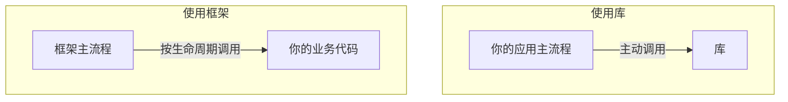
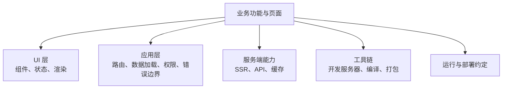

> **这一节回答了**
> - 库与框架的区别为什么常用“谁调用谁”来解释？
> - React 已经能写复杂应用，为什么官方仍称它为 library？
> - React、Vue、Angular、Next.js、Vite 分别处在什么层次？
> - 选框架时应该看什么，而不是只看热度？

## 1. 先从“复用代码”说起

开发软件时，我们不会从像素绘制、网络报文和数据结构全部手写。别人封装好的代码大致可以分成几种层次：

| 层次 | 它主要提供什么 | 例子 |
| --- | --- | --- |
| 工具函数 | 一个具体能力 | 日期格式化、数组排序 |
| 库（library） | 一组可由你主动调用的能力 | React、D3、Lodash |
| 框架（framework） | 应用骨架、生命周期和一套组织约定 | Angular、Next.js、Nuxt |
| 平台（platform） | 代码运行所需的整体环境 | 浏览器、Node.js、操作系统 |

边界并非数学定理。同一个项目可以既自称框架，又允许像库一样渐进使用。比标签更重要的是知道：**它替你决定了哪些事，你还必须自己选择哪些事。**

---

## 2. 库与框架：控制反转

最常见的区分方式是“控制权在谁手里”。

### 使用库

```js
// 你的代码决定何时调用库
const result = usefulLibrary.doSomething(input);
```

你的程序拥有主流程，需要某个能力时主动调用库。

### 使用框架

```js
// 你按框架约定提供代码；框架在合适时机调用它
export async function loader({ params }) {
  return loadUser(params.id);
}
```

框架掌握启动、路由、渲染或请求生命周期，并在规定时机调用你填入的代码。这叫**控制反转（Inversion of Control）**。



现实中两者会混合：框架内部使用大量库，你也会在框架规定的生命周期里继续调用其他库。

---

## 3. 前端工具各自在解决什么

构建一个完整 Web 应用通常需要多个层面：



不同工具覆盖的范围不同：

| 工具 | 常见定位 | 主要提供 | 通常还需要什么 |
| --- | --- | --- | --- |
| React | UI 库 / UI 架构 | 组件、状态更新、渲染模型 | 路由、数据方案、构建和部署选择 |
| Vue | 渐进式框架 | 响应式系统、组件、官方生态 | 大型应用通常再选路由、状态或 Nuxt |
| Angular | 完整 Web 框架 | 组件、依赖注入、路由、表单、工具链等 | 按 Angular 体系组织应用 |
| Svelte | UI 框架与编译方案 | 组件语法、响应式与编译优化 | 完整应用常配 SvelteKit |
| Next.js | React 全栈框架 | 路由、服务端/客户端渲染、数据与构建约定 | 部署环境与业务基础设施 |
| Nuxt | Vue 全栈框架 | 路由、SSR/SSG、服务端能力和构建约定 | 部署环境与业务基础设施 |
| Vite | 构建工具 | 开发服务器、转换和生产构建 | 它本身不规定完整应用架构 |

这张表描述定位，不代表绝对能力边界。生态会变化，工具也可以通过插件获得更多能力。

---

## 4. React 到底提供了什么

React 官方称其为“用于 Web 和原生用户界面的库”。它的核心关注点是：**如何把应用状态声明式地映射成由组件组成的用户界面。**

### 组件

```jsx
function Greeting({ name }) {
  return <h1>你好，{name}</h1>;
}
```

组件把一部分 UI 的结构和行为组合起来，并可继续嵌套其他组件。

### 声明式渲染

开发者描述“状态为 X 时，界面应该长什么样”，React 负责把状态变化反映到宿主环境：

```jsx
function SaveButton({ isSaving }) {
  return (
    <button disabled={isSaving}>
      {isSaving ? '保存中…' : '保存'}
    </button>
  );
}
```

### 状态与 Hooks

Hooks 让函数组件使用状态、订阅和其他 React 能力。React 还提供组件组合、上下文、并发渲染相关能力，以及面向服务端渲染的接口。

### React DOM

`react` 包表达与宿主无关的组件模型，`react-dom` 负责浏览器 DOM 这一宿主环境。React Native 则把类似的组件模型连接到原生移动 UI，而不是把网页 DOM 直接塞进手机应用。

---

## 5. 为什么 React 官方仍称自己为“库”

仅使用 React 核心，并不会自动替你完整规定：

- URL 如何映射到页面；
- 数据在哪里获取、缓存和重新验证；
- 如何构建、拆包和处理资源；
- 哪些组件在服务器或客户端执行；
- API 路由和服务端逻辑如何组织；
- 身份认证、国际化和部署方式；
- 项目目录必须长什么样。

因此，React 更像 UI 层的核心能力。你可以把它加进现有页面，也可以把它与 Vite、路由库、请求库等自由组合。

React 官方文档目前也明确建议：构建完整应用时，可以使用 Next.js、React Router 等全栈 React 框架。框架把 React 放入更大的应用生命周期，并补上路由、数据、构建和渲染约定。

```text
React + 自己选择路由/构建/数据方案 = 自组应用栈
React + Next.js 等                   = 使用集成框架提供的应用骨架
```

> **“React 不是框架”不是价值判断**
> “库”并不低于“框架”，也不意味着能力弱。它表示核心边界更聚焦、把更多架构选择留给使用者。口语中有人把整个 React 生态称作“React 框架”，沟通时应结合上下文，而不必陷入名词争执。

---

## 6. 框架替你获得了什么，又拿走了什么

| 收益 | 对应代价 |
| --- | --- |
| 统一项目结构和最佳实践 | 必须理解并遵守框架约定 |
| 路由、构建、渲染等能力集成 | 升级时可能受框架变化影响 |
| 团队成员更容易形成共同语言 | 某些特殊需求会碰到框架边界 |
| 官方插件和部署路径 | 对生态和维护者产生依赖 |
| 自动优化和默认配置 | 出问题时仍需理解被隐藏的底层 |

框架的价值是把大量重复决策变成经过验证的默认值。代价是自由度下降，并需要接受它的生命周期和心智模型。

一个可靠原则是：**使用抽象，但不要失去对抽象下一层的基本理解。** 不必手写打包器，却应知道构建产物、浏览器缓存和服务器路由是什么。

---

## 7. 什么时候不需要框架

以下情况可以优先考虑原生 Web 技术或小型库：

- 只有少量交互的内容页；
- 一次性原型或教学练习；
- 嵌入现有页面的独立小组件；
- 对下载体积和长期稳定性极其敏感；
- 团队能用简单方案清楚地解决问题。

以下情况更容易从集成框架受益：

- 页面和路由较多；
- 需要 SSR、SSG、流式渲染等多种策略；
- 有复杂的数据加载、错误处理与权限逻辑；
- 多人长期维护，需要统一约定；
- 希望把测试、构建和部署路径标准化。

项目小不代表永远不能用框架，项目大也不代表必须选择最重的框架。应根据未来变化成本，而不是只按当前代码行数判断。

---

## 8. 如何选择技术方案

不要只问“哪个最火”，至少评估：

1. **产品形态**：内容站、后台系统、电商、实时协作工具的重点不同。
2. **渲染需求**：是否重视首屏内容、搜索引擎、个性化或离线能力。
3. **团队经验**：熟悉的方案往往比理论最优但无人掌握的方案可靠。
4. **生态与维护**：文档、升级路径、长期维护者、关键插件是否健康。
5. **性能预算**：初始 JavaScript、服务端成本、弱设备体验。
6. **部署约束**：只能静态托管，还是可以长期运行服务器或使用边缘函数。
7. **逃生通道**：遇到框架没覆盖的需求时，能否下探到底层或逐步迁移。

可以先做一个纵向小切片：从一个真实页面、一次数据请求到一次部署，验证整个链路，再决定是否扩大使用。

---

## 9. 常见误区

| 误区 | 正确认识 |
| --- | --- |
| 框架能让人不用理解 JavaScript | 框架增加了一层概念；底层不懂时，错误更难定位 |
| 虚拟 DOM 一定比直接操作 DOM 快 | 它主要提供声明式编程与可预测更新；具体性能取决于场景和实现 |
| React 包含完整后端 | React 有服务端相关能力，但数据库、认证和业务 API 仍需要框架或服务端系统 |
| Next.js 是 React 的新名字 | Next.js 是使用 React 的全栈框架，React 也可独立用于其他环境 |
| Vite 是前端框架 | Vite 主要负责开发与构建，不替你定义完整 UI 和业务架构 |
| 选定框架就不再需要做架构设计 | 框架解决通用骨架，领域模型、模块边界和数据一致性仍由团队负责 |

## 与其他笔记的关系

- 组件最终仍运行在 [浏览器前端](/blog/2-1-前端是什么) 中。
- 模块边界见 [2.2 前端模块化](/blog/2-2-前端模块化)。
- Vite 等工具的职责见 [2.3 前端构建](/blog/2-3-前端构建)。
- 服务端框架承担的工作见 [3.2 后端框架做了哪些事？](/blog/3-2-后端框架做了哪些事)。

## 延伸阅读

- [React 官方首页：React is a library](https://react.dev/)
- [React：创建 React 应用](https://react.dev/learn/creating-a-react-app)
- [Next.js 官方文档：What is Next.js?](https://nextjs.org/docs)
- [Vue 官方简介](https://vuejs.org/guide/introduction.html)
- [Angular 官方文档](https://angular.dev/overview)
