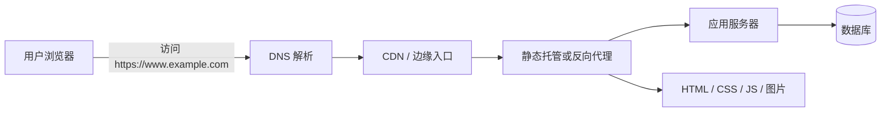
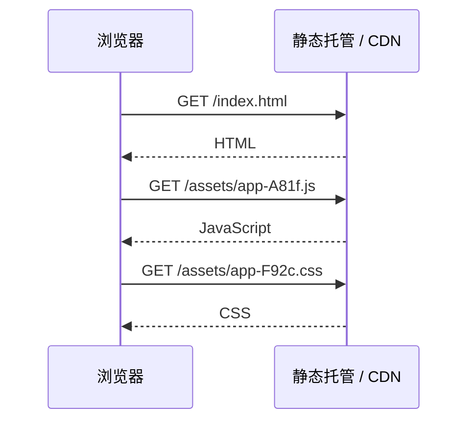
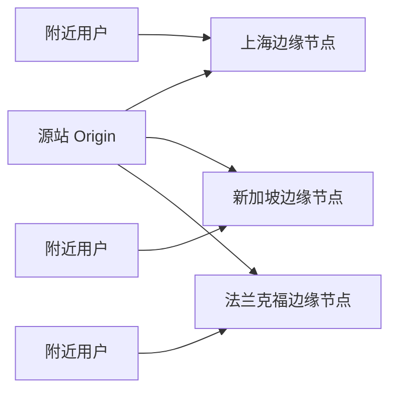
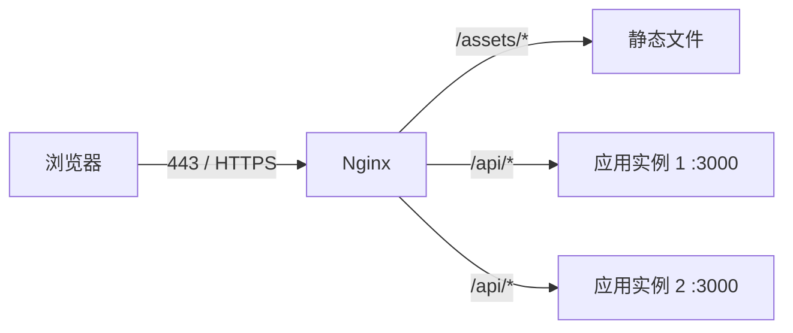
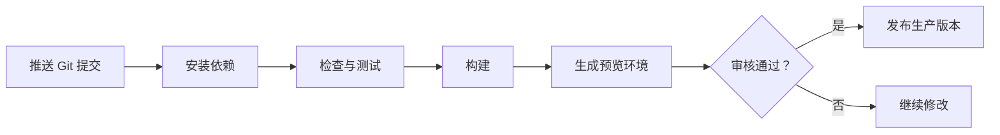

> **学完这一节，你应该能回答**
> - 为什么 `localhost:3000` 只有自己能访问？
> - 构建、部署、托管、域名、DNS、HTTPS 和 CDN 各自在哪一环？
> - 静态网站与带后端的网站需要的基础设施有什么区别？
> - Nginx 在生产系统中通常扮演什么角色？

## 1. “本地能打开”离“公网可访问”还有多远

`localhost` 或 `127.0.0.1` 指当前这台设备自身。开发服务器监听在这里时，请求不会离开你的电脑，互联网上的其他人自然无法访问。

让网站公开可用，至少要解决：

1. **产物**：浏览器或服务器真正要运行哪些文件？
2. **计算与存储**：这些文件和程序放在哪里？
3. **网络入口**：公网请求如何到达它？
4. **名称**：域名如何指向入口？
5. **安全通道**：如何启用 HTTPS？
6. **持续更新**：新版本如何可靠发布和回滚？
7. **可运维性**：出错后如何看日志、监控和恢复？



小型静态网站可能只有 `CDN → 静态文件`；复杂应用才需要后面的应用服务器和数据库。

---

## 2. 先判断网站属于哪一类

### 静态网站

部署后主要是一组 HTML、CSS、JavaScript、图片和字体文件。服务器收到请求后直接返回已有文件。

适合：

- 个人主页、文档、博客；
- 前端单页应用，数据来自独立 API；
- 在构建时就能生成内容的网站。

常见托管方式：GitHub Pages、Cloudflare Pages、Netlify、Vercel 静态输出、对象存储加 CDN、自建 Nginx。

### 动态网站

请求到来时需要执行服务端代码，例如验证用户、查询数据库、计算价格或生成个性化页面。

动态部署还要考虑：

- 应用运行时（Node.js、Python、JVM 等）；
- 进程管理和健康检查；
- 数据库与迁移；
- 秘密和环境变量；
- 扩容、日志、监控和备份。

### Serverless 与边缘函数

它们仍然属于服务端计算，只是平台替你管理大部分服务器和扩缩容。你通常按函数或请求运行代码，但仍需考虑冷启动、执行时间、地域、状态存储、成本和平台限制。

“静态、服务器、Serverless”可以混合使用。例如首页来自 CDN，登录 API 运行在函数中，核心订单服务运行在长期在线的容器里。

---

## 3. 第一步：生成生产产物

纯 HTML 项目可能无需构建；Vite 等项目通常需要：

```bash
npm ci
npm run build
```

Vite 默认把结果写入 `dist/`。部署的是这个目录中的产物，而不是：

- `src/` 源码目录；
- `node_modules/`；
- 本地开发服务器；
- 包含服务端秘密的 `.env`。

部署前先本地预览生产产物，并检查浏览器的 Console 和 Network 面板。开发模式和生产构建的行为可能不同，详见 [2.3 前端构建](/blog/2-3-前端构建)。

---

## 4. 静态托管实际做了什么

用户请求 `/about.html`，静态服务器就在部署目录中找到对应文件，连同合适的 HTTP 响应头返回。



托管平台通常还会提供：

- 全球 CDN；
- HTTPS 证书和自动续期；
- 自定义域名；
- 从 Git 仓库自动构建；
- 预览部署和回滚；
- 重定向、重写和响应头配置。

GitHub Pages 就是静态托管服务：它从仓库获取 HTML、CSS、JavaScript，可选地经过构建，然后发布为网站。它不会替你长期运行任意后端进程。

---

## 5. 域名、DNS 与服务器入口

购买域名只是获得名称的管理权，不会自动产生网站。你需要在 DNS 中配置记录，把名称指向托管平台或服务器。

常见记录：

| 记录 | 含义 | 典型用途 |
| --- | --- | --- |
| `A` | 名称指向 IPv4 地址 | `example.com → 203.0.113.10` |
| `AAAA` | 名称指向 IPv6 地址 | 根域名的 IPv6 入口 |
| `CNAME` | 一个名称指向另一个名称 | `www.example.com → host.example.net` |
| `TXT` | 任意文本 | 域名所有权验证、邮件安全配置 |

DNS 修改后不会瞬间在全世界同时生效，因为各级解析器会按 TTL 缓存结果。排查时要区分：

- DNS 尚未指向正确入口；
- DNS 已正确，但服务器没有识别这个域名；
- HTTP 可访问，但 HTTPS 证书还未签发或配置错误。

网络基础见 [1.2 计算机之间的通信：网络](/blog/1-2-计算机之间的通信-网络)。

---

## 6. HTTPS 与证书

生产网站应使用 HTTPS。浏览器与服务器建立 TLS 连接时，会验证证书中的域名、有效期和信任链，然后协商加密密钥。

现代托管平台通常自动申请和续期证书。自建服务器可使用受信任证书机构与自动化工具，但必须保证续期正常。

常见问题：

- 证书签给 `example.com`，却访问未覆盖的 `www.example.com`；
- 页面是 HTTPS，却请求 HTTP API，触发 mixed content；
- DNS 指向了旧服务器，浏览器收到另一张证书；
- 证书正常，但后端生成了错误的 HTTP 重定向地址。

HTTPS 保护传输，不会自动修复应用权限、SQL 注入或泄露的密钥。

---

## 7. CDN 与缓存

CDN（内容分发网络）在许多地区部署边缘节点，把可缓存内容放到更靠近用户的位置。



典型策略：

- 带内容哈希的 JS/CSS/图片：可设置长期缓存，因为内容改变会产生新 URL；
- `index.html`：短缓存或要求重新验证，因为它引用最新资源；
- 用户私有数据：通常不可放入公共 CDN 缓存，除非缓存键和权限经过严谨设计。

缓存错误可能把旧版本长期留在用户设备，也可能把一个用户的数据误发给另一个用户。使用 `Cache-Control` 时要明确内容是否公开、多久过期、能否重新验证。

---

## 8. Nginx 是什么

Nginx 是常见的 Web 服务器和反向代理。它不是“部署”本身，而是生产架构中可承担多个职责的一块组件：

- 提供静态文件；
- 终止 TLS；
- 把 `/api` 请求转发给后端应用；
- 负载均衡到多个应用实例；
- 压缩、缓存、限速和记录访问日志。



一个简化配置示意：

```nginx
server {
    listen 80;
    server_name example.com;

    root /var/www/app;
    index index.html;

    # 单页应用的客户端路由回退
    location / {
        try_files $uri $uri/ /index.html;
    }

    # 将 API 交给本机后端进程
    location /api/ {
        proxy_pass http://127.0.0.1:3000;
        proxy_set_header Host $host;
        proxy_set_header X-Forwarded-Proto $scheme;
    }
}
```

这只是概念示例，生产环境还要配置 HTTPS、超时、请求大小、安全响应头、日志轮转等。使用托管平台时，这些能力可能由平台提供，不需要自己维护 Nginx。

---

## 9. SPA 刷新为什么会 404

客户端路由中，React 等代码可能在浏览器里把 `/users/42` 显示为用户页面。但用户直接刷新时，请求先到静态服务器：

```text
GET /users/42
```

服务器磁盘上通常没有名为 `/users/42` 的文件，于是返回 404。解决方法是配置 fallback / rewrite：对于不是实际静态资源的前端路由，返回 `index.html`，再由客户端路由接管。

但 API 404 和资源 404 不应被一律改写成 HTML，否则前端可能期待 JSON 却得到首页。重写规则要限定范围和优先级。

---

## 10. CI/CD：从提交到上线

手工复制文件适合第一次理解过程，但容易漏文件、环境不一致，也难回滚。常见自动发布流程是：



可靠发布还应做到：

- 构建对应一个明确提交；
- 生产配置与代码分开管理；
- 发布失败不会破坏当前可用版本；
- 能快速回滚到已知正常版本；
- 数据库迁移考虑向前、向后兼容；
- 日志和监控能关联到发布版本。

部署不是把文件传上去就结束，而是软件进入长期运行阶段的开始。

---

## 11. 前后端分开部署时

一种常见结构：

```text
前端：https://www.example.com
后端：https://api.example.com
```

需要处理：

- 后端 CORS 只允许需要的前端源；
- Cookie 的 Domain、SameSite、Secure 配置；
- API 地址通过环境配置注入；
- 前后端版本的兼容性；
- 两边都有 HTTPS，避免 mixed content。

另一种结构是由同一入口代理：

```text
页面：https://example.com/
API： https://example.com/api/
```

同源结构通常简化 CORS 和 Cookie，但需要反向代理正确分流。详见 [3.3 前后端通信、跨域问题](/blog/3-3-前后端通信-跨域问题)。

---

## 12. 上线前检查清单

### 功能与产物

- [ ] 从干净环境能按锁文件安装并构建
- [ ] 生产环境变量完整，前端不包含秘密
- [ ] 首页和客户端子路由直接访问都正常
- [ ] 静态资源没有 404，基础路径正确
- [ ] 错误页、加载态和网络失败有合理表现

### 网络与安全

- [ ] 域名解析到正确入口
- [ ] HTTPS 证书有效并能自动续期
- [ ] HTTP 自动跳转 HTTPS
- [ ] CORS、Cookie 与安全响应头符合实际需要
- [ ] 数据库和内部管理端口没有直接暴露公网

### 运维

- [ ] 有结构化日志和基本监控
- [ ] 有健康检查、告警和备份
- [ ] 能识别当前线上版本
- [ ] 有可验证的回滚方法
- [ ] 依赖和基础镜像有更新计划

## 常见故障定位顺序

1. `nslookup` / `dig`：域名解析是否正确？
2. 浏览器证书信息：TLS 是否有效？
3. Network：哪个请求失败，状态码和响应是什么？
4. CDN / 反向代理日志：请求是否到达入口？
5. 应用日志：后端是否收到请求并报错？
6. 数据库和依赖服务：应用是否卡在下游？

沿请求链逐段确认，比“重启所有东西试试”更可靠。

## 延伸阅读

- [GitHub Docs：什么是 GitHub Pages](https://docs.github.com/zh/pages/getting-started-with-github-pages/what-is-github-pages)
- [Vite：部署静态站点](https://vite.dev/guide/static-deploy.html)
- [MDN：HTTPS](https://developer.mozilla.org/zh-CN/docs/Glossary/HTTPS)
- [Nginx 官方初学者指南](https://nginx.org/en/docs/beginners_guide.html)
