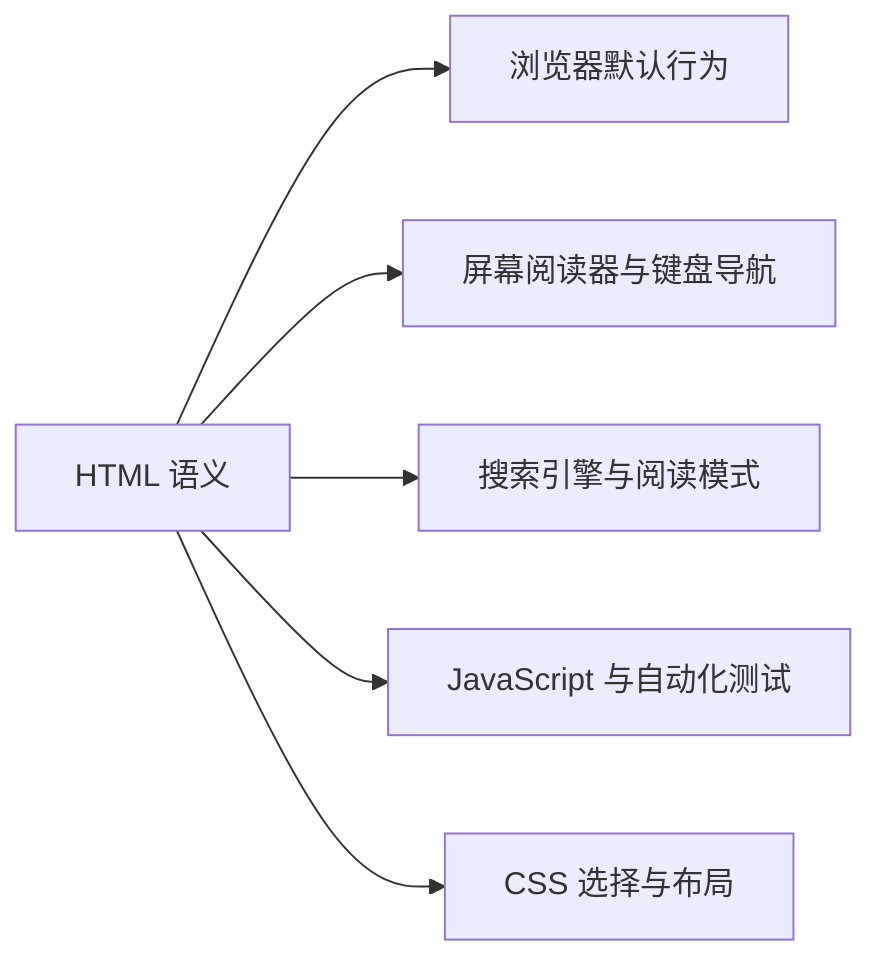
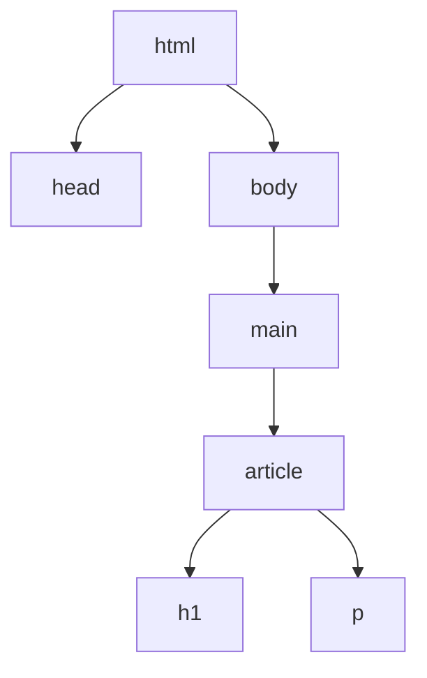

> **学完这一节，你应该能回答**
> - HTML 为什么是标记语言，而不是用来“画界面”的编程语言？
> - 语义化元素怎样同时帮助浏览器、搜索引擎和辅助技术？
> - 链接、按钮、表单、图片和表格应如何选择正确元素？
> - 为什么浏览器端校验改善体验，却不能成为安全边界？

## 1. HTML 描述内容是什么

HTML（HyperText Markup Language）用元素给内容增加结构和含义：

```html
<article>
  <h1>如何冲一杯咖啡</h1>
  <p>这是一份给初学者的步骤说明。</p>
</article>
```

这里不是在告诉浏览器“第一行用 32 像素粗体”，而是在声明：这是一篇文章、一个一级标题和一个段落。视觉外观主要由 CSS 决定。

正确的语义会被多个消费者使用：



因此，HTML 的首要目标不是“看起来对”，而是**内容结构和交互含义正确**。

---

## 2. 元素、标签、属性与 DOM

```html
<a href="/docs" lang="zh-CN">阅读文档</a>
```

| 部分 | 示例 | 含义 |
| --- | --- | --- |
| 开始标签 | `<a>` | 元素开始 |
| 属性 | `href="/docs"` | 为元素提供额外配置 |
| 内容 | `阅读文档` | 元素包含的文本或子元素 |
| 结束标签 | `</a>` | 元素结束 |

浏览器解析 HTML 后生成 DOM 树：



HTML 容错能力很强，错误嵌套时浏览器会尝试修复，但修复后的 DOM 可能与你看到的源码不同。调试时应查看开发者工具中的实际 DOM。

### 空元素与布尔属性

```html

<input type="checkbox" checked />
```

`img` 没有子内容；`checked` 这类布尔属性只要出现就表示真，写成 `checked="false"` 仍然表示存在并启用。

---

## 3. 一份可靠的文档骨架

```html
<!doctype html>
<html lang="zh-CN">
  <head>
    <meta charset="utf-8" />
    <meta name="viewport" content="width=device-width, initial-scale=1" />
    <title>页面标题</title>
    <meta name="description" content="页面内容的简短说明" />
    <link rel="stylesheet" href="/styles.css" />
    <script type="module" src="/main.js"></script>
  </head>
  <body>
    <header>...</header>
    <main>...</main>
    <footer>...</footer>
  </body>
</html>
```

- `<!doctype html>` 让浏览器使用标准模式。
- `lang` 帮助语音、断词、翻译和搜索。
- UTF-8 应尽早声明，避免文本误解码。
- viewport 元信息让移动端按设备宽度布局。
- `title` 是标签页、书签和搜索结果的重要标题。
- `description` 可能用于搜索摘要，但不是排名按钮。
- `type="module"` 的脚本默认延迟执行，并支持 `import`。

`head` 中的元数据大多不直接显示，却会影响解析、资源加载、分享和可发现性。

---

## 4. 文档地标与标题层级

常见结构元素：

| 元素 | 语义 |
| --- | --- |
| `header` | 页面或某个章节的头部 |
| `nav` | 主要导航链接组 |
| `main` | 页面独有的主要内容，通常只有一个可见主区域 |
| `article` | 可独立分发或复用的完整内容 |
| `section` | 有主题、通常有标题的章节 |
| `aside` | 与主内容间接相关的补充内容 |
| `footer` | 页面或章节的尾部信息 |

不要为了名字像布局区域就机械使用 `section`。如果只需要没有独立语义的样式容器，`div` 完全合理。

### 标题不是字号工具

```html
<h1>订单帮助中心</h1>
  <h2>付款问题</h2>
    <h3>银行卡被拒绝</h3>
  <h2>配送问题</h2>
```

标题层级表达文档大纲。不要因为想要小字体就从 `h2` 跳到 `h5`；字号交给 CSS。

---

## 5. 链接与按钮：导航还是动作

### 链接 `<a>`

链接把用户带到另一个 URL：

```html
<a href="/orders/42">查看订单</a>
```

它天然支持：

- 在新标签页打开；
- 复制链接地址；
- 浏览器历史；
- 搜索引擎发现；
- 键盘和辅助技术识别。

### 按钮 `<button>`

按钮在当前上下文触发动作：

```html
<button type="button" id="save">保存草稿</button>
```

不要用可点击的 `div` 模仿按钮，也不要用链接执行删除操作。正确元素自带焦点、键盘、角色和行为。

表单内 `<button>` 默认类型通常是 `submit`。不是提交按钮时明确写 `type="button"`，避免意外提交。

---

## 6. 图片与替代文本

```html
<figure>
  
  <figcaption>系统请求链路</figcaption>
</figure>
```

`alt` 描述图片在当前上下文承担的信息，不是机械重复文件名：

- 信息图片：传达其关键内容；
- 功能图片：描述链接或按钮的目的；
- 纯装饰图片：使用空 `alt=""`，让辅助技术跳过；
- 复杂图表：在正文提供完整文字解释，不能只靠一句 alt。

设置固有宽高可以让浏览器在图片下载前预留比例，减少布局跳动。响应式图片可结合 `srcset` 和 `sizes`，让浏览器选择合适资源。

背景装饰通常用 CSS；内容图片通常用 HTML，这影响可访问性、打印和加载语义。

---

## 7. 表单：浏览器原生的数据接口

```html
<form action="/register" method="post">
  <div>
    <label for="email">邮箱</label>
    <input
      id="email"
      name="email"
      type="email"
      autocomplete="email"
      required
    />
  </div>

  <div>
    <label for="password">密码</label>
    <input
      id="password"
      name="password"
      type="password"
      autocomplete="new-password"
      minlength="12"
      required
    />
  </div>

  <button type="submit">注册</button>
</form>
```

关键点：

- `label` 与输入控件关联，点击文字也能聚焦输入框；
- `name` 决定表单提交的字段名，没有它通常不会随表单提交；
- 合适的 `type` 帮助验证和移动键盘布局；
- `autocomplete` 帮助密码管理器和浏览器正确填写；
- placeholder 不能替代 label，输入后它会消失，也常有对比度问题；
- 错误信息应与对应控件建立程序化关联，并可被辅助技术获知。

### GET 与 POST 表单

- 搜索、筛选等可重复、可分享的只读操作适合 GET，数据进入 URL 查询参数；
- 创建或修改数据通常使用 POST 等非安全方法。

### 浏览器验证不是安全边界

用户能移除 `required`、修改请求或完全绕过页面。浏览器验证负责即时体验，服务端仍必须验证所有输入，见 [3.0 什么是API?后端是为了什么？](/blog/3-0-什么是-api-后端是为了什么)。

---

## 8. 表格用于数据，不用于页面布局

```html
<table>
  <caption>2026 年第三季度销售额</caption>
  <thead>
    <tr>
      <th scope="col">月份</th>
      <th scope="col">销售额</th>
    </tr>
  </thead>
  <tbody>
    <tr>
      <th scope="row">七月</th>
      <td>¥120,000</td>
    </tr>
  </tbody>
</table>
```

`caption` 说明表格主题，`th` 和 `scope` 建立行列标题关系。复杂表格要谨慎处理多级表头。

表格用于二维数据关系。用表格摆放导航、侧栏和正文会混淆语义，并让响应式布局与阅读顺序难以维护；页面布局应使用 CSS Grid、Flexbox 等。

---

## 9. ARIA：补充原生语义，而非替代

ARIA 可以为自定义控件补充角色、状态和关系，但首选原生 HTML：

```html
<!-- 首选 -->
<button type="button">展开详情</button>

<!-- 自制控件需要自己补齐焦点、键盘和状态，复杂得多 -->
<div role="button" tabindex="0" aria-expanded="false">展开详情</div>
```

第一条原则可以记为：**如果原生元素已经提供所需语义与行为，就使用原生元素。**

ARIA 改变辅助技术看到的语义，不会自动增加键盘行为、焦点管理或视觉状态。错误 ARIA 可能比没有更糟。

---

## 10. HTML、SEO 与渐进增强

搜索引擎和分享平台会读取标题、描述、链接、结构化内容等，但 SEO 不是堆关键词。可抓取的真实内容、清晰结构、性能和有用信息更重要。

**渐进增强**的思想是：先让核心内容和基本动作在可靠的 HTML 层可用，再用 CSS 和 JavaScript 提升体验。

例如表单本身可向服务器提交；JavaScript 可以在其上增加无刷新反馈。这样脚本加载慢、失败或辅助工具环境不同，用户仍有基础路径。

并非每个复杂应用都能完全无 JavaScript，但这个思路能迫使设计者区分核心任务和增强效果。

---

## 11. 安全相关的 HTML 边界

- 不把不可信文本直接拼成 HTML；应使用安全的文本 API 或可靠转义。
- `target="_blank"` 的外部链接应理解 opener 隔离；现代浏览器已有部分默认保护，但明确策略更稳妥。
- iframe 需要按实际用途限制 `sandbox`、权限和允许来源。
- 文件上传的 `accept` 只是文件选择提示，不是服务端安全验证。
- 隐藏输入框不是秘密；它仍会出现在源码和请求中。
- `disabled` 控件通常不会提交，`readonly` 与它行为不同。

完整威胁见 [3.6 Web 安全基础](/blog/3-6-web-安全基础)。

---

## 12. 调试与检查清单

### 调试

1. 使用 HTML Validator 检查结构错误。
2. 在 Elements 面板看浏览器实际生成的 DOM。
3. 只用键盘完成主要操作。
4. 检查焦点顺序和可见焦点。
5. 查看浏览器 Accessibility Tree。
6. 暂时关闭 CSS，确认内容顺序仍合理。

### 页面检查

- [ ] `html` 有正确 `lang`
- [ ] 页面有独特、清楚的 `title`
- [ ] 标题层级表达内容结构
- [ ] 主要导航和正文地标明确
- [ ] 链接用于导航，按钮用于动作
- [ ] 每个表单控件都有可见标签
- [ ] 图片的替代文本符合语境
- [ ] 错误、成功和必填状态不只靠颜色表达
- [ ] DOM 顺序与阅读、键盘顺序一致
- [ ] 服务端重新验证所有输入

## 小练习

只使用 HTML 写一个“注册 + 课程列表”页面：包含页面标题、导航、主内容、课程卡片、带正确标签的注册表单和一个数据表格。暂时不要写 CSS；使用浏览器默认样式时，文档也应具有清楚结构和可操作性。

## 延伸阅读

- [2.1 前端是什么](/blog/2-1-前端是什么)
- [2.7 CSS：布局、响应式与渲染](/blog/2-7-css-布局-响应式与渲染)
- [MDN：使用 HTML 构建内容](https://developer.mozilla.org/zh-CN/docs/Learn_web_development/Core/Structuring_content)
- [WHATWG HTML Living Standard](https://html.spec.whatwg.org/)
