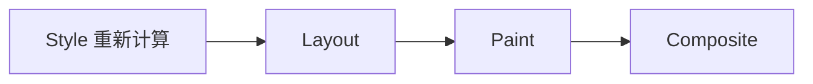

> **学完这一节，你应该能回答**
> - CSS 冲突时，来源、重要性、层叠层、选择器和源码顺序如何共同决定结果？
> - 盒模型、正常流、Flexbox、Grid 和定位分别解决什么问题？
> - 响应式设计为什么不是给每种手机写一份页面？
> - 哪些样式变化会触发布局、绘制或合成，为什么这会影响性能？

## 1. CSS 是约束系统，不是坐标清单

CSS（Cascading Style Sheets）描述元素在不同设备、内容和状态下如何呈现。浏览器综合：

- HTML 结构；
- 样式规则；
- 字体和图片的固有尺寸；
- 容器可用空间；
- 用户设置与设备能力；

计算最终布局。

好的 CSS 通常描述关系，例如“卡片至少 16rem，能放几个就放几个”，而不是给每个元素写死屏幕坐标。

```css
.card-grid {
  display: grid;
  grid-template-columns: repeat(auto-fit, minmax(min(16rem, 100%), 1fr));
  gap: 1rem;
}
```

---

## 2. 层叠：冲突规则怎样胜出

同一元素的同一属性可能被多条规则声明。浏览器大致按以下维度解决：

1. 声明来源与重要性；
2. 层叠层（cascade layers）；
3. 选择器特异性；
4. 作用域接近程度等规则；
5. 源码顺序。

这比“后写的一定覆盖先写的”更准确；源码顺序只在前面条件相当时决定胜负。

### 特异性

```css
button {}             /* 类型选择器 */
.toolbar button {}    /* 类 + 类型 */
#checkout-button {}   /* ID */
```

一般而言 ID 比类更具体，类比类型更具体。内联样式和 `!important` 还有额外优先规则。

不要靠不断增加选择器长度或堆 `!important` 打补丁。更可靠的方法是：

- 保持选择器简单；
- 使用组件和状态类；
- 明确基础、组件、工具等层次；
- 需要时使用 `@layer` 管理规则来源；
- 在开发者工具中查看被覆盖原因。

### 继承

文字颜色、字体等部分属性通常从父元素继承；宽度、边框和外边距通常不继承。`inherit`、`initial`、`unset`、`revert` 含义不同，使用时应查属性规范。

---

## 3. 盒模型

每个元素可理解为一个盒子：

```text
┌──────────── margin ────────────┐
│  ┌───────── border ─────────┐  │
│  │  ┌────── padding ─────┐  │  │
│  │  │      content       │  │  │
│  │  └────────────────────┘  │  │
│  └──────────────────────────┘  │
└────────────────────────────────┘
```

默认 `box-sizing: content-box` 下，声明的 `width` 只包含 content，padding 和 border 另加。项目常采用：

```css
*,
*::before,
*::after {
  box-sizing: border-box;
}
```

此时 `width` 包含 content、padding 和 border，更容易推理。margin 仍在盒子外。

### 外边距折叠

正常块级流中的某些垂直 margin 会折叠，而不是简单相加。Flex/Grid 项目之间通常不发生同样的 margin 折叠。组件间距更适合由父布局的 `gap` 统一管理。

### 固有尺寸与溢出

内容并不会因为容器写了宽高就自动消失。长单词、图片和表格可能撑破布局。需要理解：

- `min-width: 0` 对 Flex/Grid 子项收缩的重要性；
- `overflow` 是裁切、滚动还是可见；
- 图片常用 `max-width: 100%; height: auto;`；
- 固定高度会与动态文字、翻译和缩放冲突。

---

## 4. 正常文档流

在不写复杂布局时，块级内容通常从上到下排列，行内内容在行内从起始方向流动。这是正常流。

优先让正常流完成基础结构，再使用 Flex/Grid。过早把元素绝对定位，会让它脱离正常流，父容器无法按其高度展开，内容变化也容易重叠。

### `display`

| 值 | 典型行为 |
| --- | --- |
| `block` | 占据可用行，前后通常换行 |
| `inline` | 随文字排布，宽高行为受行内格式影响 |
| `inline-block` | 行内排列，但自身像盒子一样可设尺寸 |
| `flex` | 子元素进入一维弹性布局 |
| `grid` | 子元素进入二维网格布局 |
| `none` | 不生成布局盒，也从可访问树中移除 |

视觉隐藏、仅屏幕阅读器可见、保留布局空间等需求不能都用 `display: none`，应根据语义选择方案。

---

## 5. Flexbox：一维排列与空间分配

Flexbox 擅长一条主轴上的排列：导航、工具栏、按钮组、卡片内部布局。

```css
.toolbar {
  display: flex;
  align-items: center;
  justify-content: space-between;
  gap: 0.75rem;
  flex-wrap: wrap;
}
```

核心概念：

- `flex-direction` 决定主轴；
- `justify-content` 沿主轴分配空间；
- `align-items` 沿交叉轴对齐；
- `flex-grow` 分配剩余空间；
- `flex-shrink` 决定空间不足时如何收缩；
- `flex-basis` 提供参与分配的基础尺寸；
- `gap` 表达项目间距。

“垂直居中”只是 Flexbox 的一个小用途。更重要的是它让未知尺寸的项目在一个维度中协商空间。

---

## 6. Grid：二维轨道布局

Grid 同时控制行和列，适合页面区域、数据面板和响应式卡片网格：

```css
.layout {
  display: grid;
  grid-template-columns: minmax(12rem, 18rem) 1fr;
  gap: 1.5rem;
}
```

响应式卡片：

```css
.cards {
  display: grid;
  grid-template-columns: repeat(auto-fit, minmax(15rem, 1fr));
  gap: 1rem;
}
```

| 需求 | 优先考虑 |
| --- | --- |
| 一行按钮、导航、媒体对象 | Flexbox |
| 同时控制行列对齐 | Grid |
| 文本自然从上到下 | 正常流 |
| 少量叠加、徽标、浮层 | 定位 |

Flex 与 Grid 可以嵌套，不需要选边站。父级用 Grid 分页面区域，卡片内部用 Flex 排按钮，是常见组合。

---

## 7. 定位与层叠上下文

| `position` | 含义 |
| --- | --- |
| `static` | 默认，参与正常流 |
| `relative` | 保留原位置，并可作为绝对定位子元素的参照 |
| `absolute` | 脱离正常流，相对包含块定位 |
| `fixed` | 通常相对视口固定 |
| `sticky` | 在滚动到阈值时粘附于滚动容器 |

`z-index: 999999` 不一定压过一切，因为元素可能处于不同**层叠上下文**。`transform`、`opacity`、定位与 z-index 等条件会创建新的上下文，子元素无法简单逃出父上下文与外界比较。

遇到遮挡问题，应检查：

- 谁创建了层叠上下文；
- 元素相对哪个包含块定位；
- 哪个祖先在裁切 `overflow`；
- sticky 元素属于哪个滚动容器。

---

## 8. 长度单位与可伸缩设计

| 单位 | 相对对象 | 常见用途 |
| --- | --- | --- |
| `px` | CSS 像素 | 边框、精细控制；不等于固定物理像素 |
| `rem` | 根元素字体大小 | 字体、间距、整体可缩放尺度 |
| `em` | 当前元素相关字体大小 | 组件内部相对尺寸 |
| `%` | 属性定义的包含参照 | 流式宽度 |
| `vw` / `vh` | 视口尺寸 | 大型视觉区域，移动端需注意动态视口 |
| `dvh` / `svh` / `lvh` | 动态/小/大视口 | 移动浏览器工具栏变化场景 |
| `ch` | 字体中“0”的近似宽度 | 控制文本行宽 |

不要把所有尺寸都改成 `rem`，也不要把所有内容写死成 `px`。单位要表达设计意图。

```css
.article {
  width: min(100% - 2rem, 70ch);
  margin-inline: auto;
}
```

这表示正文最多约 70 个字符宽，小屏则保留两侧空间。

---

## 9. 响应式设计

响应式设计不是维护“手机版”和“电脑版”两份页面，而是让同一内容在不同约束下合理重排。

### 移动优先

先写小空间下的基础规则，再在空间足够时增强：

```css
.page {
  display: block;
}

@media (width >= 48rem) {
  .page {
    display: grid;
    grid-template-columns: 16rem 1fr;
  }
}
```

断点应由内容什么时候放不下决定，而不是追逐每个设备型号。

### 容器查询

组件可能不知道自己出现在整页还是窄侧栏。容器查询让它按自身容器宽度响应：

```css
.card-area {
  container-type: inline-size;
}

@container (width >= 30rem) {
  .card {
    grid-template-columns: 10rem 1fr;
  }
}
```

媒体查询描述视口或设备能力，容器查询描述组件可用空间，两者互补。

---

## 10. 自定义属性与设计令牌

```css
:root {
  --color-surface: #ffffff;
  --color-text: #1f2937;
  --space-2: 0.5rem;
  --space-4: 1rem;
  --radius-md: 0.75rem;
}

.card {
  color: var(--color-text);
  background: var(--color-surface);
  padding: var(--space-4);
  border-radius: var(--radius-md);
}
```

CSS 自定义属性参与层叠，可以在主题或组件范围覆盖。设计令牌应表达系统含义，而不是把每个偶然数值都取一个名字。

要提供回退值时：

```css
color: var(--color-text, #111827);
```

---

## 11. 浏览器渲染与性能

样式变化可能触发不同工作：



- 改变宽高、字体、位置等可能需要重新布局；
- 改变颜色、阴影可能需要重新绘制；
- 某些 `transform` 和 `opacity` 动画可主要在合成阶段完成。

但“只用 transform 就一定快”仍过度简化。图层会占内存，巨大模糊阴影和频繁内容变化仍可能昂贵。应使用 Performance 工具测量。

避免在 JavaScript 中交替读取布局和写入样式，造成强制同步布局：

```text
读尺寸 → 改样式 → 再读尺寸 → 再改样式
```

批量读取、批量写入通常更好。

---

## 12. 动画、可访问性与用户偏好

动画应帮助理解状态变化，而不是制造眩晕或阻碍操作。

```css
@media (prefers-reduced-motion: reduce) {
  *,
  *::before,
  *::after {
    scroll-behavior: auto;
    animation-duration: 0.01ms;
    animation-iteration-count: 1;
    transition-duration: 0.01ms;
  }
}
```

还应考虑：

- 文本与背景对比度；
- 200% 缩放后内容不被裁切；
- 焦点样式清楚；
- 不只靠 hover 显示关键信息；
- 触摸目标足够大；
- 深色模式不是简单反转全部颜色。

不要无条件删除 `outline`。若自定义焦点样式，必须提供同等清晰的替代。

---

## 13. 组织 CSS

可维护 CSS 的共同目标：规则的作用范围和覆盖关系可预测。

一种简单层次：

```css
@layer reset, base, components, utilities;
```

- reset：消除少量不一致；
- base：文档基础排版；
- components：按钮、卡片等；
- utilities：少量明确单用途规则。

命名方式、CSS Modules、utility-first、CSS-in-JS 都是工具选择。评价标准包括：

- 能否快速找到规则来源；
- 是否容易产生意外全局影响；
- 状态和变体能否清楚表达；
- 是否支持删除未使用样式；
- 运行时和构建成本是否合适。

---

## 14. 系统化调试 CSS

1. 在 Elements 面板确认选中的真是目标元素。
2. 查看 Computed，确认最终值和来源。
3. 看规则是否被划掉，判断层叠原因。
4. 检查盒模型与固有尺寸。
5. 打开 Flex/Grid 可视化工具。
6. 检查父级的 `display`、`overflow`、尺寸和定位上下文。
7. 临时加 `outline: 1px solid red` 观察边界。
8. 用真实长文本、空数据、缩放和窄屏测试。

“多加一个 `!important`”通常只会把问题推到下一次覆盖冲突。

## 小练习

给 [2.6 HTML：内容、结构与语义](/blog/2-6-html-内容-结构与语义) 的练习页面增加样式：正文最大行宽合理，课程卡片自动换列，表单在窄屏单列、宽屏两列，键盘焦点清楚，并尊重 reduced motion。不要用绝对定位搭整页布局。

## 延伸阅读

- [MDN：CSS 样式基础](https://developer.mozilla.org/zh-CN/docs/Learn_web_development/Core/Styling_basics)
- [MDN：CSS 布局](https://developer.mozilla.org/zh-CN/docs/Learn_web_development/Core/CSS_layout)
- [CSS Cascading and Inheritance](https://www.w3.org/TR/css-cascade-6/)
