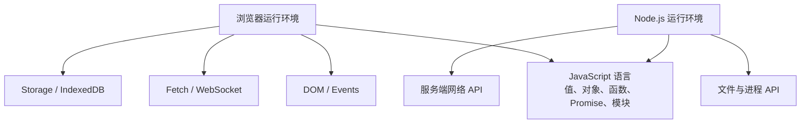
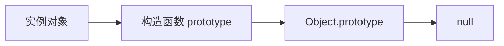

> **学完这一节，你应该能回答**
> - JavaScript 语言与浏览器 Web API 为什么要分开理解？
> - 原始值、对象、引用、类型转换和相等比较有哪些关键规则？
> - 函数、闭包、`this`、原型和类是什么关系？
> - 怎样避免共享可变状态和隐式类型转换制造的常见 bug？

## 1. JavaScript 语言不等于浏览器

JavaScript 是 ECMAScript 标准定义的编程语言。浏览器提供 DOM、Fetch、定时器、Storage 等 Web API；Node.js 则提供文件、进程和服务端网络 API。



`Array.prototype.map` 属于语言标准；`document.querySelector` 属于浏览器 DOM API；`fs.readFile` 属于 Node.js。区分来源，查文档和判断可运行环境会容易很多。

---

## 2. JavaScript 的值与类型

JavaScript 有七种原始值类型：

- `undefined`
- `null`
- `boolean`
- `number`
- `bigint`
- `string`
- `symbol`

除此之外都是对象，包括数组、函数、日期和正则表达式。

```js
typeof 42;          // "number"
typeof 'hello';     // "string"
typeof undefined;   // "undefined"
typeof {};          // "object"
typeof [];          // "object"
typeof function(){};// "function"（typeof 的特殊结果）
typeof null;        // "object"（历史遗留行为）
```

判断数组使用：

```js
Array.isArray(value);
```

不要把 `typeof null === 'object'` 当成 null 真的是普通对象。

---

## 3. `undefined`、`null` 与缺失

- `undefined` 常表示尚未赋值、属性不存在或函数没有显式返回。
- `null` 通常由程序主动表示“此处明确没有值”。
- 对象属性不存在与属性存在但值为 `undefined`，有时需要区分。

```js
const user = { nickname: undefined };

'nickname' in user; // true
'age' in user;      // false
```

JSON 没有 `undefined`：

```js
JSON.stringify({ a: undefined, b: null }); // '{"b":null}'
```

设计 API 时要明确“字段缺失”“字段为 null”“字段为空字符串”是否有不同含义。

---

## 4. Number、浮点数与 NaN

JavaScript 的普通 `number` 使用 IEEE 754 双精度浮点表示：

```js
0.1 + 0.2 === 0.3; // false
Number.isSafeInteger(9_007_199_254_740_991); // true
```

金额通常使用最小货币单位整数，或使用经过设计的十进制定点/高精度方案。

`NaN` 表示某次数字运算得不到有效数字：

```js
Number('abc');        // NaN
NaN === NaN;          // false
Number.isNaN(NaN);    // true
```

全局 `isNaN` 会先做类型转换，通常优先使用 `Number.isNaN`。

`BigInt` 可表示任意精度整数，但不能与普通 Number 直接混算，也不能原样由 JSON 标准序列化。

---

## 5. 类型转换与相等比较

JavaScript 会在许多运算中隐式转换类型：

```js
'5' + 1; // "51"
'5' - 1; // 4
0 == false;  // true
0 === false; // false
```

- `==` 会按规则进行类型转换；
- `===` 不在两边类型不同的情况下尝试转换。

应用代码通常优先使用严格相等 `===`，并在边界显式转换：

```js
const page = Number.parseInt(searchParams.get('page') ?? '1', 10);

if (!Number.isInteger(page) || page < 1) {
  throw new Error('page 必须是正整数');
}
```

### 真值与假值

假值包括：`false`、`0`、`-0`、`0n`、`""`、`null`、`undefined`、`NaN`。空数组和空对象都是真值。

```js
Boolean([]); // true
Boolean({}); // true
```

`if (!value)` 会把零、空字符串和缺失值合并处理；如果业务上它们不同，应写更精确条件。

---

## 6. `let`、`const`、作用域与提升

```js
const taxRate = 0.13;
let total = 0;
```

- 默认用 `const` 表达名称不重新绑定；
- 确实需要重新赋值时用 `let`；
- 新代码通常避免 `var`，因为它是函数作用域并有容易误解的提升行为。

`let` 和 `const` 是块级作用域：

```js
if (true) {
  const message = 'inside';
}
// message 在这里不可见
```

声明在执行到初始化之前处于暂时性死区。JavaScript 会建立作用域绑定，但不能在声明之前安全访问 `let`/`const`。

---

## 7. 原始值复制与对象引用

```js
let a = 1;
let b = a;
b = 2;
// a 仍是 1

const first = { score: 1 };
const second = first;
second.score = 2;
// first.score 也是 2
```

对象赋值复制的是引用值，两个变量指向同一个对象。

### 浅拷贝

```js
const user = {
  name: '小林',
  address: { city: '上海' },
};

const copy = { ...user };
copy.address.city = '杭州';

console.log(user.address.city); // 杭州
```

展开语法只复制第一层。深拷贝也不是通用答案：类实例、函数、文件句柄和循环引用有不同语义。更好的办法往往是明确数据所有权和更新边界。

---

## 8. 对象、属性与解构

```js
const user = {
  id: 42,
  name: '小林',
  greet() {
    return `你好，${this.name}`;
  },
};
```

访问属性：

```js
user.name;
user['name'];
```

动态键需要方括号。外部输入作为键时，应防止原型污染等问题，并优先使用 Map 或无原型对象处理任意键集合。

解构：

```js
const { id, name: displayName } = user;
```

可选链和空值合并：

```js
const city = user.address?.city ?? '未知城市';
```

`??` 只在 `null` 或 `undefined` 时使用右侧；`||` 会把 `0`、`false`、空字符串也当作缺失。

---

## 9. 数组与常用转换

```js
const prices = [30, 10, 20];

const withTax = prices.map(price => price * 1.13);
const expensive = prices.filter(price => price >= 20);
const total = prices.reduce((sum, price) => sum + price, 0);
```

| 方法 | 目的 | 是否返回新数组 |
| --- | --- | --- |
| `map` | 每个元素转换一次 | 是 |
| `filter` | 保留满足条件的元素 | 是 |
| `find` | 找到第一个匹配元素 | 否，返回元素或 undefined |
| `some` | 是否至少一个满足 | 返回 boolean |
| `every` | 是否全部满足 | 返回 boolean |
| `reduce` | 累积成一个结果 | 取决于累积值 |
| `sort` | 排序 | **原地修改原数组** |

数字排序必须提供比较函数：

```js
[10, 2, 1].sort();                // 默认按字符串规则，结果可能非预期
[10, 2, 1].sort((a, b) => a - b); // [1, 2, 10]
```

现代环境也提供返回新数组的 `toSorted()` 等方法。使用前要确认目标运行环境与构建兼容策略。

---

## 10. 函数是一等值

函数可以赋给变量、传入另一个函数并作为结果返回：

```js
function createValidator(minLength) {
  return value => value.length >= minLength;
}

const isValidPassword = createValidator(12);
```

闭包让返回函数继续访问 `minLength`。这支撑事件处理、高阶函数和模块封装。

### 函数声明与箭头函数

```js
function add(a, b) {
  return a + b;
}

const multiply = (a, b) => a * b;
```

箭头函数没有自己的 `this`、`arguments` 或构造能力，不能无差别替代所有普通函数。对象方法和需要动态 `this` 的 API 应理解调用语义后选择。

---

## 11. `this` 取决于调用方式

```js
const user = {
  name: '小林',
  greet() {
    console.log(this.name);
  },
};

user.greet(); // this 是 user

const greet = user.greet;
greet(); // this 不再自动是 user
```

普通函数的 `this` 由调用方式决定；箭头函数从外层词法环境捕获 `this`。

可以显式绑定：

```js
const boundGreet = user.greet.bind(user);
```

把 `this` 理解为隐藏的动态参数，比把它理解成“函数所属对象”更准确。

---

## 12. 原型与 class

JavaScript 对象通过原型链查找继承属性：



`class` 提供更熟悉的语法，但底层仍建立在原型机制上：

```js
class Counter {
  #count = 0;

  increment() {
    this.#count += 1;
    return this.#count;
  }
}
```

组合常比深继承更灵活。不要为了“面向对象”把每个函数都包进 class；有身份、状态和行为的模型适合对象，纯数据转换适合普通函数。

---

## 13. 异常与资源清理

```js
try {
  const data = JSON.parse(text);
  process(data);
} catch (error) {
  console.error('输入不是合法 JSON', error);
} finally {
  releaseResource();
}
```

只捕获自己能处理或补充上下文的错误。下面做法会隐藏故障：

```js
try {
  riskyOperation();
} catch {
  // 什么也不做
}
```

抛出非 Error 值会丢失常见堆栈和结构，通常使用 `throw new Error(...)` 或带 `cause` 的自定义错误。

Promise 的异步错误需要 `await` 或 `.catch()` 处理，详见 [2.9 异步、事件循环与 Promise](/blog/2-9-异步-事件循环与-promise)。

---

## 14. 模块

```js
// currency.js
export function formatCurrency(cents) {
  return new Intl.NumberFormat('zh-CN', {
    style: 'currency',
    currency: 'CNY',
  }).format(cents / 100);
}
```

```js
import { formatCurrency } from './currency.js';
```

模块有独立作用域，`import`/`export` 明确依赖关系。顶层代码仍可能产生副作用；导入模块时启动定时器或连接服务会让测试和执行顺序难以控制。

完整内容见 [2.2 前端模块化](/blog/2-2-前端模块化)。

---

## 15. DOM 与事件

```js
const form = document.querySelector('#signup');

form.addEventListener('submit', event => {
  event.preventDefault();
  const data = new FormData(form);
  console.log(data.get('email'));
});
```

事件通常经历捕获、目标和冒泡阶段。事件委托利用冒泡，在父元素上处理动态子项：

```js
list.addEventListener('click', event => {
  const button = event.target.closest('[data-delete-id]');
  if (!button || !list.contains(button)) return;

  deleteItem(button.dataset.deleteId);
});
```

DOM API 处理的是对象树，不应把字符串拼接 HTML 当成默认渲染方式。不可信内容进入 `innerHTML` 会造成 XSS 风险，见 [3.6 Web 安全基础](/blog/3-6-web-安全基础)。

---

## 16. 常见误区

| 误区 | 正确认识 |
| --- | --- |
| `const` 让对象不可变 | 只阻止变量重新绑定，对象内部仍可能改变 |
| 数组就是普通对象，所以可随便加字符串属性 | 虽然技术上可行，但会破坏清晰的数据模型和优化预期 |
| `async` 函数会自动开新线程 | 它返回 Promise，执行和调度取决于运行环境 |
| `JSON.parse` 得到的是可信对象 | 它只证明语法合法，仍需验证字段和防范危险数据 |
| `class` 是 JavaScript 唯一正确组织方式 | 函数、闭包、对象组合和类各有用途 |
| 浅拷贝等于彻底复制 | 嵌套引用仍会共享 |

## 小练习

实现一个课程列表：从普通对象数组中筛选已发布课程，按价格排序，再生成总价和课程名称列表。不要修改原数组；为无效价格、空数组和缺失名称定义明确行为。

## 延伸阅读

- [1.5 编程的基本模型](/blog/1-5-编程的基本模型)
- [2.9 异步、事件循环与 Promise](/blog/2-9-异步-事件循环与-promise)
- [2.10 TypeScript：类型系统解决了什么](/blog/2-10-typescript-类型系统解决了什么)
- [MDN：JavaScript 指南](https://developer.mozilla.org/zh-CN/docs/Web/JavaScript/Guide)
- [ECMAScript Language Specification](https://tc39.es/ecma262/)
