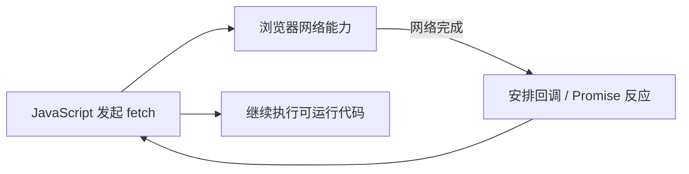
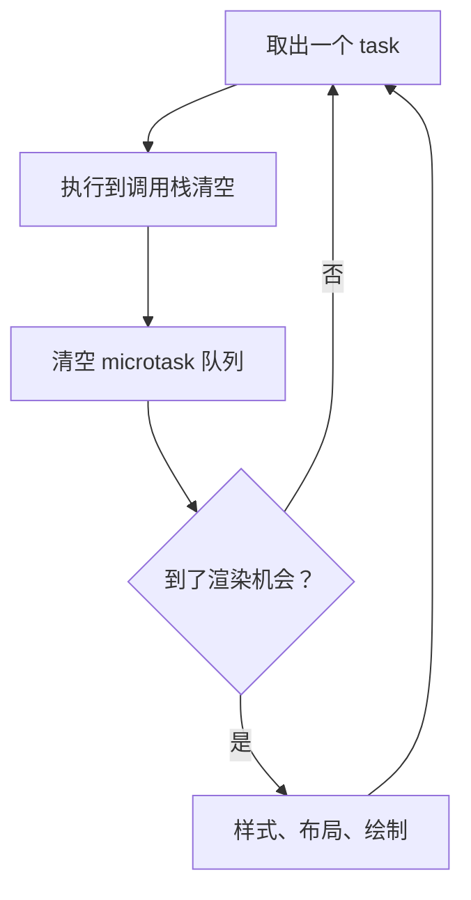
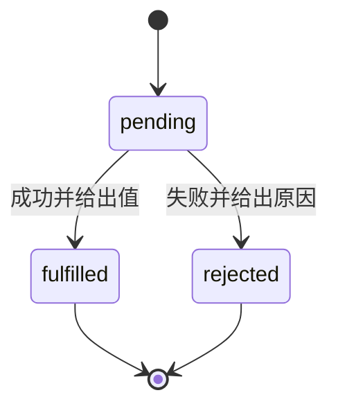

> **学完这一节，你应该能回答**
> - `async` 为什么不等于“开一个新线程”？
> - 调用栈、任务、微任务和浏览器渲染如何交替进行？
> - Promise 链、`async/await`、并发组合和错误传播有哪些规则？
> - 如何处理取消、超时、竞态、重试和并发上限？

## 1. 为什么需要异步

网络、磁盘和用户输入的速度远慢于 CPU。如果程序发出请求后原地占住主线程等待，页面会无法点击、滚动或绘制。

异步的核心是：**发起一个暂时不能立即完成的操作，把继续执行所需的信息保存下来；操作完成后，再安排后续代码运行。**



这不表示 JavaScript 函数本身一直在后台执行。等待通常由浏览器、操作系统或其他线程/进程承担，回调最终仍要回到相应 JavaScript 执行环境。

---

## 2. 调用栈与 run-to-completion

同步函数调用形成调用栈：

```js
function c() {
  console.log('c');
}

function b() {
  c();
}

function a() {
  b();
}

a();
```

当前 JavaScript 任务通常具有 **run-to-completion** 特性：一段正在执行的代码不会在任意一行被另一个普通事件处理器突然插入。它会运行到调用栈清空，事件循环才选择后续工作。

好处是无需担心普通回调在表达式执行一半时插入；代价是一个长任务会阻塞后面的输入和渲染。

```js
// 这段同步循环运行期间，页面很难及时响应
const end = performance.now() + 3000;
while (performance.now() < end) {
  // 忙等三秒
}
```

---

## 3. 事件循环的简化模型

浏览器的实际规范模型包含 agent、event loop、task queue 等细节。入门可先使用：



### Task（常被口语称为宏任务）

常见来源：

- 初始脚本；
- 用户点击、输入等事件；
- `setTimeout`；
- 消息事件；
- 部分 I/O 完成通知。

### Microtask（微任务）

常见来源：

- Promise 的 `.then/.catch/.finally`；
- `await` 后续；
- `queueMicrotask`；
- MutationObserver。

当前 task 结束后，浏览器通常在渲染前清空微任务队列。如果微任务不断创建新微任务，渲染和后续任务可能一直得不到机会。

> **“宏任务”是常见教学术语**
> Web 规范主要使用 task。不同运行环境的阶段和队列细节并不完全相同；不要把浏览器简化图机械套到 Node.js 的所有时序。

---

## 4. 输出顺序实验

```js
console.log('A');

setTimeout(() => console.log('B'), 0);

Promise.resolve().then(() => console.log('C'));

queueMicrotask(() => console.log('D'));

console.log('E');
```

典型输出：

```text
A
E
C
D
B
```

原因：

1. 当前脚本同步输出 A、E；
2. Promise 和 `queueMicrotask` 按入队顺序运行微任务；
3. 计时器回调作为后续 task 运行。

`setTimeout(fn, 0)` 不是立刻执行，而是“达到最短延迟后，有资格排队”。主线程繁忙、后台标签页节流和嵌套计时器限制都会让实际时间更晚。

---

## 5. Promise 是未来结果的容器

Promise 有三种状态：



一旦 fulfilled 或 rejected 就 settled，状态不能再次改变。

```js
const promise = fetch('/api/user');

promise
  .then(response => {
    if (!response.ok) {
      throw new Error(`HTTP ${response.status}`);
    }
    return response.json();
  })
  .then(user => {
    renderUser(user);
  })
  .catch(error => {
    showError(error);
  })
  .finally(() => {
    hideLoading();
  });
```

`.then()` 返回一个**新的 Promise**：

- 回调返回普通值 → 新 Promise fulfilled 为该值；
- 返回另一个 Promise/thenable → 新 Promise 跟随其结果；
- 抛出错误 → 新 Promise rejected；
- 没有 return → 下一个 `.then` 得到 `undefined`。

忘记 `return` 是 Promise 链常见 bug。

---

## 6. `async/await` 是 Promise 控制流语法

```js
async function loadUser(id) {
  const response = await fetch(`/api/users/${id}`);

  if (!response.ok) {
    throw new Error(`HTTP ${response.status}`);
  }

  return response.json();
}
```

- `async` 函数总是返回 Promise；
- `return value` 使它 fulfilled；
- `throw error` 使它 rejected；
- `await` 暂停当前 async 函数的后续，而不是阻塞整个 JavaScript 线程；
- Promise settled 后，`await` 后续作为微任务继续。

```js
try {
  const user = await loadUser(42);
  renderUser(user);
} catch (error) {
  showError(error);
}
```

`await` 让流程更像同步代码，但网络失败、并发和取消等现实问题仍然存在。

---

## 7. 顺序执行还是并发发起

下面两个请求互不依赖，却被串行等待：

```js
const user = await fetchUser();
const settings = await fetchSettings();
```

可并发发起：

```js
const userPromise = fetchUser();
const settingsPromise = fetchSettings();

const [user, settings] = await Promise.all([
  userPromise,
  settingsPromise,
]);
```



```mermaid
gantt
    title 串行与并发等待
    dateFormat X
    axisFormat %L
    section 串行
    user      :0, 400
    settings  :400, 700
    section 并发
    user      :0, 400
    settings  :0, 300
```

并发发起不保证底层并行，也不一定总更好。请求有依赖、服务端有限速或资源消耗很大时，需要控制顺序和数量。

---

## 8. Promise 组合方法

| 方法 | 何时完成 | 适合 |
| --- | --- | --- |
| `Promise.all` | 全部成功才成功；任一失败就尽快失败 | 所有结果都必需 |
| `Promise.allSettled` | 等全部结束，保留每项成功/失败 | 批量任务独立汇总 |
| `Promise.race` | 第一个 settled 的结果决定 | 超时竞赛、取首个结果 |
| `Promise.any` | 第一个成功；全部失败才失败 | 多来源任选一个成功 |

`Promise.all` 失败不会自动取消其他已经发出的请求。若资源昂贵，应显式使用取消机制。

大量数据也不要一次性 `Promise.all` 数万请求。需要建立并发池，例如同一时间最多 5 个，以免耗尽浏览器连接、服务器、内存或第三方配额。

---

## 9. 错误传播与未处理拒绝

```js
async function save() {
  const data = await validate();
  return persist(data);
}
```

若 `validate` 或 `persist` 拒绝，`save()` 返回的 Promise 也拒绝。调用者需要 `await`、`return` 或 `.catch()`：

```js
button.addEventListener('click', async () => {
  try {
    await save();
  } catch (error) {
    reportError(error);
  }
});
```

下面容易丢失错误：

```js
async function handle() {
  save(); // 没有 await 或 return，handle 可能提前“成功”
}
```

只在能恢复、转换或增加有用上下文的层捕获。记录后再次抛出时要避免每层重复打印同一异常。

---

## 10. 取消与超时

Promise 本身没有通用“撤销已发生副作用”能力。许多 Web API 使用 `AbortSignal` 协作取消：

```js
const controller = new AbortController();
const timeoutId = setTimeout(() => controller.abort(), 8000);

try {
  const response = await fetch('/api/report', {
    signal: controller.signal,
  });
  return await response.json();
} finally {
  clearTimeout(timeoutId);
}
```

取消通常意味着调用者不再等待、浏览器停止继续读取或尝试中断网络，并不保证服务器没有收到或执行请求。

对支付、下单等操作，超时后不能直接认为失败并无脑重试。应使用幂等键，再查询最终状态。

---

## 11. 竞态：后发请求先返回

用户依次输入 `a`、`ab`：

```text
请求 A（a）  ───────────────> 最后返回
请求 B（ab） ───────> 先返回
```

如果 A 最后覆盖界面，用户会看到过期结果。

解决方式：

### 取消旧请求

```js
let currentController;

async function search(query) {
  currentController?.abort();
  currentController = new AbortController();

  const response = await fetch(`/api/search?q=${encodeURIComponent(query)}`, {
    signal: currentController.signal,
  });
  return response.json();
}
```

### 比较请求版本

```js
let latestRequest = 0;

async function refresh() {
  const requestId = ++latestRequest;
  const data = await loadData();

  if (requestId !== latestRequest) return;
  render(data);
}
```

后端并发写入则需要数据库事务、版本号或条件更新，不能只靠前端请求顺序。

---

## 12. CPU 密集任务与 Web Worker

把大循环放入 Promise，并不会自动离开主线程：

```js
Promise.resolve().then(() => expensiveCalculation());
```

它仍会在微任务中占住主线程。

可选策略：

- 把工作拆成小块，定期让出主线程；
- 使用 Web Worker 在另一个线程运行可转移的计算；
- 使用服务端后台任务；
- 改善算法或减少工作量。

Worker 与主线程通过消息传递，普通对象通常要结构化克隆；大型二进制数据可考虑 transferable objects，避免复制成本。

---

## 13. 背压与流

若生产数据的速度长期高于处理速度，无界队列会吃光内存：

```text
网络每秒到达 1000 条
处理器每秒消费 100 条
积压每秒增加 900 条
```

背压策略包括：

- 暂停或减慢生产者；
- 设置有界缓冲；
- 批量处理；
- 丢弃可替代的旧数据；
- 拒绝新任务并要求稍后重试；
- 扩展消费者，但仍受下游极限约束。

Streams API、异步迭代器和消息队列提供不同层次的流控制。实时通信详见 [3.7 WebSocket、SSE 与实时通信](/blog/3-7-websocket-sse-与实时通信)。

---

## 14. 常见误区

| 误区 | 正确认识 |
| --- | --- |
| `setTimeout(fn, 0)` 立即执行 | 只是以后排一个 task，至少等当前栈和微任务结束 |
| `await` 会阻塞整个浏览器 | 它暂停当前 async 函数的后续，主线程可处理其他任务 |
| Promise 创建后要调用才开始 | 构造 Promise 或调用返回 Promise 的函数时，操作通常已经发起 |
| `Promise.all` 会依次执行 | Promise 若已创建，通常已经并发进行；all 负责组合结果 |
| 并发越多越快 | 可能触发限速、资源耗尽和下游拥塞 |
| 请求取消等于服务端回滚 | 服务器可能已经完成副作用 |
| 微任务优先，所以把所有工作放微任务更快 | 无尽微任务会饿死渲染和用户事件 |

## 小练习

实现一个带自动补全的搜索框：输入后等待 300ms，再发送请求；新输入取消旧计时器和旧请求；只显示最新查询结果；区分取消、网络失败、空结果与成功。用 Network 面板观察时序。

## 延伸阅读

- [2.8 JavaScript：语言核心](/blog/2-8-javascript-语言核心)
- [3.3 前后端通信、跨域问题](/blog/3-3-前后端通信-跨域问题)
- [MDN：JavaScript 执行模型](https://developer.mozilla.org/zh-CN/docs/Web/JavaScript/Reference/Execution_model)
- [MDN：Promise](https://developer.mozilla.org/zh-CN/docs/Web/JavaScript/Reference/Global_Objects/Promise)
- [HTML Standard：Event loops](https://html.spec.whatwg.org/multipage/webappapis.html#event-loops)
