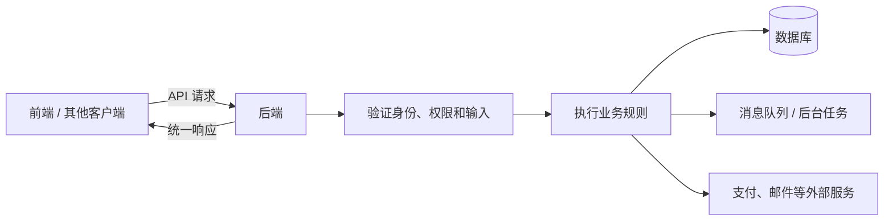
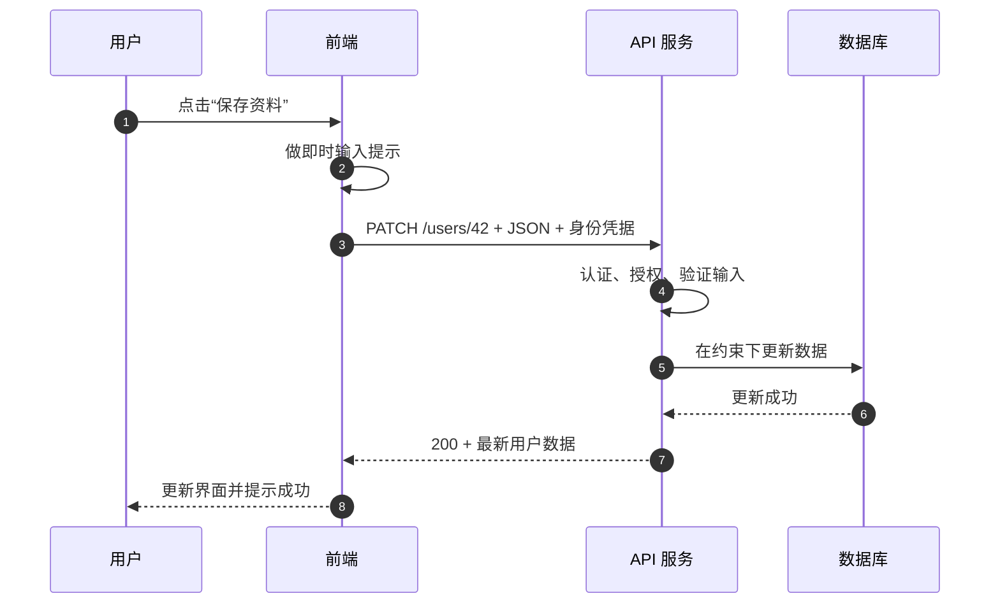
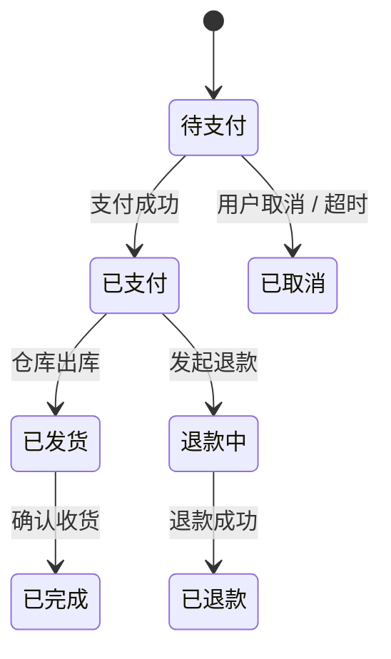

> **学完这一节，你应该能回答**
> - API 为什么不是“一个网址”或“后端的同义词”？
> - 哪些工作必须放在后端，不能只靠前端完成？
> - 一个良好的 API 契约应该说明什么？
> - REST、RPC、GraphQL、Webhook 和 WebSocket 各自解决什么问题？

## 1. API 的本质：明确的协作边界

API 是 **Application Programming Interface（应用程序编程接口）**。它规定一段软件如何请求另一段软件的能力，以及对方会如何回应。

API 的关键不是“联网”，而是**接口契约**：

- 可以调用什么操作；
- 要传入什么数据；
- 会返回什么结果；
- 失败时如何表达；
- 调用者需要具备什么权限；
- 契约如何随版本演进。

因此，API 可以存在于很多层面：

| API 类型 | 调用双方 | 例子 |
| --- | --- | --- |
| 函数 / 库 API | 同一程序中的模块 | `Math.max(1, 3)` |
| 操作系统 API | 应用与操作系统 | 打开文件、创建进程、网络 socket |
| 浏览器 Web API | 网页代码与浏览器 | DOM、Fetch、Geolocation |
| 数据库 API | 应用与数据库 | SQL、数据库驱动 |
| Web API | 通过网络通信的客户端与服务端 | `/api/users/42` |

日常全栈开发中说“调 API”，通常特指通过 HTTP 调用 Web API，但不要把这个狭义用法当成 API 的完整定义。

---

## 2. 后端为什么存在

前端代码会下载到用户设备上。用户可以查看、修改、重复执行请求，也可以完全绕过页面，自己构造请求。因此，前端不能成为最终安全边界。

后端主要承担以下职责：

### 2.1 可信地执行规则

例如商品页面显示价格 99 元，但攻击者可以把前端变量改成 1 元。创建订单时，后端必须根据数据库中的商品、活动和用户资格重新计算价格，不能相信客户端提交的总价。

### 2.2 管理共享和持久化数据

浏览器本地存储只属于某个用户、某台设备，还可能被清空。多人共享的账户、订单和文章需要由后端通过数据库持久化，并协调并发修改。

### 2.3 认证与授权

- **认证（authentication）**：你是谁？
- **授权（authorization）**：你可以做什么？

隐藏“删除用户”按钮只能改善界面，不能形成权限控制。后端在每次敏感操作时都必须验证身份和权限。

### 2.4 保护秘密

数据库密码、支付平台私钥和服务端 API 密钥不能出现在前端构建产物里。后端处于受控环境，能替客户端使用这些秘密完成调用。

### 2.5 集成外部系统

支付、邮件、对象存储、搜索、消息队列等服务通常由后端统一调用，以控制密钥、重试、日志和数据一致性。

### 2.6 处理异步和长期任务

视频转码、生成报表、发送批量邮件不适合让一个浏览器请求一直等待。后端可以把任务写入队列，由工作进程异步执行，再提供状态查询或通知。



---

## 3. 后端不等于数据库

数据库负责存储、查询和约束数据，后端负责业务流程和对外接口。把数据库直接暴露给任意浏览器通常会带来严重风险。

以转账为例，后端至少要：

1. 验证登录状态；
2. 检查账户是否属于当前用户；
3. 校验金额和限额；
4. 在事务中扣款和入账；
5. 防止同一请求被重复执行；
6. 记录可审计日志；
7. 返回不泄露敏感信息的结果。

这些规则不是一句 `UPDATE balance` 能完整表达的。数据库约束是最后防线之一，但不是全部应用逻辑。

---

## 4. 一次 API 请求的完整路径



前端校验让用户更快获得反馈；后端校验建立真正约束。两边都做不是无意义重复，因为它们处在不同信任边界，目标不同。

---

## 5. API 契约包含什么

以“获取用户”为例：

```http
GET /api/users/42 HTTP/1.1
Host: api.example.com
Authorization: Bearer <token>
Accept: application/json
```

成功响应：

```http
HTTP/1.1 200 OK
Content-Type: application/json

{
  "id": 42,
  "name": "小林",
  "createdAt": "2026-09-07T08:30:00Z"
}
```

一个可用的契约需要说清：

| 部分 | 应说明的问题 |
| --- | --- |
| 地址与方法 | 调哪个路径、使用 GET/POST/PATCH 等哪种方法 |
| 路径和查询参数 | 哪些必填，类型、范围和编码是什么 |
| 请求头 | 内容类型、认证、幂等键等如何传递 |
| 请求体 | JSON 字段、嵌套结构和验证规则 |
| 成功响应 | 状态码、字段含义和时间/金额等格式 |
| 错误响应 | 可稳定识别的错误码、提示和细节 |
| 权限 | 哪类身份可以调用或看到哪些字段 |
| 兼容性 | 字段新增、废弃与版本升级策略 |

HTTP 只是传递这份契约的常用载体，详见 [3.1 HTTP](/blog/3-1-http)。

---

## 6. 以资源为中心设计 REST 风格接口

REST 是一组架构思想，不等于“JSON + HTTP”。工程中常说 REST API，通常指围绕资源使用 HTTP 语义设计接口。

以任务系统为例：

| 目的 | 方法与路径 | 可能的状态码 |
| --- | --- | --- |
| 获取任务列表 | `GET /tasks?status=todo` | `200` |
| 获取一个任务 | `GET /tasks/123` | `200`、`404` |
| 创建任务 | `POST /tasks` | `201`、`400` |
| 整体替换任务 | `PUT /tasks/123` | `200` / `204`、`404` |
| 局部修改任务 | `PATCH /tasks/123` | `200` / `204`、`404` |
| 删除任务 | `DELETE /tasks/123` | `204`、`404` |

路径优先表达资源名词，HTTP 方法表达动作，通常比设计成下面这样更统一：

```text
/getAllTasks
/createNewTask
/deleteTaskById
```

但 REST 不是宗教。有些业务动作并不自然等价于 CRUD，例如“批准贷款”或“取消订单”。明确建模动作和状态转换，往往比勉强套成字段更新更安全。

---

## 7. CRUD 只是起点，业务规则才是核心

CRUD 指 Create、Read、Update、Delete。很多入门项目只是把数据库表直接映射成四类接口，但真实后端还要维护**业务不变量**。

例如订单可能有状态：



不能允许客户端任意把 `status` 从“待支付”改成“已完成”。后端应暴露合法操作，验证当前状态，并在事务中同时更新库存、支付记录和审计信息。

---

## 8. 幂等性：重试会不会重复产生副作用

网络可能在服务器已经成功处理后、响应返回前断开。客户端不知道结果，只能重试。如果“创建订单”重试一次就多创建一单，系统会出问题。

**幂等操作**重复执行一次或多次，预期的最终效果相同。

- 查询通常天然幂等；
- 把资源设置为某个确定值通常可以幂等；
- “余额增加 10 元”通常不幂等；
- 创建支付、订单等操作可通过客户端生成的幂等键去重。

幂等不代表每次响应字节完全相同，也不代表服务器内部不记录多次访问；它关注业务可观察的目标状态。

---

## 9. API 不只有 REST

| 风格 / 机制 | 核心思路 | 适合场景 | 主要注意点 |
| --- | --- | --- | --- |
| REST 风格 HTTP API | 围绕资源和 HTTP 语义 | 通用 Web API、公开接口 | 容易被误做成只剩 CRUD |
| RPC | 直接表达远程操作或方法 | 内部服务、高性能或强类型调用 | 容易产生较紧的服务耦合 |
| GraphQL | 客户端声明需要的字段 | 多端数据需求差异大、关系数据查询 | 缓存、授权和查询成本控制更复杂 |
| Webhook | 事件发生后，服务端回调另一方 URL | 支付结果、代码仓库事件 | 验签、重试、重复与乱序处理 |
| WebSocket | 建立长连接并双向传消息 | 聊天、协作、实时状态 | 连接管理、断线恢复和扩容 |
| SSE | 服务器通过 HTTP 持续单向推送事件 | 通知、日志流、生成式输出 | 主要是服务端到客户端单向流 |

这些方案可以共存。普通资料查询用 REST，实时协作用 WebSocket，支付平台通过 Webhook 通知结果，是很常见的组合。

---

## 10. 错误也属于契约

不理想的错误响应：

```json
{ "message": "出错了" }
```

更容易被程序处理的形式：

```json
{
  "error": {
    "code": "EMAIL_ALREADY_USED",
    "message": "该邮箱已注册",
    "field": "email",
    "requestId": "req_01J..."
  }
}
```

- HTTP 状态码表达大类；
- 稳定的业务错误码供客户端判断；
- 人类提示可以翻译和调整，不应成为程序唯一判断依据；
- `requestId` 帮助用户报告与服务端日志关联；
- 生产响应不要泄露堆栈、SQL、路径或密钥。

后端要区分“调用者输入不合法”和“服务器自身故障”。把所有问题都返回 `200`，或所有问题都返回 `500`，都会让监控、缓存和客户端处理失去语义。

---

## 11. API 的安全底线

1. 不信任任何客户端输入，包括请求头、文件名和隐藏字段。
2. 认证之后仍逐项授权，防止用户只改 URL 中的 ID 就读取别人数据。
3. 数据库使用参数化查询，避免把输入拼接成 SQL。
4. 对上传文件限制类型、大小、数量和存放位置。
5. 对敏感接口限速，防止暴力尝试和资源耗尽。
6. 日志避免记录密码、完整令牌和敏感个人数据。
7. 外部回调验证签名，并处理重复、延迟和乱序事件。
8. 金额使用最小货币单位的整数或精确小数，避免浮点误差。
9. 关键操作建立审计记录和可恢复策略。

框架可以提供工具，但不会替你自动设计正确权限和业务规则，见 [3.2 后端框架做了哪些事？](/blog/3-2-后端框架做了哪些事)。

---

## 12. 设计 API 时的检查清单

- [ ] 资源、动作和数据所有权清楚吗？
- [ ] 输入类型、长度、范围与必填条件明确吗？
- [ ] 认证与授权分别在哪里发生？
- [ ] 成功和失败是否使用有意义的状态码与错误码？
- [ ] 重试是否安全，是否需要幂等键？
- [ ] 分页、过滤和排序是否有上限？
- [ ] 新增字段能否兼容旧客户端？
- [ ] 并发修改会不会覆盖数据或破坏不变量？
- [ ] 日志能否定位问题，又不会泄露敏感数据？
- [ ] 文档和自动化测试是否与实现同步？

## 延伸阅读

- [MDN：Web API](https://developer.mozilla.org/zh-CN/docs/Web/API)
- [MDN：HTTP 请求方法](https://developer.mozilla.org/zh-CN/docs/Web/HTTP/Reference/Methods)
- [OpenAPI 规范](https://spec.openapis.org/oas/latest.html)
