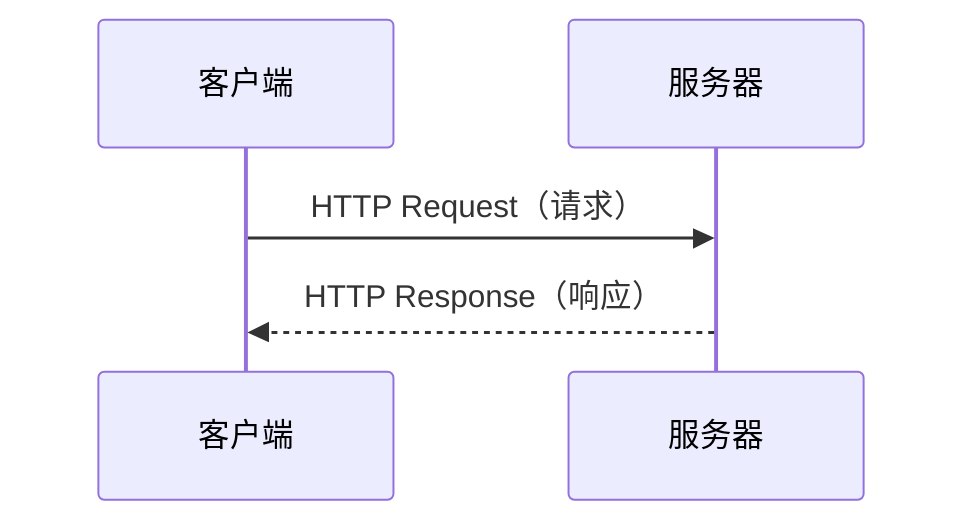

> **学完这一节，你应该能回答**
> - HTTP 请求和响应分别由哪些部分组成？
> - 方法、状态码、请求头和请求体各自表达什么？
> - “HTTP 无状态”为什么不等于网站不能登录？
> - HTTPS、HTTP/2、HTTP/3 分别改变了哪一层？

## 1. HTTP 是什么

HTTP（Hypertext Transfer Protocol）是 Web 的应用层协议。它规定客户端和服务器如何组织、发送和解释一条条消息。

基本模式是：



客户端不一定是浏览器，也可以是手机应用、命令行工具或另一台服务器。服务器也不一定是一台物理机器，可能是反向代理、函数或集群对外呈现的统一入口。

HTTP 负责“消息是什么意思”，底层传输负责“字节怎样可靠而高效地到达”。网络分层见 [1.2 计算机之间的通信：网络](/blog/1-2-计算机之间的通信-网络)。

---

## 2. URL 的结构

```text
https://api.example.com:443/users/42?include=orders#profile
└协议┘ └─────主机─────┘端口└──路径──┘└──查询参数──┘└片段┘
```

| 部分 | 作用 | 是否通常发送给服务器 |
| --- | --- | --- |
| scheme | 使用什么协议，如 `https` | 决定如何建立连接 |
| host | 目标主机名 | 是 |
| port | 目标端口；HTTPS 默认 443 | 用于建立连接 |
| path | 目标资源路径 | 是 |
| query | 额外查询参数 | 是 |
| fragment | 页面内部定位，如 `#profile` | **否**，通常只由浏览器处理 |

查询参数要经过 URL 编码。不要通过手工字符串拼接构造复杂 URL，可使用语言提供的 URL 和参数编码接口。

敏感信息不应放在 URL 中，因为 URL 可能进入浏览器历史、服务器日志、代理日志和来源信息。

---

## 3. 请求长什么样

下面用 HTTP/1.1 文本形式展示语义；HTTP/2 和 HTTP/3 在线上传输形式不同，但仍保留方法、路径、头和体等概念。

```http
POST /api/tasks HTTP/1.1
Host: example.com
Content-Type: application/json
Accept: application/json
Authorization: Bearer <token>

{
  "title": "学习 HTTP",
  "done": false
}
```

一条请求包含：

1. **请求行**：方法、目标路径、协议版本；
2. **请求头（headers）**：描述认证、内容格式、缓存偏好等元信息；
3. **空行**：分隔头和体；
4. **请求体（body）**：可选的实际数据。

`Content-Type` 描述当前消息体是什么格式；`Accept` 表达客户端希望服务器返回什么格式。它们名字相似但方向不同。

---

## 4. 响应长什么样

```http
HTTP/1.1 201 Created
Content-Type: application/json
Location: /api/tasks/123
Cache-Control: no-store

{
  "id": 123,
  "title": "学习 HTTP",
  "done": false
}
```

响应包含：

1. **状态行**：协议版本、状态码和简短说明；
2. **响应头**：内容类型、缓存、Cookie 等元信息；
3. **响应体**：HTML、JSON、图片字节或其他内容，也可能为空。

浏览器判断 JSON 的依据不是 URL 是否以 `.json` 结尾，而主要是 `Content-Type: application/json`。

---

## 5. HTTP 方法：你想对资源做什么

| 方法 | 常见语义 | 安全（只读语义） | 幂等（重复后最终效果相同） |
| --- | --- | --- | --- |
| GET | 获取资源 | 是 | 是 |
| HEAD | 只获取与 GET 类似的响应头，不返回表示体 | 是 | 是 |
| POST | 创建、提交或触发处理 | 否 | 通常否 |
| PUT | 用给定表示整体创建或替换目标资源 | 否 | 是 |
| PATCH | 局部修改资源 | 否 | 不保证 |
| DELETE | 删除目标资源 | 否 | 是 |
| OPTIONS | 查询通信选项，也用于 CORS 预检 | 是 | 是 |

这里的“安全”是协议语义上的“不应改变服务器状态”，不是指没有安全风险。“幂等”也不是响应必须完全相同：第一次删除可能返回 `204`，第二次返回 `404`，但资源最终都处于不存在状态。

> **GET 不应触发危险操作**
> 浏览器、搜索引擎、缓存和预加载器可能主动访问 GET 链接。如果 `GET /delete-user?id=42` 真能删除用户，爬虫或链接预览都可能意外触发它。

---

## 6. 状态码：服务器如何概括结果

| 类别 | 含义 | 常见状态码 |
| --- | --- | --- |
| 1xx | 信息性响应 | `100 Continue` |
| 2xx | 请求已成功处理 | `200 OK`、`201 Created`、`204 No Content` |
| 3xx | 需要重定向或可使用缓存 | `301`、`302`、`304 Not Modified` |
| 4xx | 请求本身或调用权限有问题 | `400`、`401`、`403`、`404`、`409`、`422`、`429` |
| 5xx | 服务器处理请求时失败 | `500`、`502`、`503`、`504` |

几个容易混淆的状态码：

- `400 Bad Request`：请求格式或参数整体不合法。
- `401 Unauthorized`：实际常表示“尚未通过认证”或凭据无效。
- `403 Forbidden`：服务器知道调用者是谁，但不允许此操作。
- `404 Not Found`：资源不存在；出于安全考虑，有时也用来隐藏资源是否存在。
- `409 Conflict`：请求与资源当前状态冲突，例如版本冲突或唯一性冲突。
- `429 Too Many Requests`：触发限速。
- `502 Bad Gateway`：代理从上游收到无效响应。
- `503 Service Unavailable`：服务暂时不可用或过载。
- `504 Gateway Timeout`：代理等待上游超时。

前端的 `fetch()` 遇到 `404` 或 `500` 时，Promise 通常仍会正常得到 `Response`；只有网络层失败等情况才直接 reject。因此要主动检查 `response.ok`。

---

## 7. 请求头和响应头

HTTP 头让协议可以扩展。常见头包括：

| Header | 方向 | 作用 |
| --- | --- | --- |
| `Host` | 请求 | 目标主机，使多个站点可共享 IP |
| `Accept` | 请求 | 客户端可接受的响应媒体类型 |
| `Content-Type` | 两者 | 当前消息体的媒体类型 |
| `Content-Length` | 两者 | 消息体字节长度（并非总会出现） |
| `Authorization` | 请求 | 携带认证凭据 |
| `Cookie` | 请求 | 浏览器发送匹配的 Cookie |
| `Set-Cookie` | 响应 | 让浏览器保存或更新 Cookie |
| `Cache-Control` | 两者 | 缓存策略 |
| `ETag` | 响应 | 资源版本验证标识 |
| `If-None-Match` | 请求 | 携带已有 ETag 做条件请求 |
| `Location` | 响应 | 重定向目标或新资源位置 |
| `Origin` | 请求 | 跨源访问相关的源信息 |

HTTP 头名称不区分大小写。不要自行发明含义模糊的头来替代消息体中的业务数据；也不要在日志中无差别记录 `Authorization` 和 Cookie。

---

## 8. JSON、表单与文件上传

常见请求体格式：

| `Content-Type` | 常见用途 |
| --- | --- |
| `application/json` | 结构化 API 数据 |
| `application/x-www-form-urlencoded` | 传统 HTML 表单的键值数据 |
| `multipart/form-data` | 表单与文件上传 |
| `text/plain` | 纯文本 |
| `application/octet-stream` | 未特别指定类型的二进制流 |

JSON 只有字符串、数字、布尔值、`null`、数组和对象等基本类型，没有内置日期和任意精度金额类型。API 必须约定：

- 时间使用什么时区和格式；
- 金额是元的小数还是分的整数；
- 大整数会不会超出 JavaScript 安全整数范围；
- 缺失字段与值为 `null` 是否含义不同。

上传文件时，不能只信任文件名后缀和客户端传来的 MIME 类型，还要限制大小、检查内容并安全生成存储名称。

---

## 9. “无状态”为什么仍然能登录

HTTP 核心是**无状态的**：两个先后请求在协议层没有天然关联。服务器不会只因为连接过一次，就自动知道下一次还是同一用户。

网站通过在每次请求中携带上下文建立会话，例如：

### Cookie + 服务端 Session

1. 登录成功后，服务端创建 Session 数据；
2. 响应通过 `Set-Cookie` 给浏览器一个随机 Session ID；
3. 浏览器后续自动发送 Cookie；
4. 服务端用 ID 找回登录状态。

### Token

客户端在请求中携带访问令牌，服务端验证令牌后确定身份。Token 可以是不可读的随机字符串，也可以是带签名声明的 JWT。

JWT 不是“更安全的 Session”或“无需服务端思考状态”的魔法。它仍需处理过期、撤销、密钥轮换、泄露、权限变化和存储位置等问题。

Cookie 是浏览器的存储与自动发送机制，Session 是服务端维护会话状态的设计，两者不是同义词。

---

## 10. HTTP 缓存

缓存减少传输和服务器计算，但要保证内容不会错误地过期或泄露。

### 强缓存

在有效期内，客户端可以直接使用本地副本，例如：

```http
Cache-Control: public, max-age=31536000, immutable
```

这适合文件名带内容哈希的静态资源。

### 协商缓存

缓存过期后，客户端携带验证条件：

```http
If-None-Match: "asset-v3"
```

内容未变时，服务器可以返回：

```http
HTTP/1.1 304 Not Modified
```

无需再次传输完整响应体。

`no-store` 表示不应存储响应；`no-cache` 的含义通常是使用前必须重新验证，并非绝对“不缓存”。这是一个常见命名陷阱。

用户私有响应要谨慎设置 `private`、`Vary` 和 CDN 规则。缓存键少考虑一个身份或语言维度，就可能返回错误用户的数据。

---

## 11. HTTPS：HTTP + TLS

HTTPS 并不是一种完全不同的业务协议，而是让 HTTP 通过 TLS 安全传输。TLS 提供：

- 加密，降低被窃听的风险；
- 完整性保护，发现传输中篡改；
- 通过证书验证服务器身份。

建立 TLS 时要进行握手并协商密钥，现代协议会通过连接复用、会话恢复等方式降低成本。

HTTPS 无法阻止服务器自己泄露数据，也无法让恶意网站变善良。浏览器地址栏的锁表示通道和域名证书正常，不表示页面中的每个业务操作都可信。

---

## 12. HTTP/1.1、HTTP/2 与 HTTP/3

| 版本 | 传输基础 | 关键变化 |
| --- | --- | --- |
| HTTP/1.1 | TCP | 持久连接、分块传输等；一个连接上的并发能力受限 |
| HTTP/2 | TCP + TLS（浏览器实践中通常如此） | 二进制分帧、头部压缩、单连接多路复用 |
| HTTP/3 | QUIC（基于 UDP） | 把可靠传输和 TLS 集成到 QUIC，改善连接建立与传输层队头阻塞 |

版本升级主要改变线上传输与性能机制，并没有推翻请求方法、状态码、URL 和头字段等 HTTP 语义。

HTTP/2 的多路复用解决了应用层一条连接按顺序等待的问题，但底层 TCP 丢包仍可能阻塞同一连接上的多个流。HTTP/3 的 QUIC 为不同流维护更独立的传输状态。

---

## 13. 用浏览器和命令行观察 HTTP

```bash
# 只看响应头
curl -I https://example.com

# 显示请求、握手和响应的详细过程
curl -v https://example.com

# 发送 JSON POST 请求
curl https://api.example.com/tasks \
  -X POST \
  -H 'Content-Type: application/json' \
  -d '{"title":"学习 HTTP"}'
```

浏览器 Network 面板中重点查看：

1. Request URL 与 Method；
2. Status Code；
3. Request / Response Headers；
4. Payload；
5. Response / Preview；
6. Timing；
7. 请求来自哪段代码（Initiator）。

调试时先记录实际报文，再判断是 DNS、连接、TLS、HTTP、CORS 还是业务数据问题。

---

## 14. 常见误区

| 误区 | 正确认识 |
| --- | --- |
| POST 比 GET 安全 | 安全主要来自 HTTPS、认证和授权；POST 数据同样可被调用者查看和修改 |
| 状态码 `200` 就说明业务一定成功 | 有些糟糕 API 会在 `200` 响应体里放错误；应结合契约判断 |
| HTTPS 会隐藏访问的域名和所有流量特征 | 内容会加密，但网络元数据并非全部消失 |
| HTTP 无状态，所以服务器不能保存 Session | 协议请求独立，应用仍可借助 Cookie/Token 关联会话 |
| `fetch()` 只有 2xx 才算 Promise 成功 | HTTP 错误状态通常仍会得到 Response，需要检查 `ok` 或状态码 |
| CORS 是 HTTP 自带的服务器防火墙 | CORS 主要是浏览器执行的跨源读取规则，详见 [3.3 前后端通信、跨域问题](/blog/3-3-前后端通信-跨域问题) |

## 延伸阅读

- [MDN：HTTP 概览](https://developer.mozilla.org/zh-CN/docs/Web/HTTP/Guides/Overview)
- [MDN：HTTP 消息](https://developer.mozilla.org/zh-CN/docs/Web/HTTP/Guides/Messages)
- [MDN：HTTP 状态码](https://developer.mozilla.org/zh-CN/docs/Web/HTTP/Reference/Status)
- [RFC 9110：HTTP Semantics](https://www.rfc-editor.org/rfc/rfc9110)
