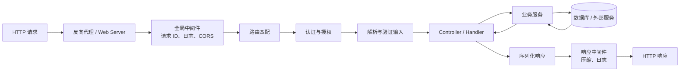
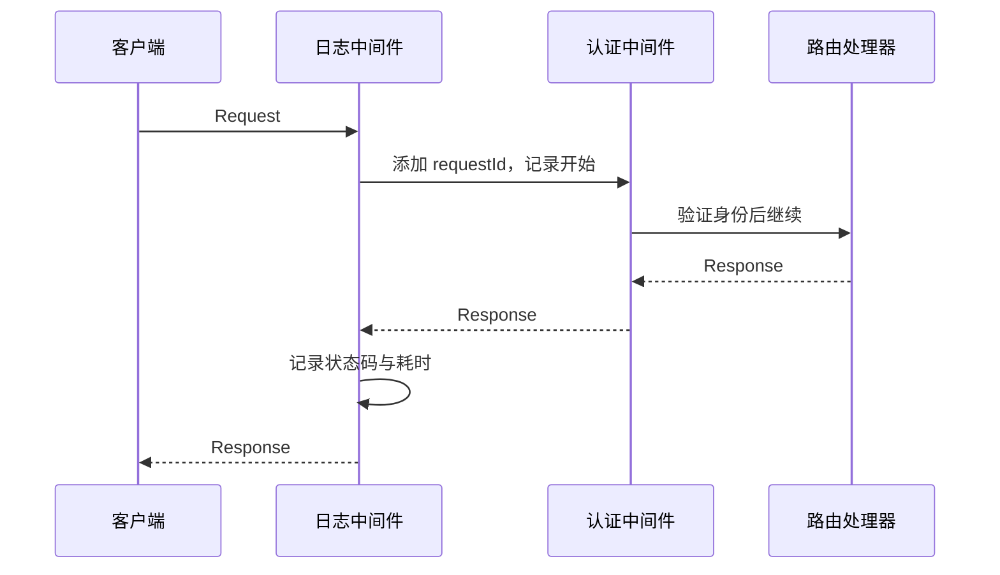
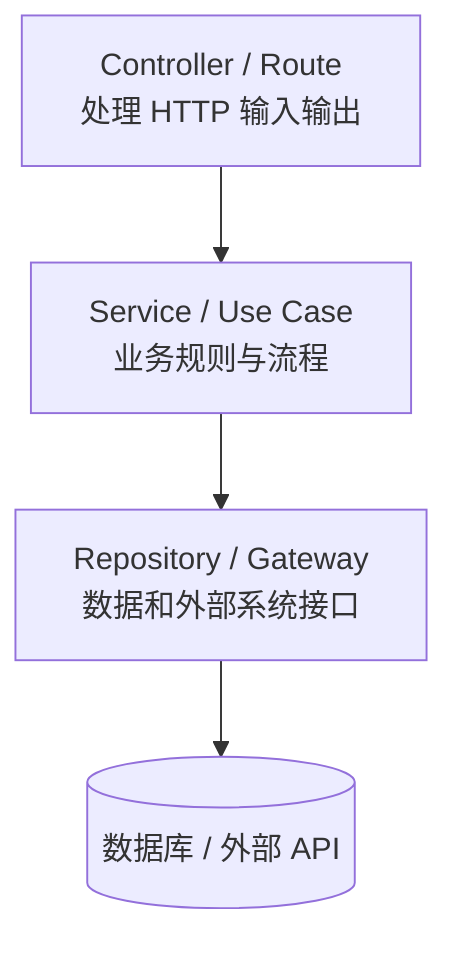

> **学完这一节，你应该能回答**
> - 一个 HTTP 请求进入后端框架后会经历哪些环节？
> - 路由、中间件、参数验证、ORM 和依赖注入分别解决什么问题？
> - Web 服务器、应用服务器、框架、运行时和数据库为什么不能混为一谈？
> - 框架能提供安全工具，为什么仍不能保证应用安全？

## 1. 不使用框架，需要自己做什么

假设我们只拿到操作系统提供的网络 socket。为了做一个可用的 Web API，至少需要自己处理：

1. 监听 IP 和端口；
2. 接受并管理连接；
3. 解析 HTTP 方法、路径、请求头和请求体；
4. 根据路径找到对应业务代码；
5. 解析 JSON、表单和上传文件；
6. 验证参数并报告错误；
7. 认证用户、检查权限；
8. 调用数据库并管理事务；
9. 把对象序列化成 JSON；
10. 捕获异常并转换成正确状态码；
11. 记录日志、指标和追踪信息；
12. 处理超时、并发、关闭和资源回收；
13. 测试以上所有行为。

这些工作并非每个项目的独特价值。**后端框架把反复出现的基础设施问题整理成统一生命周期、扩展点和默认约定，让开发者聚焦业务规则。**

框架不是让复杂度消失，而是把通用复杂度集中封装起来。

---

## 2. 一次请求的典型生命周期

不同框架名称和顺序略有差异，但主干相似：



任何环节都可能提前结束请求：

- CORS 预检直接返回；
- 限速器返回 `429`；
- 认证失败返回 `401`；
- 参数错误返回 `400` 或 `422`；
- 缓存直接返回已有响应；
- 未捕获异常由统一错误处理器转换为 `500`。

这条管线使横跨所有接口的逻辑可以放在统一位置，而不是复制到每个处理函数。

---

## 3. 路由：把请求交给正确代码

路由通常根据 HTTP 方法和路径匹配处理函数：

```text
GET    /users          → listUsers
GET    /users/:id      → getUser
POST   /users          → createUser
PATCH  /users/:id      → updateUser
DELETE /users/:id      → deleteUser
```

同一路径的 `GET /users/42` 与 `DELETE /users/42` 是两个不同操作。路由器还会提取：

- 路径参数：`42`；
- 查询参数：`?page=2&sort=name`；
- 请求头：`Authorization`、`Content-Type`；
- 请求体：JSON 或表单。

一个处理器的伪代码：

```text
PATCH /users/:id
  1. 读取 id 和 JSON 请求体
  2. 验证字段类型与范围
  3. 确认当前用户有权修改此 id
  4. 调用 UserService.updateProfile(...)
  5. 返回更新后的用户和 200
```

路由只负责找到入口，不应把所有业务和数据库代码都塞在处理器中。

---

## 4. 解析、验证与序列化

网络上传来的都是不可信字节。框架常把它们转换为语言对象，再按声明的模型验证：

```json
{
  "email": "user@example.com",
  "age": 200
}
```

只判断“能解析成 JSON”远远不够。还要验证：

- 必填字段是否存在；
- 类型是否正确；
- 字符串长度和格式；
- 数字范围；
- 枚举值是否合法；
- 对象嵌套深度和数组数量；
- 字段组合是否满足业务条件。

验证通常分两层：

| 层次 | 示例 | 适合放在哪里 |
| --- | --- | --- |
| 结构验证 | `age` 是 0～150 的整数 | 请求模型 / schema |
| 业务验证 | 该邮箱是否已被其他账户占用 | 业务服务 + 数据库约束 |

框架还负责把返回对象**序列化**为 JSON 等格式，并设置 `Content-Type`。输出模型可以防止把密码哈希、内部备注等字段意外返回。

> **不要直接把数据库对象原样返回**
> 数据库模型反映存储结构，API 模型反映公开契约。两者绑定过紧会泄露字段，也会让数据库改动无意中破坏客户端。

---

## 5. 中间件：处理横切关注点

中间件（middleware）包裹或串联请求处理流程：



适合放入中间件的内容：

- 请求 ID 与访问日志；
- CORS；
- 认证信息解析；
- 限速；
- 响应压缩；
- 超时；
- 统一异常转换；
- 指标和分布式追踪。

不适合把具体业务规则全塞进全局中间件，否则执行顺序和数据依赖会变得隐蔽。

中间件顺序非常重要：错误处理器要能包住后续代码，认证通常在授权之前，压缩应作用于最终响应。调整顺序可能改变安全和功能行为。

---

## 6. 认证、授权与安全工具

框架常提供或集成：

- Session、Cookie、Bearer Token 解析；
- OAuth / OpenID Connect 客户端；
- 权限装饰器或策略；
- CSRF 防护；
- CORS 和安全响应头；
- 密码哈希库集成；
- 请求体大小限制和限速。

但框架不知道你的业务：

```text
“项目成员可以读文档，只有文档所有者和管理员可以删除”
```

这种对象级权限必须由应用明确实现。仅检查“用户已登录”，然后按 URL 中的 `documentId` 查询并删除，会产生越权漏洞。

安全工具还可能因配置错误失效，例如：

- CORS 放行所有来源并允许凭据；
- Cookie 没有 `Secure`、`HttpOnly` 或合适的 `SameSite`；
- 反向代理信任设置错误，导致 IP 或协议判断被伪造；
- 调试模式在公网暴露堆栈和环境信息。

---

## 7. 数据库访问与 ORM

框架通常通过驱动或 ORM（Object-Relational Mapping）访问数据库。

ORM 将表和关系映射为语言对象或查询构造器，例如概念上：

```text
User.findById(42)
```

最终可能转换为参数化 SQL：

```sql
SELECT id, name, email
FROM users
WHERE id = ?;
```

ORM 的价值包括：

- 参数绑定，减少手工拼接 SQL；
- 映射类型与关系；
- 管理迁移；
- 组合查询；
- 在测试中替换部分数据访问。

但 ORM 不是数据库，也不会消除数据库知识。仍要理解：索引、事务、锁、查询计划、连接池、唯一约束和 N+1 查询。

### 事务

需要共同成功或失败的一组修改应放在事务中：

```text
创建订单
  ├─ 扣减库存
  ├─ 写入订单
  └─ 写入付款待处理记录
```

如果第二步失败，第一步不应单独保留。框架可以提供事务 API，但哪些操作属于同一业务原子单元，仍需开发者决定。

---

## 8. 分层：让 HTTP、业务和存储各归其位

一种常见但不是唯一的划分：



| 层 | 负责 | 不宜负责 |
| --- | --- | --- |
| Controller | 读取请求、调用用例、映射响应 | 大段业务判断、到处写 SQL |
| Service / Use Case | 业务流程、不变量、事务边界 | HTTP Header 和框架响应对象 |
| Repository / Gateway | 查询和保存数据、隔离外部系统 | 决定用户是否有业务资格 |

分层的目的不是多建几个目录，而是让核心业务不依赖每个外部细节。小项目可以更简单；如果一个只有三条路由的应用机械分成十层，反而增加理解成本。

按业务功能组织通常也比全局堆放 `controllers/`、`services/`、`repositories/` 更容易扩展：

```text
modules/
├── orders/
│   ├── order.routes
│   ├── order.service
│   ├── order.repository
│   └── order.test
└── users/
    └── ...
```

---

## 9. 依赖注入做了什么

业务服务如果自己在内部直接创建数据库客户端、邮件客户端和时钟，就很难测试和替换：

```text
OrderService
  ├─ 自己连接生产数据库
  ├─ 自己创建邮件客户端
  └─ 直接读取系统当前时间
```

依赖注入（Dependency Injection，DI）是从外部把所需依赖交给对象或函数：

```text
OrderService(orderRepository, mailer, clock)
```

测试时可注入内存仓库、假邮件服务和固定时钟。框架的 DI 容器可以负责创建对象和生命周期，但 DI 的核心思想并不依赖容器。

过度使用全局容器也会隐藏依赖。构造函数或函数参数能清楚表达的依赖，不一定需要复杂魔法。

---

## 10. 同步、异步与并发

Web 服务常有大量 I/O 等待：数据库、网络和磁盘。异步模型允许一个请求等待 I/O 时，执行线程或事件循环继续服务其他请求。

但要避免三个误区：

1. `async` 不会让 CPU 密集计算自动变快；
2. 在异步事件循环中执行阻塞调用，仍可能卡住大量请求；
3. 并发请求可能同时修改同一数据，必须借助事务、锁、版本号或原子操作保证一致性。

CPU 密集任务可交给工作线程、独立进程或任务队列。长期任务不要无上限占住 HTTP 请求和数据库连接。

框架还要面对**背压**：当下游只能每秒处理 100 个任务，上游每秒涌入 10,000 个请求时，不能只把所有内容堆进内存。限速、有界队列、超时和拒绝策略都是稳定性设计。

---

## 11. 错误处理与可观测性

统一错误处理器通常负责：

- 把已知业务错误映射为 4xx；
- 把意外异常映射为 500；
- 给响应加入请求 ID；
- 在服务端记录堆栈，但不泄露给客户端；
- 确保敏感字段被脱敏。

生产系统需要三类互补信息：

| 类型 | 回答的问题 | 例子 |
| --- | --- | --- |
| 日志（logs） | 某次事件具体发生了什么 | 某 requestId 的错误上下文 |
| 指标（metrics） | 整体趋势如何 | 请求量、错误率、P95 延迟、连接池使用率 |
| 追踪（traces） | 一个请求跨服务花在哪里 | API → 订单服务 → 数据库 → 支付服务 |

只记录“报错了”没有定位价值；记录完整密码、Token 和用户隐私又会产生新的安全问题。

---

## 12. 各组件不要混为一谈

| 组件 | 作用 | 例子 |
| --- | --- | --- |
| 语言运行时 | 执行程序 | Node.js、Python、JVM、.NET |
| 后端框架 | 组织请求生命周期和应用结构 | Express、FastAPI、Django、Spring Boot、ASP.NET Core |
| 应用服务器 | 承载并调度应用请求 | Uvicorn、Gunicorn、Node 进程、Kestrel |
| Web 服务器 / 反向代理 | TLS、静态文件、代理、负载均衡 | Nginx、Caddy |
| ORM / 数据访问层 | 把应用查询映射到数据库 | SQLAlchemy、Prisma、Hibernate |
| 数据库 | 持久化和查询数据 | PostgreSQL、MySQL、SQLite |
| 容器 | 打包应用及用户空间依赖 | Docker / OCI 容器 |

一个部署可能是：

```text
Nginx → Uvicorn → FastAPI 应用 → SQLAlchemy → PostgreSQL
```

它们是不同层的组件，不能简单说“FastAPI 把网站放到网上”或“Docker 就是服务器”。部署入口见 [2.5 把网页部署到公网上](/blog/2-5-把网页部署到公网上)。

---

## 13. 常见框架的取向

| 框架 | 语言 / 生态 | 典型取向 |
| --- | --- | --- |
| Express | JavaScript / Node.js | 核心小、组合自由，很多决策留给项目 |
| NestJS | TypeScript / Node.js | 模块、装饰器、DI 和较强结构约定 |
| FastAPI | Python | 类型声明、验证、异步支持和 OpenAPI 文档集成 |
| Django | Python | ORM、认证、管理后台等能力较完整 |
| Spring Boot | Java / JVM | 企业生态、DI、配置与大量基础设施集成 |
| ASP.NET Core | C# / .NET | 完整 Web 平台、DI、中间件与高性能服务器 |

“轻量”不等于最终系统简单：自由组合也意味着团队要自己选型和维护。功能全面也不等于必须使用全部能力。

---

## 14. 框架不会替你做的事

- 理解真实业务和设计正确领域模型；
- 确定数据所有权和权限边界；
- 保证每个查询都有合适索引；
- 自动让接口在重试和并发下保持正确；
- 决定哪些失败应重试、补偿或人工处理；
- 防止所有配置错误与依赖漏洞；
- 自动形成清晰模块边界；
- 让单机程序无需设计就无限扩展。

框架提供护栏和积木，工程质量仍取决于对业务、不变量、失败模式和运行环境的理解。

---

## 15. 选择框架的检查清单

1. 团队最熟悉哪些语言和运行时？
2. 项目是简单 API、内容站、数据处理服务，还是复杂企业系统？
3. 是否需要异步、WebSocket、任务队列或实时流？
4. 认证、ORM、后台管理和 API 文档是否希望官方集成？
5. 社区、维护节奏、升级与长期支持是否匹配项目寿命？
6. 测试、调试、部署和监控路径是否清楚？
7. 能否在不启动完整外部系统时测试核心业务？
8. 最关键的性能和安全约束是什么？

最好的入门项目不是同时比较十个框架，而是用一个框架完成一条纵向链路：请求 → 验证 → 业务规则 → 数据库 → 测试 → 部署，再理解每一层发生了什么。

## 延伸阅读

- [FastAPI 官方文档](https://fastapi.tiangolo.com/)
- [Express 官方文档](https://expressjs.com/)
- [Django 官方文档](https://docs.djangoproject.com/)
- [Spring Boot 官方文档](https://docs.spring.io/spring-boot/)
- [ASP.NET Core 官方文档](https://learn.microsoft.com/aspnet/core/)
