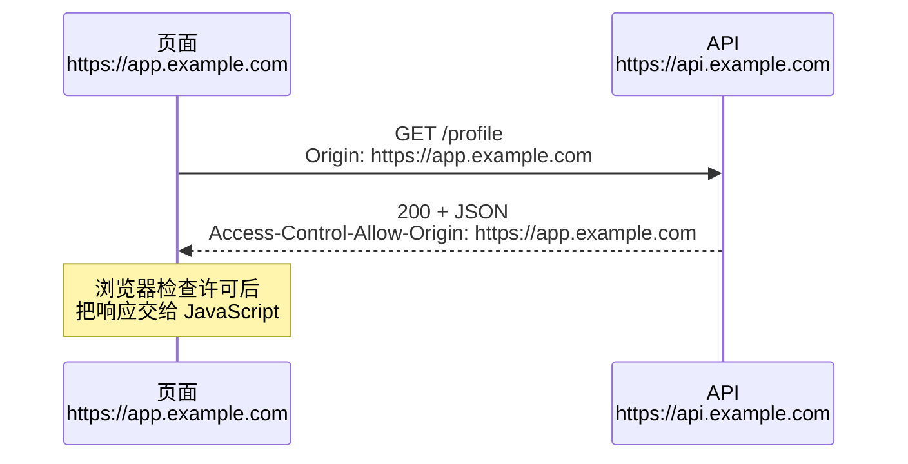
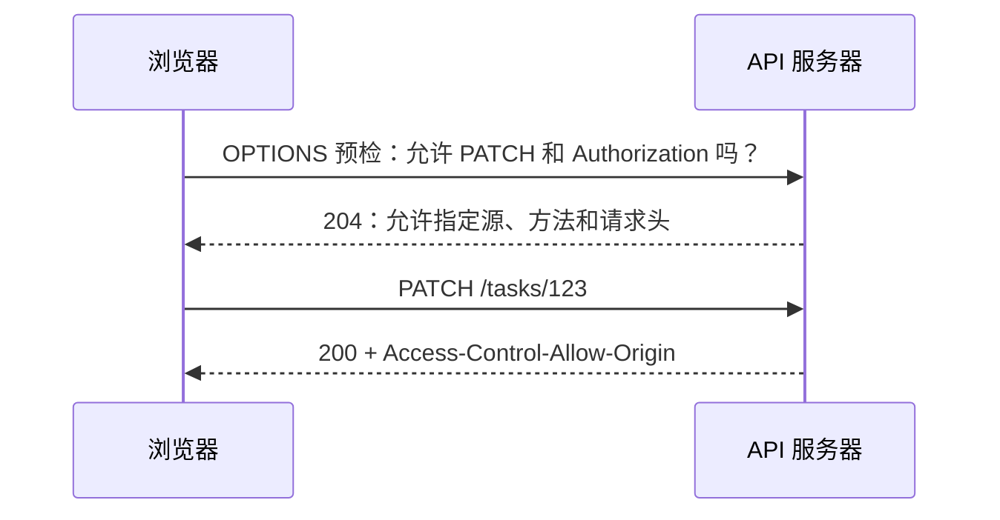

> **学完这一节，你应该能回答**
> - 前端调用后端时，除了“发一个请求”还要处理哪些状态？
> - 协议、主机、端口如何共同决定是否同源？
> - CORS 为什么由后端响应头授权，却由浏览器执行？
> - 预检请求、Cookie 凭据和 CSRF 之间是什么关系？

## 1. 前后端通信的基本模型

前端通常通过 HTTP API 获取和提交数据：

```js
async function createTask(title) {
  const response = await fetch('https://api.example.com/tasks', {
    method: 'POST',
    headers: {
      'Content-Type': 'application/json',
    },
    body: JSON.stringify({ title }),
  });

  if (!response.ok) {
    const error = await response.json();
    throw new Error(error.message ?? `请求失败：${response.status}`);
  }

  return response.json();
}
```

一次可靠的前端交互至少要考虑：

- 请求参数和编码；
- loading、成功、空数据和错误状态；
- 认证凭据；
- 超时与用户取消；
- 重试是否安全；
- 多个请求先后返回导致的竞态；
- 组件卸载后是否还更新状态；
- 后端契约发生变化时如何兼容。

“接口在 Postman 中成功”只证明服务器能响应那个请求，不代表浏览器环境中的 CORS、Cookie、mixed content 和页面代码都正确。

---

## 2. 什么是源（origin）

浏览器用三部分共同定义一个源：

```text
origin = scheme（协议） + hostname（主机名） + port（端口）
```

以页面 `https://www.example.com/account` 为基准：

| 目标 URL | 是否同源 | 原因 |
| --- | --- | --- |
| `https://www.example.com/api` | 是 | 协议、主机、端口相同；路径不影响源 |
| `https://www.example.com:443/api` | 是 | HTTPS 的默认端口就是 443 |
| `http://www.example.com/api` | 否 | 协议不同 |
| `https://api.example.com/api` | 否 | 主机名不同；子域名也算不同主机 |
| `https://www.example.com:8443/api` | 否 | 端口不同 |
| `https://example.com/api` | 否 | `example.com` 与 `www.example.com` 是不同主机 |

路径、查询参数和 `#fragment` 不参与源的判断。

---

## 3. 为什么浏览器要限制跨源读取

假设你已经登录网上银行，浏览器中保存着银行 Cookie。此时你打开恶意网站。如果任意页面都能读取其他网站的响应，恶意脚本就可能借浏览器身份读取余额和私人数据。

因此浏览器实施**同源策略（Same-Origin Policy）**：一个源的脚本不能随意读取另一个源的敏感内容。

但现实应用确实需要从不同源加载 API、字体等资源，于是有了 CORS：

**CORS（Cross-Origin Resource Sharing）让目标服务器通过 HTTP 响应头，声明哪些源可以让浏览器脚本读取它的响应。**



三个关键点：

1. CORS 主要是**浏览器的读取限制**，不是服务器的登录或权限系统。
2. 服务器通过响应头表达许可，浏览器负责执行。
3. 非浏览器客户端（如 `curl`、后端服务）通常不受浏览器 CORS 机制限制，但仍受认证、网络和服务器权限控制。

---

## 4. CORS 不是阻止请求发出的万能防火墙

有时跨源请求已经到达服务器并产生副作用，只是浏览器因响应缺少 CORS 许可，不把响应内容交给前端 JavaScript。

这意味着：

- 不能靠“没配置 CORS”阻止攻击者调用接口；
- 修改数据的接口仍需认证、授权、CSRF 防护或其他业务保护；
- GET 应保持只读语义；
- CORS 报错时，要看服务端日志判断请求是否实际到达。

浏览器同源策略保护用户在浏览器中的数据读取边界，后端权限保护服务本身；两者解决的问题不同。

---

## 5. 简单请求与预检请求

某些满足受限条件的跨源请求可以直接发送，通常被称为“简单请求”。例如方法为 `GET`、`HEAD`、`POST`，只使用 CORS 安全列出的请求头，并且 `Content-Type` 是少数允许值之一。

下面这些常见情况会触发 **preflight（预检）**：

- `PUT`、`PATCH`、`DELETE` 等方法；
- `Content-Type: application/json`；
- 自定义请求头；
- `Authorization` 请求头。

浏览器先发送 `OPTIONS`：

```http
OPTIONS /tasks/123 HTTP/1.1
Origin: https://app.example.com
Access-Control-Request-Method: PATCH
Access-Control-Request-Headers: content-type, authorization
```

服务器许可响应：

```http
HTTP/1.1 204 No Content
Access-Control-Allow-Origin: https://app.example.com
Access-Control-Allow-Methods: GET, POST, PATCH, DELETE
Access-Control-Allow-Headers: Content-Type, Authorization
Access-Control-Max-Age: 600
```

浏览器确认许可后，才发送真正的 `PATCH`。



> **实际响应也要带 CORS 头**
> 预检通过不代表后续响应可以漏掉 `Access-Control-Allow-Origin`。如果应用只给成功响应加 CORS 头，真实的 401 或 500 会在浏览器里表现成模糊的 CORS 错误，反而掩盖原始问题。

---

## 6. 常见 CORS 响应头

| 响应头 | 作用 |
| --- | --- |
| `Access-Control-Allow-Origin` | 允许哪个请求源读取响应 |
| `Access-Control-Allow-Methods` | 预检时允许哪些方法 |
| `Access-Control-Allow-Headers` | 预检时允许客户端发送哪些请求头 |
| `Access-Control-Allow-Credentials` | 是否允许浏览器在跨源请求中使用凭据 |
| `Access-Control-Expose-Headers` | 允许前端脚本读取哪些非安全列出的响应头 |
| `Access-Control-Max-Age` | 预检结果可缓存多久 |

带多个允许源时，服务器通常读取请求的 `Origin`，与白名单匹配后回显一个具体源，并正确设置：

```http
Vary: Origin
```

这提醒缓存：不同 Origin 可能得到不同响应头。如果 CDN 忽略这个维度，可能把为某个源生成的响应错误复用给另一个源。

`Access-Control-Allow-Origin` 不是逗号分隔的任意多源列表；常见正确做法是动态匹配白名单后返回单个允许源。

---

## 7. Cookie、凭据与通配符

跨源 `fetch` 默认不会像同源请求那样总是携带 Cookie。需要时可显式设置：

```js
fetch('https://api.example.com/profile', {
  credentials: 'include',
});
```

服务器也必须返回：

```http
Access-Control-Allow-Origin: https://app.example.com
Access-Control-Allow-Credentials: true
```

当使用凭据时，`Access-Control-Allow-Origin` 不能写成 `*`，必须是明确允许的源。

Cookie 是否实际发送，还受这些属性影响：

- `Secure`：只通过 HTTPS 发送；
- `HttpOnly`：JavaScript 不能读取，但浏览器仍可随请求发送；
- `SameSite`：限制跨站上下文中的 Cookie 发送；
- `Domain` 与 `Path`：决定匹配范围；
- 浏览器第三方 Cookie 策略。

> **跨源（cross-origin）与跨站（cross-site）不是完全相同概念**
> 同源比较协议、主机、端口；SameSite 使用“站点”概念。两个子域名通常跨源，但可能仍属于同站。分析 Cookie 和 CSRF 时不要把两个术语混用。

---

## 8. CORS 与 CSRF 的区别

| 对比 | CORS | CSRF |
| --- | --- | --- |
| 核心问题 | 某源的脚本能否读取另一个源的响应 | 恶意页面能否借用户自动携带的凭据发起有副作用请求 |
| 主要执行者 | 浏览器根据服务端响应头判断 | 应用通过 Token、SameSite、来源验证等防护 |
| 是否替代认证授权 | 否 | 否 |
| 典型防护 | 精确 Origin 白名单、正确响应头 | CSRF Token、合适的 SameSite、检查 Origin/Referer、避免 GET 改数据 |

CORS 不应被当成 CSRF 的唯一防线。尤其是浏览器能直接发送的表单类请求，即使攻击页面读不到响应，也可能已经修改了服务器数据。

如果 API 使用 Cookie 认证，更需要明确 CSRF 模型；如果使用 `Authorization` 头，恶意站点通常无法凭空获得令牌，但仍要处理 XSS、令牌泄露和 CORS 配置。

---

## 9. 开发环境为什么特别容易跨域

常见本地结构：

```text
前端：http://localhost:5173
后端：http://localhost:3000
```

虽然主机名相同，但端口不同，所以属于不同源。

有两种正规解决方案：

### 方案 A：后端配置允许的开发源

后端白名单加入 `http://localhost:5173`。注意 `localhost` 与 `127.0.0.1` 也是不同主机字符串，前端实际使用哪个就配置哪个。

### 方案 B：开发服务器代理

浏览器只请求同源路径：

```text
浏览器 → http://localhost:5173/api/tasks
                │
                └─ 开发服务器代理 → http://localhost:3000/tasks
```

对浏览器而言是同源请求，因此不触发浏览器 CORS 检查。代理发生在受控开发服务器上，而不是在前端 JavaScript 中“绕过浏览器”。

生产环境可以由 Nginx 或平台把 `/api` 代理到后端，形成同源入口，详见 [2.5 把网页部署到公网上](/blog/2-5-把网页部署到公网上)。

---

## 10. `mode: 'no-cors'` 为什么通常不是解决办法

有人遇到 CORS 错误后加入：

```js
fetch(url, { mode: 'no-cors' });
```

这不会给你跨源读取权限。浏览器会限制请求方法和请求头，并向 JavaScript 返回 **opaque response（不透明响应）**：看不到正常状态码、响应头和正文。

它适用于少数只需要发送或加载、不需要读取结果的场景，不适合普通 JSON API。正确修复位置通常是目标服务器的 CORS 配置、代理结构或请求本身。

---

## 11. 前端通信中常被误认为 CORS 的问题

浏览器控制台可能显示跨域相关提示，但根因不一定是白名单：

- DNS 解析失败；
- 服务器没有启动或端口错误；
- TLS 证书无效；
- HTTPS 页面请求 HTTP 资源，被 mixed content 阻止；
- 反向代理返回 502 / 504，却没给错误响应加 CORS 头；
- OPTIONS 被认证中间件拦截；
- 重定向到了另一个未许可的源；
- API 异常返回 HTML 错误页；
- 请求头名称没有加入 `Access-Control-Allow-Headers`；
- 服务器重复设置多个 `Access-Control-Allow-Origin`；
- CDN 缓存了错误来源的响应。

因此不要只搜索控制台最后一句报错，要在 Network 面板查看 OPTIONS 和实际请求各自发生了什么。

---

## 12. 一套系统的 CORS 排查顺序

1. **确认页面源**：从地址栏记录协议、主机和端口。
2. **确认 API URL**：比较三元组，判断是否真的跨源。
3. **看 Network 面板**：是否先出现 OPTIONS？状态码是什么？
4. **看请求的 `Origin`**：与后端白名单是否逐字匹配。
5. **看预检响应**：Allow-Origin、Methods、Headers 是否完整。
6. **看实际响应**：包括 4xx / 5xx 是否也带正确 CORS 头。
7. **检查凭据**：前端 `credentials`、服务端 Allow-Credentials 和 Cookie 属性是否匹配。
8. **检查代理和重定向**：请求最终是否去了另一个域名或协议。
9. **看服务端日志**：判断请求是否到达，以及真正的异常是什么。
10. **用 `curl` 辅助复现**：它可验证服务器响应，但不能模拟浏览器是否放行读取。

预检示例：

```bash
curl -i -X OPTIONS 'https://api.example.com/tasks' \
  -H 'Origin: https://app.example.com' \
  -H 'Access-Control-Request-Method: POST' \
  -H 'Access-Control-Request-Headers: content-type, authorization'
```

---

## 13. 不止 CORS：可靠通信还要处理失败与竞态

### 超时和取消

`fetch` 可配合 `AbortController`：

```js
const controller = new AbortController();
const timeoutId = setTimeout(() => controller.abort(), 8000);

try {
  const response = await fetch('/api/search?q=network', {
    signal: controller.signal,
  });
  // 检查 response.ok，再解析数据
} finally {
  clearTimeout(timeoutId);
}
```

超时不代表服务器一定没有执行请求。对创建订单、支付等非幂等操作盲目重试，可能产生重复结果。

### 竞态

用户快速输入两次搜索：请求 A 先发后慢，请求 B 后发先回。如果 A 最后覆盖 B，界面会显示旧结果。可以取消旧请求、记录请求序号，或只接受当前查询对应的响应。

### 乐观更新

前端可以先假设操作成功，让界面立即变化；如果后端失败，再回滚并提示。这能提升体验，但要设计：

- 回滚依据；
- 多次并发修改的顺序；
- 服务端最终返回数据与本地预测不一致时如何合并。

### 错误分层

| 层次 | 示例 | 前端处理 |
| --- | --- | --- |
| 网络错误 | 离线、DNS、连接失败 | 提示网络问题，允许安全重试 |
| HTTP 错误 | 401、403、404、429、500 | 按状态和 API 错误码处理 |
| 解析错误 | 宣称 JSON 却返回 HTML | 记录响应与部署问题 |
| 业务错误 | 库存不足、邮箱已使用 | 给出可行动提示 |
| 状态竞态 | 旧响应覆盖新响应 | 取消、版本号或序列控制 |

---

## 14. WebSocket 是否使用 CORS

WebSocket 从 HTTP Upgrade 握手开始，但不使用 Fetch 的完整 CORS 流程，也没有标准 CORS 预检。浏览器会在握手中发送 `Origin`，服务器应主动验证允许的来源，并照常做认证和授权。

建立连接后还要处理：

- 心跳和超时；
- 断线重连与消息补偿；
- 重复和乱序；
- 单连接的身份过期；
- 多实例之间的消息分发；
- 每个消息动作的权限检查。

“已经建立 WebSocket”不代表这条连接后续所有消息天然可信。

---

## 15. 生产配置原则

- 明确列出可信前端源，不根据任意输入无条件回显 Origin。
- 只有确实需要 Cookie 等凭据时才启用 Allow-Credentials。
- 让 OPTIONS 在认证之前正确得到响应，但不要因此跳过真实请求的权限。
- CORS 头覆盖成功和错误响应。
- 配置 `Vary: Origin`，并检查 CDN 缓存行为。
- 开发、测试、生产使用独立白名单，避免把临时开发域名放进生产。
- 同源代理可减少配置复杂度，但不能取代后端认证和授权。
- 自动化测试允许源、拒绝源、预检和带凭据请求。

## 与其他笔记的关系

- 源中的协议、主机和端口见 [1.2 计算机之间的通信：网络](/blog/1-2-计算机之间的通信-网络)。
- 请求方法、状态码和头字段见 [3.1 HTTP](/blog/3-1-http)。
- API 契约、认证与幂等见 [3.0 什么是API?后端是为了什么？](/blog/3-0-什么是-api-后端是为了什么)。
- CORS 中间件在请求管线的位置见 [3.2 后端框架做了哪些事？](/blog/3-2-后端框架做了哪些事)。

## 延伸阅读

- [MDN：跨源资源共享（CORS）](https://developer.mozilla.org/zh-CN/docs/Web/HTTP/Guides/CORS)
- [MDN：同源策略](https://developer.mozilla.org/zh-CN/docs/Web/Security/Same-origin_policy)
- [MDN：Using Fetch](https://developer.mozilla.org/zh-CN/docs/Web/API/Fetch_API/Using_Fetch)
- [OWASP：Cross-Site Request Forgery Prevention](https://owasp.org/www-community/attacks/csrf)
