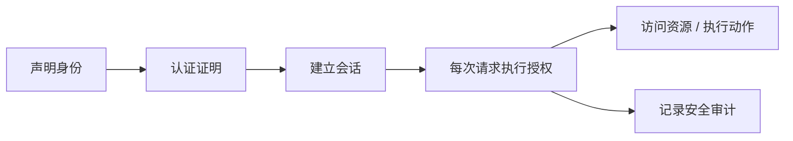
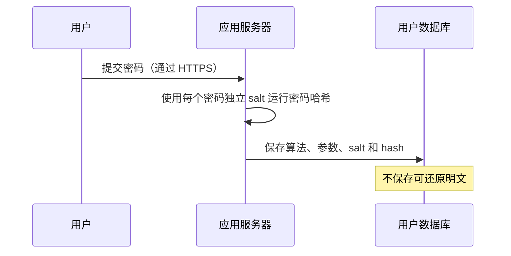

> **学完这一节，你应该能回答**
> - 身份标识、身份核验、认证、会话和授权为何是不同步骤？
> - 密码、短信码、TOTP、安全密钥和 Passkey 分别属于什么因素？
> - RBAC、ABAC、ReBAC 和资源所有权检查如何选择？
> - 为什么“用户已登录”远远不代表他有权操作某个对象？

## 1. 先把几个概念分开

| 概念 | 它回答的问题 | 例子 |
| --- | --- | --- |
| 身份标识（identification） | 你声称自己是谁？ | 用户名、邮箱、用户 ID |
| 身份核验（identity proofing） | 这个数字身份是否对应某个现实主体？ | 银行开户核验、企业认证 |
| 认证（authentication / AuthN） | 当前访问者如何证明自己控制该身份？ | 密码、Passkey、MFA |
| 会话（session） | 多次请求如何持续关联到已认证主体？ | Session ID、访问令牌 |
| 授权（authorization / AuthZ） | 这个主体此刻能对这个资源做什么？ | 是否能编辑项目、退款、查看报表 |
| 审计（audit） | 谁在何时做了什么，结果如何？ | 管理员删除用户的不可抵赖记录 |



登录成功只是建立身份上下文，授权仍要在每次受保护操作中判断。

---

## 2. 主体、资源、动作与上下文

授权问题可以拆成：

```text
主体 Subject：谁在请求？
资源 Resource：想访问什么？
动作 Action：想做什么？
上下文 Context：在什么条件下？
```

例如：

```text
员工 Alice
在工作时间、公司设备上
申请导出
客户项目 P 的财务报表
```

授权策略不应只有 `isAdmin` 一个布尔值。真实规则可能与组织、租户、资源所有者、成员关系、数据敏感级别、时间和审批状态有关。

---

## 3. 认证因素

认证因素按证明来源分类：

| 因素 | 含义 | 例子 |
| --- | --- | --- |
| 你知道的 | 知识 | 密码、PIN |
| 你持有的 | 所有物 | 手机、硬件安全密钥、认证器 |
| 你本身的 | 生物特征 | 指纹、面容 |

真正的多因素认证需要来自不同类别。密码 + 两个安全问题仍主要是同一知识因素。

### 风险与上下文

认证强度应与风险匹配：

- 浏览公开内容无需登录；
- 查看普通个人资料可使用已有会话；
- 修改密码、添加收款账户或大额转账可要求重新认证或更强因素；
- 异常设备、地理位置或行为可触发额外验证。

这叫 step-up authentication（提升认证），但风险信号本身可能误判，必须提供安全恢复路径。

---

## 4. 密码系统的正确职责

用户输入密码后，服务端不应保存明文，也不应使用可逆加密作为主要密码存储方式。应使用专门的、故意较慢且可调成本的密码哈希算法。



登录时用保存的算法和参数重新计算并进行安全比较。

### Salt 与 Pepper

- **salt**：每个密码使用不同随机值，与哈希一起保存，防止相同密码产生相同结果并抵抗预计算表。
- **pepper**：可选的系统级秘密，放在数据库之外的秘密管理系统；泄露或轮换处理更复杂。

### 算法

优先使用当前安全指南推荐的密码哈希，例如 Argon2id；在受限或兼容场景使用合适参数的 scrypt、bcrypt、PBKDF2 等。不要自己发明哈希组合，也不要使用普通 SHA-256 单次哈希存密码。

算法参数会随硬件进步调整。系统应记录每条哈希使用的版本和成本，在用户成功登录后逐步升级旧哈希。

---

## 5. 登录接口不只是“比较密码”

一个成熟流程还应考虑：

- 全程 HTTPS；
- 对账户和来源进行分层限速；
- 防止用户名枚举；
- 检测撞库、暴力尝试和异常行为；
- 成功后旋转会话标识；
- 记录安全事件但不记录明文凭据；
- 对高风险操作重新认证；
- 支持用户查看和撤销其他设备会话。

错误提示可统一为“账号或凭据不正确”，避免让攻击者批量确认哪些邮箱已注册。与此同时，真正用户仍需要可用的找回流程，不能只靠模糊报错牺牲可用性。

账户锁死也可能被攻击者用来拒绝服务。渐进延迟、限速、风险验证与通知通常比永久硬锁更稳妥。

---

## 6. MFA、TOTP、短信和恢复码

| 方式 | 优点 | 局限 |
| --- | --- | --- |
| 短信验证码 | 覆盖广、用户熟悉 | SIM 换卡、号码回收、钓鱼和通信网络风险 |
| 邮件验证码 | 部署简单 | 安全性依赖邮箱账户本身 |
| TOTP | 离线生成、生态成熟 | 仍可被实时钓鱼转发，设备迁移要处理 |
| 推送确认 | 使用方便 | 可能遭遇推送疲劳和误点 |
| 安全密钥 / Passkey | 公钥凭据、与站点绑定，抗钓鱼能力强 | 恢复、设备覆盖和账户迁移需设计 |
| 恢复码 | 失去主因素时恢复 | 必须一次性、妥善保存并可撤销 |

MFA 不是在密码后随便多问一个问题。注册第二因素、替换设备和账户恢复往往是最薄弱环节，需要与登录同等级保护。

### Passkey / WebAuthn 的基本思想

服务端保存公钥，认证器保存或管理私钥。服务端发送一次性挑战，认证器在用户同意后签名；服务端验证签名和上下文。凭据绑定到依赖方范围，能显著降低把凭据输入钓鱼站点的风险。

生物识别通常在本地解锁认证器，网站不一定拿到用户指纹或面容原始数据。

---

## 7. 账户恢复是认证系统的一部分

如果“忘记密码”只需回答生日和姓名，攻击者会绕过再强的登录保护。

恢复流程应考虑：

- 令牌随机、短期、一次性；
- 链接使用 HTTPS，令牌不进入第三方资源日志；
- 请求恢复时不暴露账户是否存在；
- 修改成功后撤销或审查旧会话；
- 用户收到通知并能报告异常；
- 更换 MFA 因素需要提升验证；
- 高价值账户可能需要人工或延迟恢复。

支持团队也属于攻击面。攻击者可能通过社工诱导客服绕过技术控制。

---

## 8. 授权模型

### 8.1 ACL：资源列出谁能做什么

```text
文档 42
  Alice: read, write
  Team-A: read
```

直观但资源和主体很多时管理成本上升。

### 8.2 RBAC：基于角色

```text
角色 editor → article:read, article:update
用户 Alice → editor
```

适合职责相对稳定的组织。不要为每个细微组合创建新角色，造成角色爆炸。

### 8.3 ABAC：基于属性

```text
允许，当：
  user.department == document.department
  且 document.classification <= user.clearance
```

灵活，但策略、数据来源和调试更复杂。

### 8.4 ReBAC：基于关系

```text
用户是项目成员
项目拥有文档
因此用户可读取文档
```

适合协作、社交和多层组织关系。

真实系统常混合模型：RBAC 给基础能力，资源所有权和关系进一步收窄，环境属性触发额外限制。

---

## 9. 默认拒绝与最小权限

可靠授权的基本原则：

1. **默认拒绝**：没有明确允许就拒绝。
2. **每个请求验证**：不能只在页面加载时检查一次。
3. **最小权限**：人、服务和令牌只获得完成任务所需能力。
4. **服务端执行**：隐藏按钮不是权限控制。
5. **集中策略、贴近资源**：避免规则散落又能使用真实对象上下文。
6. **拒绝路径也测试**：不仅测试管理员能成功，还测试普通用户和跨租户访问确实失败。

```mermaid
flowchart TD
    Q[请求 action(resource)] --> ID[解析主体身份]
    ID --> LOAD[安全加载资源与租户上下文]
    LOAD --> POLICY{策略允许？}
    POLICY -->|否| DENY[拒绝并记录]
    POLICY -->|是| DO[在约束下执行]
```

---

## 10. 对象级授权与 IDOR

危险代码概念：

```text
DELETE /documents/123
→ 按 123 查询
→ 直接删除
```

即使用户已登录，他也可能把 `123` 改成别人的 `124`。这类问题常称 IDOR/BOLA：通过可控对象标识访问了未授权资源。

更可靠的查询把授权上下文纳入条件：

```sql
DELETE FROM documents
WHERE id = :document_id
  AND owner_id = :current_user_id;
```

复杂规则可能先加载资源再由策略引擎判断，但必须避免“先执行后检查”。随机 UUID 会降低猜测概率，却不能代替授权。

---

## 11. 多租户隔离

SaaS 系统里同一应用服务多个组织。每个请求都要正确确定 tenant，并让查询、缓存、文件、消息和日志保持隔离。

常见风险：

- 只按资源 ID 查询，忘了 tenant 条件；
- 缓存键没有 tenant ID；
- 后台任务丢失请求中的租户上下文；
- 对象存储路径可跨租户猜测；
- 管理员角色没有区分平台管理员和租户管理员；
- 数据导出或搜索索引混入其他租户。

可以在数据库策略、仓库层、服务层建立多重护栏，但仍需端到端测试跨租户拒绝。

---

## 12. 授权中的时间与并发

授权判断和实际修改之间若隔得太久，条件可能变化：

```text
检查：用户是成员
        ↓ 期间用户被移出项目
执行：删除项目文件
```

对高风险操作，应在接近执行的位置重新判断，并借助事务、条件更新或锁维持一致性。长时间运行的任务要保存和重新验证适当授权上下文，而不是永久继承提交任务时的无限权限。

权限撤销还要考虑缓存、令牌有效期、长连接和后台 worker 何时感知。

---

## 13. 审计与隐私

安全审计日志应能回答：

- 哪个主体；
- 在什么时间与来源；
- 对哪个资源执行什么动作；
- 策略为何允许或拒绝；
- 结果和关联请求 ID；
- 是否使用提升认证或管理员代操作。

审计日志本身含敏感信息，需要访问控制、防篡改、保留期限和删除政策。不要记录密码、完整 Session ID、访问令牌或恢复令牌。

管理员查看用户数据也应被审计；“内部人员”不是自动可信边界。

---

## 14. 常见误区

| 误区 | 正确认识 |
| --- | --- |
| 用户登录了就可以访问所有 `/users/:id` | 登录只确认身份，每个资源仍需授权 |
| 使用 UUID 就不用授权 | UUID 只降低猜测，泄露后仍可被滥用 |
| 角色越多越精细越安全 | 角色爆炸会使配置不可理解，应建模资源和关系 |
| 手机验证码天然是强安全 | 它有电信、钓鱼和账号恢复风险，应按威胁模型使用 |
| 生物识别数据被直接上传给每个网站 | WebAuthn 常由本地认证器验证用户并用私钥签名 |
| 密码加密保存就安全 | 密码应使用专用慢哈希；可逆密钥泄露会暴露全部密码 |
| 前端路由守卫能阻止越权 | 用户可以绕过前端直接调用 API |

## 15. 实施检查清单

- [ ] 认证、会话、授权职责清楚分离
- [ ] 密码使用当前推荐的专用哈希与可升级参数
- [ ] 登录、恢复和 MFA 变更都有滥用防护
- [ ] 登录后和权限提升后旋转会话
- [ ] 每个对象与动作都在服务端检查权限
- [ ] 默认拒绝并实行最小权限
- [ ] 多租户条件进入查询、缓存和后台任务
- [ ] 关键权限变更能及时撤销会话或令牌
- [ ] 允许和拒绝路径都有自动化测试
- [ ] 审计足以调查问题，又不记录秘密

## 延伸阅读

- [3.5 Cookie、Session、JWT 与 OAuth](/blog/3-5-cookie-session-jwt-与-oauth)
- [3.6 Web 安全基础](/blog/3-6-web-安全基础)
- [OWASP Authentication Cheat Sheet](https://cheatsheetseries.owasp.org/cheatsheets/Authentication_Cheat_Sheet.html)
- [OWASP Authorization Cheat Sheet](https://cheatsheetseries.owasp.org/cheatsheets/Authorization_Cheat_Sheet.html)
- [OWASP Password Storage Cheat Sheet](https://cheatsheetseries.owasp.org/cheatsheets/Password_Storage_Cheat_Sheet.html)
- [W3C Web Authentication](https://www.w3.org/TR/webauthn/)
