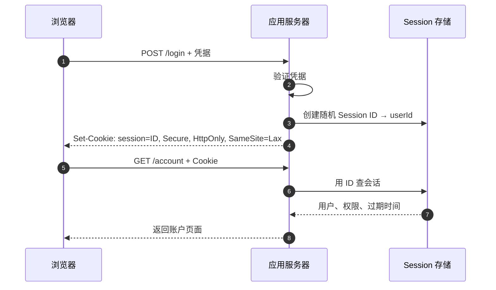
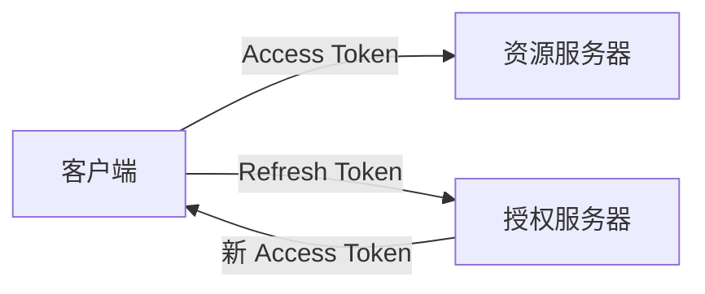
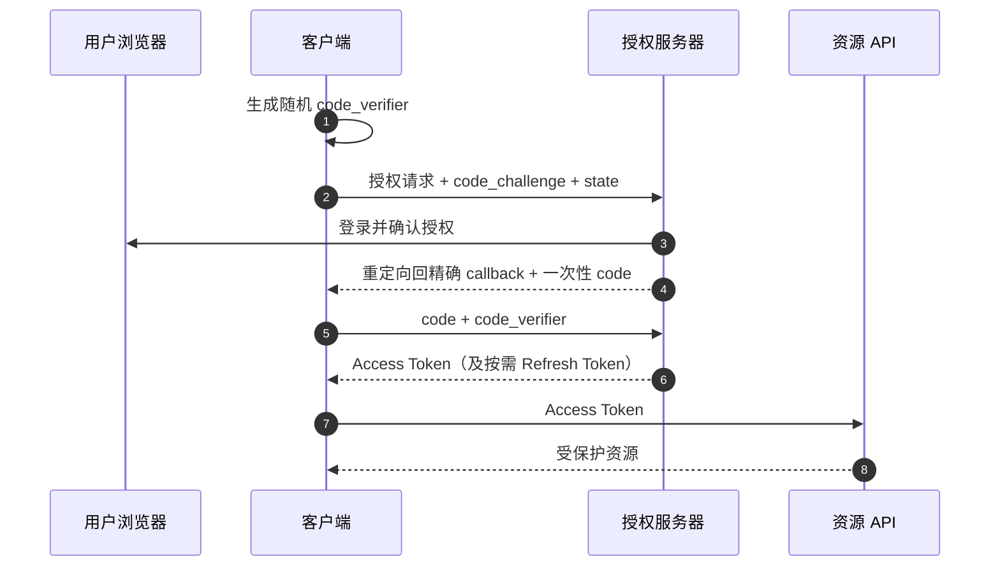

> **学完这一节，你应该能回答**
> - Cookie、Session、Token 和 JWT 为何不在同一分类层级？
> - JWT 的签名保证什么，为什么 payload 不能放秘密？
> - OAuth 解决授权委托，OpenID Connect 又补充了什么？
> - 浏览器应用该如何在 XSS、CSRF、撤销能力和架构复杂度之间取舍？

## 1. 四个概念先分层

| 名称 | 本质 | 解决的问题 |
| --- | --- | --- |
| Cookie | 浏览器按规则保存并随 HTTP 请求发送的小数据 | 在浏览器与服务器间携带状态标识 |
| Session | 一段交互期间的会话状态模型 | 把多个无状态 HTTP 请求关联到同一主体 |
| Token | 表示某种权利或状态的凭证字符串 | 调用者向接收方出示能力 |
| JWT | 一种带签名声明的紧凑 token 格式 | 让接收方验证声明未被篡改及签发者 |
| OAuth | 授权委托协议框架 | 让客户端在限定范围内访问资源，而不拿用户密码 |

Cookie 可以携带 Session ID，也可以携带其他偏好；Session ID 是 token，但不必是 JWT；JWT 可以放 Cookie，也可以放 Authorization 头；OAuth access token 也不保证一定是 JWT。

---

## 2. HTTP 无状态与 Session

HTTP 请求彼此独立。服务器建立会话后，可以返回一个随机标识：



浏览器持有不可预测的 Session ID，服务器保存会话内容。这叫 server-side session 或 opaque token 方案。

优点：

- 服务端容易立即撤销；
- 权限改变可在下一请求生效；
- 客户端 token 很小，不暴露内部声明；
- 实现和审计相对直观。

代价：

- 多实例需要共享会话存储、粘性路由或其他一致方案；
- 每次请求通常要查询会话；
- 存储需要过期和清理。

---

## 3. Session ID 的安全要求

Session ID 在有效期内近似等同于用户已完成的认证。攻击者拿到它，通常就能冒充用户。

必须做到：

- 使用密码学安全随机数，足够长且不可预测；
- 登录成功、权限提升等安全边界变化后旋转 ID；
- 不把 ID 放在 URL；
- 全程 HTTPS；
- 设置 Secure、HttpOnly、合适 SameSite；
- 闲置超时与绝对过期；
- 用户退出、改密码或报告失窃时能撤销；
- 服务端只保存必要会话信息并安全清理。

### Session fixation

攻击者先让受害者使用一个攻击者已知的 Session ID，再等待受害者登录。如果登录后沿用同一 ID，攻击者就能接管。解决关键是认证状态改变时生成新 ID，并使旧 ID 失效。

### 并发会话策略

系统要明确：

- 是否允许多设备同时登录；
- 用户能否查看和逐个撤销设备；
- 密码修改后是否撤销其他会话；
- 管理员禁用账户后多久生效；
- 长连接如何被断开。

---

## 4. Cookie 的安全属性

```http
Set-Cookie: __Host-session=<random>; Path=/; Secure; HttpOnly; SameSite=Lax
```

`__Host-` 前缀要求 Secure、Path=/ 且不设置 Domain，可帮助收窄 Cookie 范围（浏览器支持规则应按目标环境确认）。

| 属性 | 意义 |
| --- | --- |
| Secure | 只在安全连接发送 |
| HttpOnly | 页面 JavaScript 不能读取 |
| SameSite | 控制跨站上下文携带 |
| Domain | 指定匹配域；不设置通常是 host-only |
| Path | 限制请求路径，但不能抵抗同源脚本读取非 HttpOnly Cookie |
| Max-Age / Expires | 持久时间 |

删除 Cookie 时，要使用与设置时匹配的 name、Domain、Path，并让其过期。只删除前端状态而未撤销服务器 Session，旧 Cookie 副本仍可能有效。

跨域与凭据见 [3.3 前后端通信、跨域问题](/blog/3-3-前后端通信-跨域问题)。

---

## 5. JWT 的结构

JWT 常写成三个 Base64URL 编码部分：

```text
header.payload.signature
```

示意 payload：

```json
{
  "iss": "https://auth.example.com",
  "sub": "user-42",
  "aud": "https://api.example.com",
  "exp": 1788768000,
  "scope": "tasks:read"
}
```

### 签名保证什么

接收方使用正确密钥验证：

- header 和 payload 在签发后未被改变；
- token 来自持有相应签名密钥的一方。

签名**不等于加密**。任何拿到普通签名 JWT 的人通常都能解码 payload，所以不能放密码、私钥或不应暴露给持有者的敏感信息。

存在专门的加密 token 标准，但这会增加密钥、算法和互操作复杂度；仍应最小化声明。

---

## 6. 验证 JWT 不能只验证签名

资源服务器通常还需验证：

- 允许的签名算法，不能盲信 token 自带算法；
- `iss` 是否是预期签发者；
- `aud` 是否包含当前服务；
- `exp` 是否过期；
- `nbf` 是否已经生效；
- 密钥 ID 和密钥来源是否合法；
- token 类型与使用场景；
- 必要 scope / 权限；
- 账户或会话是否已被禁用（若架构要求即时撤销）。

不要自己手写密码学和 JWT 解析，使用维护良好、默认安全的库，并固定验证配置。

### JWT 的取舍

优点：

- 多个服务可本地验证签名；
- 声明自包含，减少每次查询签发方；
- 适合跨服务或联合身份场景。

代价：

- 签发后难以即时撤销；
- token 体积比随机 ID 大；
- 权限声明可能陈旧；
- 密钥轮换、算法和 audience 配置复杂；
- 很容易被误用为通用 Session 替代品。

如果应用是单体 Web 服务，普通服务端 Session 往往更简单。技术选择应由信任边界决定，而不是因为 JWT 看起来“更现代”。

---

## 7. Access Token 与 Refresh Token

- **Access Token**：给资源服务器调用 API，通常短期、权限有限。
- **Refresh Token**：给授权服务器换取新 Access Token，寿命更长、价值更高。
- **ID Token**：OpenID Connect 中向客户端说明一次认证结果和用户身份声明，不应随意当成 API Access Token。



Refresh Token 需要更严格保护。公共客户端无法可靠保守内置 client secret，因此通常依赖 PKCE、刷新令牌轮换或 sender-constrained 等机制，而不是把 secret 打包进前端。

轮换模式下，每次刷新发新 Refresh Token，并使旧值失效；旧值再次出现可能意味着泄露，应撤销相应 token family。并发刷新和网络重试必须有明确处理，否则正常请求也可能被误判。

---

## 8. OAuth 解决的是什么

典型场景：一个照片打印应用希望读取用户云盘中的指定照片。用户不应把云盘密码交给打印应用。

OAuth 定义四类角色：

| 角色 | 含义 |
| --- | --- |
| Resource Owner | 有权授权资源的主体，常是用户 |
| Client | 请求授权的应用 |
| Authorization Server | 认证用户、征得同意并签发 token |
| Resource Server | 接受 Access Token 并提供受保护 API |

OAuth 是授权委托框架，本身不等于“登录协议”。“用某平台登录”通常建立在 OpenID Connect（OIDC）之上。

---

## 9. Authorization Code + PKCE 流程

现代浏览器和原生客户端通常采用授权码流程并使用 PKCE：



- `code_verifier` 留在客户端实例；
- `code_challenge` 随初始请求发送；
- 截获授权码但没有 verifier 的攻击者不能轻易兑换；
- `state`、OIDC nonce、精确 redirect URI 等分别防护不同攻击，不能互相随意省略；
- 当前安全实践优先使用 `S256` PKCE。

不要使用把 Access Token 直接暴露在前端重定向 URL 片段中的旧式隐式流程作为新系统默认。

---

## 10. OpenID Connect：在 OAuth 上加入身份层

OIDC 在 OAuth 2.0 之上定义身份认证语义：

- ID Token；
- 标准用户声明；
- UserInfo；
- nonce、发现元数据等机制。

客户端验证 ID Token 时仍需验证签名、issuer、audience、有效期和 nonce 等。它说明“授权服务器对本次认证作出的声明”，不是无限期用户档案，也不是给任何 API 通用的 bearer token。

联合登录会把身份提供商变成关键依赖，需要处理账户绑定、邮箱变化、供应商停用和同一用户多个身份来源。

---

## 11. 浏览器应用的常见架构

### 同源 Web + 服务端 Session

```text
浏览器 ─ Cookie Session ID → 自己的后端
```

简单、易撤销，适合传统 Web 和很多单体应用。需要 CSRF 防护与 Cookie 配置。

### BFF（Backend for Frontend）

```text
浏览器 ─ HttpOnly Session Cookie → BFF ─ Token → 下游 API
```

BFF 在服务端保管 OAuth token，浏览器只持有会话 Cookie，减少 token 暴露给 JavaScript。代价是增加服务端组件、状态与代理流量。

### 纯浏览器客户端持有 Token

适用于特定 SPA 架构，但必须仔细处理 PKCE、存储、刷新、XSS、多个标签页和令牌泄露。浏览器中不存在让 JavaScript 可用、又能在 XSS 完全控制页面时绝对保密的存储。

选择依据是信任边界、部署能力和风险，不是简单比较“Cookie vs JWT”。

---

## 12. XSS 与 CSRF 的取舍

### Cookie 自动发送

浏览器会按规则自动携带 Cookie，所以恶意站点可能诱导用户浏览器发送有副作用请求。需要 SameSite、CSRF token、Origin/Referer 检查和安全 HTTP 方法等防护。

### JavaScript 可读 token

若 token 存在 localStorage 或 JS 内存，普通跨站页面通常不能直接读取；但一旦你的源发生 XSS，恶意脚本可能读取 token 或直接调用 API。

HttpOnly Cookie 降低直接窃取 token 的风险，却不能让 XSS 无害：攻击脚本仍可能以用户身份发同源请求、读取页面数据。

认证架构必须同时防 XSS 与 CSRF，不能用其中一个风险否定另一个。

---

## 13. Token 应放在哪里

没有对所有应用都完美的答案：

| 位置 | 优点 | 风险/限制 |
| --- | --- | --- |
| HttpOnly Cookie | JS 不能直接读取，可自动发送 | 需 CSRF 和 Cookie 范围设计 |
| JS 内存 | 刷新后消失，减少长期落盘 | XSS 可使用，刷新恢复复杂 |
| localStorage | 实现简单、刷新保留 | 任意同源 XSS 可读取，难以收窄生命周期 |
| sessionStorage | 每标签页、生命周期较短 | XSS 仍可读取，多标签页体验复杂 |
| BFF 服务端 | 浏览器不持有下游 token | 增加后端状态与架构成本 |

不要把 token 放在 URL 查询参数：它可能进入历史、日志、截图和 Referer。对高风险系统，优先采用经过审查的身份库和成熟架构。

---

## 14. 退出、撤销和权限变化

完整退出可能包括：

1. 撤销服务端 Session；
2. 删除匹配的 Cookie；
3. 撤销 Refresh Token 或 token family；
4. 清理页面和本地私有数据；
5. 通知其他标签页；
6. 断开 WebSocket；
7. 清理私有 Service Worker 缓存；
8. 在需要时完成身份提供商的联合退出。

短期 JWT 常通过较短过期时间限制撤销窗口；高风险场景可增加 denylist、token introspection、版本号或 sender-constrained token，但每种机制都有一致性和性能成本。

权限不要永久复制进长寿命 token。角色被撤销后，旧 token 仍可能保留旧声明，系统要明确最大生效延迟。

---

## 15. 常见误区

| 误区 | 正确认识 |
| --- | --- |
| JWT 被 Base64 编码，所以内容保密 | Base64URL 可直接解码；签名不等于加密 |
| JWT 天然无状态，所以永远优于 Session | 撤销、权限变化和刷新常重新引入状态与复杂度 |
| OAuth 就是第三方登录 | OAuth 是授权；登录身份层通常由 OIDC 提供 |
| client secret 写进 SPA 就能保密 | 发给浏览器的 secret 可以被用户取得 |
| Access Token 和 ID Token 可互换 | audience、语义和接收方不同 |
| HttpOnly Cookie 可彻底防 XSS | 它防止直接读取 Cookie，但脚本仍能执行用户操作 |
| 退出只需删除前端 token | 服务器有效凭证、刷新令牌和其他设备会话也要处理 |

## 16. 选择建议

- 单体或同源 Web 应用：优先认真评估服务端 Session + 安全 Cookie。
- 浏览器调用多个受保护服务：考虑 BFF，把复杂 token 留在服务端。
- 第三方授权和联合登录：使用成熟 OAuth/OIDC 实现，采用授权码 + PKCE 和当前安全实践。
- 服务间调用：使用适合机器身份的凭证、短期 token 和明确 audience，不复制用户密码。
- 无论方案：最小权限、短寿命、轮换、撤销、审计和 XSS/CSRF 防护缺一不可。

## 延伸阅读

- [3.4 身份认证与权限控制](/blog/3-4-身份认证与权限控制)
- [2.11 浏览器存储、缓存与安全边界](/blog/2-11-浏览器存储-缓存与安全边界)
- [RFC 9700：OAuth 2.0 Security Best Current Practice](https://datatracker.ietf.org/doc/html/rfc9700)
- [RFC 7636：PKCE](https://datatracker.ietf.org/doc/html/rfc7636)
- [OpenID Connect Core](https://openid.net/specs/openid-connect-core-1_0.html)
- [OWASP Session Management Cheat Sheet](https://cheatsheetseries.owasp.org/cheatsheets/Session_Management_Cheat_Sheet.html)
