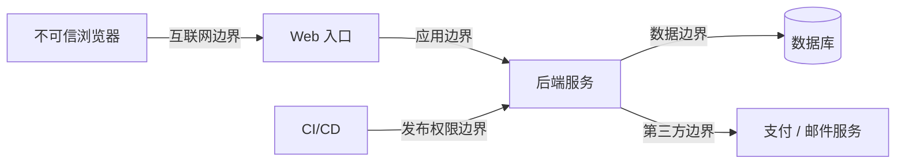
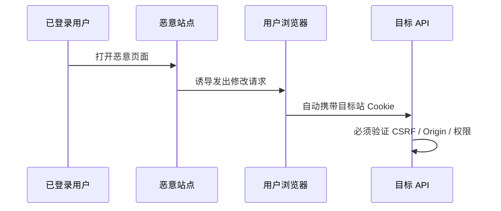
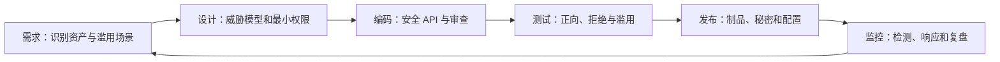

> **学完这一节，你应该能回答**
> - 安全为什么首先是识别资产、信任边界和攻击路径，而不是安装某个插件？
> - 输入验证、输出编码、参数化查询、CSP 和权限检查分别防什么？
> - XSS、CSRF、SQL 注入、越权、SSRF、文件上传和资源耗尽有何区别？
> - 如何把安全检查放进设计、开发、测试、部署和响应全过程？

## 1. 安全不是“系统绝对不会被攻破”

工程安全的目标是：在明确成本和场景下，降低攻击成功概率、限制影响范围、尽快发现问题并能够恢复。

常见安全目标：

| 目标 | 含义 | 例子 |
| --- | --- | --- |
| 机密性 | 未授权者不能读取 | 用户私信、密钥 |
| 完整性 | 数据和操作不能被未授权篡改 | 订单金额、发布包 |
| 可用性 | 合法用户在需要时可以使用 | 服务抵抗过载和故障 |
| 真实性 | 主体和数据来源可信 | 验证服务器、用户、Webhook |
| 可审计性 | 能调查谁做了什么 | 管理操作和安全事件日志 |
| 隐私 | 数据收集、使用和保留符合目的 | 最小化个人数据 |

安全措施也可能冲突：详细日志有助调查，却可能泄露隐私；更严格验证提高安全，却可能让账户恢复困难。需要明确取舍，而不是堆叠口号。

---

## 2. 从威胁模型开始

在写防护前，先问：

1. **资产是什么**：账户、资金、个人数据、服务可用性、代码签名密钥？
2. **参与者是谁**：普通用户、管理员、第三方服务、内部员工、攻击者？
3. **入口有哪些**：HTTP、WebSocket、上传、Webhook、后台任务、管理台？
4. **信任边界在哪里**：浏览器到 API、服务到数据库、租户之间、CI 到生产？
5. **攻击者能做什么**：修改客户端、重放请求、控制 URL、批量并发、盗取低权限账户？
6. **失败影响如何**：单用户数据、一个租户、整个平台还是供应链？



在图上标出数据流、身份、秘密和权限，很多风险会比读漏洞清单更容易发现。

---

## 3. 永远不要信任客户端

用户可以：

- 修改 HTML 和 JavaScript；
- 绕过按钮直接调用 API；
- 重放和并发发送请求；
- 更换 URL 中的资源 ID；
- 伪造请求头和文件名；
- 上传与扩展名不符的内容；
- 修改本地存储。

前端验证是用户体验，后端验证才是业务约束。

但“不信任”不表示把所有输入粗暴拒绝，而是：明确格式、长度、范围和语义，在边界验证并以安全方式使用。

---

## 4. 输入验证与输出编码不是同一件事

### 输入验证

确认输入是否符合业务允许集合：

```text
数量：1～100 的整数
货币：CNY 或 USD
重定向目标：站内预定义路径
文件：限定大小、类型和数量
```

优先使用 allowlist 思维：描述允许什么，而不是试图列尽所有危险字符串。

### 输出编码

同一字符串放到不同上下文，需要不同编码：

- HTML 文本；
- HTML 属性；
- URL 参数；
- JavaScript 字符串；
- CSS；
- SQL 参数；
- Shell 参数。

不存在一套“万能 sanitize”能让字符串在所有上下文安全。数据应尽可能晚地、针对最终解释上下文编码。

参数化 SQL 不是 HTML 转义；HTML 编码也不能让字符串安全地拼进 Shell 命令。

---

## 5. XSS：不可信数据被当成代码

Cross-Site Scripting（XSS）的本质是：攻击者控制的数据进入可执行 HTML/JavaScript 上下文，在你的源中运行。

### 危险示例

```js
result.innerHTML = userProvidedText;
```

如果只是显示文本：

```js
result.textContent = userProvidedText;
```

框架模板通常默认转义文本插值，但 raw HTML、危险 URL、直接 DOM 操作和第三方插件可能绕过保护。

### 常见类别

| 类别 | 数据如何到达执行点 |
| --- | --- |
| Stored XSS | 恶意内容先存数据库，后来展示给其他用户 |
| Reflected XSS | 请求参数立即反射进响应 |
| DOM-based XSS | 前端代码在浏览器中把不可信值送入危险 sink |

### 防护组合

1. 使用自动上下文编码的模板或框架；
2. 文本用 `textContent` 等安全 API；
3. 富文本使用维护良好的 HTML 清理器与严格 allowlist；
4. 验证 URL scheme，避免 `javascript:` 等危险协议；
5. 避免内联脚本和动态代码执行；
6. 使用 CSP、Trusted Types 等纵深防御；
7. 减少第三方脚本，因为它与第一方脚本共享巨大权限。

HttpOnly Cookie 降低 Cookie 值被直接读取的风险，但 XSS 仍可读取页面、发请求和诱导用户，因此不能代替修复。

---

## 6. SQL 注入与其他注入

危险做法：

```text
"SELECT * FROM users WHERE email = '" + input + "'"
```

数据被拼入 SQL 语法，攻击者可能改变查询结构。

正确方向是参数化查询：

```sql
SELECT id, name
FROM users
WHERE email = :email;
```

驱动把 SQL 结构与参数值分开处理。

### 参数不能代替所有动态 SQL

列名、排序方向、表名等通常不能像普通值一样绑定：

```text
sortBy = 用户输入的任意字符串  // 危险
```

应映射到预定义 allowlist：

```text
"name" → users.name
"createdAt" → users.created_at
```

ORM 会减少手写拼接，但 raw query、动态过滤和错误 API 仍会注入。

同样原则适用于：

- OS 命令注入：优先直接调用库或参数数组，不拼 Shell 字符串；
- LDAP、模板、日志和表达式注入；
- 邮件 Header、CSV 公式等上下文。

---

## 7. CSRF：借用户自动凭据执行请求

浏览器可能自动携带目标站点 Cookie。恶意页面诱导用户发送修改请求，就可能借用用户身份。

防护：

- 合适的 SameSite Cookie；
- 随机、绑定会话且经过验证的 CSRF token；
- 验证 Origin，必要时检查 Referer；
- 不用 GET 修改状态；
- 敏感操作要求重新认证或交易确认；
- CORS 精确配置，但不把它当唯一防线。



CORS 主要控制脚本读取跨源响应；某些请求即使响应读不到，也可能已经产生副作用。详见 [3.3 前后端通信、跨域问题](/blog/3-3-前后端通信-跨域问题)。

---

## 8. 失效的访问控制

常见问题：

- 只检查用户是否登录；
- 仅在前端隐藏功能；
- URL 改 ID 就能读别人的对象；
- 普通管理员能调用平台超级管理员接口；
- 租户 ID 只来自请求参数，未与会话绑定；
- 批量接口、导出接口和 WebSocket 消息漏做权限；
- 服务之间默认彼此全信任。

服务端应按“主体 + 资源 + 动作 + 上下文”逐项授权，默认拒绝并测试拒绝路径，详见 [3.4 身份认证与权限控制](/blog/3-4-身份认证与权限控制)。

随机 ID、未公开链接和复杂前端流程只能降低偶然发现，不能形成授权。

---

## 9. SSRF：让服务器替攻击者访问

如果后端接受任意 URL 并抓取内容：

```text
POST /preview
{ "url": "用户提供的地址" }
```

攻击者可能让服务器访问：

- 内网管理服务；
- 云环境元数据接口；
- 本机端口；
- 只能由该服务器访问的合作方 API；
- 超大或永不结束的响应。

防护要结合业务：

- 最好只允许预定义服务或域名；
- 解析后验证协议、主机和最终 IP；
- 阻止环回、链路本地、私网和保留地址，除非业务明确需要；
- 每次重定向后重新验证；
- 限制端口、响应大小、时间与重定向次数；
- 使用隔离的出口代理和最小网络权限；
- 防范 DNS 重新绑定和 IPv4/IPv6 表达绕过。

只检查字符串是否以 `https://trusted.com` 开头并不可靠。

---

## 10. 文件上传、路径穿越与内容风险

上传文件带来多层问题：

- 文件过大导致存储或内存耗尽；
- 扩展名与真实内容不符；
- 图片/文档解析器漏洞；
- 文件名包含 `../` 覆盖任意路径；
- 上传 HTML/SVG 后在你的域名执行脚本；
- 恶意压缩包解压膨胀；
- 私有文件 URL 可预测或被缓存公开。

基本策略：

1. 服务端限制数量和大小，并在流式读取时执行限制；
2. 生成自己的存储 ID，不信任客户端路径；
3. 在隔离环境验证/转换内容；
4. 上传目录不可执行，最好使用独立源或对象存储；
5. 下载时设置正确 `Content-Type`、`Content-Disposition` 和权限；
6. 压缩包限制解压文件数、总大小和路径；
7. 私有对象使用短期授权，不把长期公开 URL 当权限。

---

## 11. 不安全反序列化与原型污染

反序列化意味着把字节或文本恢复为程序对象。危险在于：

- 某些格式能指定要实例化的类或执行钩子；
- 不可信对象可覆盖原型或配置字段；
- 超深嵌套和巨大数组消耗资源；
- 签名缺失的数据可被篡改。

优先使用简单数据格式与明确 schema，限制大小和深度，不对不可信数据启用任意对象构造。JavaScript 合并配置时要防范 `__proto__` 等危险键，并使用修复过的库。

不要通过 `eval` 或 `new Function` 解析 JSON。

---

## 12. 秘密与密码学

秘密包括数据库凭据、API key、签名私钥、Cookie 签名密钥、加密密钥和 CI 发布令牌。

原则：

- 不提交到 Git；
- 不打包进前端；
- 使用秘密管理系统注入；
- 按环境和服务分离；
- 最小权限和短寿命；
- 定期轮换，并能紧急吊销；
- 日志、错误和监控中脱敏；
- 建立泄露检测和响应流程。

密码学不要自己设计算法或协议。使用标准、维护良好的实现，并清楚：

- 哈希、MAC、签名、加密解决不同问题；
- 加密数据仍需完整性保护和密钥管理；
- 随机数必须来自密码学安全来源；
- nonce/IV 的唯一性要求依算法而异；
- 密钥轮换意味着数据和旧 token 的兼容策略。

---

## 13. 依赖与供应链

应用不仅信任自己的代码，还信任：

- npm/pip/Maven 等包；
- 构建脚本和安装钩子；
- CI Action 与容器基础镜像；
- CDN 脚本；
- 编译器、插件和开发工具；
- 发布账户与签名密钥。

实践：

- 提交锁文件，固定可复现依赖；
- 审查新增依赖的维护、权限和体积；
- 自动扫描已知漏洞，但人工判断可利用性；
- 及时升级且先测试；
- CI 引用固定版本或不可变摘要；
- 使用最小构建权限，保护发布凭据；
- 生成并保存构建来源、制品摘要和依赖清单。

“没有公开漏洞报告”不表示依赖安全，“扫描报警”也不一定代表当前应用可被利用。

---

## 14. 安全响应头与 HTTPS

常见防护头：

| Header | 主要作用 |
| --- | --- |
| Content-Security-Policy | 限制脚本、样式、连接、frame 等来源 |
| Strict-Transport-Security | 在受控期限内要求使用 HTTPS |
| X-Content-Type-Options: nosniff | 降低 MIME 类型猜测风险 |
| Referrer-Policy | 控制跨页面发送的 Referer 信息 |
| Permissions-Policy | 限制摄像头、定位等浏览器能力 |
| frame-ancestors（CSP） | 控制页面能否被其他页面嵌入，防点击劫持 |

头部必须按应用实际资源来源配置。为了让页面恢复正常而写极宽 CSP，会失去防护价值。

HTTPS 保护传输通道，但服务器端的 SQL 注入、越权和恶意业务逻辑仍然存在。

---

## 15. 资源耗尽与滥用

攻击不一定偷数据，也可能耗尽：

- CPU：复杂正则、图片转换、密码哈希；
- 内存：无界请求体、WebSocket 缓冲；
- 数据库连接：慢查询和长事务；
- 存储：无限上传和日志；
- 第三方费用：短信、邮件、模型 API；
- 业务资源：抢占库存、批量注册。

防护要分层：

- 请求大小、分页和查询复杂度上限；
- 超时、并发限制和有界队列；
- 用户、IP、设备、租户与全局限速；
- 预算和配额；
- 缓存与熔断；
- 成本昂贵操作的认证和异步处理；
- 监控异常模式并保留人工处置能力。

只按 IP 限速会误伤共享网络，也会被分布式来源绕过；应结合账户和业务资源。

---

## 16. 错误处理与日志

客户端需要可行动的错误，但不应看到：

- 堆栈和源码路径；
- SQL 与数据库结构；
- 环境变量和密钥；
- 其他用户数据；
- 内部服务拓扑。

服务器日志应有 request ID、主体、动作和结果，但避免密码、Cookie、完整 Token、支付数据和过量隐私信息。

安全事件日志需要防篡改、访问控制、时间同步、保留策略和告警。日志不是存得越多越安全。

可观测性详见 [5.2 日志、指标与链路追踪](/blog/5-2-日志-指标与链路追踪)。

---

## 17. 把安全放进开发流程



检查清单：

- [ ] 外部输入有 schema、大小和业务范围限制
- [ ] 数据按最终上下文安全使用或编码
- [ ] SQL 使用参数化查询
- [ ] 所有对象与动作执行服务端授权
- [ ] Cookie、Session、Token 生命周期明确
- [ ] 有 XSS、CSRF、CORS 和安全头策略
- [ ] 上传、URL 抓取和后台任务有资源限制
- [ ] 秘密不进入代码、前端和日志
- [ ] 依赖和 CI 权限受到控制
- [ ] 关键拒绝路径有自动化测试
- [ ] 有漏洞报告、轮换、回滚和事件响应流程

## 18. 常见误区

| 误区 | 正确认识 |
| --- | --- |
| 前端把按钮隐藏就安全 | API 必须在服务端授权 |
| 输入经过正则过滤就处处安全 | 安全取决于最终 SQL/HTML/Shell 等解释上下文 |
| ORM 自动消灭 SQL 注入 | 动态 raw query 和错误构造仍可能注入 |
| CSP 能修复 XSS | CSP 是纵深防御，仍要修复危险数据流 |
| 使用 HTTPS 后应用就是安全的 | HTTPS 只保护传输及服务器身份验证 |
| 内网接口不需要认证 | SSRF、错误暴露和内部威胁会跨越边界 |
| 安全扫描零报警就安全 | 工具只能发现已建模的一部分问题 |

## 延伸阅读

- [3.4 身份认证与权限控制](/blog/3-4-身份认证与权限控制)
- [3.5 Cookie、Session、JWT 与 OAuth](/blog/3-5-cookie-session-jwt-与-oauth)
- [OWASP Cheat Sheet Series](https://cheatsheetseries.owasp.org/)
- [OWASP Application Security Verification Standard](https://owasp.org/www-project-application-security-verification-standard/)
- [MDN：Content Security Policy](https://developer.mozilla.org/zh-CN/docs/Web/HTTP/Guides/CSP)
