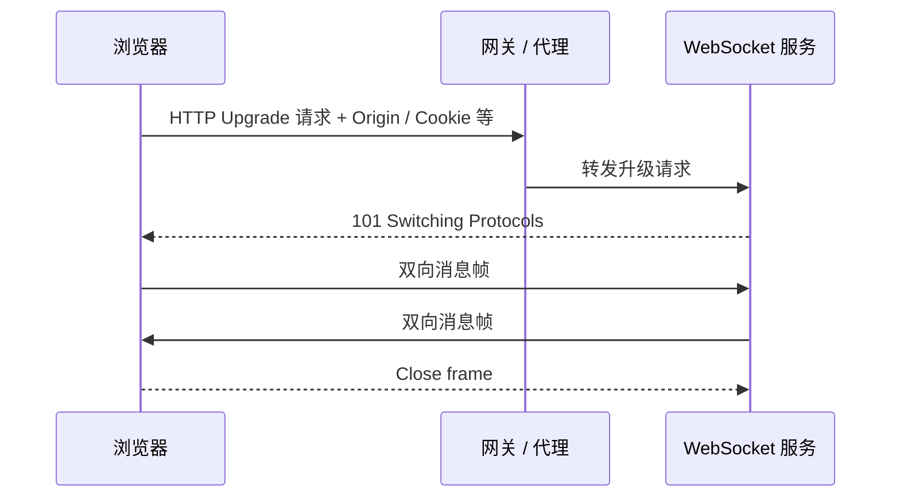
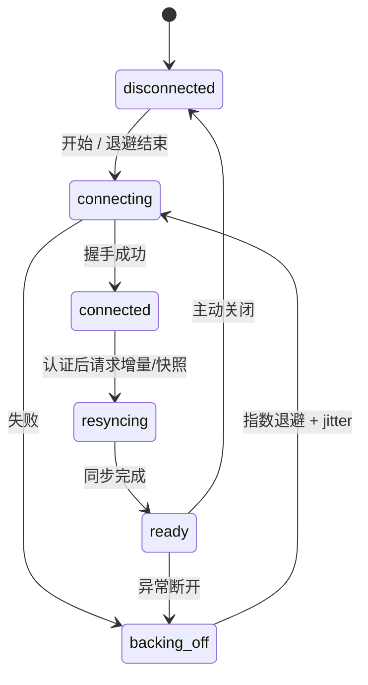
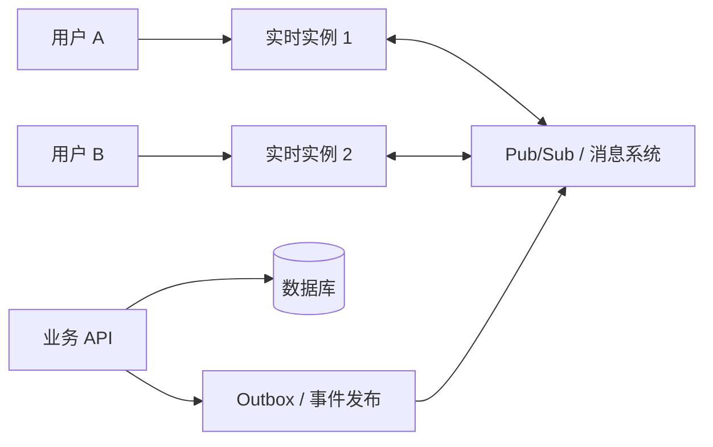

> **学完这一节，你应该能回答**
> - 轮询、长轮询、SSE、WebSocket 和 WebRTC 分别适合什么？
> - “保持长连接”为什么只是实时系统的开始？
> - 心跳、断线重连、补发、幂等、顺序和背压如何设计？
> - 多实例部署后，一条消息怎样找到连接在另一台服务器上的用户？

## 1. 先确认是否真的需要实时

“实时”不是毫秒越小越好，而是业务能接受的最大延迟：

| 场景 | 可接受延迟示例 | 合适起点 |
| --- | --- | --- |
| 后台报表状态 | 数秒到数十秒 | 普通轮询 |
| 新闻/监控更新 | 约一秒 | SSE 或短轮询 |
| 聊天消息 | 数百毫秒到数秒 | WebSocket / SSE + HTTP |
| 协同编辑 | 更低且双向频繁 | WebSocket + 冲突算法 |
| 音视频通话 | 极低延迟、点对点媒体 | WebRTC |

长连接会增加服务器连接数、状态、部署和恢复复杂度。如果每分钟更新一次，5～15 秒轮询可能比维护 WebSocket 更可靠、更便宜。

---

## 2. 几种通信方式

| 方式 | 方向 | 连接模型 | 优点 | 局限 |
| --- | --- | --- | --- | --- |
| 短轮询 | 客户端反复请求 | 每次独立 HTTP | 最简单、缓存与调试成熟 | 空请求多、延迟受间隔限制 |
| 长轮询 | 服务端等待到有数据或超时 | 响应后重新连接 | 兼容普通 HTTP | 连接反复建立、状态复杂 |
| SSE | 服务端持续向客户端推送文本事件 | 长 HTTP 响应 | 简单、自动重连、事件 ID | 浏览器原生主要单向，二进制不直接 |
| WebSocket | 双向消息帧 | 升级后的长连接 | 双向、低额外开销、文本/二进制 | 恢复、背压和扩容需自行设计 |
| WebRTC | 浏览器间实时媒体/数据 | 多种传输和协商 | 低延迟媒体、可点对点 | NAT 穿透、信令、TURN 和媒体复杂 |

选择协议前问：数据方向、频率、大小、可靠性、浏览器兼容、代理限制和基础设施能力。

---

## 3. 轮询并不低级

```js
async function pollJob(id, signal) {
  while (!signal.aborted) {
    const response = await fetch(`/api/jobs/${id}`, { signal });
    const job = await response.json();

    render(job);
    if (job.status === 'done' || job.status === 'failed') return;

    await new Promise(resolve => setTimeout(resolve, 2000));
  }
}
```

改进方向：

- 页面不可见时降低频率；
- 失败后指数退避而不是立即重试；
- 使用 ETag/条件请求减少响应；
- 服务端返回建议的下次查询时间；
- 完成后停止；
- 页面卸载或任务切换时取消。

轮询天然适配无状态 HTTP、负载均衡、缓存和普通监控。在低频场景里，它常是最稳妥方案。

---

## 4. SSE：服务器单向事件流

服务器返回 `text/event-stream`：

```text
id: 101
event: task-updated
data: {"taskId":"42","status":"done"}

id: 102
data: {"message":"heartbeat"}

```

空行结束一条事件。浏览器端：

```js
const source = new EventSource('/events');

source.addEventListener('task-updated', event => {
  const data = JSON.parse(event.data);
  updateTask(data);
});

source.onerror = () => {
  // EventSource 通常会自动尝试重连
};
```

SSE 的优点：

- 基于普通 HTTP 响应流；
- 浏览器自动重连；
- `id` 可帮助重连后从 `Last-Event-ID` 继续；
- 事件类型和文本格式简单；
- 适合通知、日志、状态流和生成内容。

注意：

- 原生 EventSource 自定义请求头能力有限；
- 代理可能缓冲响应，需关闭不合适缓冲并发送心跳；
- HTTP/1.x 对同源并发连接有限制，HTTP/2 情况不同；
- 服务端仍要处理断开和慢消费者；
- 客户端到服务端的命令通常继续用普通 HTTP。

---

## 5. WebSocket 的连接过程

浏览器先通过 HTTP 发起握手，服务器同意后升级协议：



客户端：

```js
const socket = new WebSocket('wss://example.com/realtime', ['app.v1']);

socket.addEventListener('open', () => {
  socket.send(JSON.stringify({ type: 'subscribe', channel: 'tasks' }));
});

socket.addEventListener('message', event => {
  const message = JSON.parse(event.data);
  handleMessage(message);
});

socket.addEventListener('close', event => {
  console.log(event.code, event.reason);
});
```

生产环境使用 `wss://`，类似 HTTPS。反向代理必须正确支持 Upgrade 和长连接超时。

---

## 6. 建立连接不等于已经同步

连接可能在任何时刻中断：Wi-Fi 切换、手机休眠、代理超时、服务器重启、发布滚动更新。

可靠客户端状态机：



重连成功只表示有了新通道，断线期间的消息仍可能丢失。必须通过序列号、游标或重新获取快照恢复业务状态。

---

## 7. 消息协议也需要契约

不要只发送含义模糊的字符串：

```json
{
  "version": 1,
  "type": "task.updated",
  "messageId": "evt_01J...",
  "sequence": 1832,
  "occurredAt": "2026-09-07T09:00:00Z",
  "data": {
    "taskId": "task_42",
    "revision": 7,
    "status": "done"
  }
}
```

常见字段：

- 类型和协议版本；
- 消息/事件唯一 ID；
- 会话、频道或资源标识；
- 顺序号、游标或资源 revision；
- 发生时间与发送时间；
- payload schema；
- 错误码和关联请求 ID。

接收方要验证消息类型、大小和字段。客户端版本落后时，服务端应有兼容窗口或明确要求升级。

---

## 8. 命令、事件与响应

区分三种消息有助于设计：

| 类别 | 含义 | 示例 |
| --- | --- | --- |
| Command | 请求系统执行某动作，可能失败 | `task.complete` |
| Event | 某件事已经发生的事实 | `task.completed` |
| Reply/Ack | 对命令接收或处理结果的回应 | `command.accepted`、`command.failed` |

事件名称通常使用过去式，不能被“撤回”；新变化以另一个事件表达。

只收到传输层 ACK 不等于业务完成。客户端需要知道消息是：刚到网关、已排队、已持久化，还是业务处理成功。

---

## 9. 消息交付语义

| 语义 | 意味着什么 | 应用需要做什么 |
| --- | --- | --- |
| At-most-once | 最多一次，可能丢 | 接受丢失或主动重新获取 |
| At-least-once | 至少一次，可能重复 | 幂等处理和去重 |
| Effectively-once | 通过去重/事务使业务效果看似一次 | 维护唯一 ID、状态和原子写入 |

端到端“恰好一次”很难：消息可能在服务端成功提交后、确认返回前断线。重试会产生重复，不重试会产生丢失。

常见方案：

- 客户端为命令生成稳定 ID；
- 服务端在唯一约束下记录已处理 ID；
- 处理结果与去重记录在同一事务提交；
- 重复命令返回先前结果；
- 事件消费者按 event ID 去重。

幂等不是简单忽略所有重复；要定义同一 ID 携带不同内容时如何处理。

---

## 10. 顺序不是天然全局存在

一条 TCP/WebSocket 连接上的字节有序，不代表：

- 重连前后有序；
- 多个服务器产生的事件全局有序；
- 数据库提交顺序等于用户看到顺序；
- 不同频道之间有意义的顺序；
- 客户端异步处理完成顺序一致。

可使用：

- 每个资源 revision；
- 每个频道单调 sequence；
- 服务端时间 + ID 作为展示排序，但不代表因果；
- 乐观并发控制；
- CRDT/OT 等协同算法处理真正并发编辑。

不要把客户端本地时钟当作绝对顺序依据。

---

## 11. 心跳、半开连接与超时

网络中断后，一端可能暂时不知道连接已经失效。需要心跳和空闲超时：

```text
服务端 ping → 客户端 pong
若连续多次未回应 → 关闭并释放资源
```

浏览器 WebSocket API 不直接暴露协议级 ping/pong 给页面代码时，应用可发送业务心跳消息。

心跳间隔要平衡：

- 太频繁：耗电、流量和服务器工作增加；
- 太稀疏：故障发现慢，代理可能先断开；
- 所有客户端同一时刻心跳：形成周期性尖峰，可加入 jitter。

服务端要在连接关闭、认证过期和部署退出时清理订阅、计时器和 presence 状态。

---

## 12. 重连退避

服务器故障时，百万客户端立即每 100ms 重连会形成重连风暴。

```text
延迟 ≈ min(上限, 基础值 × 2^尝试次数) + 随机抖动
```

策略：

- 指数退避；
- 加随机 jitter；
- 成功稳定一段时间后重置计数；
- 服务端可提供重试建议；
- 离线时等待网络恢复；
- 身份失效不要无限重连，应进入重新登录流程。

重连后携带最后游标，服务端若无法补齐历史，则返回“需要完整快照”。

---

## 13. 背压与慢消费者

若消息到达比客户端处理快：

- 浏览器缓冲增长；
- 主线程 CPU 达到 100%；
- 页面卡死或内存耗尽。

经典浏览器 `WebSocket` API 不提供完整自动背压机制，可以观察 `bufferedAmount` 控制发送端，但接收端仍需设计。

常见策略：

- 合并可覆盖的状态更新，只保留最新值；
- 对必须保留的事件设有界队列；
- 批量传输和处理；
- 降低订阅粒度；
- 慢到阈值时断开并要求通过快照恢复；
- 对大数据使用流式或其他支持背压的协议。

服务端也要限制每个连接的发送队列。不能让一个慢用户占用无限内存。

---

## 14. 认证与授权

连接建立时：

- 使用 WSS；
- 验证 Session/Token；
- 检查 `Origin`，因为 WebSocket 不走完整 Fetch CORS 流程；
- 限制消息和握手大小；
- 记录连接主体与租户。

连接建立后：

- 每个订阅和命令继续授权；
- 不允许客户端任意订阅 `user:another-id`；
- 权限或账户状态变化时撤销订阅或断开；
- 长连接中的 token 过期要有重新认证策略；
- 对消息频率和资源使用限速；
- 日志不记录完整 token 和敏感消息体。

把 token 放 WebSocket URL 会进入代理和服务日志，应优先使用安全 Cookie、受支持的协议/首条认证消息或短期单用途票据，并结合架构评估。

---

## 15. 多实例扩展

用户 A 连接到实例 1，用户 B 连接到实例 2。实例 1 处理新消息后，必须把事件传到实例 2：



关键问题：

- 连接目录存在哪里；
- 事件先写数据库还是先广播；
- 发布失败如何补偿；
- 消息系统是否可能重复或乱序；
- 新实例加入和旧实例优雅退出；
- 一个房间有十万订阅者时如何扇出；
- 跨地域延迟与数据所有权。

Outbox 模式可把业务数据与待发布事件写入同一数据库事务，再由发布器可靠发送，降低“数据库成功但广播丢失”的窗口。

---

## 16. Presence 为什么特别难

“在线”不是一个瞬时真相：

- 手机切后台但连接暂存；
- 网络断开，服务器尚未超时；
- 同一用户多个标签页和设备；
- 服务器部署迁移连接；
- 心跳延迟。

更诚实的模型常是：

```text
lastSeenAt: 最近确认活动时间
status: online / idle / offline（带近似性）
connections: 当前已知连接集合
```

对外展示“5 分钟前活跃”通常比承诺绝对在线更符合分布式现实。

---

## 17. 测试与可观测性

至少测试：

- 握手成功和认证失败；
- 无权订阅被拒绝；
- 消息 schema 错误和超大消息；
- 重复、乱序和断线补发；
- 服务端重启与滚动发布；
- 慢客户端和队列上限；
- token 过期和权限撤销；
- 大量连接同时重连；
- 多实例消息传递。

关键指标：

- 当前连接数、连接/断开速率；
- 握手失败原因；
- 消息吞吐、大小和处理延迟；
- 每连接缓冲与被丢弃消息；
- 重连次数和补发差距；
- Pub/Sub 延迟与失败；
- 按租户和消息类型的资源使用。

---

## 18. 常见误区

| 误区 | 正确认识 |
| --- | --- |
| WebSocket 一定比 HTTP 快 | 低频场景连接管理成本可能更高 |
| 连接没触发 close 就一定在线 | 半开连接需要心跳和超时发现 |
| TCP 有序，所以业务事件全局有序 | 多连接、重连、多服务和并发提交会破坏全局顺序 |
| 自动重连就不会丢消息 | 必须有游标、历史或完整快照恢复 |
| 服务器 send 成功等于用户看见 | 可能只进入本地缓冲，业务确认层次需定义 |
| Sticky Session 能解决全部扩容 | 它不解决跨实例广播、故障转移和业务事件一致性 |
| SSE 是低配 WebSocket | 单向 HTTP 事件流在许多场景更简单可靠 |

## 小练习

为任务应用设计实时更新协议：普通修改走 HTTP，服务器通过 SSE 或 WebSocket 推送 `task.updated`。定义事件 ID、资源 revision、断线游标、完整快照接口、重复处理和无权订阅时的行为。

## 延伸阅读

- [2.9 异步、事件循环与 Promise](/blog/2-9-异步-事件循环与-promise)
- [4.5 Redis、缓存与数据一致性](/blog/4-5-redis-缓存与数据一致性)
- [6.2 扩容、负载均衡与高可用](/blog/6-2-扩容-负载均衡与高可用)
- [MDN：WebSocket](https://developer.mozilla.org/zh-CN/docs/Web/API/WebSocket)
- [MDN：Using server-sent events](https://developer.mozilla.org/zh-CN/docs/Web/API/Server-sent_events/Using_server-sent_events)
- [WebSockets Standard](https://websockets.spec.whatwg.org/)
