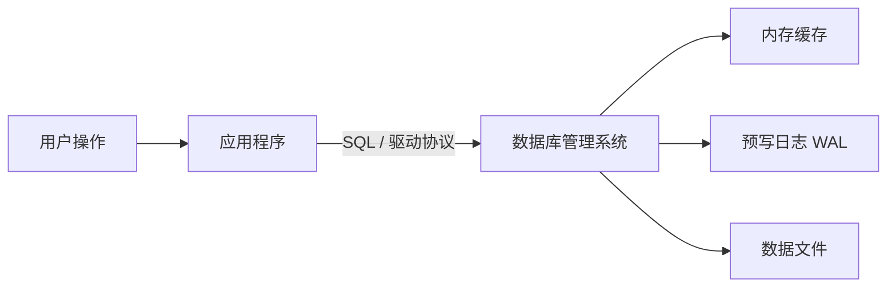
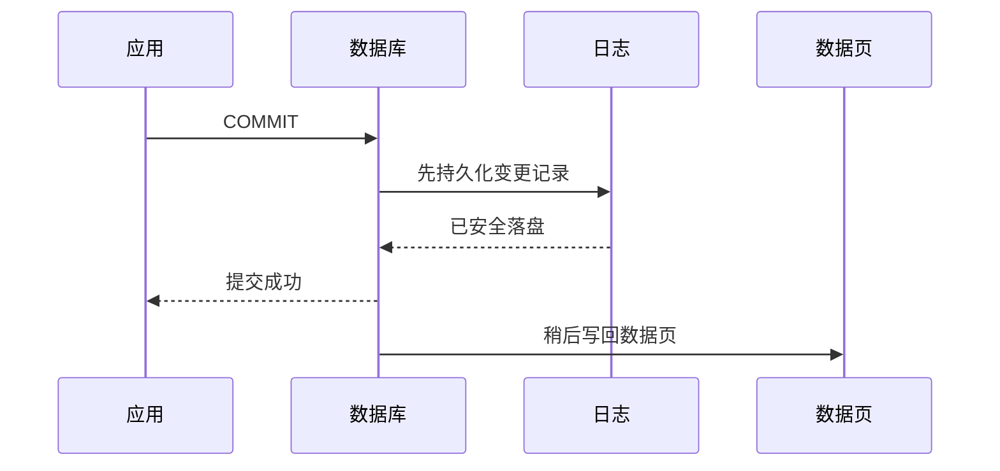
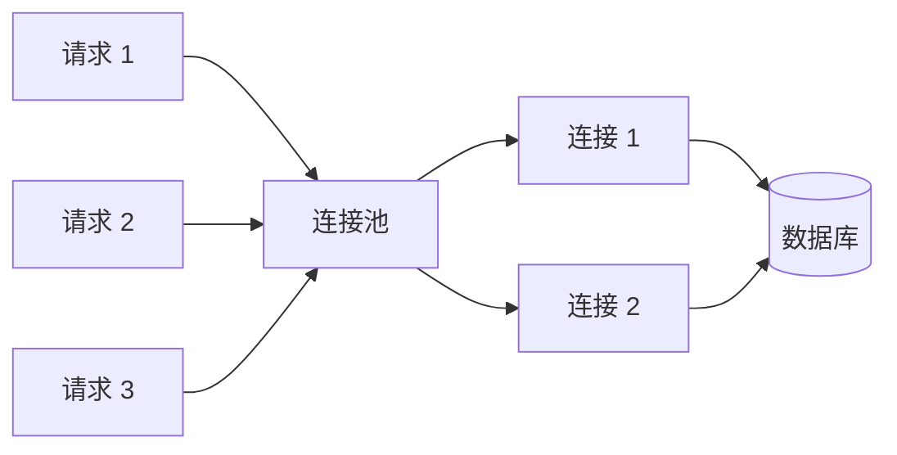

> **学完这一篇，你应该能回答**
> - 数据库与 Excel、JSON 文件有什么本质区别？
> - 数据库管理系统替应用承担了哪些工作？
> - 关系型、文档型、键值型数据库分别适合什么问题？
> - “备份”“复制”“缓存”为什么不是一回事？

---

## 1. 先区分三个概念

日常交流中，“数据库”常常混指三件事：

| 概念 | 含义 | 例子 |
|---|---|---|
| 数据（data） | 被保存的事实 | 用户名、订单金额、文章内容 |
| 数据库（database） | 按某种结构组织起来的一组数据 | 一个电商系统的用户、商品和订单数据 |
| 数据库管理系统（DBMS） | 管理数据库的软件 | PostgreSQL、MySQL、SQLite、MongoDB |

应用通常不直接修改磁盘上的数据库文件，而是向 DBMS 发出命令。DBMS 负责查找、修改、并发控制、权限、持久化和故障恢复。



数据库不是“能装数据的文件夹”，而是一套围绕数据建立的管理机制。

---

## 2. 为什么不直接把数据写进 JSON 文件

一个只有自己使用、数据量很小的脚本，写 JSON 文件完全合理。问题出现在系统开始同时面对多个用户和多个请求时。

假设两个请求同时给同一个账户扣款：

1. 请求 A 读到余额 100 元；
2. 请求 B 也读到余额 100 元；
3. A 扣除 30，写回 70；
4. B 扣除 20，也写回 80。

最终余额是 80 元，但正确结果应当是 50 元。两个操作互相覆盖，称为**丢失更新**。

一个成熟的 DBMS 通常会处理以下问题：

- **查询**：不用把全部数据读入内存再逐条检查；
- **并发**：多个请求同时读写时，结果仍尽可能正确；
- **事务**：一组操作要么全部成功，要么全部失败；
- **约束**：不允许重复邮箱、无效外键等脏数据进入系统；
- **恢复**：进程崩溃或机器断电后，能够恢复到一致状态；
- **权限**：不同账户只能执行被授权的操作；
- **索引**：用额外空间换取查询速度；
- **备份与复制**：降低误删和硬件故障造成的损失。

因此，数据库的核心价值不是“存得多”，而是**在变化、并发和故障存在时，仍然可靠地管理共享状态**。

---

## 3. 数据库里的数据最终放在哪里

以典型的磁盘型关系数据库为例：

1. 数据按固定大小的**页（page）**组织在磁盘文件中；
2. 常用页面会缓存在内存中，减少慢速磁盘访问；
3. 修改数据时，系统通常先记录**预写日志（WAL）**，再择机把数据页写回磁盘；
4. 崩溃重启后，数据库可根据日志重放已经提交的操作。



这只是简化模型，但它解释了一个重要现象：应用收到“提交成功”时，并不一定意味着所有目标数据页都已经改写；关键是数据库已有足够信息在故障后恢复。

> **> WAL 的具体实现因数据库而异。理解“先有可恢复的日志，再确认事务”比记住某个产品的内部细节更重要。**

---

## 4. 最常见的数据库类型

### 4.1 关系型数据库

数据放在有明确列定义的表中，表与表之间通过键建立关系，通常使用 SQL。

```text
users                 orders
------------------    -----------------------
id | name | email     id | user_id | amount
```

适合：订单、账户、库存、企业系统等结构相对稳定、关系复杂、正确性要求高的业务。

代表：PostgreSQL、MySQL、SQLite、SQL Server。

### 4.2 文档数据库

一条记录通常是一个类似 JSON 的文档，可以嵌套不同结构。

```json
{
  "id": 42,
  "title": "数据库入门",
  "tags": ["database", "backend"],
  "author": { "id": 7, "name": "Lin" }
}
```

适合：天然以完整文档读写、字段变化较多、跨文档关系不复杂的业务。

代表：MongoDB、Couchbase。

### 4.3 键值数据库

通过唯一键直接获取值，接口接近“给我这个键对应的内容”。

```text
session:8f31...  ->  { userId: 42, expiresAt: ... }
```

适合：缓存、会话、限流计数、临时状态。

代表：Redis、DynamoDB 的部分使用模式。

### 4.4 其他专用数据库

- **图数据库**：擅长多跳关系，如社交关系和知识图谱；
- **时序数据库**：擅长带时间戳的连续指标；
- **搜索引擎**：擅长全文检索、相关性排序和聚合分析；
- **列式分析数据库**：擅长扫描大量数据做统计，而不是频繁修改单条记录。

数据库类型并非互斥。一套系统可以用 PostgreSQL 保存核心业务数据，用 Redis 做缓存，用搜索引擎做全文检索。但每增加一种存储，都会增加部署、备份、监控和数据一致性的成本。

---

## 5. OLTP 与 OLAP：两种不同负载

| 维度 | OLTP：在线事务处理 | OLAP：在线分析处理 |
|---|---|---|
| 典型问题 | “创建一笔订单” | “过去一年各地区销量如何” |
| 操作特点 | 高频、短小、读写少量行 | 低频但扫描和聚合大量数据 |
| 关注点 | 延迟、一致性、并发 | 吞吐量、压缩、分析能力 |
| 常见存储 | 行式关系数据库 | 数据仓库、列式数据库 |

不要因为分析查询“也能跑”就直接压在生产交易库上。一个扫描数亿行的报表，可能占满 CPU、内存和 I/O，影响用户下单。

---

## 6. 应用如何连接数据库

应用通过数据库驱动建立网络连接，并使用相应协议发送请求。建立连接往往需要身份验证和资源分配，成本不低，所以服务端通常维护**连接池**：



连接池不是越大越好。数据库能同时高效执行的工作有限，过多连接会增加内存占用和上下文切换。常见做法是设置合理的池大小、获取连接超时，并监控等待时间。

SQLite 是一个特殊而实用的例子：它通常以库的形式嵌入应用，直接访问本地数据库文件，不需要独立服务器。它非常适合本地应用、原型和中小型单机服务，但并不等于“简陋的 PostgreSQL”。

---

## 7. Schema 与迁移

**Schema（模式）**描述数据的结构和规则，例如有哪些表、每列是什么类型、哪些列不能为空、哪些列需要唯一。

随着产品演进，结构也会变化：

```text
第一版：users(id, name)
第二版：users(id, name, email)
第三版：email 必须唯一
```

将一次结构变化写成可追踪、可重复执行的脚本，称为**数据库迁移（migration）**。生产迁移要考虑：

- 老版本应用能否暂时兼容新结构；
- 大表改列是否长时间锁表；
- 新列的历史数据如何回填；
- 失败后如何继续或回滚；
- 应用发布与数据库变更的顺序。

安全的演进通常遵循“先扩展、再迁移、最后收缩”：先添加兼容结构，逐步切换读写，确认无误后再删除旧结构。

---

## 8. 备份、复制和缓存不是一回事

| 机制 | 主要目的 | 不能替代什么 |
|---|---|---|
| 备份（backup） | 从误删、逻辑损坏、灾难中恢复历史数据 | 不能直接提供低延迟高可用 |
| 复制（replication） | 保存实时或近实时副本，提高可用性或读能力 | 主库误删可能也会复制过去，不等于备份 |
| 缓存（cache） | 保存可重新生成的热点数据，提高访问速度 | 不应默认成为唯一可信数据源 |

只有真正演练过恢复过程的备份，才算可信的备份。一个从未恢复测试过的备份文件，只能算“希望”。

---

## 9. 怎样选择第一款数据库

对于大多数普通 Web 项目，可以先问：

1. 数据之间是否有明确关系？
2. 是否需要事务和强约束？
3. 查询方式是否会不断变化？
4. 团队是否熟悉其备份、升级和监控？
5. 预期瓶颈有真实数据支撑，还是只是假设？

如果没有明显的特殊需求，成熟的关系型数据库通常是稳妥起点。关系型数据库不仅能存表，也普遍支持 JSON、全文检索、空间数据等能力。先用一个可靠系统把业务模型做对，往往比过早拼装多种数据库更重要。

---

## 10. 常见误区

> **“数据库慢，所以加 Redis”**
> 慢可能来自缺少索引、一次返回太多数据、N+1 查询、锁等待或连接池耗尽。缓存会增加一致性问题，应该先定位瓶颈。

> **“有副本就不需要备份”**
> 误删、错误脚本和勒索软件可能同时影响副本。备份要有独立保留周期，并定期演练恢复。

> **“NoSQL 一定比 SQL 可扩展”**
> 扩展能力来自具体系统、数据模型和访问模式，不来自名字。错误的数据模型在任何数据库里都会付出代价。

---

## 11. 本章路线

接下来会依次回答：

1. [如何声明式地查询关系数据](/blog/4-1-sql-与关系模型)；
2. [如何把现实业务变成可靠的数据模型](/blog/4-2-表-主键-外键与数据建模)；
3. [索引如何用空间换时间](/blog/4-3-索引为什么能加速查询)；
4. [并发修改如何保持正确](/blog/4-4-事务-并发与隔离级别)；
5. [缓存如何提速，又会引入什么问题](/blog/4-5-redis-缓存与数据一致性)；
6. [什么时候应当选择其他数据模型](/blog/4-6-nosql-什么时候有价值)。

---

## 延伸阅读

- [PostgreSQL：Tutorial](https://www.postgresql.org/docs/current/tutorial.html)
- [PostgreSQL：Database Physical Storage](https://www.postgresql.org/docs/current/storage.html)
- [SQLite：When To Use SQLite](https://www.sqlite.org/whentouse.html)
