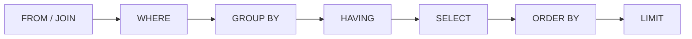
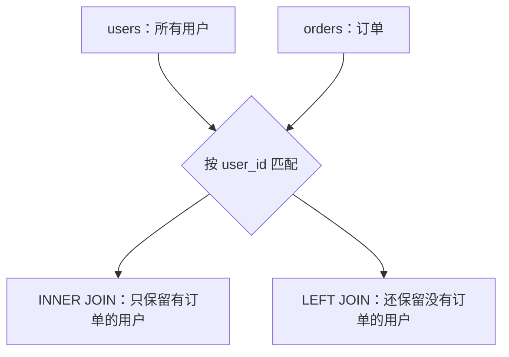

> **学完这一篇，你应该能**
> - 理解表、行、列背后的关系模型；
> - 写出常见的查询、连接、分组和修改语句；
> - 正确处理 `NULL`、排序和聚合；
> - 明白为什么参数化查询和查询计划很重要。

---

## 1. 关系模型不只是“用表格存数据”

关系模型把数据表示为一组**关系（relation）**。在工程中，关系通常表现为表：

- 一行是一个元组（tuple），代表一条事实；
- 一列是一个属性（attribute）；
- 每列有自己的取值范围和类型；
- 表中的行在逻辑上没有固定顺序；
- 表之间可以通过键建立联系。

假设有三张表：

```text
users                         courses
id | name  | email            id | title
---+-------+----------------   ---+-------------
 1 | 小林  | lin@example.com    7 | 数据库入门

enrollments
user_id | course_id | progress
--------+-----------+---------
      1 |         7 |       65
```

`enrollments` 表表达“用户参加课程”这段关系。它让用户和课程可以各自独立存在，又能建立多对多联系。

---

## 2. SQL 是声明式语言

SQL 的重要特点是：你描述**想要什么结果**，数据库决定**怎样得到结果**。

```sql
SELECT name, email
FROM users
WHERE created_at >= DATE '2026-01-01'
ORDER BY created_at DESC
LIMIT 20;
```

这条语句没有规定数据库应先扫描哪个索引、采用什么连接算法或如何读取磁盘页。优化器会根据统计信息和可用索引生成执行计划。

这与手写循环形成对比：循环通常明确描述每一步怎么做；SQL 更像提交一份结果规格。

> **> SQL 有标准，但不同数据库在数据类型、函数、分页、JSON 和建表语法上存在差异。学习时先掌握共同模型，再查具体数据库文档。**

---

## 3. 一条查询的基本组成

```sql
SELECT id, title, price
FROM products
WHERE status = 'on_sale' AND price < 100
ORDER BY price ASC, id ASC
LIMIT 20;
```

| 子句 | 作用 |
|---|---|
| `SELECT` | 指定返回哪些表达式或列 |
| `FROM` | 指定数据来源 |
| `WHERE` | 过滤行 |
| `ORDER BY` | 定义结果顺序 |
| `LIMIT` | 限制返回数量 |

不要依赖数据库“碰巧”返回的顺序。没有 `ORDER BY`，结果顺序就没有保证，可能因索引、并发或数据库升级而改变。

尽量避免长期使用 `SELECT *`：它会多传数据、使接口依赖表的全部列，也容易在新增大字段后引发性能变化。

---

## 4. SQL 的逻辑处理顺序

SQL 的书写顺序与概念上的处理顺序不同。简化后的逻辑顺序是：



这解释了为什么很多数据库不能在同一层的 `WHERE` 中直接使用 `SELECT` 刚定义的别名：执行过滤时，那个别名在逻辑上还不存在。

---

## 5. `NULL` 不是空字符串，也不是 0

`NULL` 表示“缺失、未知或不适用”。因为它表示未知，SQL 比较会出现第三种逻辑结果：`UNKNOWN`。

```sql
-- 错误：不会找到 NULL
SELECT * FROM users WHERE phone = NULL;

-- 正确
SELECT * FROM users WHERE phone IS NULL;
SELECT * FROM users WHERE phone IS NOT NULL;
```

若 `discount` 是 `NULL`：

```sql
discount > 0       -- UNKNOWN
discount = 0       -- UNKNOWN
NOT (discount = 0) -- 仍是 UNKNOWN
```

`WHERE` 只保留条件为 `TRUE` 的行。因此，允许 `NULL` 会影响查询、唯一约束、排序和聚合，建模时必须明确它代表什么。

可以用 `COALESCE` 返回第一个非空值：

```sql
SELECT COALESCE(nickname, name, '匿名用户') AS display_name
FROM users;
```

---

## 6. JOIN：沿着关系组合数据

### 6.1 INNER JOIN

只保留两边能够匹配的行：

```sql
SELECT o.id, u.name, o.amount
FROM orders AS o
JOIN users AS u ON u.id = o.user_id;
```

### 6.2 LEFT JOIN

保留左表所有行；右侧没有匹配时，右侧列为 `NULL`：

```sql
SELECT u.id, u.name, o.id AS order_id
FROM users AS u
LEFT JOIN orders AS o ON o.user_id = u.id;
```



一个常见陷阱是把右表条件放进 `WHERE`，无意中把 `LEFT JOIN` 变成类似 `INNER JOIN` 的效果：

```sql
-- 没有已支付订单的用户也会被过滤掉
SELECT u.id, o.id
FROM users u
LEFT JOIN orders o ON o.user_id = u.id
WHERE o.status = 'paid';

-- 如果希望保留所有用户，应把条件放在连接条件中
SELECT u.id, o.id
FROM users u
LEFT JOIN orders o
  ON o.user_id = u.id AND o.status = 'paid';
```

---

## 7. 聚合：把多行归纳成结果

常见聚合函数包括 `COUNT`、`SUM`、`AVG`、`MIN`、`MAX`。

```sql
SELECT user_id,
       COUNT(*) AS order_count,
       SUM(amount) AS total_amount
FROM orders
WHERE status = 'paid'
GROUP BY user_id
HAVING SUM(amount) >= 1000;
```

- `WHERE` 在分组前过滤原始行；
- `GROUP BY` 把行分组；
- 聚合函数针对每组计算；
- `HAVING` 在分组后过滤聚合结果。

注意 `COUNT(*)` 统计行数，`COUNT(column)` 只统计该列非 `NULL` 的行。

---

## 8. 修改数据

### 插入

```sql
INSERT INTO users (name, email)
VALUES ('小林', 'lin@example.com')
RETURNING id;
```

### 更新

```sql
UPDATE users
SET name = '林同学', updated_at = CURRENT_TIMESTAMP
WHERE id = 42;
```

### 删除

```sql
DELETE FROM sessions
WHERE expires_at < CURRENT_TIMESTAMP;
```

> **> `UPDATE` 或 `DELETE` 忘记写 `WHERE`，可能修改整张表。执行重要修改前，先用相同条件运行 `SELECT` 检查目标行，并在事务中操作。**

多步修改需要放入事务，详见 [4.4 事务、并发与隔离级别](/blog/4-4-事务-并发与隔离级别)。

---

## 9. 子查询与 CTE

子查询把一个查询的结果交给另一个查询：

```sql
SELECT name
FROM users
WHERE id IN (
  SELECT user_id
  FROM orders
  WHERE amount >= 1000
);
```

CTE（Common Table Expression）用 `WITH` 给中间结果命名，适合提升复杂查询的可读性：

```sql
WITH paid_totals AS (
  SELECT user_id, SUM(amount) AS total
  FROM orders
  WHERE status = 'paid'
  GROUP BY user_id
)
SELECT u.name, p.total
FROM paid_totals p
JOIN users u ON u.id = p.user_id
WHERE p.total >= 1000;
```

CTE 不天然等于“更快”。最终性能取决于数据库版本、优化器决策和具体查询。

---

## 10. 窗口函数：保留明细，同时做跨行计算

普通 `GROUP BY` 会把多行折叠成一行；窗口函数不会。

```sql
SELECT
  user_id,
  id AS order_id,
  amount,
  SUM(amount) OVER (
    PARTITION BY user_id
    ORDER BY created_at
  ) AS running_total
FROM orders;
```

它可以用于排名、累计值、移动平均，以及“每组取最新一条”等问题：

```sql
SELECT *
FROM (
  SELECT o.*,
         ROW_NUMBER() OVER (
           PARTITION BY user_id
           ORDER BY created_at DESC
         ) AS rn
  FROM orders o
) ranked
WHERE rn = 1;
```

---

## 11. 参数化查询：不要拼接用户输入

下面的伪代码有 SQL 注入风险：

```text
sql = "SELECT * FROM users WHERE email = '" + input + "'"
```

应使用数据库驱动提供的参数绑定：

```sql
SELECT id, name FROM users WHERE email = $1;
```

参数的值与 SQL 结构分开传输，数据库不会把用户输入重新解释为 SQL 语法。参数化是防注入的基础，而“手动替换引号”并不可靠。参见 [3.6 Web 安全基础](/blog/3-6-web-安全基础)。

---

## 12. 查询计划：数据库到底准备怎么查

同一条 SQL 可能有多种执行方式：

- 顺序扫描整张表；
- 使用索引找到少量行；
- 先过滤 A 表再连接 B 表；
- 使用嵌套循环、哈希连接或归并连接；
- 在内存中排序，或利用索引顺序。

在 PostgreSQL 中，可以查看计划：

```sql
EXPLAIN
SELECT * FROM orders WHERE user_id = 42;

EXPLAIN (ANALYZE, BUFFERS)
SELECT * FROM orders WHERE user_id = 42;
```

`EXPLAIN ANALYZE` 会真正执行语句。不要随意对会修改数据的语句或生产环境中的重查询使用它。

计划中的“成本”通常是优化器内部的相对估计，不直接等于毫秒。分析时应同时看：

- 估计行数与实际行数是否相差很大；
- 时间花在哪里；
- 读取了多少页面；
- 是否出现不必要的全表扫描或排序；
- 查询本身是否返回了过多数据。

索引原理详见 [4.3 索引为什么能加速查询](/blog/4-3-索引为什么能加速查询)。

---

## 13. 三个常见性能问题

### N+1 查询

先查出 100 篇文章，再为每篇文章单独查询作者，会产生 101 次往返。通常可以用一次 JOIN、批量 `IN` 查询或 ORM 的预加载解决。

### 深分页

```sql
SELECT * FROM posts ORDER BY id LIMIT 20 OFFSET 1000000;
```

数据库往往仍需要找到并跳过前面的大量记录。连续翻页更适合使用游标或键集分页：

```sql
SELECT * FROM posts
WHERE id > $last_seen_id
ORDER BY id
LIMIT 20;
```

### 应用层重复加工

把全部数据拉到应用再过滤、排序和聚合，常常浪费网络与内存。能清晰、安全地交给数据库完成的集合运算，通常应尽量在数据库中完成。

---

## 14. 小结

SQL 的难点不在背关键字，而在建立集合思维：

1. 先明确结果中“一行代表什么”；
2. 再确定需要哪些表和连接条件；
3. 在正确阶段过滤、分组和排序；
4. 用约束和参数化保证正确与安全；
5. 用实际执行计划验证性能，而不是凭感觉改写语句。

---

## 延伸阅读

- [PostgreSQL：The SQL Language](https://www.postgresql.org/docs/current/tutorial-sql.html)
- [PostgreSQL：Queries](https://www.postgresql.org/docs/current/queries.html)
- [PostgreSQL：Using EXPLAIN](https://www.postgresql.org/docs/current/using-explain.html)
- [OWASP：SQL Injection Prevention Cheat Sheet](https://cheatsheetseries.owasp.org/cheatsheets/SQL_Injection_Prevention_Cheat_Sheet.html)
