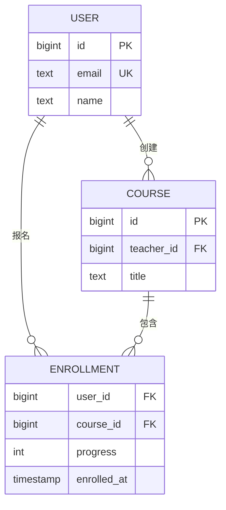
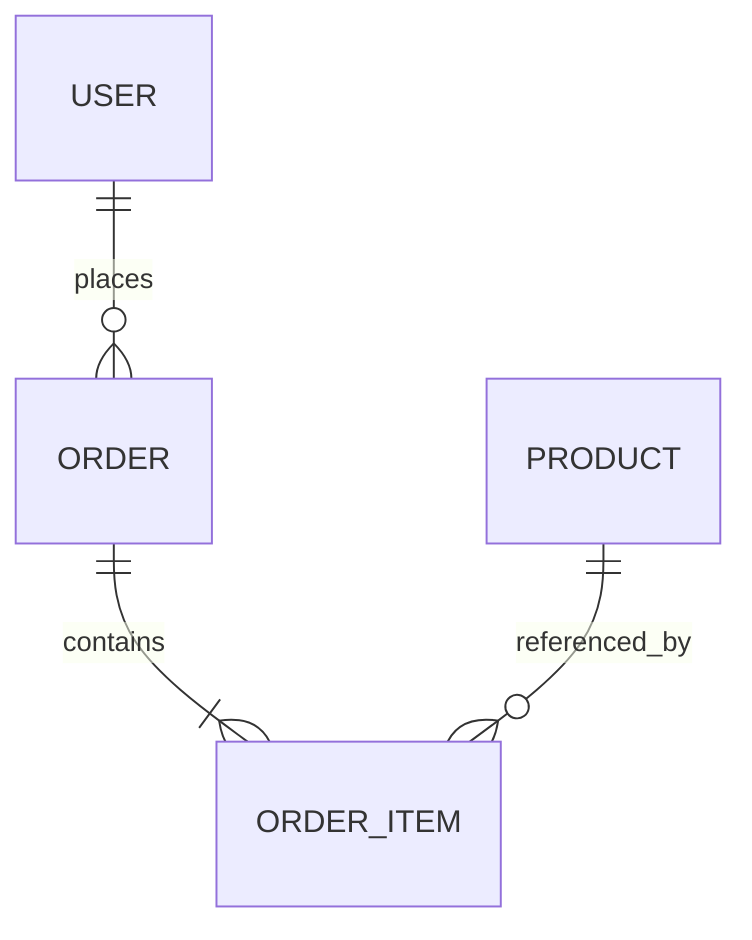
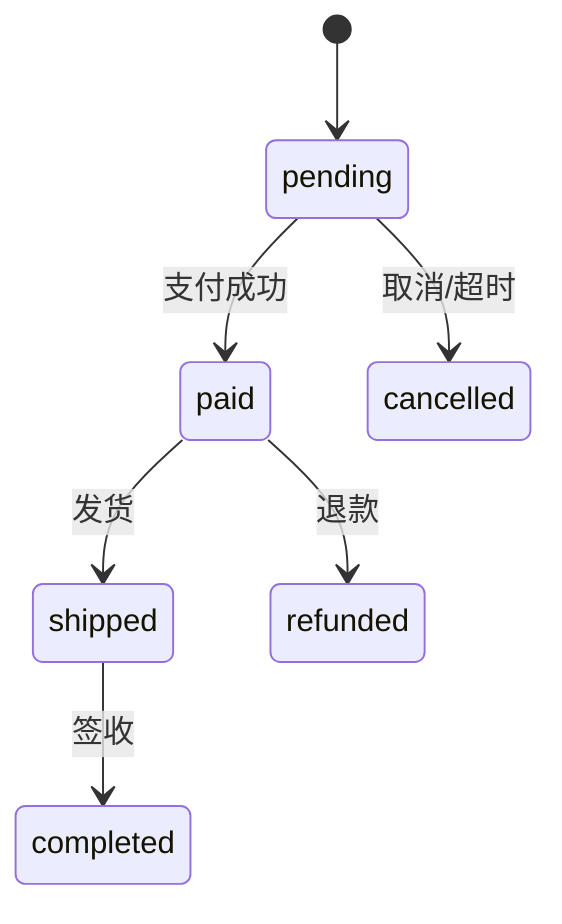

> **学完这一篇，你应该能**
> - 从业务中的实体、关系和规则设计基本表结构；
> - 区分主键、唯一约束和外键；
> - 理解一对一、一对多、多对多关系如何落到表中；
> - 知道规范化、反规范化和 Schema 迁移的取舍。

---

## 1. 数据建模是在保存“事实与规则”

一张表不是某个页面的字段集合。页面会改版，数据模型应该表达相对稳定的业务事实。

以在线课程为例：

- 用户可以注册；
- 课程由教师发布；
- 用户可以报名多门课程；
- 一门课程也有多个学员；
- 每次报名有自己的进度和报名时间。

先把名词和关系画出来：



好的模型不仅能保存当前页面需要展示的内容，还应尽量阻止不可能或无效的状态。

---

## 2. 从用例和不变量开始

建表前先写下核心用例：

- 通过邮箱查找用户；
- 查询某个用户报名的课程；
- 查询某门课程的所有学员；
- 更新学习进度；
- 防止同一用户重复报名同一课程。

再写下必须始终成立的**不变量（invariant）**：

- 用户邮箱不能重复；
- 进度必须在 0 到 100 之间；
- 报名记录必须指向真实用户和课程；
- 同一用户和课程最多只有一条报名记录。

这些规则应尽可能下沉到数据库约束，因为应用可能有多个版本、后台脚本和管理工具，仅靠某个前端表单校验守不住所有入口。

---

## 3. 主键：稳定地标识一行

**主键（Primary Key）**要求值唯一且非空，用来标识一行。

```sql
CREATE TABLE users (
  id BIGINT GENERATED ALWAYS AS IDENTITY PRIMARY KEY,
  email TEXT NOT NULL UNIQUE,
  name TEXT NOT NULL
);
```

### 自然键与代理键

| 类型 | 含义 | 例子 | 取舍 |
|---|---|---|---|
| 自然键 | 业务本身已有的标识 | 身份证号、国家代码 | 有语义，但可能变化、敏感或格式复杂 |
| 代理键 | 专门生成、无业务含义 | 自增整数、UUID | 稳定、引用方便，但仍需额外约束业务唯一性 |

邮箱不适合作为用户主键：用户可能换邮箱，邮箱还属于敏感信息。更常见的设计是用稳定的代理键作主键，同时给邮箱加唯一约束。

UUID 便于多节点独立生成，也不连续暴露业务量；整数键较短、索引紧凑、容易阅读。应根据系统需求选择，不要把其中任何一种当作普遍真理。

---

## 4. 唯一约束：表达业务唯一性

```sql
ALTER TABLE users
ADD CONSTRAINT users_email_unique UNIQUE (email);
```

如果唯一性由多个字段共同决定，可以使用复合唯一约束：

```sql
CREATE TABLE enrollments (
  user_id BIGINT NOT NULL,
  course_id BIGINT NOT NULL,
  progress INTEGER NOT NULL DEFAULT 0,
  UNIQUE (user_id, course_id)
);
```

先查询“有没有重复”，再插入，不能在并发下保证唯一：两个请求可能同时查询到不存在，然后都插入。数据库唯一约束才是最终防线；应用捕获冲突后再返回友好提示。

> **> 不同数据库对唯一约束中的 `NULL` 处理可能不同。若业务规则是“非空时唯一”，应查明所用数据库的准确语义。**

---

## 5. 外键：保证引用对象存在

```sql
CREATE TABLE courses (
  id BIGINT GENERATED ALWAYS AS IDENTITY PRIMARY KEY,
  teacher_id BIGINT NOT NULL REFERENCES users(id),
  title TEXT NOT NULL
);
```

外键保证 `teacher_id` 指向真实用户，这叫**引用完整性**。

删除被引用记录时，要明确策略：

```sql
teacher_id BIGINT REFERENCES users(id) ON DELETE RESTRICT
```

| 策略 | 含义 | 适合场景 |
|---|---|---|
| `RESTRICT` / `NO ACTION` | 有引用时拒绝删除 | 删除代表严重业务动作 |
| `CASCADE` | 连带删除引用行 | 明确属于父对象的附属数据 |
| `SET NULL` | 将引用设为空 | 关系消失，但子记录仍有独立价值 |

级联删除很方便，也可能让一次误操作扩大。使用前要能清楚说出整条删除链。

> **> 在 PostgreSQL 中，外键会要求被引用列具备唯一性，但不会自动为“引用方列”创建索引。若经常按 `teacher_id` 查询课程或删除教师，应评估是否为引用方列建索引。**

---

## 6. 三种关系如何建表

### 6.1 一对多

一个用户有多笔订单：把“一”的主键放在“多”的表中。

```text
users(id)  1 ───────< N  orders(user_id)
```

### 6.2 多对多

用户和课程互为多对多，使用中间表：

```sql
CREATE TABLE enrollments (
  user_id BIGINT NOT NULL REFERENCES users(id),
  course_id BIGINT NOT NULL REFERENCES courses(id),
  progress INTEGER NOT NULL DEFAULT 0 CHECK (progress BETWEEN 0 AND 100),
  enrolled_at TIMESTAMPTZ NOT NULL DEFAULT CURRENT_TIMESTAMP,
  PRIMARY KEY (user_id, course_id)
);
```

中间表并非“粘合剂”而已，它往往是一个真正的业务实体，拥有进度、角色、创建时间等属性。

### 6.3 一对一

可以在外键上增加唯一约束：

```sql
CREATE TABLE user_profiles (
  user_id BIGINT PRIMARY KEY REFERENCES users(id),
  bio TEXT,
  avatar_url TEXT
);
```

一对一不一定需要拆表。只有在字段可选、体积很大、权限不同或生命周期不同时，拆分才更有价值。

---

## 7. 约束是数据库里的护栏

```sql
CREATE TABLE products (
  id BIGINT GENERATED ALWAYS AS IDENTITY PRIMARY KEY,
  sku TEXT NOT NULL UNIQUE,
  name TEXT NOT NULL,
  price_cents BIGINT NOT NULL CHECK (price_cents >= 0),
  status TEXT NOT NULL CHECK (status IN ('draft', 'on_sale', 'archived')),
  created_at TIMESTAMPTZ NOT NULL DEFAULT CURRENT_TIMESTAMP
);
```

常用约束：

- `NOT NULL`：值必须存在；
- `UNIQUE`：一个或一组值不得重复；
- `PRIMARY KEY`：唯一且非空的行标识；
- `FOREIGN KEY`：引用必须有效；
- `CHECK`：值必须满足条件；
- `DEFAULT`：插入未指定值时使用默认值。

应用校验负责更友好的交互，数据库约束负责最终正确性。二者不是二选一。

---

## 8. `NULL` 应该表达明确含义

不要随意把所有列都设为可空。先问：

- 值暂时未知？
- 这个属性不适用于该对象？
- 用户明确选择不提供？
- 还是开发时没想清楚默认值？

如果不同含义对业务很重要，单个 `NULL` 可能不够，应增加状态列或单独建模。

例如，`shipped_at IS NULL` 可能表示“尚未发货”，这很清楚；但 `phone IS NULL` 可能同时表示“未填写”“已删除”“不愿提供”，需要根据业务决定是否区分。

---

## 9. 规范化：让每个事实有清楚的归属

假设把订单存成这样：

```text
order_id | user_email | user_name | product_1 | product_2 | product_3
```

会出现问题：

- 用户改名，要更新许多订单；
- 一笔订单商品超过 3 个就无处可放；
- 商品信息重复，容易互相矛盾；
- 删除最后一笔订单可能顺带丢失用户信息。

更合理的结构是：



规范化的直觉目标是：

- 一列尽量保存一个不可再拆的业务值；
- 一行由它的键确定；
- 非键属性依赖正确的对象，而不是偶然依赖其他属性；
- 同一事实尽量只有一个权威来源。

1NF、2NF、3NF 是帮助发现重复和依赖问题的分析工具，不是为了追求形式上的“表越多越好”。

---

## 10. 反规范化：有意识地保存重复数据

有时为了性能、历史快照或跨系统读取，会故意重复数据。例如订单项保存购买当时的商品名称和单价：

```sql
order_items(
  order_id,
  product_id,
  product_name_snapshot,
  unit_price_cents,
  quantity
)
```

商品后来改名或涨价，不应改变历史订单。这里的重复值不是“缓存错误”，而是订单发生时的事实。

反规范化前要回答：

1. 哪个字段是权威来源？
2. 重复数据在何时更新？
3. 允许多长时间不一致？
4. 能否从权威数据重建？
5. 性能问题是否已被测量证实？

---

## 11. 金额、时间与状态的建模

### 金额

不要用二进制浮点数保存必须精确的货币金额。常见做法是：

- 使用最小货币单位的整数，如 `price_cents = 1999`；
- 或使用数据库的精确十进制类型；
- 同时保存币种，因为 `100` 美元和 `100` 日元不是同一个值。

### 时间

区分：

- **时间点**：一件事实际发生的瞬间，通常统一保存并明确时区；
- **本地日期/时间**：例如“每周一上午 9 点”，它依赖地区和时区规则；
- **持续时长**：不应假装成某个时间点。

跨地区系统要特别小心夏令时、时区数据库更新，以及只有日期没有时间的业务语义。

### 状态

状态字段不是随意字符串。先画状态机，列出允许的转换：



数据库约束可以限制允许的状态值，应用服务负责检查允许的状态转换。

---

## 12. 删除、审计与历史

### 物理删除

真正移除数据，结构简单，但恢复困难。

### 软删除

增加 `deleted_at`，普通查询只读取未删除行。它便于恢复，但会影响唯一约束、索引、外键和所有查询条件，并不“免费”。

### 审计日志

对于权限、资金和关键配置，常需要记录：

- 谁在什么时间执行了什么操作；
- 修改前后是什么；
- 操作来自哪个请求或设备；
- 是否成功。

审计记录应限制修改权限，并避免直接记录密码、令牌等秘密。

如果业务需要完整历史，可以考虑事件表、历史版本表或双时态模型，而不是只在主表里堆一个“最后修改时间”。

---

## 13. 多租户数据隔离

SaaS 系统常让多个组织共享一套服务。最简单的共享表模式会给业务表增加 `tenant_id`：

```sql
SELECT id, title
FROM projects
WHERE tenant_id = $current_tenant
  AND id = $project_id;
```

关键不是“加了字段”，而是所有查询、唯一约束、索引和后台任务都必须包含租户边界。例如项目名可能只要求在同一租户内唯一：

```sql
UNIQUE (tenant_id, name)
```

仅由前端隐藏别人的数据不构成隔离。服务端授权和数据库策略应形成多层防线，参见 [3.4 身份认证与权限控制](/blog/3-4-身份认证与权限控制)。

---

## 14. Schema 迁移要兼容正在运行的系统

生产环境中，旧版和新版应用可能短暂同时存在。一次安全的重命名经常要拆成多步：


大表迁移还要考虑锁、事务日志增长、复制延迟和回填速度。不要默认一条看似简单的 `ALTER TABLE` 在生产环境中也会瞬间完成。

---

## 15. 建模检查清单

- 每张表的一行代表什么，能否用一句话说清？
- 主键是否稳定且不泄露不必要的业务信息？
- 业务唯一性是否有 `UNIQUE` 约束？
- 表之间是否用外键表达真实关系？
- `NULL`、默认值和删除分别代表什么？
- 金额、时间、状态是否有明确语义？
- 热门查询能否沿着键高效找到数据？
- 数据修改是否需要事务保护？
- 是否需要审计、历史版本或租户隔离？
- 结构变化能否无停机或低风险迁移？

数据模型是系统的骨架。接口和页面很容易重写，错误的数据含义一旦积累成多年历史，修复成本通常更高。

---

## 延伸阅读

- [PostgreSQL：Data Definition](https://www.postgresql.org/docs/current/ddl.html)
- [PostgreSQL：Constraints](https://www.postgresql.org/docs/current/ddl-constraints.html)
- [PostgreSQL：Date/Time Types](https://www.postgresql.org/docs/current/datatype-datetime.html)
