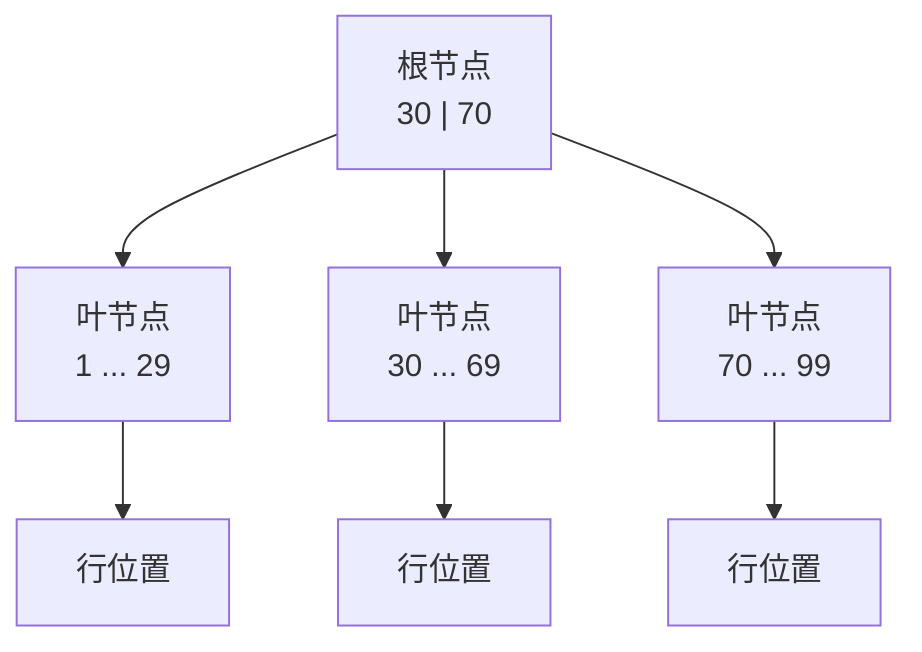
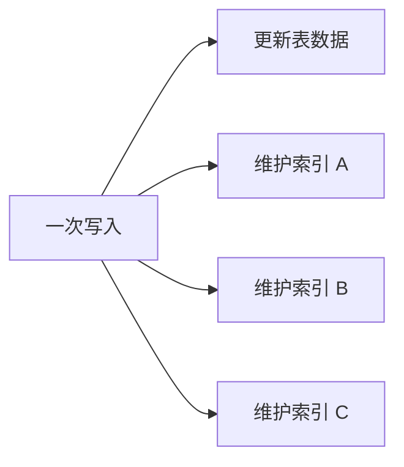
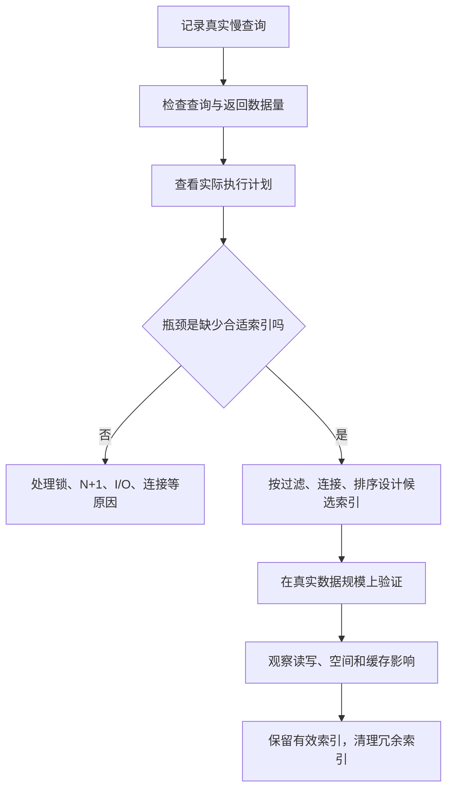

> **学完这一篇，你应该能**
> - 解释索引为什么能减少数据库读取的数据量；
> - 理解 B-tree、复合索引、覆盖索引和部分索引的基本思想；
> - 知道索引为什么会降低写入速度并占用空间；
> - 用查询计划判断索引是否真正起作用。

---

## 1. 没有索引时，数据库怎么找数据

假设 `orders` 表有一亿行：

```sql
SELECT *
FROM orders
WHERE order_no = 'A202609070001';
```

如果没有可用索引，数据库可能只能从头到尾检查数据页，这叫**顺序扫描（sequential scan）**或全表扫描。复杂度直觉接近 `O(n)`：数据翻倍，需要检查的内容也大致翻倍。

索引是根据一个或多个列建立的额外数据结构，它保存“键值 → 数据位置”的有序映射。数据库可以先在更小、更有组织的索引中定位，再访问少量目标数据页。

索引有点像书后的关键词索引：它没有替你保存整本书，而是告诉你相关内容在哪几页。这个比喻的边界也很重要——数据库索引需要随数据更新，而且查询可能同时涉及多个条件和排序。

---

## 2. B-tree 的基本直觉

关系数据库中最常见的是 B-tree 家族索引。它不是二叉树：一个节点可以保存许多有序键和子指针，从而让树保持很矮。



真实结构有更多层，每个节点通常对应磁盘页。查找时只需沿一条路径向下，而不是检查所有行。因为每层有很高的分支数，即使索引包含海量记录，高度也通常不大。

B-tree 天然适合：

- 等值：`id = 42`；
- 范围：`created_at >= ...`；
- 比较：`price < 100`；
- 前缀范围；
- 与索引顺序一致的排序、最小值和最大值。

但“有索引”不等于“查询一定快”。速度取决于能排除多少数据、是否需要回表、数据是否在内存、结果量多大，以及执行计划是否选择它。

---

## 3. 建索引的基本语法

```sql
CREATE INDEX orders_user_id_idx
ON orders (user_id);
```

唯一索引还会阻止重复值：

```sql
CREATE UNIQUE INDEX users_email_unique_idx
ON users (email);
```

在 PostgreSQL 等数据库中，主键和唯一约束通常会自动创建支持约束的唯一索引。因此不要在同样的列上再机械地创建一个重复索引。

> **> 索引是物理优化结构，约束是业务规则。虽然唯一约束常由唯一索引实现，建模时仍应优先用约束表达规则。**

---

## 4. 索引为什么不是免费的

每增加一个索引，都要付出代价：

- **磁盘空间**：索引本身要存键和位置；
- **写入成本**：插入、更新或删除行时，相关索引也要维护；
- **缓存竞争**：索引页会占用内存，挤压其他热点数据；
- **维护成本**：统计信息、页分裂、膨胀和重建都需要资源；
- **规划复杂度**：大量相似索引会增加分析和运维难度。



所以不要“给每一列都加索引”。索引应由真实查询、数据规模和执行计划驱动。

---

## 5. 选择性：这个条件能排除多少行

**选择性（selectivity）**可以直观理解为：一个条件能把候选数据缩小到什么程度。

```text
order_no = 某个唯一订单号    → 可能只剩 1 行，选择性高
status = 'paid'              → 可能命中全表 70%，选择性低
```

若查询要返回表中大部分行，逐个沿索引找位置再回表，可能比连续扫描整张表更慢。因此优化器即使看到索引，也可能合理地选择顺序扫描。

列的不同值数量通常称为**基数（cardinality）**。高基数不自动等于高选择性：是否有用仍取决于具体条件和数据分布。

数据库通过统计信息估计各条件会命中多少行。若数据分布发生巨大变化而统计信息过旧，优化器可能做出错误选择。

---

## 6. 复合索引：列的顺序很重要

```sql
CREATE INDEX orders_user_created_idx
ON orders (user_id, created_at DESC);
```

这个索引很适合：

```sql
SELECT id, amount, created_at
FROM orders
WHERE user_id = 42
ORDER BY created_at DESC
LIMIT 20;
```

索引先按 `user_id` 排列，同一用户内部再按 `created_at` 排列。数据库可以快速定位用户 42 的区间，并直接按所需顺序读取前 20 条。

可以把复合索引想成通讯录先按姓、再按名排序：

- 查“姓林的人”很方便；
- 查“姓林且名为某某的人”也方便；
- 只查“名字叫某某、姓不限”，整体顺序就不再直接有利。

这常被概括为“最左前缀”，但不要把它当死口诀。具体数据库可能进行跳跃扫描、位图组合等优化；是否有效要以实际计划为准。

设计复合索引时通常考虑：

1. 哪些条件总是一起出现；
2. 等值条件与范围条件的组合；
3. 是否需要支持 `ORDER BY`；
4. 最常用查询的过滤能力；
5. 能否让一个复合索引替代多个冗余索引。

---

## 7. 范围条件会影响后续列的利用

假设索引是：

```sql
CREATE INDEX events_tenant_time_type_idx
ON events (tenant_id, created_at, event_type);
```

查询：

```sql
WHERE tenant_id = 9
  AND created_at >= TIMESTAMPTZ '2026-09-01'
  AND event_type = 'login'
```

数据库容易定位 `tenant_id = 9`，再从时间范围起点开始扫描；但在这个时间范围内，`event_type` 并不是全局连续排列的首要维度，因此它通常不能像前两列那样大幅缩小要扫描的索引区间。它仍可能用于索引内过滤，但效果不同。

所以复合索引列顺序必须结合真实查询，而不是简单遵循“选择性最高的列永远放最前”。

---

## 8. 覆盖索引与 Index-Only Scan

普通索引找到目标后，数据库还可能需要回到表数据页读取其他列，称为“回表”。如果查询需要的列都能从索引取得，就有机会采用仅索引扫描：

```sql
CREATE INDEX orders_user_time_cover_idx
ON orders (user_id, created_at DESC)
INCLUDE (amount, status);
```

```sql
SELECT created_at, amount, status
FROM orders
WHERE user_id = 42
ORDER BY created_at DESC
LIMIT 20;
```

覆盖更多列可能减少回表，但也会让索引更大、写入更慢。PostgreSQL 是否真的能只读索引，还会受到 MVCC 可见性信息等因素影响。

---

## 9. 部分索引与表达式索引

### 部分索引

只为满足条件的行建索引：

```sql
CREATE INDEX orders_unpaid_created_idx
ON orders (created_at)
WHERE status = 'unpaid';
```

如果未支付订单只占很小部分，这个索引会比覆盖全表的索引更小。查询条件必须能让优化器判断它符合索引谓词。

### 表达式索引

对计算结果建索引：

```sql
CREATE UNIQUE INDEX users_lower_email_idx
ON users (LOWER(email));
```

它可以支持不区分大小写的邮箱查找：

```sql
SELECT id FROM users WHERE LOWER(email) = LOWER($1);
```

表达式必须与查询写法和数据库规则匹配。更重要的是先确定业务语义：邮箱是否要规范化、大小写规则是什么，不要让一个函数调用悄悄替代领域决策。

---

## 10. 不同索引类型解决不同问题

以下以 PostgreSQL 的概念为例：

| 类型 | 擅长的问题 |
|---|---|
| B-tree | 等值、范围、排序，大多数普通查询的默认选择 |
| Hash | 等值比较 |
| GIN | 一个值包含多个组成项，如数组、全文词元、部分 JSON 查询 |
| GiST | 空间、范围、相似性等可扩展搜索 |
| BRIN | 超大且物理顺序与列值相关的表，如按时间追加的日志 |

索引类型不是“速度等级”，而是针对不同运算定义的查找结构。全文检索、空间包含、向量相似度等问题，都需要与运算语义匹配的索引。

---

## 11. 为什么索引可能没有被使用

常见原因包括：

- 表很小，全表扫描更便宜；
- 条件命中大部分数据；
- 查询对列做了与索引不匹配的函数或类型转换；
- 复合索引列顺序不适合查询；
- 统计信息不准确；
- 返回列很多、随机回表成本高；
- `LIKE '%keyword%'` 无法利用普通 B-tree 的前缀顺序；
- 参数值分布差异很大，通用计划不适合某些值；
- 查询条件与部分索引的谓词无法被证明匹配。

不要通过删除条件、强制提示或盲目重建索引来“让它走索引”。先确认优化器选择是否真的更慢。

---

## 12. 使用 EXPLAIN 验证

```sql
EXPLAIN (ANALYZE, BUFFERS)
SELECT id, amount
FROM orders
WHERE user_id = 42
ORDER BY created_at DESC
LIMIT 20;
```

阅读计划时从这些问题开始：

1. 实际总耗时是否真的慢？
2. 哪个节点消耗最多时间或读取最多页面？
3. 估计行数与实际行数相差多大？
4. 过滤掉了多少行？
5. 是否发生大量循环，例如 N+1 形态的嵌套循环？
6. 冷缓存和热缓存表现是否不同？

`EXPLAIN ANALYZE` 会运行查询，并增加少量测量开销。分析写操作时要格外谨慎，可以放在事务中最后回滚，但外部副作用和某些序列变化未必都能像普通数据一样恢复。

---

## 13. 外键列为什么常常需要索引

```text
users(id)  1 ───────< N  orders(user_id)
```

经常查询“某用户的订单”时，`orders(user_id)` 显然适合建索引。删除或更新用户主键时，数据库也需要检查是否存在引用行；没有索引可能导致扫描整个订单表。

但它仍不是无条件规则：极小的表、几乎不查询的归档表，或特殊写入负载可能有不同取舍。PostgreSQL 不会自动给引用方列建索引，应由设计者根据访问模式决定。

---

## 14. 索引与分页

深 `OFFSET` 分页需要跳过大量记录：

```sql
SELECT id, created_at
FROM posts
ORDER BY created_at DESC, id DESC
LIMIT 20 OFFSET 100000;
```

若产品只需要“继续加载”，可以用键集分页：

```sql
SELECT id, created_at
FROM posts
WHERE (created_at, id) < ($last_time, $last_id)
ORDER BY created_at DESC, id DESC
LIMIT 20;
```

配合索引：

```sql
CREATE INDEX posts_time_id_idx
ON posts (created_at DESC, id DESC);
```

`id` 用来打破相同时间的并列，保证游标稳定。键集分页不能随意跳到第 5000 页，但对连续浏览更高效、更能抵抗并发插入造成的重复或遗漏。

---

## 15. 索引设计流程



最终原则是：**索引服务于具体访问模式**。它不是越多越好，也不是看到慢查询就把 `WHERE` 中所有列塞进一个索引。

---

## 延伸阅读

- [PostgreSQL：Indexes](https://www.postgresql.org/docs/current/indexes.html)
- [PostgreSQL：Multicolumn Indexes](https://www.postgresql.org/docs/current/indexes-multicolumn.html)
- [PostgreSQL：Index-Only Scans and Covering Indexes](https://www.postgresql.org/docs/current/indexes-index-only-scans.html)
- [PostgreSQL：Using EXPLAIN](https://www.postgresql.org/docs/current/using-explain.html)
