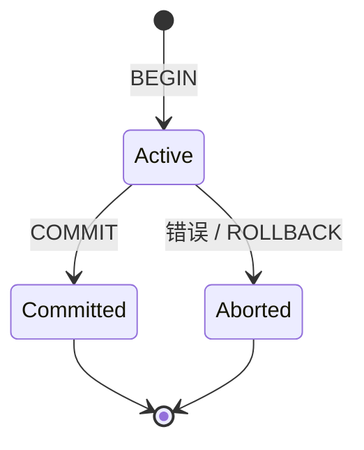
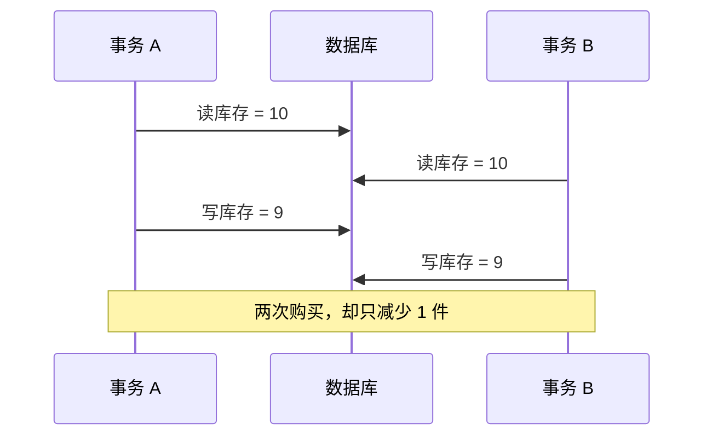
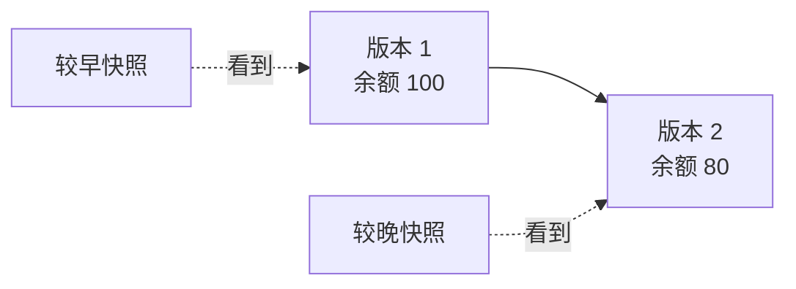
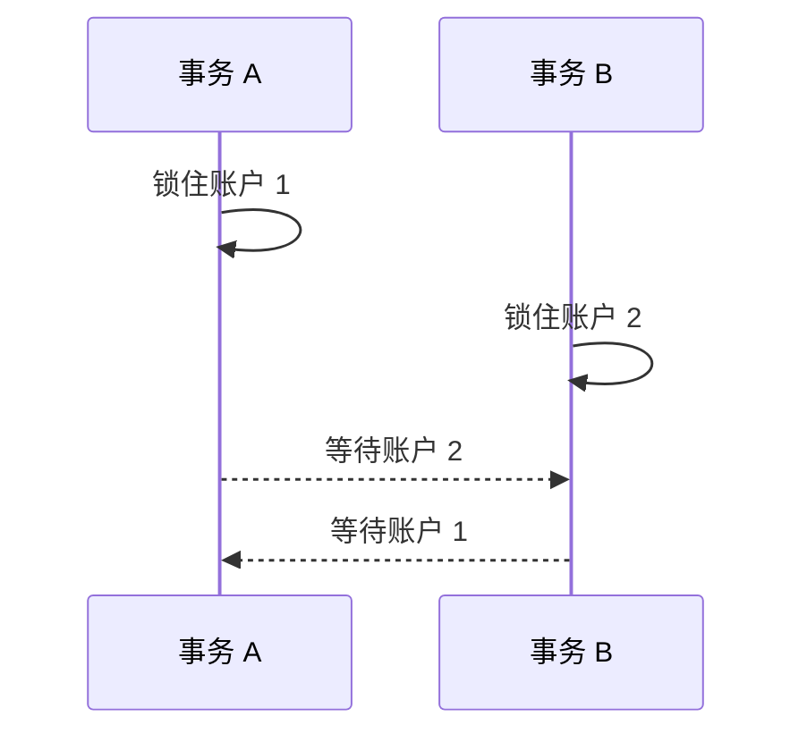
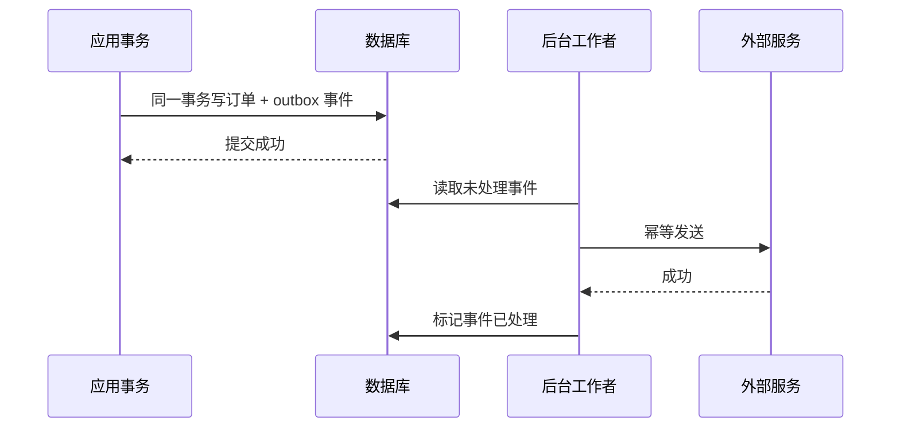
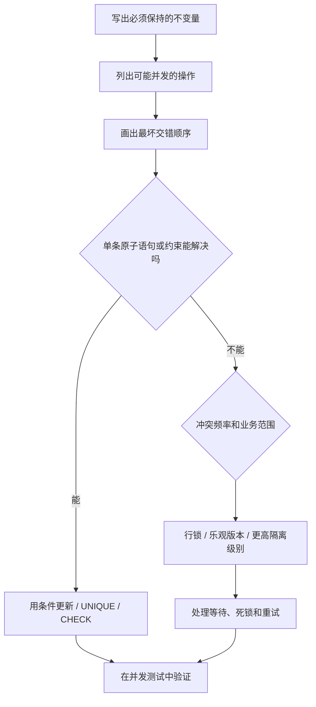

> **学完这一篇，你应该能**
> - 理解事务的 ACID 特性，而不只会背四个字母；
> - 识别丢失更新、脏读、不可重复读、幻读和写偏差；
> - 理解隔离级别、MVCC、锁和死锁的关系；
> - 知道数据库事务为什么不能直接包住邮件、支付等外部操作。

---

## 1. 事务是一组不可随意拆开的状态变化

银行转账包含至少两步：

```sql
UPDATE accounts SET balance = balance - 100 WHERE id = 1;
UPDATE accounts SET balance = balance + 100 WHERE id = 2;
```

如果第一步成功后服务崩溃，钱就凭空少了。事务让这两步组成一个整体：

```sql
BEGIN;

UPDATE accounts
SET balance = balance - 100
WHERE id = 1 AND balance >= 100;

UPDATE accounts
SET balance = balance + 100
WHERE id = 2;

COMMIT;
```

若中途发现错误，可以 `ROLLBACK`。不过还要检查第一条更新实际影响了一行，否则余额不足时也可能继续给对方加钱。



---

## 2. ACID 到底意味着什么

### Atomicity：原子性

事务内的修改作为整体提交或整体回滚，不留下“完成一半”的数据库状态。

### Consistency：一致性

事务把数据库从一个满足规则的状态带到另一个满足规则的状态。这里的规则包括主键、外键、检查约束，也包括应用正确实现的业务不变量。

数据库不能自动知道“每个账户每天最多提现 5 万元”这条业务规则，除非你用约束、锁或正确事务逻辑表达它。

### Isolation：隔离性

并发事务互相影响时，数据库限制它们能看到哪些中间状态。隔离通常不是“所有事务完全串行”，而是在正确性与并发性能之间选择保证程度。

### Durability：持久性

数据库确认提交后，即使进程崩溃，也应能够恢复已提交的数据。它通常依赖日志、刷盘和恢复协议。

> **> 持久性不等于永不丢数据。磁盘损坏、机房事故、误删除和配置错误仍需要备份、复制与恢复演练。**

---

## 3. 并发为什么会制造反直觉结果

单个请求的代码可能完全合理，多个请求交错执行后却不再正确。

### 3.1 丢失更新



“读取—在应用中计算—写回”很容易产生这种竞争。若逻辑简单，优先使用单条原子更新：

```sql
UPDATE products
SET stock = stock - 1
WHERE id = $1 AND stock > 0
RETURNING stock;
```

然后检查是否更新成功。

### 3.2 脏读

事务 B 读到了事务 A 尚未提交的数据；随后 A 回滚，B 曾看到一个从未真正存在的状态。

### 3.3 不可重复读

事务 A 两次读取同一行，中间 B 提交了修改，所以 A 得到不同值。

### 3.4 幻读

事务 A 两次执行同一范围查询，中间 B 插入或删除了符合条件的行，结果集合发生变化。

### 3.5 写偏差

两名医生中至少一人必须值班。两个事务分别看到“对方仍值班”，于是各自把自己改为休息。它们修改不同的行，因此没有普通写写冲突，最终却破坏“至少一人值班”的跨行约束。

写偏差说明：保护单行不等于保护业务不变量。

---

## 4. 隔离级别

SQL 标准描述了四个常见隔离级别。下面是概念性对比，具体数据库的实现和保证可能更强：

| 隔离级别 | 脏读 | 不可重复读 | 幻读 | 并发与重试成本 |
|---|---:|---:|---:|---|
| Read Uncommitted | 可能 | 可能 | 可能 | 通常最低 |
| Read Committed | 避免 | 可能 | 可能 | 常见默认值 |
| Repeatable Read | 避免 | 避免 | 标准上可能 | 更强 |
| Serializable | 避免 | 避免 | 避免 | 最接近串行，可能要求重试 |

### Read Committed

一条语句通常只能看到它开始前已经提交的数据。但同一事务中的下一条语句可能看到后来提交的新结果。

### Repeatable Read

事务通常围绕一个稳定快照工作，多次读取更一致。但不同数据库如何处理幻读、更新冲突和写偏差并不相同。

### Serializable

目标是让成功提交的并发事务，其效果等价于某种串行执行顺序。数据库可能通过锁，也可能通过检测危险依赖后中止某个事务来实现。因此应用必须准备重试序列化失败。

> **PostgreSQL 的特殊点**
> PostgreSQL 的 `READ UNCOMMITTED` 实际按 `READ COMMITTED` 处理；其 `REPEATABLE READ` 也不会出现 SQL 标准所允许的幻读。但它仍可能发生序列化异常之外的业务竞争，必须按 PostgreSQL 文档理解具体保证。

隔离级别不是越高越“专业”。应先明确要保护的不变量，再选择足够的机制，并正确处理锁等待、失败和重试。

---

## 5. MVCC：让读写少互相阻塞

许多数据库使用**多版本并发控制（MVCC）**。更新一行时，不是简单地在所有读者眼前擦掉旧值，而是保留可供不同事务判断可见性的版本。



事务根据快照和版本信息决定能看到哪一个版本。这带来两个重要效果：

- 普通读取不必总是阻塞写入；
- 写入不必总是阻塞普通读取。

但 MVCC 不会消灭所有锁，也不保证应用逻辑自动正确：

- 多个事务更新同一行仍会冲突或等待；
- DDL、外键检查等会使用锁；
- 长事务会阻止旧版本被及时清理；
- 快照看到的是一致视图，不代表数据永远不变。

---

## 6. 悲观锁：先锁住，再修改

当业务需要读取某行后再依据其状态更新，可以锁定目标行：

```sql
BEGIN;

SELECT stock
FROM products
WHERE id = $1
FOR UPDATE;

-- 检查并执行后续修改
UPDATE products SET stock = stock - 1 WHERE id = $1;

COMMIT;
```

其他试图锁定或修改同一行的事务通常要等待。它适合冲突概率较高、临界区很短的场景。

代价是：

- 锁等待增加延迟；
- 长事务会扩大阻塞范围；
- 以不同顺序获取多个锁，可能死锁；
- 用户思考、网络调用不应发生在持锁事务中。

---

## 7. 乐观并发控制：更新时确认版本没变

给记录增加版本号：

```text
documents(id, content, version)
```

读取时得到 `version = 7`，更新时附加条件：

```sql
UPDATE documents
SET content = $new_content,
    version = version + 1
WHERE id = $id AND version = 7;
```

若影响 0 行，说明别人已经修改，应重新读取、合并或提示冲突。

乐观控制适合冲突较少、读取到提交之间可能隔很久的场景。它不会让冲突消失，而是把“悄悄覆盖”变成“可检测的失败”。HTTP 中的 ETag 与 `If-Match` 也表达类似思想。

---

## 8. 死锁：每个人都在等对方



数据库通常会检测死锁并中止其中一个事务。常用缓解方式：

- 所有代码按一致顺序获取资源，例如总是先锁较小 ID；
- 缩短事务，事务内不等待用户或外部网络；
- 一次锁定明确集合，避免边走边扩展；
- 为查找待锁行的条件建立合适索引；
- 捕获死锁错误并对整个事务做有限次数、带抖动的重试。

死锁并不一定意味着数据库坏了；它往往是并发控制在发现无法继续后主动选择一个牺牲者。

---

## 9. 重试要求操作具备幂等性意识

高隔离级别、死锁、网络闪断都可能让事务需要重试。但下面的代码有危险：

```text
事务成功提交
    ↓
响应在网络中丢失
    ↓
客户端认为失败，再次请求
```

如果“创建订单”重复执行，就可能创建两笔订单。常见解决方式是使用**幂等键**：

```sql
CREATE TABLE idempotency_keys (
  tenant_id BIGINT NOT NULL,
  key TEXT NOT NULL,
  response JSONB,
  PRIMARY KEY (tenant_id, key)
);
```

服务端把业务结果与幂等键绑定，重复请求返回已有结果。数据库唯一约束是抵御并发重复的关键部分。

结合 [1.2 计算机之间的通信：网络](/blog/1-2-计算机之间的通信-网络) 与 [3.1 HTTP](/blog/3-1-http) 中关于网络失败的讨论，要始终记得：客户端收到超时，只能说明它没收到结果，不能证明服务端没有执行。

---

## 10. 数据库事务无法包住外部世界

下面的伪代码看似合理：

```text
BEGIN
  写入订单
  调用支付平台
  发送确认邮件
COMMIT
```

数据库回滚不了已经发出的邮件，也无法要求第三方支付接口与本地事务同时提交。把网络调用放在事务里还会让锁持有很久。

一种常见方案是**事务性发件箱（Transactional Outbox）**：



它保证“业务数据和待发送事件”一起落库，但工作者仍可能重复发送，因此消费者和外部调用仍要尽量幂等。

跨多个服务的长业务流程常使用 Saga：每一步是本地事务，失败时执行补偿动作。补偿不是数据库式回滚——例如“退款”是一项新的业务动作，而不是让支付从历史上消失。

---

## 11. 事务要短，但边界要完整

事务过短会漏掉不变量，过长会造成锁等待、版本堆积和连接占用。

事务中通常不应做：

- 等用户确认；
- 调用慢速第三方接口；
- 上传大文件；
- 进行长时间 CPU 计算；
- 无界地遍历和修改海量行。

但也不要为了“短”而把必须原子完成的检查和更新拆开。正确做法是先准备好外部输入，再进入数据库事务，迅速完成必要的读取、验证和写入，然后提交。

---

## 12. 常见错误

> **先查再写，没有约束或锁**
> 并发请求可能都通过检查。优先使用唯一约束、条件更新或显式并发控制。

> **把事务当异常捕获器**
> 事务解决状态原子性，不会自动修复错误业务逻辑，也不会回滚数据库外的副作用。

> **忽略事务失败状态**
> 某些数据库中，事务内一条语句报错后，必须显式回滚，后续语句不能照常继续。

> **在事务中逐条处理巨量数据**
> 这会产生长时间锁和大量日志。应设计分批、可恢复、可重入的迁移流程。

> **遇到序列化失败就返回 500**
> 某些并发失败是正确性机制的一部分。应用应对可重试错误进行有限重试，并设置退避与监控。

---

## 13. 设计并发操作的思考顺序



并发正确性不能只靠单元测试里按顺序执行两个函数。需要有意制造竞争、重复请求、超时和故障，观察最终不变量是否仍成立。

---

## 延伸阅读

- [PostgreSQL：Transactions](https://www.postgresql.org/docs/current/tutorial-transactions.html)
- [PostgreSQL：Transaction Isolation](https://www.postgresql.org/docs/current/transaction-iso.html)
- [PostgreSQL：Concurrency Control](https://www.postgresql.org/docs/current/mvcc.html)
- [PostgreSQL：Explicit Locking and Deadlocks](https://www.postgresql.org/docs/current/explicit-locking.html)
