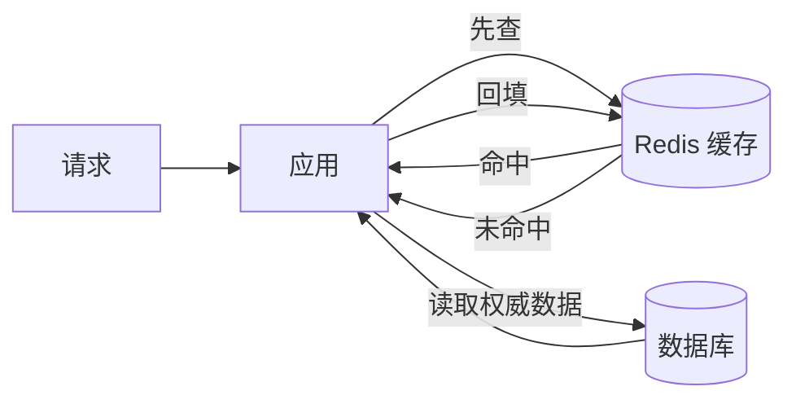
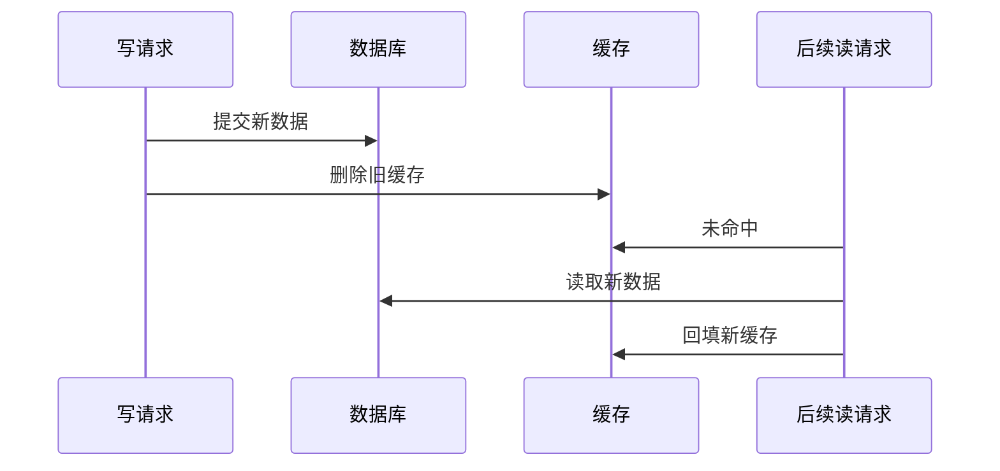
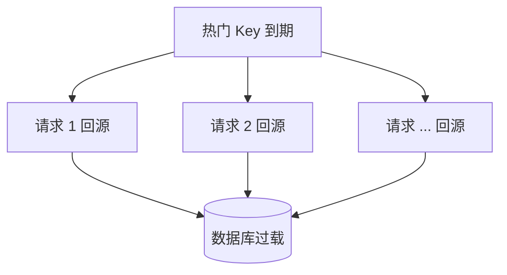

> **学完这一篇，你应该能**
> - 理解 Redis 为什么不仅是“内存里的键值表”；
> - 根据数据结构选择缓存、计数、排行榜和事件流方案；
> - 解释 Cache-Aside、TTL、淘汰策略和缓存一致性；
> - 识别缓存穿透、击穿、雪崩、热 Key 与分布式锁风险。

---

## 1. Redis 是数据结构服务器

Redis 把常用数据放在内存中，并通过网络提供一组针对数据结构的原子操作。它的价值不只是 `key -> value`，还在于服务端理解值的结构：

| 数据类型 | 直觉 | 常见用途 |
|---|---|---|
| String | 字节序列、整数或文本 | 缓存对象、计数器、令牌 |
| Hash | 字段—值集合 | 小型对象、配置 |
| List | 按插入顺序排列的序列 | 简单队列、最近记录 |
| Set | 无序且不重复的集合 | 标签、去重、共同好友 |
| Sorted Set | 每个成员有分数并按分数排序 | 排行榜、优先级队列 |
| Stream | 追加式事件日志 | 消息处理、消费者组 |

例如排行榜不必每次把所有分数取回应用排序：

```text
ZADD leaderboard 1250 user:42
ZINCRBY leaderboard 80 user:42
ZREVRANGE leaderboard 0 9 WITHSCORES
```

操作在 Redis 服务端完成，减少网络往返和并发竞争。

> **> “单条命令原子”不等于一整段应用逻辑原子。多命令业务仍需事务、Lua 脚本或重新设计成单个原子操作，并考虑失败与重试。**

---

## 2. Redis 为什么快

常见原因包括：

- 主要数据在内存中，避免普通磁盘随机读取；
- 数据结构和命令针对特定操作优化；
- 网络协议相对直接；
- 许多操作在单个执行线程的顺序语义下完成，避免细粒度锁竞争；
- 支持批量、流水线和服务端脚本，减少往返。

但“Redis 很快”不表示延迟固定：

- 返回一个超大集合仍会耗费 CPU 和网络；
- 某些命令复杂度与集合大小相关；
- 大 Key 删除、持久化、故障切换和内存回收可能造成抖动；
- 客户端连接池、跨区域网络也可能成为瓶颈。

每次使用命令前，应查看其时间复杂度和返回数据规模，避免在请求路径上执行无界操作。

---

## 3. 缓存保存的是“可丢失、可重建”的副本

假设商品信息的权威数据在 PostgreSQL，Redis 保存常用商品的副本：



关键观念：

- 数据库通常是 **source of truth（权威来源）**；
- 缓存可以过期、被淘汰或全部丢失；
- 缓存故障时，系统应尽量能回源，而不是失去业务事实；
- 回源能力也要有限流保护，否则缓存故障会拖垮数据库。

如果某份数据只存在 Redis，就不能再把它简单视为缓存，而要按正式数据库对待其持久化、复制、备份和恢复目标。

---

## 4. Cache-Aside：最常见的读取模式

读取流程：

```text
1. 读取缓存
2. 命中：直接返回
3. 未命中：读取数据库
4. 将结果写入缓存，并设置过期时间
5. 返回结果
```

伪代码：

```js
async function getProduct(id) {
  const key = `product:v3:${id}`;
  const cached = await redis.get(key);
  if (cached !== null) return JSON.parse(cached);

  const product = await db.products.findById(id);
  if (product !== null) {
    await redis.set(key, JSON.stringify(product), { EX: 300 });
  }
  return product;
}
```

这里的 `v3` 是键版本。缓存数据结构发生不兼容变化时，可以切换版本，而不必同步清理每个旧 Key。

---

## 5. 写操作时先改谁

Cache-Aside 常采用：

```text
1. 更新数据库
2. 删除缓存
```

而不是“更新数据库后，再把新值写入缓存”。删除让下一次读取从权威数据重建，可减少复杂转换和并发覆盖。



不过它仍然不是强一致事务。可能出现：

- 数据库已成功，删除缓存失败，旧值继续存在到 TTL；
- 更新数据库和删除缓存之间，有请求读到旧缓存；
- 并发读在更新前查到旧数据，却在更新后把旧数据回填。

解决程度取决于业务要求：

- 设置合理而非无限的 TTL；
- 删除失败进入可重试队列；
- 事件驱动失效，事件需可靠投递；
- 缓存值携带数据版本，拒绝旧版本覆盖新版本；
- 对极高一致性数据绕过缓存或读取主库；
- 接受明确的短暂不一致，并在产品上避免误导。

“一致性”不是开关。应该明确可接受的陈旧窗口，例如商品描述可旧 5 分钟，库存和余额却可能不允许。

---

## 6. TTL 与淘汰策略

**TTL（Time To Live）**是键的过期时间。它有三重价值：

- 限制旧数据最长存在时间；
- 让长期不用的数据自动释放；
- 在失效消息偶尔丢失时提供最终兜底。

但 TTL 不是一致性证明，也不是精确调度器。不要依赖某个键在第 300.000 秒必然被删除。

当内存达到上限时，Redis 会依据配置的淘汰策略处理键，例如从设置过期时间的键或所有键中按近似 LRU、LFU、随机等方式选择，也可以拒绝会增加内存的写入。

生产环境必须明确：

- `maxmemory` 是多少；
- 使用什么淘汰策略；
- 被淘汰的数据能否重建；
- 内存达到上限时，应用会怎样退化。

---

## 7. 缓存穿透、击穿与雪崩

### 7.1 缓存穿透

大量请求查询根本不存在的数据，每次都未命中并访问数据库。

应对方式：

- 校验明显无效的 ID；
- 短时间缓存“不存在”的结果；
- 使用 Bloom Filter 过滤确定不存在的键；
- 对异常来源限流。

缓存空结果时要设较短 TTL，否则对象刚创建后仍可能被认为不存在。

### 7.2 缓存击穿 / 惊群

一个极热 Key 到期，成千上万个请求同时回源。



应对方式：

- 单航班 / 请求合并：只有一个请求负责加载，其他等待结果；
- 逻辑过期：先返回稍旧数据，由后台刷新；
- 热点数据提前刷新；
- 对回源设置并发上限和超时。

### 7.3 缓存雪崩

大量 Key 同时过期或整个缓存集群不可用，流量集中打到数据库。

应对方式：

- TTL 加随机抖动，避免同一秒集中失效；
- 分批预热；
- 缓存高可用，但仍为完全故障设计回源限流；
- 熔断、排队、降级和容量预留；
- 不让所有关键路径都依赖同一个缓存故障域。

---

## 8. 热 Key 与大 Key

### 热 Key

某个键承受远高于其他键的访问量，例如全站热门榜。即使集群总容量充足，单个分片或网卡也可能过载。

可以考虑：本地短缓存、请求合并、只读副本、合理拆分数据，或让 CDN 承担公开内容。

### 大 Key

一个键包含百万级集合成员或巨大字符串。它会造成：

- 单次传输和序列化很慢；
- 删除、过期或复制时产生延迟抖动；
- 集群迁移困难；
- 一次误操作占满客户端内存。

应对方式是分页读取、拆分集合、限制单值体积，并持续监控键大小分布。

---

## 9. Redis 的其他常见用途

### 9.1 会话

```text
session:<opaque-id> -> { userId, permissionsVersion, expiresAt }
```

适合集中管理登录状态和撤销会话。要设置过期时间、Cookie 安全属性，并考虑 Redis 故障时的登录体验。参见 [3.5 Cookie、Session、JWT 与 OAuth](/blog/3-5-cookie-session-jwt-与-oauth)。

### 9.2 限流

固定窗口可用计数器，但边界处可能突发；滑动窗口、令牌桶或漏桶能提供不同语义。多个操作需要原子完成时，可使用 Lua 脚本或相应原子命令。

限流 Key 要包含正确维度，例如租户、用户、接口，而不是只按可伪造的请求头。

### 9.3 排行榜

Sorted Set 能按分数排序并查询名次。要提前定义同分规则、重置周期和作弊处理。

### 9.4 消息与事件

Pub/Sub 适合在线订阅者的即时广播，离线消费者通常收不到历史消息；Streams 保存追加日志，并支持消费者组和确认机制。两者语义不同，不能只因为都能“发消息”就互换。

---

## 10. 持久化与复制不等于零丢失

Redis 可使用 RDB 快照、AOF 日志或二者组合进行持久化。它们在恢复速度、文件大小、性能和允许丢失窗口上有不同取舍。

复制和自动故障切换可以提高可用性，但异步复制下，主节点刚确认而尚未复制的数据可能在故障切换时丢失。是否能接受，要由恢复点目标（RPO）和恢复时间目标（RTO）决定。

若 Redis 保存的是缓存，丢失后重建通常可接受；若保存支付状态、唯一队列或其他不可重建事实，就必须重新审视存储选择和持久化保证。

---

## 11. 分布式锁不是普通互斥锁

常见做法是使用带过期时间的条件写入获得锁，并用随机唯一值标识所有者：

```text
SET lock:resource-42 <random-token> NX PX 10000
```

释放时必须原子地检查 token 仍属于自己，再删除，不能直接 `DEL`。否则旧持有者超时后，可能删除新持有者刚获得的锁。

即使实现正确，仍有更深问题：

- 持有者暂停时间超过租约，却不知道锁已失效；
- 网络分区让不同参与者看到不同状态；
- 锁服务故障切换可能改变已知状态；
- 获得锁不代表外部资源一定会拒绝旧持有者。

高正确性场景应考虑**栅栏令牌（fencing token）**：每次获取锁获得单调递增编号，真正的数据存储只接受比已处理编号更新的请求。

更常见也更可靠的第一选择是：数据库唯一约束、条件更新、版本号和幂等键。不要用分布式锁来弥补尚未定义清楚的业务不变量。

---

## 12. 缓存键设计

推荐让键体现命名空间、租户、版本和对象标识：

```text
prod:tenant:18:product:v3:9281
```

设计时考虑：

- 是否可能跨租户串数据；
- 数据结构变更如何切换版本；
- Key 是否包含密码、令牌、邮箱等敏感内容；
- 是否能批量定位相关键，而不依赖危险的全库扫描；
- TTL 是否有抖动；
- 单个键可能增长到多大。

不要在生产请求路径上使用会扫描全部键空间的命令来找前缀。维护必要的索引集合，或使用渐进式扫描和离线管理工具。

---

## 13. 引入缓存前后的检查清单

### 引入前

- 已用指标确认瓶颈在重复读取，而非慢 SQL、锁或网络？
- 数据是否可以重建？权威来源是谁？
- 可以接受多长时间的旧数据？
- 缓存完全不可用时，系统如何退化？

### 上线后

- 命中率、回源量、延迟分位数是否健康？
- 是否存在热 Key、大 Key、连接耗尽？
- 内存使用、淘汰量、过期量如何？
- 数据库是否能承受缓存失效时的受控回源？
- 更新失败、删除失败和反序列化错误是否可观测？

缓存的目标是减少总成本，而不是让架构图多一个方框。若一致性处理、故障容量和运维成本超过收益，暂时不用缓存可能更好。

---

## 延伸阅读

- [Redis：Data types](https://redis.io/docs/latest/develop/data-types/)
- [Redis：Key eviction](https://redis.io/docs/latest/develop/reference/eviction/)
- [Redis：Persistence](https://redis.io/docs/latest/operate/oss_and_stack/management/persistence/)
- [Redis：Distributed Locks](https://redis.io/docs/latest/develop/clients/patterns/distributed-locks/)
