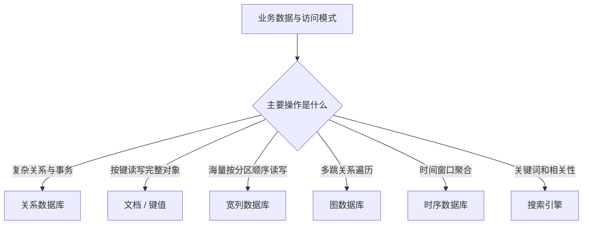
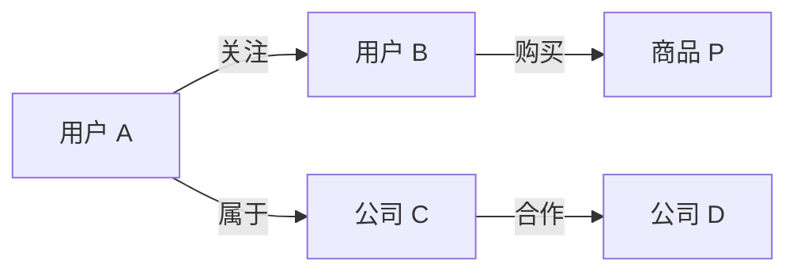
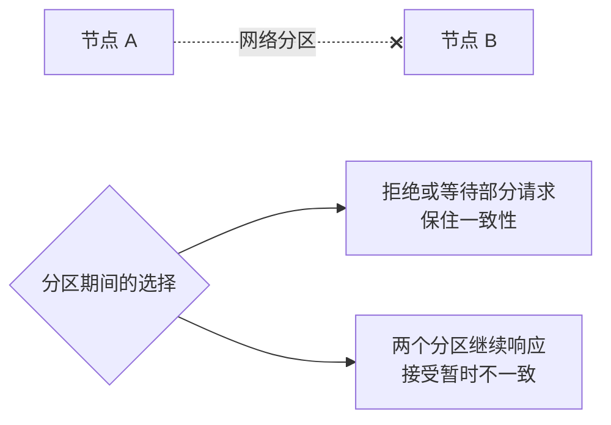
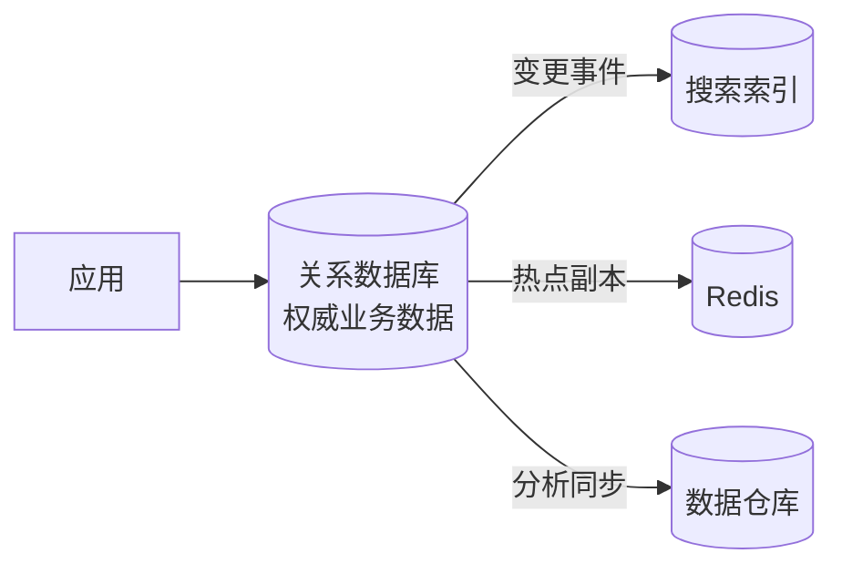

> **学完这一篇，你应该能**
> - 理解 NoSQL 是一组不同数据模型，而不是单一技术；
> - 根据访问模式区分文档、键值、宽列、图、时序和搜索系统；
> - 正确理解 CAP，不把它当成数据库能力排行榜；
> - 判断何时应保留关系数据库，何时值得引入专用存储。

---

## 1. NoSQL 不等于“不能写 SQL”

NoSQL 更接近“Not Only SQL”：它泛指不以传统关系模型作为唯一核心的数据系统。这个标签下面的产品差异极大：

- Redis 与 MongoDB 的数据模型不同；
- MongoDB 与图数据库解决的问题不同；
- 搜索引擎和时序数据库也不应被当作同一种东西；
- 一些 NoSQL 系统支持事务，一些关系数据库也支持 JSON 和分布式扩展。

因此，真正有意义的问题不是“SQL 还是 NoSQL”，而是：

> 数据是什么形状？最重要的访问模式是什么？需要哪些一致性、事务、查询和扩展保证？

---

## 2. 从访问模式倒推数据模型

关系建模通常先分解实体和关系，再灵活组合查询。许多 NoSQL 系统更强调先列出核心访问模式，然后按读取方式组织数据。

以文章系统为例：

- 按文章 ID 读取全文；
- 读取作者最近 20 篇文章；
- 按关键词全文搜索；
- 统计每天阅读量；
- 推荐“关注者也喜欢的文章”。

这五种需求可能分别适合文档、宽列或键值、搜索、时序分析和图/推荐系统。强迫一个数据库以同样方式完成全部工作，通常会制造复杂度。



---

## 3. 文档数据库

文档数据库通常以类似 JSON/BSON 的对象为读写单位：

```json
{
  "_id": "post-42",
  "title": "理解数据库",
  "author": {
    "id": "user-7",
    "displayName": "小林"
  },
  "tags": ["database", "backend"],
  "comments": [
    { "userId": "user-9", "text": "讲得很清楚" }
  ]
}
```

### 嵌入还是引用

**嵌入（embedding）**把相关数据放在同一文档中：读取一次即可得到整体，适合一起读取、生命周期相同、数量有界的数据。

**引用（referencing）**只保存其他对象 ID：减少重复，适合独立变化、数量无界或被许多对象共享的数据。

不要无界地把评论、日志或历史事件塞入单个文档。文档会越来越大，更新冲突和传输成本也会增加。

文档“结构灵活”不等于“没有结构”。应用仍需定义字段类型、必填规则、版本迁移和兼容策略；只是约束的承担位置不同。

适合场景：

- 一个对象及其有界子对象经常整体读写；
- 不同对象的可选字段差异较大；
- 很少需要跨大量文档做任意关系连接。

不太适合：高度关联、复杂跨实体约束、经常临时组合多维查询的核心交易数据。

---

## 4. 键值数据库

键值数据库的核心接口近似：

```text
PUT(key, value)
GET(key)
DELETE(key)
```

它用受限查询能力换取简单、低延迟和按键分区能力。设计关键在 Key：必须提前知道如何定位数据。

```text
用户资料：user:<user-id>
订单详情：order:<order-id>
用户订单：user-orders:<user-id>:<month>
```

为了支持多个访问模式，可能需要把同一事实写入多份派生结构。这提高读取效率，也把更新、回放和一致性责任交给应用。

适合：会话、购物车、配置、按明确 ID 读取的对象、极大规模的简单访问模式。

---

## 5. 宽列数据库

宽列或列族数据库通常按**分区键**把数据分散到节点，并在分区内按排序键组织。它们适合海量、可预测、按键和范围访问的数据。

例如设备事件：

```text
partition_key = device_id + day
sort_key      = event_time
```

这样可以高效查询“设备 42 在某一天的事件”。但想临时查询“所有设备中温度超过 80 的事件”，若没有相应索引或预先建立的查询表，就可能代价很高。

设计时要避免：

- 所有流量落到同一个分区键；
- 单个分区无限增长；
- 把任意 JOIN 和跨分区事务当作默认能力；
- 只按实体建模，却没有列出查询模式。

代表性系统包括 Apache Cassandra、HBase，以及具有相似按键设计思想的云数据库服务。

---

## 6. 图数据库

图模型将数据表示为节点和边：



它擅长的问题是：

- A 与 B 之间最短路径是什么；
- 某用户的三度关系中有哪些潜在联系人；
- 哪些账户组成异常资金网络；
- 权限如何沿组织和资源关系继承。

关系数据库也能保存边表并使用递归查询。只有关系遍历是核心负载、深度和形态经常变化，而且普通关系查询已难以满足时，引入图数据库才更有价值。

---

## 7. 时序数据库与搜索引擎

### 时序数据库

数据以时间戳为核心，常见操作是：

- 持续追加指标；
- 按时间范围和标签查询；
- 降采样、窗口聚合；
- 设置保留周期和压缩。

适合监控指标、物联网遥测、金融行情等。需要注意标签基数过高会让索引和内存迅速膨胀。

### 搜索引擎

搜索引擎把文本拆成词元，建立倒排索引，用于：

- 全文检索；
- 模糊匹配与相关性排序；
- 高亮、分词和同义词；
- 大规模过滤与聚合。

搜索索引往往是从主数据库派生的读取模型。更新传播可能有延迟，所以不应默认用搜索结果判断“余额是否足够”或“用户名是否唯一”。

---

## 8. CAP 定理究竟在说什么

CAP 讨论的是：**当分布式系统发生网络分区（P）时，系统无法同时对每个请求都提供线性一致性（C）和可用响应（A）**。



这里的术语有严格含义：

- **一致性 C**：所有成功操作表现得像在单一、最新副本上按某种顺序执行，接近线性一致性；
- **可用性 A**：每个发给未故障节点的请求都得到非错误响应，但不保证是最新数据；
- **分区容忍 P**：即使节点间消息丢失或长时间延迟，系统仍按定义继续工作。

常见误读：

- 不是平时随意从 C、A、P 中选两个；分区发生时才出现核心取舍；
- CAP 的 C 不是 ACID 中的 Consistency；
- “选择 AP”不代表完全没有一致性；系统可能提供会话一致性、因果一致性或最终一致性；
- “选择 CP”不代表整个系统停机；它可能只拒绝无法安全处理的操作；
- CAP 不能替代对延迟、吞吐、事务、备份和运维的评估。

现实系统还要面对网络正常时的一致性与延迟取舍，常用 PACELC 作为补充视角：发生分区时在 A/C 之间取舍；没有分区时，也常在延迟 L 与一致性 C 之间取舍。

---

## 9. 最终一致性不是“迟早会对”这么简单

最终一致性的直觉是：没有新更新且通信恢复后，副本最终收敛。但应用必须明确收敛过程中的体验：

- 用户刚改头像，刷新却看见旧头像；
- 取消订单后，搜索结果仍短暂显示可购买；
- 两个地区同时更新同一字段，哪个获胜；
- 删除的数据会不会被离线副本重新带回来。

常见冲突处理包括：

- 最后写入获胜，但需要可靠处理时钟问题；
- 明确版本向量或因果关系；
- 按字段或业务规则合并；
- 使用可交换、可合并的数据结构；
- 把冲突交给用户处理。

一致性模型必须和用户体验、业务损失以及补偿机制一起设计。

---

## 10. 反规范化与重复写入

为了让一次读取命中一个分区，NoSQL 模型经常保存重复数据：

```text
orders_by_id
orders_by_user
orders_by_status_and_day
```

一笔订单可能在三处出现。代价是：

- 写入需要同步更新多个投影；
- 中途失败会产生不一致；
- 修复需要重放事件或离线对账；
- Schema 变更需要迁移多份数据。

事件驱动更新派生视图时，应假设消息可能重复、延迟或乱序，消费者需要幂等，数据最好带版本，并准备对账和重建能力。

---

## 11. 多模型存储：能力增加，复杂度也增加

一种常见架构是：



这叫多模型或多语言持久化。它能让每个系统发挥专长，但要额外处理：

- 谁是权威数据源；
- 变更如何可靠传播；
- 数据延迟如何向用户解释；
- 怎样重建派生存储；
- 每套系统的监控、权限、备份、升级和成本；
- 跨系统查询和故障排查。

增加一种数据库，绝不只是增加一个客户端依赖。

---

## 12. 什么时候值得使用 NoSQL

比较有说服力的信号：

- 访问模式稳定且与某种专用数据模型高度吻合；
- 单机或传统主从架构已被真实测量证明无法满足规模要求；
- 业务能明确接受并处理相应一致性模型；
- 团队有能力运行、备份和排查该系统；
- 专用能力能显著简化问题，例如全文检索、多跳图遍历或时序压缩；
- 数据天然以有界聚合文档整体读写。

不太有说服力的理由：

- “以后用户可能很多”；
- “Schema 灵活，所以不用设计”；
- “大公司都在用”；
- “NoSQL 一定更快”；
- “不想学 JOIN”；
- “微服务就必须每个服务用不同数据库”。

---

## 13. 一张实用对照表

| 需求 | 通常优先考虑 | 主要风险 |
|---|---|---|
| 复杂关系、事务、临时查询 | 关系数据库 | 横向分布需要更多设计 |
| 完整聚合对象按 ID 读写 | 文档数据库 | 重复数据、跨文档关系 |
| 极简按键访问、超低延迟 | 键值数据库 | 查询能力受限 |
| 海量按分区与范围读写 | 宽列数据库 | 分区设计决定成败 |
| 多跳关系遍历 | 图数据库 | 运维生态与非图查询 |
| 指标和遥测 | 时序数据库 | 标签基数、保留成本 |
| 全文、模糊、相关性搜索 | 搜索引擎 | 索引延迟、不宜作唯一事实源 |

如果需求同时包括多项，也不必立刻使用多套系统。现代关系数据库可能已经为 JSON、全文、空间和时间序列提供了足够能力。先验证“足够好”，再为确切瓶颈增加专用系统。

---

## 14. 选择存储的决策问题

1. 最重要的五个读写路径是什么？
2. 一次操作涉及一个对象、一组对象，还是任意关系？
3. 哪些不变量必须强一致？
4. 能接受多长复制和索引延迟？
5. 数据增长方向是行数、单值大小、写入速率还是关系数量？
6. 如何分区，是否存在不可拆的热分区？
7. 如何备份、恢复、迁移和删除数据？
8. 数据能否导出，供应商或产品迁移成本如何？
9. 故障时系统应拒绝请求、返回旧数据还是降级功能？
10. 团队能否长期维护，而不只是完成首次接入？

默认选择成熟关系数据库并不保守，它是在保留事务、约束和灵活查询能力。只有具体需求能抵消额外复杂度时，NoSQL 才真正产生价值。

---

## 延伸阅读

- [MongoDB：Data Modeling](https://www.mongodb.com/docs/manual/data-modeling/)
- [Amazon Dynamo Paper](https://www.allthingsdistributed.com/files/amazon-dynamo-sosp2007.pdf)
- [Brewer：CAP Twelve Years Later](https://www.infoq.com/articles/cap-twelve-years-later-how-the-rules-have-changed/)
- [PostgreSQL：JSON Types](https://www.postgresql.org/docs/current/datatype-json.html)
