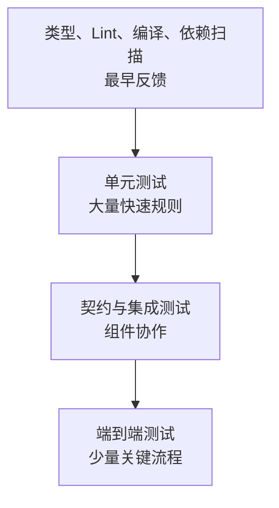
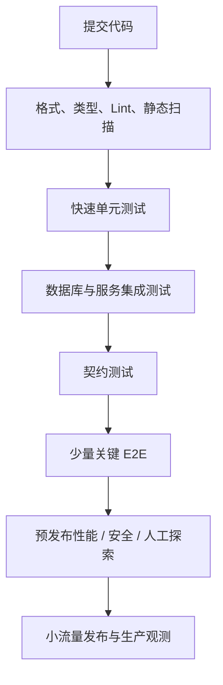

> **学完这一篇，你应该能**
> - 理解测试不是“证明没有 Bug”，而是管理风险；
> - 区分静态检查、单元、集成、契约、端到端和非功能测试；
> - 写出稳定、独立、围绕可观察行为的测试；
> - 根据失败代价与反馈速度设计一套测试组合。

---

## 1. 测试到底在提供什么

软件几乎不可能通过有限测试证明“绝对没有错误”。测试真正提供的是证据：

> 在明确的输入、环境和假设下，系统表现符合预期。

它主要降低三类风险：

- 新代码一开始就写错；
- 修改 A 时意外破坏了 B；
- 开发环境正常，上线组合后失败。

测试也是一种可执行的行为说明。例如“库存为 0 时不能下单”比“下单函数应该正确”更具体，也更能指导实现。

---

## 2. 测试先从风险出发

不要平均地测试每一行代码。先问：

- 错了会损失多少钱、数据或信誉？
- 这段逻辑有多少分支和边界？
- 它依赖多少外部系统？
- 过去是否频繁出错？
- 人工检查是否困难或容易遗漏？

支付金额、权限判断、数据迁移值得更强保护；纯展示间距通常不需要同等数量的自动化测试。

```text
测试优先级 ≈ 出错概率 × 出错影响 × 难以被其他手段发现的程度
```

这不是精确公式，而是一种决策框架。

---

## 3. 测试不只有一种层次



越靠下通常运行更快、定位更准；越靠上越接近真实使用，但环境更复杂、执行更慢、失败原因更多。它不是严格金字塔，也不要求固定比例。

合理组合的目标是：用最低总成本获得足够信心。

---

## 4. 静态检查：程序还没运行就发现问题

包括：

- 编译错误；
- TypeScript 等类型检查；
- Lint 规则；
- 格式检查；
- 依赖漏洞和秘密扫描；
- Schema、配置和基础设施文件校验。

```ts
function total(price: number, count: number): number {
  return price * count;
}

total("19.9", 2); // 类型检查阶段即可发现
```

静态工具反馈极快，但看不到真实运行语义：一个类型完全正确的折扣公式仍然可能算错。参见 [2.10 TypeScript：类型系统解决了什么](/blog/2-10-typescript-类型系统解决了什么)。

---

## 5. 单元测试：验证一个小范围的行为

单元不必等于“一个函数”。更有用的定义是：在隔离、快速、可控的环境中验证一个小型行为单元。

```ts
function calculateShipping(weightKg: number, vip: boolean) {
  if (weightKg <= 0) throw new Error("invalid weight");
  if (vip) return 0;
  return weightKg <= 1 ? 8 : 8 + Math.ceil(weightKg - 1) * 3;
}

test("普通用户 2.2kg 运费为 14 元", () => {
  expect(calculateShipping(2.2, false)).toBe(14);
});

test("非正重量被拒绝", () => {
  expect(() => calculateShipping(0, false)).toThrow("invalid weight");
});
```

好的单元测试会覆盖：

- 正常路径；
- 边界值，如 0、1、最大值；
- 非法输入；
- 重要业务分支；
- 曾经出现过的缺陷。

不要为每个 getter 或内部私有方法机械写测试。测试可观察行为，重构内部实现时才不会大量误报。

---

## 6. 集成测试：验证组件真的能一起工作

集成测试关注边界：

- 应用代码与真实数据库；
- 序列化与 HTTP 路由；
- ORM 与约束、事务；
- 缓存客户端与 Redis；
- 消息生产者与消费者；
- 文件格式和第三方 SDK。

一个单元测试可能把数据库模拟成“永远成功”，却发现不了：

- 列名拼错；
- 外键或唯一约束冲突；
- 时区转换错误；
- 事务在异常路径没有回滚；
- SQL 在真实数据库方言中无效。

因此，关键持久化逻辑应有连接真实同类数据库的集成测试。可以用临时数据库、容器或独立测试 Schema，保证每次运行有可控起点。

---

## 7. 契约测试：接口两端是否仍然说同一种语言

服务 A 认为响应是：

```json
{ "userId": 42, "name": "小林" }
```

服务 B 升级后却返回：

```json
{ "id": "42", "displayName": "小林" }
```

双方各自单元测试都可能通过，组合后才失败。契约测试用于验证：

- 路径、方法、状态码；
- 请求和响应结构；
- 字段类型、是否可空；
- 错误语义；
- 事件格式与兼容规则。

契约可以来自 OpenAPI、JSON Schema、Protocol Buffers，或由消费者期望生成。关键是接口演进要有兼容策略，而不是把生产调用当集成测试。

---

## 8. 端到端测试：从用户入口贯穿系统

E2E 测试通过真实浏览器或客户端执行完整流程，例如：

```text
注册 → 登录 → 搜索商品 → 下单 → 查看订单
```

它能覆盖路由、页面、API、数据库和部署组合，是高价值信心来源；但也更慢、更容易受网络、数据和时间影响。

```ts
import { test, expect } from "@playwright/test";

test("用户可以完成登录", async ({ page }) => {
  await page.goto("/login");
  await page.getByLabel("邮箱").fill("learner@example.com");
  await page.getByLabel("密码").fill("correct-password");
  await page.getByRole("button", { name: "登录" }).click();

  await expect(page).toHaveURL(/\/dashboard$/);
  await expect(page.getByRole("heading", { name: "控制台" })).toBeVisible();
});
```

应优先选择用户能感知的角色、标签和文本，而不是依赖易变化的 CSS 类名。只为最关键旅程保留少量、稳定的 E2E 测试。

---

## 9. 非功能测试

“功能正确”不代表系统可用。

### 性能测试

- 负载测试：预期流量下延迟和吞吐如何；
- 压力测试：超过容量后怎样退化；
- 浸泡测试：长时间运行是否泄漏资源；
- 峰值测试：流量突然上升时是否稳定。

结果要看分位数而不只看平均值。平均 100 ms 可能掩盖 1% 请求超过 10 秒。

### 安全测试

包括依赖扫描、静态/动态分析、权限矩阵测试、模糊测试和人工威胁评审。扫描器不能替代安全设计，参见 [3.6 Web 安全基础](/blog/3-6-web-安全基础)。

### 可访问性与兼容性测试

自动工具可以发现缺少标签、对比度等问题，但键盘操作、屏幕阅读器体验和认知负担仍需人工验证。还要覆盖真实支持的浏览器、屏幕和输入方式。

---

## 10. Arrange—Act—Assert

测试通常可以写成三个阶段：

```ts
test("余额不足时拒绝扣款", async () => {
  // Arrange：准备已知状态
  const account = { balance: 50 };

  // Act：执行一个行为
  const result = withdraw(account, 80);

  // Assert：检查外部可观察结果
  expect(result.ok).toBe(false);
  expect(account.balance).toBe(50);
});
```

也可以用 Given—When—Then 表达。一个测试最好只讲一个清楚故事，但可以有多个断言来验证同一行为结果。

测试名应描述条件和结果，例如“过期会话访问订单接口返回 401”，而不是“test auth”。

---

## 11. Mock、Stub 与 Fake：替身要少而准

测试替身用于控制难以访问或不稳定的依赖：

- **Stub**：返回预设结果；
- **Fake**：有简化实现，例如内存仓库；
- **Mock**：还验证某些交互是否发生；
- **Spy**：记录真实对象的调用。

替身的风险是：测试验证了自己编造的世界，而不是真实依赖。

例如把支付接口 Mock 成始终返回 `{ success: true }`，发现不了真实接口超时、重复回调、签名验证和字段变化。更合理的组合是：

- 单元测试用替身穷举业务分支；
- 契约测试确认双方格式；
- 沙箱集成测试验证真实协议；
- 少量 E2E 验证完整主流程。

不要 Mock 被测对象的内部实现，也不要把“某个私有函数被调用两次”当成用户行为。

---

## 12. 可重复、独立、快速

稳定测试应尽量满足：

- 可单独运行，不依赖另一测试先执行；
- 不共享可变账户、文件或全局变量；
- 时间、随机数和外部响应可控制；
- 失败能给出足够上下文；
- 同一提交重复运行结果一致；
- 足够快，开发者愿意频繁运行。

测试数据库可用事务回滚、每测试唯一数据、临时 Schema 等方式隔离。浏览器测试应使用独立上下文，清晰准备自己的登录和数据状态。

禁止用固定睡眠“等待页面加载”：

```ts
await new Promise(r => setTimeout(r, 3000)); // 脆弱且浪费时间
```

应等待具体、可观察条件：

```ts
await expect(page.getByText("订单已创建")).toBeVisible();
```

---

## 13. Flaky Test：偶尔失败的测试

不稳定测试会侵蚀团队对测试的信任。常见来源：

- 时间和时区；
- 随机数未固定种子；
- 异步操作未正确等待；
- 多测试共享数据；
- 依赖真实外部网络；
- 执行顺序依赖；
- CPU 或 I/O 紧张导致超时；
- 选择器依赖动画或 DOM 实现细节。

重试可以收集证据，但不能把失败洗成绿色。应保存截图、视频、网络记录、日志和随机种子，找到根因；短期隔离不稳定测试时，也要设置负责人和修复期限。

---

## 14. 覆盖率不是质量分数

行覆盖率 100% 也可能没有验证正确结果：

```ts
test("调用折扣函数", () => {
  calculateDiscount(100, "VIP"); // 执行了，但没断言
});
```

覆盖率适合发现“完全没被测试触达”的区域，而不是衡量测试是否有意义。还可以关注：

- 分支覆盖率；
- 关键需求是否有测试；
- 变异测试能否发现人为注入的逻辑错误；
- 生产缺陷是否补成回归测试；
- 测试失败是否真的阻止危险发布。

---

## 15. 一套实用测试策略



生产监控不是测试失败后的补丁，而是测试体系最后一层：真实用户、真实数据规模和真实依赖永远会带来测试环境没有覆盖的组合。参见 [5.2 日志、指标与链路追踪](/blog/5-2-日志-指标与链路追踪)。

---

## 延伸阅读

- [Testing Library：Introduction](https://testing-library.com/docs/)
- [Playwright：Best Practices](https://playwright.dev/docs/best-practices)
- [Playwright：Test Isolation](https://playwright.dev/docs/browser-contexts)
- [Google Testing Blog](https://testing.googleblog.com/)
