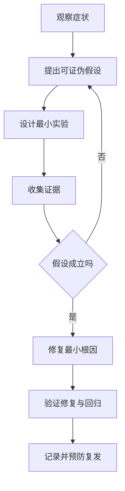
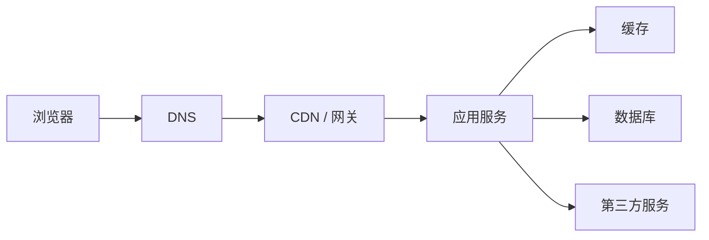

> **学完这一篇，你应该能**
> - 把“系统坏了”转化为可验证的问题描述；
> - 用复现、分层、对照和二分法逐步缩小原因范围；
> - 区分相关性、症状、触发条件和根因；
> - 在生产环境中安全收集证据并验证修复。

---

## 1. 调试不是猜答案，而是减少不确定性

低效排错常见循环：

```text
看到报错 → 凭印象改一处 → 重启 → 仍然失败 → 再随机改一处
```

系统化排错更像实验：



每一步都应该让可能原因变少。若一次改了五处，即使问题消失，也很难知道真正原因，甚至可能埋下新问题。

---

## 2. 先写出精确症状

“网站打不开”信息太少。更好的描述是：

> 2026-09-07 14:20 起，中国大陆移动网络用户访问 `/checkout` 时，约 30% 请求在 10 秒后返回 504；首页正常，已登录与未登录用户都受影响。

至少记录：

- 预期结果和实际结果；
- 首次发生时间、频率、持续时长；
- 哪些用户、地区、设备、版本受影响；
- 哪些路径正常；
- 错误码、请求 ID、日志和截图；
- 最近有哪些发布、配置、数据或依赖变化。

“什么没有坏”与“什么坏了”同样有价值，它能帮你划定边界。

---

## 3. 先复现，再修改

可重复复现是排错的巨大加速器。把问题压缩成：

```text
给定：用户余额 100，两个请求同时扣款
操作：并发发送两次 80 元扣款
结果：两个请求都成功
预期：至多一个成功
```

好的复现应尽量：

- 步骤最少；
- 输入固定；
- 环境可记录；
- 不依赖人工时机；
- 能连续运行并统计频率。

若只能在生产复现，不要冒险修改真实数据。先用只读证据、流量回放、匿名化样本、影子环境或最小诊断开关缩小范围。

---

## 4. 按层定位：请求在哪一段开始出错

一个页面请求可能经过：



每层问两个问题：

1. 输入到达这里时是否正确？
2. 从这里输出时是否已经错误？

例：

- 浏览器 Network 面板看到请求根本没发出：检查前端逻辑、CORS、Service Worker；
- 网关有请求，应用没有日志：检查路由、服务发现、超时；
- 应用返回 500：根据请求 ID 看异常堆栈；
- 应用耗时主要在 SQL：查看锁等待和查询计划；
- 数据库很快，但总延迟高：检查连接池排队、序列化和下游调用。

分层定位可以避免在前端问题上重建索引，也避免在数据库锁等待时盲目扩容 Web 服务。

---

## 5. 阅读错误信息的顺序

一个异常通常包含：

- 错误类型和消息；
- 调用栈；
- 源文件与行号；
- 原始原因（cause）；
- 请求和环境上下文。

建议从最具体的首个业务错误读起，而不是只看最后一句“请求失败”。异步调用和封装层可能重复包装异常，要沿 `cause` 找到最初失败点。

```text
PaymentError: charge failed
  caused by HttpError: 401 Unauthorized
    caused by TokenExpired: credential expired at ...
```

不要把整个错误文本原样展示给最终用户，其中可能包含路径、SQL、令牌或内部架构。用户看到稳定错误码与可行动提示，详细上下文进入受控日志。

---

## 6. 用假设表避免漫无目的

| 假设 | 支持证据 | 反对证据 | 最小验证方法 |
|---|---|---|---|
| 数据库变慢 | API P99 上升 | DB CPU 正常 | 查看慢查询与连接等待 |
| 新版本引入 | 故障紧随发布 | 旧实例也异常 | 按版本分组错误率 |
| 第三方超时 | 调用耗时集中在下游 | 健康检查正常 | 查看单请求 Trace 与超时计数 |

一个好假设必须可被推翻。例如“可能是缓存有问题”太宽；“商品缓存反序列化失败，因为新旧版本字段不兼容”可以通过抽取具体 Key 和比较 Schema 验证。

---

## 7. 对照实验与一次只改一个变量

找到一个正常样本和一个异常样本，对比：

- 用户或租户；
- 请求参数；
- 应用版本；
- 数据库记录；
- 服务器区域；
- 浏览器和操作系统；
- 权限与功能开关；
- 时间窗口。

若只有大文件上传失败，小文件正常，优先检查体积相关限制和超时；若只有一个租户失败，优先检查其数据形态和配置，而不是先怀疑全局网络。

实验时一次只改变一个关键变量，结果才有解释力。

---

## 8. 二分法：快速缩小搜索空间

当回归发生在一长串提交中，可以用版本二分：

```text
已知正常提交 ───────── 多个提交 ───────── 已知异常提交
                         ↑
                  每次测试中间点
```

Git 的 `bisect` 能自动协助这个过程。二分也适用于：

- 大配置文件：禁用一半规则；
- 大数据集：用一半数据复现；
- 服务链：在中间层检查输入输出；
- 复杂表达式：逐步移除一半条件；
- 时间线：查找指标第一次偏离的时刻。

前提是有可靠的“好/坏”判断。若复现本身随机，先提高重复次数或找到更稳定的判据。

---

## 9. 断点、日志与追踪分别适合什么

### 断点调试

适合本地观察控制流、变量和调用栈。可以单步执行和条件暂停。但暂停会改变并发时序，不适合所有竞争问题，也不应随意附加到生产进程。

### 日志

适合记录跨时间发生的离散事件。临时日志要包含请求 ID 和必要上下文，避免在高频循环中打印巨量内容。

### 分布式追踪

适合跟随一个请求穿过多个服务，定位时间花在何处、哪一个依赖失败。详见 [5.2 日志、指标与链路追踪](/blog/5-2-日志-指标与链路追踪)。

工具只是观察窗口。关键仍是先有问题和假设，再选择能区分假设的证据。

---

## 10. 网络问题怎样定位

按层检查：

```text
域名解析 → TCP/QUIC 连接 → TLS → HTTP → 应用协议 → 业务响应
```

要区分：

- DNS 没有返回地址；
- 连接被拒绝；
- 连接超时；
- TLS 证书或名称验证失败；
- HTTP 4xx / 5xx；
- 网关超时，但后端最终可能已执行；
- 浏览器因 CORS 拒绝把响应交给脚本。

`ping` 通不通不能证明 HTTPS 服务是否正常；服务器也可能禁用 ICMP。使用与真实请求相同的协议、域名、网络和身份验证来复现。参见 [1.2 计算机之间的通信：网络](/blog/1-2-计算机之间的通信-网络) 与 [3.6 Web 安全基础](/blog/3-6-web-安全基础)。

---

## 11. 数据库问题怎样定位

先区分四类时间：

- 获取连接的等待；
- 等待锁；
- 数据库执行 SQL；
- 结果传输和应用处理。

常用证据：

- 慢查询日志；
- `EXPLAIN (ANALYZE, BUFFERS)`；
- 活跃会话和锁等待；
- 连接池使用率；
- 估计行数与实际行数；
- CPU、I/O、缓存命中与复制延迟。

不要看到 CPU 高就立刻加机器。可能是一条缺索引查询，也可能是正常高吞吐。不要看到某条 SQL 慢就立即加索引，它可能被锁住而根本没在执行。参见 [4.3 索引为什么能加速查询](/blog/4-3-索引为什么能加速查询) 与 [4.4 事务、并发与隔离级别](/blog/4-4-事务-并发与隔离级别)。

---

## 12. 异步与并发问题

常见症状：偶发、难复现、加日志后消失、只在高负载出现。

检查方向：

- Promise 是否漏掉 `await`；
- 错误是否在异步边界被吞掉；
- 多个任务是否写同一状态；
- 是否假设回调按发起顺序完成；
- 取消后旧请求是否仍覆盖新结果；
- 重试是否造成重复副作用；
- 锁顺序是否可能死锁；
- 队列是否有背压。

可以用固定随机种子、并发屏障、故障注入、重复运行和逻辑时钟，让竞争更容易暴露。参见 [2.9 异步、事件循环与 Promise](/blog/2-9-异步-事件循环与-promise)。

---

## 13. 性能问题：先测量，再优化

总响应时间可以粗略分解为：

```text
排队 + 应用计算 + 数据库 + 缓存 + 下游网络 + 序列化 + 客户端渲染
```

不同工具回答不同问题：

- Profiler：CPU 时间花在哪些函数；
- Heap Snapshot：哪些对象占内存、是否泄漏；
- Flame Graph：调用栈上的资源分布；
- 浏览器 Performance：脚本、布局、绘制和长任务；
- 查询计划：数据库如何访问数据；
- Trace：跨服务的端到端等待。

关注 P50、P95、P99 等分位数，按接口、地区、版本和结果状态分组。平均值会把少数极慢请求隐藏掉。

一次优化后必须重新测量。有时缓存减少数据库时间，却增加序列化和一致性成本；有时并行请求缩短单次延迟，却压垮下游。

---

## 14. 生产事故中先止血还是先找根因

用户正在受影响时，优先降低影响：

- 回滚可疑发布；
- 关闭新功能开关；
- 限流或降级非关键能力；
- 切换健康副本；
- 扩容已确认饱和的资源。

止血措施仍应保留证据，并由明确负责人执行。系统稳定后，再做深入根因分析。

根因分析不应停在“某工程师配置错了”。继续问：

- 为什么错误配置能通过评审和自动检查？
- 为什么发布没有逐步放量？
- 为什么告警晚于用户反馈？
- 为什么回滚困难？
- 哪项机制可以降低同类问题再次发生的概率或影响？

目标是改进系统，不是寻找替罪者。

---

## 15. 验证修复

“报错不见了”还不够。完整验证包括：

1. 原复现步骤从失败变为成功；
2. 能解释修复为什么针对根因；
3. 增加一个修复前失败、修复后通过的回归测试；
4. 检查相邻功能和异常路径；
5. 在相近数据规模与并发下测试；
6. 小流量上线，观察错误率、延迟和业务指标；
7. 准备回滚条件。

若无法稳定复现，应明确说“症状暂未再次出现”，而不是宣称根因已修复。

---

## 16. 一份可复用的排错记录

```text
症状：
影响范围：
首次发生时间：
预期 / 实际：
最小复现：
正常样本与异常样本：
近期变化：

假设 1：
验证方法：
结果：

根因：
临时缓解：
永久修复：
回归测试：
上线验证：
后续预防：
```

高质量调试的产物不仅是一个补丁，还包括可复用知识：以后同类问题能否更早发现、更快定位、更安全恢复。

---

## 延伸阅读

- [Chrome DevTools：Debug JavaScript](https://developer.chrome.com/docs/devtools/javascript/)
- [Git：git bisect](https://git-scm.com/docs/git-bisect)
- [PostgreSQL：Using EXPLAIN](https://www.postgresql.org/docs/current/using-explain.html)
- [Google SRE：Postmortem Culture](https://sre.google/sre-book/postmortem-culture/)
