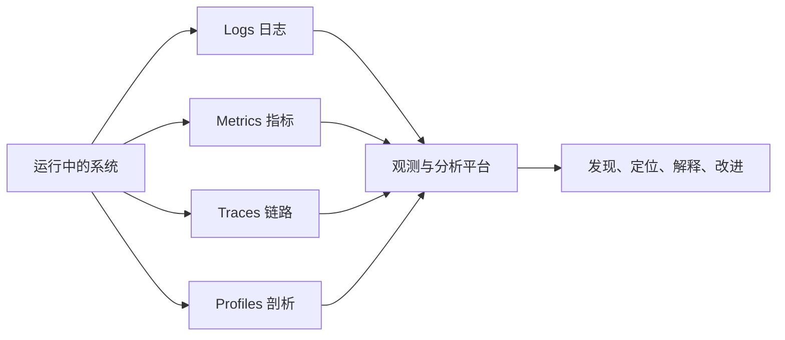
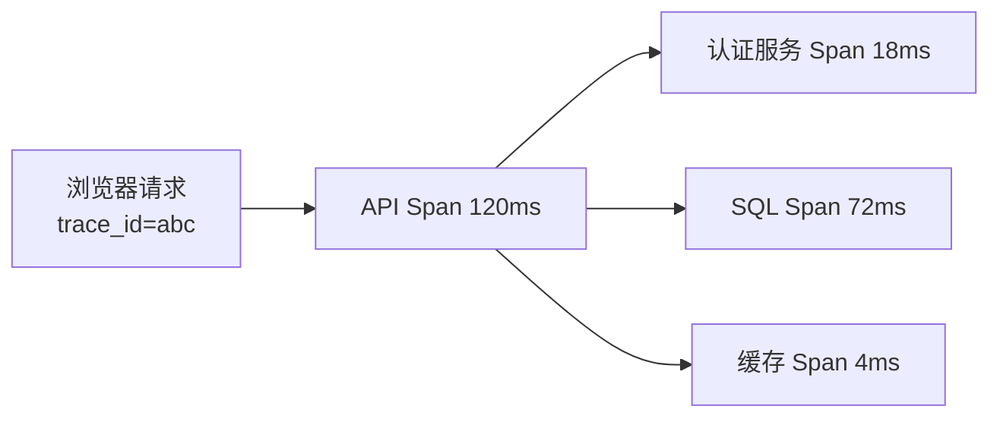
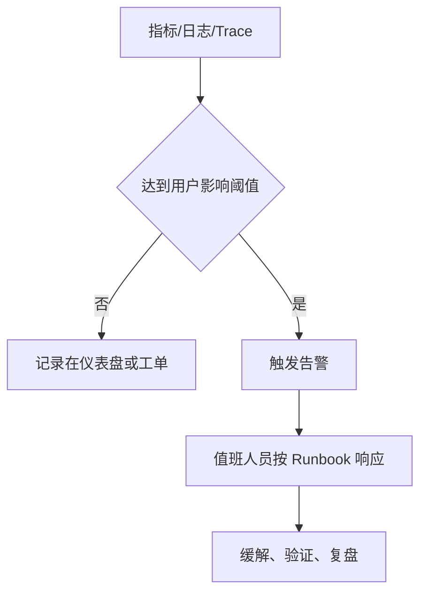

> **学完这一篇，你应该能**
> - 区分监控与可观测性；
> - 理解日志、指标、Trace 和 Profile 分别回答什么问题；
> - 用 SLI、SLO 和错误预算描述用户实际获得的可靠性；
> - 设计低噪声告警，并让一次请求能跨服务关联起来。

---

## 1. 从“系统活着”到“用户得到正确服务”

服务器进程仍在运行，不代表用户可以完成支付；CPU 正常，也不代表查询结果正确。

**监控（monitoring）**通常针对已知问题收集数据并设置告警，例如“5xx 比例超过 2%”。

**可观测性（observability）**强调能否根据系统外部输出，理解内部发生了什么，尤其是事先没有预料到的问题。

两者不是对立概念：监控负责持续看守关键条件，可观测性为调查未知问题提供足够证据。



---

## 2. 四类信号分别回答什么

| 信号 | 形态 | 最适合回答 |
|---|---|---|
| 日志 Logs | 带时间和上下文的事件记录 | “具体发生了什么错误？” |
| 指标 Metrics | 随时间聚合的数值 | “问题多大、从何时开始？” |
| 链路 Traces | 一个请求跨组件的路径 | “时间花在哪一跳？” |
| 剖析 Profiles | 代码级资源使用采样 | “CPU 或内存具体耗在哪？” |

它们应互相连接，而不是四座信息孤岛。例如从错误率图选中异常时段，跳到一个慢 Trace，再用 `trace_id` 找相关日志，最后用 Profile 确认 CPU 热点。

---

## 3. 日志：记录有意义的事件

不推荐只有一串不可解析文本：

```text
something went wrong for user 42
```

结构化日志更容易检索和聚合：

```json
{
  "timestamp": "2026-09-07T06:32:10.481Z",
  "level": "error",
  "service": "order-api",
  "environment": "production",
  "event": "payment_authorization_failed",
  "request_id": "req_8bf2",
  "trace_id": "7bba9f...",
  "order_id": "ord_9281",
  "provider": "example-pay",
  "error_code": "provider_timeout",
  "duration_ms": 3012
}
```

字段名和语义应稳定，使机器可以统计“各错误码数量”，而不必解析自然语言。

### 日志级别

| 级别 | 用途 |
|---|---|
| DEBUG | 开发或短期诊断的细节 |
| INFO | 正常但重要的业务/生命周期事件 |
| WARN | 异常但系统还能处理，需要关注趋势 |
| ERROR | 当前操作失败，需要调查或补偿 |

若每个请求都打印数十条 INFO，真正错误会被淹没，存储费用也会增长。级别应代表行动意义，而不是开发者心情。

---

## 4. 日志里不能随便放什么

通常不应记录：

- 密码、验证码、访问令牌、Cookie；
- 完整银行卡号和安全码；
- 私钥、数据库连接串；
- 不必要的身份证号、电话、邮箱、精确地址；
- 完整请求体和响应体，尤其含敏感数据时。

必要标识可做脱敏、哈希或使用内部不透明 ID。日志系统同样需要访问控制、加密、保留期限和删除策略。

要防止**日志注入**：用户输入中的换行和控制字符可能伪造日志记录。结构化编码比字符串拼接更安全，但仍要限制字段大小。

---

## 5. 指标：看趋势、比例与分布

常见指标类型：

- **Counter**：只增不减的累计计数，如请求数；重启可归零，分析时看增长率；
- **Gauge**：可增可减的瞬时值，如队列长度、内存使用；
- **Histogram**：把大量观测放入区间，用于计算延迟和大小分布。

以 HTTP 服务为例，最常用的是 RED：

- **Rate**：每秒请求量；
- **Errors**：失败数量或比例；
- **Duration**：耗时分布。

对 CPU、磁盘、连接池等资源，可用 USE：

- **Utilization**：使用率；
- **Saturation**：排队或超出处理能力的程度；
- **Errors**：资源错误。

业务指标也很关键：支付成功率、注册完成率、消息积压年龄可能比 CPU 更接近用户体验。

---

## 6. 为什么看分位数，不只看平均值

假设 99 个请求耗时 100 ms，一个请求耗时 10 秒：

```text
平均值约 199 ms
P50 约 100 ms
P99 接近 10 s
```

平均值看起来还能接受，但尾部用户体验很差。常见分位数：

- P50：典型用户体验；
- P95：较慢的一批；
- P99/P99.9：尾部问题，容易受排队和少数依赖故障影响。

分位数不能在所有情况下直接取平均。使用直方图桶或支持可合并分布的遥测方法，才能正确聚合多实例结果。

---

## 7. 指标标签与高基数陷阱

指标常带标签：

```text
http_requests_total{
  service="order-api",
  route="/orders/:id",
  method="GET",
  status="200"
}
```

每一种标签组合都会产生新的时间序列。不要把 `user_id`、`request_id`、完整 URL 或随机错误消息作为指标标签，否则序列数量可能爆炸。

经验分工：

- 指标标签使用有限、可枚举的维度，如服务、路由模板、状态类别；
- 单个请求和用户细节放日志或 Trace；
- 需要跨信号跳转时用 exemplars、trace ID 等关联方式。

---

## 8. 分布式追踪：给请求一条完整路径

一次请求经过多个组件时，每个操作片段称为 Span，多个父子 Span 组成 Trace：



Span 通常包含：

- 名称、开始和结束时间；
- `trace_id`、`span_id`、父 Span；
- 服务、版本、环境；
- 路由、数据库操作类型等属性；
- 状态和异常事件。

请求上下文必须沿 HTTP Header、消息属性等边界传播，才能把不同进程的 Span 组装起来。W3C Trace Context 定义了常用的跨服务传播格式。

不要把秘密和大量正文放入 Span 属性；追踪系统同样有安全和成本边界。

---

## 9. 采样：不一定保存每一条 Trace

高流量系统保存全部 Trace 可能成本过高。常见策略：

- 头部采样：请求开始时决定是否采样，简单但可能漏掉后来才知道的错误；
- 尾部采样：收集完成后根据错误、延迟等决定保留，更有价值但需要缓冲和集中决策；
- 概率采样：按比例保留；
- 规则采样：提高错误、慢请求或关键租户的保留率。

无论采用什么策略，都要避免不同服务各自随意决定导致链路残缺，并记录采样率以便正确估算。

---

## 10. SLI、SLO 与 SLA

### SLI：实际测量值

服务水平指标，例如：

```text
成功率 = 满足条件的成功请求数 / 有效请求总数
```

### SLO：内部可靠性目标

例如“滚动 30 天内，创建订单请求成功率达到 99.9%”。SLO 要明确：

- 哪些请求计入；
- 成功如何定义；
- 时间窗口；
- 数据来源；
- 计划维护是否排除。

### SLA：对外承诺

SLA 通常是合同或商业承诺，可能包含违约补偿。它不应与内部 SLO 混为一谈；内部目标往往比外部承诺更严格，留出响应空间。

---

## 11. 错误预算

如果 SLO 是 99.9%，在一个 30 天窗口内允许约 0.1% 的不达标事件或时间，这部分容忍度称为错误预算。

错误预算帮助团队讨论取舍：

- 预算充足，可以更积极迭代；
- 消耗过快，降低发布速度，优先修复可靠性；
- 已耗尽，停止高风险变更，聚焦恢复。

它不是鼓励故障，而是承认 100% 可靠通常成本无限，同时用用户可感知的目标约束发布决策。

---

## 12. 告警应该要求人采取行动

一个好告警能回答：

- 用户是否正在受影响；
- 严重程度和范围多大；
- 谁负责响应；
- 第一份仪表盘和 Runbook 在哪里；
- 何时自动恢复，何时需要升级处理。

优先对症状告警，例如“订单成功率低于 SLO”，而不是对每次 CPU 短暂升高呼叫人员。资源告警只有在能预示用户影响或需要明确行动时才值得打断人。



应避免：

- 一个事故触发数百条重复告警；
- 阈值在边界来回抖动；
- 没有责任人或处理手册；
- 告警只说“某值为 83”，却不说明影响；
- 长期没人处理的告警仍保留。

---

## 13. 健康检查有不同深度

| 检查 | 回答的问题 | 注意点 |
|---|---|---|
| Liveness | 进程是否卡死，需要重启？ | 不要因短暂下游故障造成重启风暴 |
| Readiness | 当前实例是否能接收流量？ | 未预热、正在关闭时应摘流量 |
| Startup | 启动是否仍在正常进行？ | 给慢启动应用合理时间 |
| Synthetic | 外部用户路径是否可完成？ | 应覆盖 DNS、TLS、网关等黑盒路径 |

健康接口返回 200 只说明它检查到的内容健康。若只返回固定字符串，它无法证明数据库、权限或核心交易流程可用。

---

## 14. 仪表盘如何避免“看起来很忙”

服务首页仪表盘可先放：

- 请求量、错误率、延迟分位数；
- 关键业务成功率；
- 当前发布版本和部署标记；
- 下游依赖错误与延迟；
- 连接池、队列积压和资源饱和；
- SLO 与错误预算消耗。

支持按环境、区域、版本、路由和状态下钻。图表应标单位、时间范围和阈值，避免使用截断坐标制造视觉误导。

部署事件要标到图上。若错误率恰好在新版本放量时上升，版本维度是强线索，但仍需进一步验证因果关系。

---

## 15. 可观测性也需要治理

遥测不是越多越好。需要管理：

- 采样率和保留期；
- 指标基数；
- 日志级别和字段标准；
- 隐私、权限和数据驻留；
- SDK 与采集器失败时的资源边界；
- 存储与查询成本；
- 时钟同步；
- 服务名、路由名和错误码规范。

遥测管道故障不应拖垮业务请求。导出通常应异步、有界缓冲，满时按照明确策略丢弃或降采样，并监控“观测系统本身是否健康”。

---

## 16. 从零搭建的顺序

1. 为每个请求生成或接收请求 ID；
2. 输出结构化日志，统一服务、环境、版本和错误码；
3. 建立请求量、错误率和延迟直方图；
4. 定义一两个核心用户旅程的 SLI/SLO；
5. 为数据库和外部 HTTP 调用接入 Trace；
6. 让日志包含 `trace_id`，支持跨信号跳转；
7. 建服务首页仪表盘和少量可行动告警；
8. 编写 Runbook，定期演练；
9. 根据实际排错缺口补信号，而不是无限采集。

最好的可观测性系统不是拥有最多图表，而是事故发生时能迅速回答：谁受影响、从何时开始、哪一层异常、刚刚改变了什么，以及缓解是否有效。

---

## 延伸阅读

- [OpenTelemetry：Signals](https://opentelemetry.io/docs/concepts/signals/)
- [OpenTelemetry：Traces](https://opentelemetry.io/docs/concepts/signals/traces/)
- [W3C：Trace Context](https://www.w3.org/TR/trace-context/)
- [Google SRE：Monitoring Distributed Systems](https://sre.google/sre-book/monitoring-distributed-systems/)
- [Google SRE Workbook：Implementing SLOs](https://sre.google/workbook/implementing-slos/)
