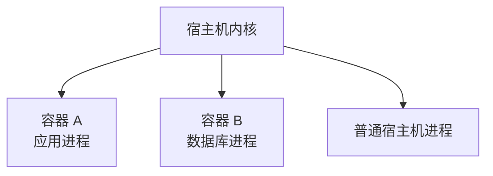
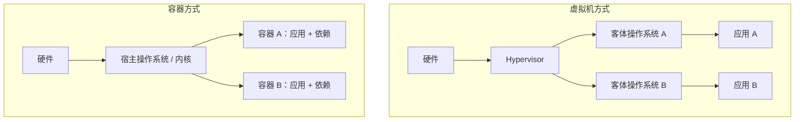
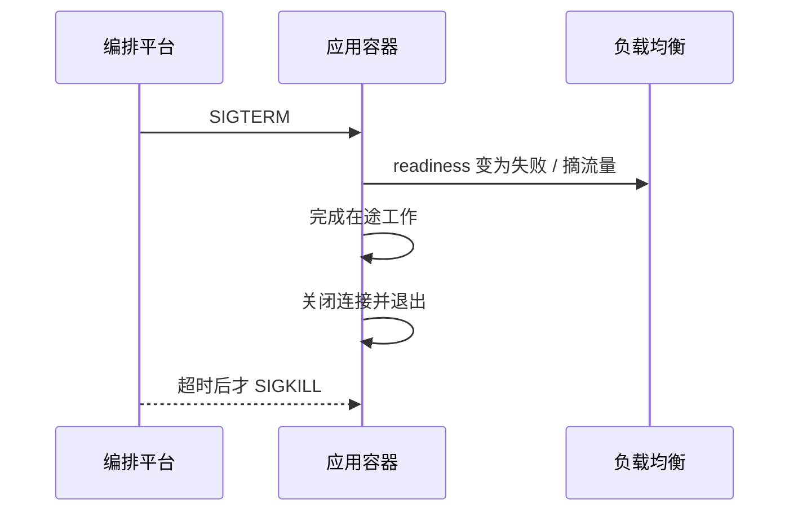
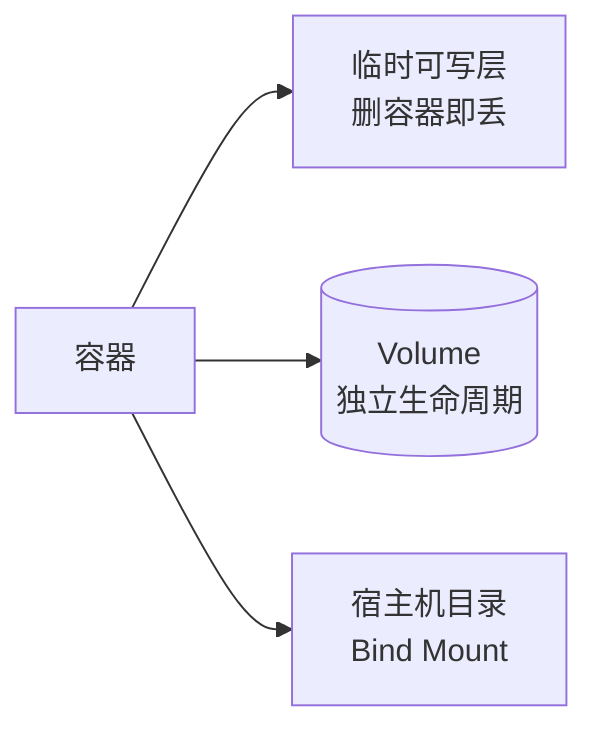

> **学完这一篇，你应该能**
> - 区分镜像、容器、虚拟机和 Dockerfile；
> - 理解容器的进程、文件、网络和数据边界；
> - 写出基本的多阶段构建，并用 Compose 组合多个服务；
> - 避免把秘密写入镜像、以 root 运行和丢失持久数据等问题。

---

## 1. 容器首先是一个受隔离的进程

容器不是一台缩小版实体电脑。它本质上仍是宿主机上的进程，只是操作系统给它提供了隔离视图和资源边界：

- Namespace 让进程看到独立的进程号、网络、挂载点等；
- cgroup 限制和统计 CPU、内存等资源；
- 分层文件系统提供镜像内容和容器可写层；
- 安全机制限制进程能够执行的系统操作。



Linux 容器共享宿主机内核，所以启动快、额外开销较小。共享内核也意味着它的隔离边界通常不同于完整虚拟机。

在 macOS 或 Windows 上运行 Linux 容器时，Docker Desktop 通常先运行一个轻量 Linux 虚拟机，容器再共享这个虚拟机的 Linux 内核。

---

## 2. 容器与虚拟机



| 维度 | 容器 | 虚拟机 |
|---|---|---|
| 内核 | 通常共享宿主内核 | 每台有自己的客体内核 |
| 启动 | 常为秒级甚至更快 | 通常更慢 |
| 资源开销 | 较小 | 较大 |
| 隔离边界 | 进程级，依赖内核机制 | 通常更强的硬件虚拟化边界 |
| 操作系统灵活性 | 受宿主内核类型约束 | 可运行不同客体操作系统 |

两者可以叠加使用：云虚拟机提供租户隔离，虚拟机内部再用容器部署应用。

---

## 3. 镜像与容器

**镜像（image）**是运行应用所需文件、运行时、库和配置的只读模板。

**容器（container）**是从镜像启动的进程及其运行状态。

```text
Dockerfile --build--> Image --run--> Container
                                  ├─ Container
                                  └─ Container
```

同一个镜像可以启动多个容器。镜像内容是不可变的；容器运行时会增加临时可写层。删除容器后，这个可写层通常也随之删除。

因此，“进入容器手工修改文件”不能作为正式部署方式。正确做法是修改 Dockerfile 或源代码，构建新镜像，再替换容器。

---

## 4. 镜像为什么有很多层

Dockerfile 的许多指令会产生文件系统层：

```dockerfile
FROM node:24-alpine
WORKDIR /app
COPY package.json package-lock.json ./
RUN npm ci
COPY . .
RUN npm run build
CMD ["node", "dist/server.js"]
```

层可以在镜像间共享，也可以被构建缓存复用。如果依赖清单没变，`npm ci` 对应的层可能不必重建。

所以先复制依赖清单、安装依赖，再复制经常变化的源码，通常比一开始 `COPY . .` 更能利用缓存。

但缓存不应掩盖过期依赖。生产镜像要有定期重建策略，并明确基础镜像版本和安全更新方式。

---

## 5. 构建上下文与 `.dockerignore`

运行构建命令时，会把一个目录作为**构建上下文**交给构建器。`COPY` 只能读取上下文中的内容。

不要把无关或敏感文件发送进上下文：

```text
node_modules
.git
.env
coverage
dist
*.log
```

将这些规则放在 `.dockerignore` 中，可以：

- 减少传输和构建时间；
- 避免缓存因无关文件变化而失效；
- 降低秘密被意外复制进镜像的风险。

即使某个秘密后来在下一层被删除，它也可能仍存在于旧层历史中。秘密不应通过普通 `COPY` 或 `ENV` 烘焙进镜像；构建时使用专用 secret mount，运行时由平台注入。

---

## 6. 多阶段构建：构建环境与运行环境分离

前端或 TypeScript 服务需要编译工具，但生产运行未必需要它们：

```dockerfile
# syntax=docker/dockerfile:1
FROM node:24-alpine AS build
WORKDIR /app
COPY package.json package-lock.json ./
RUN npm ci
COPY . .
RUN npm run build

FROM node:24-alpine AS runtime
WORKDIR /app
ENV NODE_ENV=production
COPY package.json package-lock.json ./
RUN npm ci --omit=dev && npm cache clean --force
COPY --from=build /app/dist ./dist
USER node
EXPOSE 3000
CMD ["node", "dist/server.js"]
```

第一个阶段负责编译；第二阶段只复制运行必需内容。好处包括：

- 最终镜像更小；
- 不携带编译器和开发工具，攻击面更小；
- 构建步骤仍保留在一个可重复文件里。

这只是示例。真实项目还需确认依赖安装脚本、原生模块、文件权限和进程如何接收退出信号。

---

## 7. `RUN`、`CMD` 与 `ENTRYPOINT`

| 指令 | 发生时间 | 作用 |
|---|---|---|
| `RUN` | 构建镜像时 | 安装依赖、编译等，结果进入镜像层 |
| `CMD` | 容器启动时 | 提供默认启动命令或默认参数 |
| `ENTRYPOINT` | 容器启动时 | 定义固定可执行入口，参数通常追加其后 |

优先使用 JSON 数组形式：

```dockerfile
CMD ["node", "dist/server.js"]
```

它避免额外 Shell 解析，并让应用更直接地接收终止信号。若启动脚本还要做迁移、生成配置等工作，要正确使用 `exec` 转交 PID 1，并处理失败退出。

---

## 8. 容器内的 PID 1 与优雅退出

容器停止时，运行平台通常先发送终止信号，等待一段时间，再强制杀死。应用收到信号后应：

1. 停止接收新请求；
2. 等待进行中的请求在上限内结束；
3. 停止消费新消息；
4. 刷新必要缓冲；
5. 关闭数据库连接；
6. 正常退出。



如果应用忽略信号，每次部署都可能中断请求或重复处理消息。

---

## 9. 端口映射与容器网络

容器内服务监听 `3000`，并不自动对宿主机开放：

```text
宿主机 8080  ──映射──>  容器 3000
```

```bash
docker run --rm -p 8080:3000 my-api
```

这里浏览器访问宿主机 `localhost:8080`，Docker 把流量转给容器的 3000 端口。

在 Compose 网络中，服务通常通过**服务名**互相访问：

```text
api 连接 postgres:5432
```

不是连接 `localhost:5432`。对 `api` 容器而言，`localhost` 指向它自己，而不是数据库容器或宿主机。

`EXPOSE 3000` 主要描述镜像预期监听端口，本身不等于发布到公网。

---

## 10. 数据卷与绑定挂载

### 容器可写层

随容器删除，适合临时文件和可重建缓存。

### Volume

由 Docker 管理，生命周期独立于容器，适合数据库数据等持久内容。

### Bind Mount

把宿主机明确路径挂入容器，适合开发时同步源码或注入配置，但更依赖宿主环境。



Volume 不是备份。误删数据、逻辑损坏和磁盘故障仍会影响它，需要独立备份和恢复演练。

---

## 11. 用 Compose 组合本地服务

```yaml
services:
  api:
    build: .
    ports:
      - "3000:3000"
    environment:
      DATABASE_URL: postgres://app:dev-password@db:5432/app
    depends_on:
      db:
        condition: service_healthy

  db:
    image: postgres:17
    environment:
      POSTGRES_USER: app
      POSTGRES_PASSWORD: dev-password
      POSTGRES_DB: app
    volumes:
      - db-data:/var/lib/postgresql/data
    healthcheck:
      test: ["CMD-SHELL", "pg_isready -U app -d app"]
      interval: 5s
      timeout: 3s
      retries: 10

volumes:
  db-data:
```

Compose 适合在本地或单机上描述多个容器、网络和卷。示例密码只适合本地开发，不能提交真实生产秘密。

`depends_on` 能控制一定的启动依赖，但服务仍必须自己处理数据库重启、短暂不可用和网络断开。分布式系统中没有一次启动顺序能保证依赖永远健康。

---

## 12. 配置与秘密

镜像应尽量在不同环境复用，环境差异在运行时注入：

```text
同一镜像 sha256:abc...
  ├─ 开发：不同数据库地址和日志级别
  ├─ 预发布：测试凭据
  └─ 生产：生产配置和受控秘密
```

配置可来自环境变量或挂载文件。秘密应由平台的秘密管理能力提供，并遵循：

- 最小权限；
- 不进入 Git、镜像层或构建日志；
- 可轮换；
- 有访问审计；
- 不通过命令行参数暴露给进程列表；
- 应用日志主动脱敏。

环境变量使用方便，但也不是天然的保险箱；要考虑进程转储、调试界面和平台权限。

---

## 13. 资源限制与 OOM

没有限制的容器可能占满宿主机。运行平台应为容器设置合理 CPU 和内存边界。

达到内存上限时，进程可能被 OOM Killer 终止。应用内部看到的可用内存也可能与宿主机总内存不同，语言运行时需要正确识别容器限制。

设置限制前要测量：

- 正常与峰值内存；
- 启动和稳定期 CPU；
- 垃圾回收抖动；
- 并发请求对内存的放大；
- 超限后的重启和流量转移行为。

限制太低会频繁重启，太高则失去隔离和调度价值。

---

## 14. 容器安全基础

- 选择可信且尽量小的基础镜像；
- 固定合适版本或 digest，并有自动更新流程；
- 多阶段构建，不带入编译器和无关工具；
- 使用非 root 用户；
- 移除不需要的 Linux capabilities；
- 尽量使用只读根文件系统和明确可写目录；
- 扫描镜像和依赖漏洞；
- 不把 Docker Socket 挂入普通应用容器；
- 不以 `--privileged` 解决权限问题；
- 对镜像来源、构建过程和签名建立供应链记录。

容器是安全边界的一部分，不是完整安全方案。宿主机内核、编排权限、网络策略和应用漏洞仍然重要。

---

## 15. 常用排查思路

| 症状 | 优先检查 |
|---|---|
| 容器一启动就退出 | 进程日志、退出码、CMD、配置 |
| 宿主机访问不到 | 进程监听地址、端口映射、防火墙 |
| 容器访问不到数据库 | 服务名、网络、端口、健康状态、凭据 |
| 重建后数据丢失 | 是否写在临时层、Volume 是否正确挂载 |
| 镜像特别大 | 构建上下文、层内容、多阶段构建、缓存文件 |
| 本地正常线上失败 | 架构、CPU 指令、文件权限、只读目录、配置差异 |
| 无故重启 | OOM、健康检查、退出信号、平台事件 |

排查时先确认进程是否存在、监听什么地址、收到什么配置、使用哪个镜像 digest，再逐层检查网络和依赖。参见 [5.1 调试与系统化排错](/blog/5-1-调试与系统化排错)。

---

## 16. 容器化不等于自动获得云能力

Docker 能让运行环境更可重复，但不会自动提供：

- 多机器调度；
- 自动扩缩容；
- 服务发现和负载均衡；
- 滚动发布；
- 跨节点持久存储；
- 高可用数据库；
- 日志、指标和告警；
- 备份和灾难恢复。

这些通常由云平台、Kubernetes、托管服务或其他编排系统承担。是否需要复杂编排，取决于规模和可靠性目标；单机 Compose 对许多小系统已经足够。

下一篇 [CI/CD 与可靠发布](/blog/6-1-ci-cd-与可靠发布) 会解释如何将镜像安全地从一次提交送到生产环境。

---

## 延伸阅读

- [Docker：What is a container?](https://docs.docker.com/get-started/docker-concepts/the-basics/what-is-a-container/)
- [Docker：What is an image?](https://docs.docker.com/get-started/docker-concepts/the-basics/what-is-an-image/)
- [Docker：Multi-stage builds](https://docs.docker.com/build/building/multi-stage/)
- [Docker：Building best practices](https://docs.docker.com/build/building/best-practices/)
- [Docker：Persisting container data](https://docs.docker.com/get-started/docker-concepts/running-containers/persisting-container-data/)
