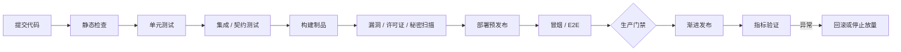
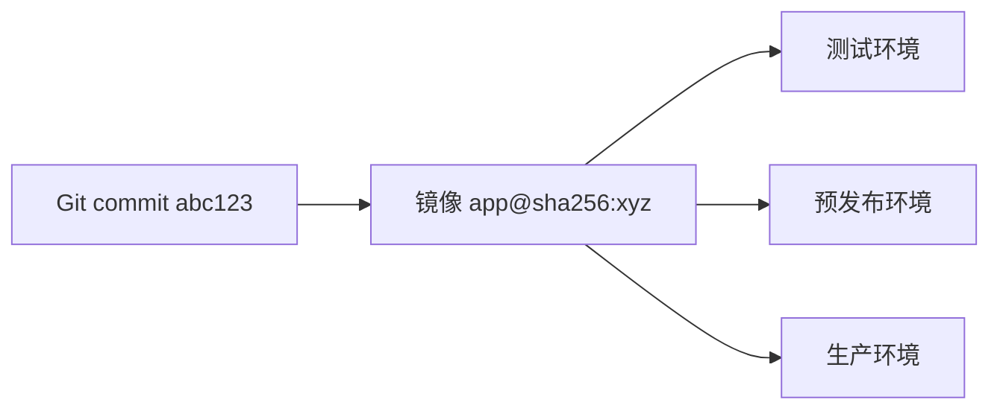
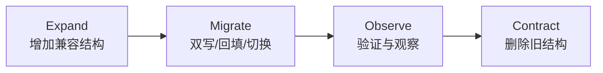

> **学完这一篇，你应该能**
> - 区分持续集成、持续交付和持续部署；
> - 设计“构建一次、逐环境提升”的流水线；
> - 理解滚动、蓝绿、金丝雀发布和功能开关的取舍；
> - 为数据库迁移、秘密、回滚和供应链安全设置护栏。

---

## 1. CI/CD 解决的是变更风险

软件事故常不是因为系统从未工作，而是因为一次变更破坏了原有行为。CI/CD 把构建、检查、发布和验证变成可重复流程，缩短从修改到反馈的距离。

### Continuous Integration：持续集成

开发者频繁把小变更合入共享主线，每次自动构建和测试，尽早发现冲突。

### Continuous Delivery：持续交付

通过自动化，让任意合格版本随时具备发布条件；是否发布到生产可以由人批准。

### Continuous Deployment：持续部署

每个通过全部条件的变更自动进入生产，不再需要人工点击发布。

中文语境中两者都常被简称 CD，要根据上下文区分。

---

## 2. 一条典型流水线



每一关都应回答清楚的问题：

- 失败是否会阻止后续步骤；
- 证据和日志在哪里；
- 谁可以重跑、跳过或批准；
- 超时和取消后是否留下半成品；
- 同一版本如何追踪到源提交。

---

## 3. 快速反馈与分层执行

把便宜、容易失败的检查放前面：

```text
格式/类型（秒） → 单元测试（分钟） → 集成/E2E（更久） → 部署
```

独立任务可以并行，例如前端测试、后端测试、依赖扫描。但不要让并行隐藏顺序依赖：构建制品应在所有必要检查通过后才发布。

耗时大的非阻塞检查可以夜间运行，但关键安全和正确性检查必须处于合并或发布路径上。一个“失败但大家习惯忽略”的 CI 形同虚设。

测试策略见 [5.0 测试的层次](/blog/5-0-测试的层次)。

---

## 4. Build Once, Promote Many

推荐只构建一次不可变制品，然后把同一个制品从测试环境提升到生产：



若每个环境重新构建，即使源代码相同，也可能因基础镜像、依赖仓库或时间变化得到不同内容。这样测试过的并不是最终上线的制品。

每个制品应能追溯：

- 源代码提交；
- 构建流程版本；
- 依赖和基础镜像；
- 测试结果；
- 签名、摘要和发布时间；
- 部署到了哪些环境。

环境差异通过运行时配置注入，参见 [6.0 Docker 与容器化](/blog/6-0-docker-与容器化)。

---

## 5. 一个简化的 GitHub Actions 示例

```yaml
name: ci

on:
  pull_request:
  push:
    branches: [main]

permissions:
  contents: read

jobs:
  test:
    runs-on: ubuntu-latest
    steps:
      - uses: actions/checkout@v4
      - uses: actions/setup-node@v4
        with:
          node-version-file: .node-version
          cache: npm
      - run: npm ci
      - run: npm run lint
      - run: npm run typecheck
      - run: npm test
      - run: npm run build
```

生产项目还应：

- 固定第三方 Action 到可信版本，严格场景可固定 commit SHA；
- 最小化 `permissions`；
- 区分来自 Fork 的不可信代码；
- 限制自托管 Runner 的网络和凭据；
- 为依赖缓存设置正确 Key，缓存不等于构建制品；
- 上传测试报告和构建证明；
- 不在日志中打印秘密。

YAML 只是实现形式。真正重要的是权限边界、制品不可变性和失败语义。

---

## 6. 秘密与短期凭据

CI 系统通常能访问代码、制品仓库和生产环境，是高价值攻击目标。

基础规则：

- 只授予任务所需权限；
- 生产秘密绑定受保护环境，不给普通 PR；
- 优先使用 OIDC 等方式换取短期云凭据，减少长期密钥；
- 审核谁能修改流水线文件；
- 对 Fork PR 禁止自动获取生产秘密；
- 对发布审批、秘密读取和权限变更保留审计；
- 定期轮换无法避免的长期凭据。

“秘密被遮成星号”只防止普通日志显示，不能阻止恶意代码把它编码后发走。根本防线是不要把高权限秘密交给不可信代码。

---

## 7. 环境与发布门禁

常见环境：开发、测试、预发布、生产。每个环境应有清晰用途，而不是长期漂移成另一套系统。

生产门禁可以包括：

- 指定分支或标签；
- 必要检查全部通过；
- 人工审批高风险变更；
- 变更窗口；
- 安全或合规检查；
- 当前错误预算允许发布；
- 生产一次只进行一个互相冲突的部署。

审批的价值在于审核具体风险和证据，不是机械点按钮。低风险、可快速回滚的小变更可以高度自动化；高风险数据迁移需要更严格流程。

---

## 8. 发布与功能启用可以分开

**部署（deploy）**：把代码放到生产环境。

**发布（release）**：让用户真正获得新行为。

功能开关让两者分离：先安全部署隐藏代码，再逐步对内部用户、1%、10%、100% 用户启用。


功能开关也会产生技术债：旧分支、组合爆炸、权限错误。每个临时开关应有负责人、默认值、监控和删除期限；安全授权不能只靠客户端开关。

---

## 9. 四种发布策略

### 9.1 重建式发布

停止旧版本，再启动新版本。简单，但有停机窗口，适合能接受中断的小型系统。

### 9.2 滚动发布

逐批用新实例替换旧实例：

```text
旧旧旧旧 → 新旧旧旧 → 新新旧旧 → 新新新旧 → 新新新新
```

资源增量小，但发布期间新旧版本并存，接口和数据库必须兼容。

### 9.3 蓝绿发布

蓝环境运行旧版，绿环境完整部署新版，验证后切换流量。

优点是切换和回退快；代价是短期维护两套容量，数据库等共享状态仍难瞬间回滚。

### 9.4 金丝雀发布

先让少量真实流量进入新版本，观察指标后逐步扩大。

它能控制影响范围，但必须具备可靠流量切分、版本维度指标和自动/人工停止条件。若新版本改变数据不可逆，少量流量也可能污染共享状态。

---

## 10. 数据库迁移是发布中最危险的部分之一

应用可以快速换回旧镜像，数据库结构和数据却未必能回滚。

安全模式是 Expand—Migrate—Contract：



例如重命名列：

1. 增加新列，旧列保留；
2. 发布能同时处理新旧列的应用；
3. 分批回填历史数据；
4. 切换所有读写；
5. 确认旧版本不再运行；
6. 后续独立发布中删除旧列。

避免在应用启动时让每个实例同时执行迁移。应由受控、单实例任务执行，记录版本并支持安全重试。详见 [4.2 表、主键、外键与数据建模](/blog/4-2-表-主键-外键与数据建模)。

---

## 11. 回滚不是万能撤销键

适合回滚代码的情况：新版本尚未产生不兼容数据，旧版本仍能读取当前 Schema。

不适合简单回滚的情况：

- 已删除或不可逆转换数据；
- 已向外部发送邮件、付款或消息；
- 新版本写入旧版本无法理解的数据；
- 安全漏洞要求立即前滚修补；
- 客户端已经依赖新接口。

所以发布前要同时准备：

- **回滚（rollback）**：恢复旧制品；
- **前滚（roll forward）**：迅速发布修正版；
- **停放（rollout pause）**：停止继续扩大流量；
- **降级**：暂时关闭非关键能力。

回滚步骤必须经过演练，且能够在压力下由不熟悉作者的人执行。

---

## 12. 发布后验证

部署工具显示“成功”只代表任务完成，不代表用户成功。

至少验证：

- 新实例 readiness 正常；
- 冒烟测试能完成关键流程；
- 错误率、延迟、资源和重启次数正常；
- 关键业务成功率正常；
- 新旧版本指标可对比；
- 数据库锁、复制延迟和连接池正常；
- 下游调用没有异常放大；
- 日志中没有新增错误模式。

发布标记应写入仪表盘。金丝雀的放量和停止条件尽量自动化，参见 [5.2 日志、指标与链路追踪](/blog/5-2-日志-指标与链路追踪)。

---

## 13. 软件供应链

从源代码到运行制品之间有许多可被篡改的环节：


防护包括：

- 锁定依赖并审查更新；
- 生成 SBOM，记录制品包含什么；
- 扫描已知漏洞、许可证和恶意包；
- 保证构建环境隔离、短生命周期；
- 对制品签名并在部署时验证；
- 使用不可变 digest，而非只依赖可移动标签；
- 保存来源证明和审计记录；
- 定期重建以吸收基础镜像安全更新。

扫描发现漏洞不等于实际可利用，也不等于可以忽略；应结合可达性、暴露面和影响确定修复优先级。

---

## 14. 流水线本身也要可靠

- 部署任务应幂等，重复执行不会破坏环境；
- 设置超时，避免任务永久卡住；
- 对同一环境使用并发控制；
- 取消旧流水线时，确认不会留下半次部署；
- 制品上传完成后再发布引用；
- 外部服务失败采用有限重试与退避；
- 关键步骤保留审计和可重放信息；
- CI 平台故障时有受控应急发布流程。

应急流程不能变成绕过所有检查的常用途径。事后要补齐审计、验证和复盘。

---

## 15. 衡量交付能力

常见指标包括：

- 部署频率；
- 从提交到生产的交付前置时间；
- 变更失败率；
- 失败后恢复时间；
- 流水线耗时与不稳定率；
- 回滚成功率。

这些指标用于发现系统性瓶颈，不应简单变成个人绩效指标，否则团队会通过拆提交、隐藏失败等方式“优化数字”。

高频发布与可靠性并不天然冲突。小批量、自动验证、渐进放量和快速恢复，通常比积累数月后一次性大发布更容易控制风险。

---

## 16. 最小可行的可靠发布清单

- 主分支受保护，变更经过评审；
- 格式、类型、单元和关键集成测试自动运行；
- 构建不可变制品，并关联提交摘要；
- 秘密不进入仓库、镜像或普通 PR；
- 同一制品逐环境提升；
- 数据库迁移向前向后兼容；
- 生产部署有并发控制；
- 先小流量，再逐步放大；
- 用用户指标自动验证；
- 有演练过的回滚、前滚和降级方案；
- 发布记录和审计可查询。

下一篇 [6.2 扩容、负载均衡与高可用](/blog/6-2-扩容-负载均衡与高可用) 会讨论系统在流量增长和组件故障时，怎样继续提供服务。

---

## 延伸阅读

- [GitHub Docs：Deploying with GitHub Actions](https://docs.github.com/en/actions/how-tos/deploy/configure-and-manage-deployments/control-deployments)
- [GitHub Docs：Deployments and environments](https://docs.github.com/en/actions/reference/workflows-and-actions/deployments-and-environments)
- [GitHub Docs：Security hardening for GitHub Actions](https://docs.github.com/en/actions/security-guides/security-hardening-for-github-actions)
- [Kubernetes：Deployments](https://kubernetes.io/docs/concepts/workloads/controllers/deployment/)
