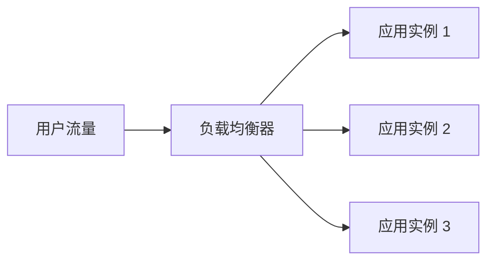
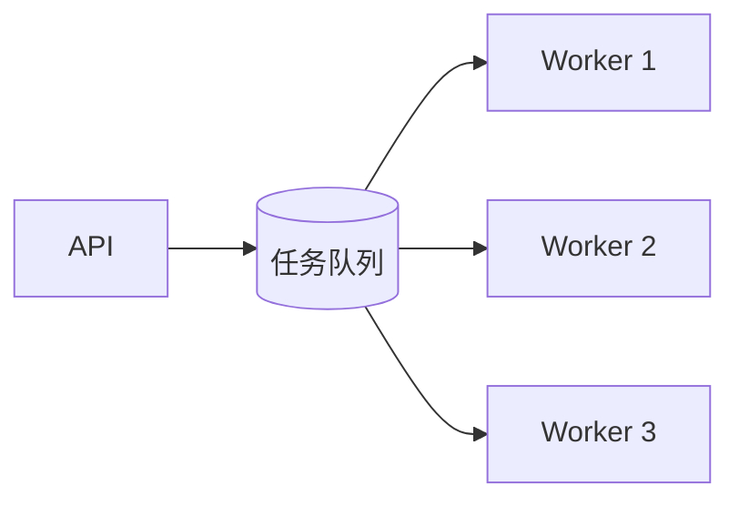
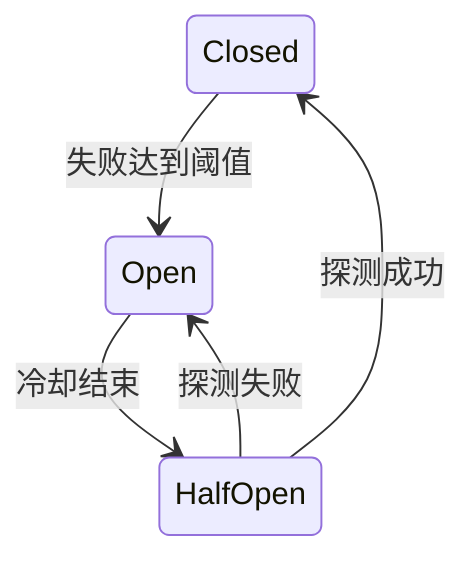

> **学完这一篇，你应该能**
> - 区分吞吐量、延迟、容量、可用性和耐久性；
> - 理解垂直扩容、水平扩容、负载均衡与自动扩缩容；
> - 用超时、重试、熔断、隔舱和背压限制故障扩散；
> - 区分高可用与灾难恢复，并用 RTO、RPO 描述目标。

---

## 1. 先定义“系统扛不住”的具体含义

“性能不够”可能指完全不同的问题：

- 单个请求计算很慢；
- 每秒请求数量太多；
- 数据库连接在排队；
- 内存不足导致频繁重启；
- 某个下游偶发 10 秒超时；
- 一个可用区故障后没有其他实例；
- 数据量增长让查询计划改变。

几个核心指标：

| 概念 | 含义 | 例子 |
|---|---|---|
| 延迟 Latency | 完成一次操作需要多久 | P95 = 300 ms |
| 吞吐量 Throughput | 单位时间完成多少工作 | 2,000 请求/秒 |
| 并发量 Concurrency | 同一时刻正在处理多少工作 | 500 个在途请求 |
| 容量 Capacity | 满足目标延迟和错误率时的最大负载 | 3,000 请求/秒 |
| 可用性 Availability | 需要服务时能否正确响应 | 月成功率 99.9% |
| 耐久性 Durability | 已确认数据能否长期保留 | 提交后故障不丢订单 |

扩容前先用 [指标与追踪](/blog/5-2-日志-指标与链路追踪) 找到饱和点。否则可能扩了 Web 服务器，真正瓶颈却仍是只有 50 个连接的数据库。

---

## 2. 一点排队论直觉

粗略地说：

```text
并发中的请求数 ≈ 到达速率 × 平均响应时间
```

这叫 Little's Law 的直觉形式。若每秒进入 1,000 个请求，平均每个耗时 0.2 秒，那么系统中平均约有 200 个请求在途。

当到达速率持续接近或超过处理能力时，队列会增长，排队时间又让请求占用连接更久，最终形成延迟雪崩。CPU 从 70% 升到 90%，尾部延迟可能不是线性增加。

所以系统需要保留余量，并在过载时明确拒绝或降级，而不是无限排队。

---

## 3. 垂直扩容与水平扩容

### 垂直扩容（Scale Up）

给单台机器增加 CPU、内存或更快磁盘。

优点：简单、无需改分布式架构；缺点：有硬件上限、成本可能非线性增长、单点仍然存在。

### 水平扩容（Scale Out）

增加更多服务实例共同处理请求。



优点：容量可以逐步增加，也能容忍部分实例故障；缺点：必须处理状态共享、负载分布、网络失败和数据一致性。

现实中通常两者结合：先合理升级单机规格，再在真正需要时水平扩展。

---

## 4. 让应用实例尽量无状态

如果登录会话只存在实例 1 的内存中，下一个请求被分到实例 2 就会“掉登录”。

```text
不利于扩展：用户状态 → 某个进程内存
更易扩展：用户状态 → 数据库 / 共享会话存储 / 受验证令牌
```

无状态不是没有任何数据，而是任意健康实例都能根据请求和共享存储完成工作。实践包括：

- 上传文件进入对象存储，而不是实例本地磁盘；
- 会话放数据库/Redis，或使用合适的短期令牌；
- 后台任务进入队列；
- 配置从统一环境注入；
- 实例可以随时替换而不丢业务事实。

Sticky Session 能让同一用户尽量回到同一实例，但会造成负载不均和故障切换问题，通常只是兼容手段，不应代替状态设计。

---

## 5. 负载均衡器做什么

负载均衡器接收流量并选择后端实例：

- 四层负载均衡依据 IP、端口和传输连接；
- 七层负载均衡理解 HTTP，可按主机、路径、Header 等路由；
- 还可能终止 TLS、限流、记录访问日志和执行健康检查。

常见调度策略：

| 策略 | 适合直觉 |
|---|---|
| Round Robin | 请求成本接近时轮流分配 |
| Least Connections | 长连接或耗时差异较大时优先较空实例 |
| Hash | 希望同一 Key 稳定落到类似位置 |
| Weighted | 不同实例容量或金丝雀比例不同 |

负载均衡器自己也不能成为单点。云托管 LB 或多实例入口通常会隐藏这层冗余，但仍要理解 DNS、证书和配置也是依赖。

---

## 6. 健康检查与摘流量

### Liveness

进程是否卡死到需要重启。

### Readiness

实例当前是否准备好接收新流量，例如启动尚未预热、正在关闭、关键资源耗尽时可暂时失败。

不要让 liveness 深度依赖所有下游。如果数据库短暂抖动导致每个应用实例被同时重启，故障会被放大。

实例优雅下线时要：先让 readiness 失败，等待负载均衡停止发新请求，再完成在途请求，参见 [6.0 Docker 与容器化](/blog/6-0-docker-与容器化)。

---

## 7. 自动扩缩容并不是看到 CPU 高就加机器

扩缩容由信号、阈值、冷却和容量上下限共同决定。

可用信号包括：

- CPU 或内存；
- 每实例请求数；
- 在途请求；
- 队列长度或最老消息年龄；
- 自定义业务并发量。

问题在于扩容有延迟：拉取镜像、启动进程、预热缓存和注册健康检查都需要时间。如果流量 10 秒内暴涨，而实例 3 分钟才可用，仅靠事后扩容来不及。

应结合：

- 基础预留容量；
- 预测性或定时扩容；
- 请求限流与排队；
- 冷却时间，防止反复增减；
- 缩容前排空连接和任务；
- 下游容量，避免上游扩容压垮数据库。

---

## 8. 队列把瞬时峰值摊平

不是所有工作都需要同步完成。生成报表、发送邮件、处理图片可以先入队：



队列提供缓冲，却不会创造处理能力。若长期到达速度大于消费速度，积压仍会无限增长。

要监控：

- 队列长度；
- 最老消息等待时间；
- 成功、失败和重试率；
- 死信队列；
- 单任务耗时；
- 重复和乱序。

消费者应尽量幂等。通常的“至少一次”投递意味着任务可能重复，不能把“收到一次”当成事实保证。

---

## 9. 背压与负载削减

当下游已满，上游继续无限发送只会把内存和队列耗尽。

**背压（backpressure）**让生产速度感知消费能力，例如限制在途请求、使用有界队列或暂停读取。

**负载削减（load shedding）**在过载时主动拒绝部分低价值工作：

- 返回 `429 Too Many Requests` 或 `503 Service Unavailable`；
- 优先保证登录、下单等核心路径；
- 暂停推荐、报表等非关键功能；
- 使用陈旧缓存提供只读降级；
- 限制单租户或单客户端配额。

有界失败通常优于无限等待后全站崩溃。

---

## 10. 超时、重试与抖动

所有远程调用都应有超时。没有超时的请求可能永久占住线程、连接和内存。

但多层各自重试会放大流量：

```text
客户端重试 3 次 × API 重试 3 次 × 数据层重试 3 次 = 最坏 27 次尝试
```

重试只适合：

- 失败可能短暂；
- 操作幂等或有幂等键；
- 有明确次数和总时间预算；
- 使用指数退避并加入随机抖动；
- 不会让已过载依赖更加过载。

对于参数错误、权限拒绝等永久错误，不应重试。超时也不能证明服务端没有执行，涉及写操作时必须处理重复。

---

## 11. 熔断与隔舱

### 熔断器

当某下游持续失败时，暂时快速失败，不再让每个请求都等待超时；过一段时间允许少量探测，恢复后再闭合。



熔断器需要结合降级和告警，否则只是更快返回错误。

### 隔舱（Bulkhead）

像船体隔舱一样限制故障范围：

- 不同下游使用独立连接池；
- 关键与非关键任务使用不同队列；
- 租户有配额；
- 区域和可用区构成故障域；
- 高风险功能使用独立资源上限。

这样推荐服务耗尽连接时，不会连带让支付服务失去全部连接。

---

## 12. 缓存与 CDN

把公开静态内容放在靠近用户的 CDN，可减少源站带宽和延迟。应用缓存和 [Redis](/blog/4-5-redis-缓存与数据一致性) 能降低重复计算和数据库读取。

但缓存会带来：

- 失效与陈旧数据；
- 热 Key；
- 缓存雪崩；
- 权限响应被错误共享；
- 源站在缓存故障时容量不足。

Cache Key 必须包含影响响应的必要维度，如语言、版本、租户和权限范围。含个人数据的响应不要被公共缓存共享。

---

## 13. 数据库怎样扩展

通常按以下顺序考虑，而不是第一天就分库分表：

1. 修正数据模型和慢查询；
2. 建立合适索引，减少不必要数据传输；
3. 调整连接池和事务长度；
4. 升级单机 CPU、内存、磁盘；
5. 对可接受陈旧的读取使用只读副本；
6. 缓存真实热点；
7. 分区大表；
8. 必要时按租户或 Key 分片。

### 只读副本

可以分担读流量，但复制通常有延迟。用户刚写入后立刻读副本，可能看不到自己的更改。需要读写一致性时，可以短期读主库、使用复制位点等待，或设计会话一致性策略。

### 分片

将不同数据放到不同数据库节点。分片键决定负载是否均匀、跨分片查询难度和扩容成本。

危险分片键示例：所有热门租户恰好集中到一个分片；按日期分片却让所有最新写入落到同一节点。

分片之后，跨分片 JOIN、事务、唯一约束和迁移都会更复杂。应由真实容量证据推动。

---

## 14. 可用性不是副本数量

若一个请求必须依次经过两个独立、各自 99.9% 可用的关键服务，粗略组合可用性为：

```text
99.9% × 99.9% ≈ 99.8%
```

依赖越多，端到端可用性可能越低。真实故障往往还相关：多个服务共享同一区域、证书、身份平台或部署流程，不能简单假设独立。

高可用设计要消除单点：

- 多个应用实例；
- 负载均衡器本身冗余；
- 数据库故障切换；
- 跨故障域部署；
- DNS、证书、秘密管理和 CI/CD 的恢复路径；
- 人员与流程不依赖唯一专家。

冗余只有在能够被检测、切换和验证时才有价值。

---

## 15. 高可用与灾难恢复

**高可用（HA）**关注常见组件故障时服务尽量不中断，常在同一区域的多个故障域中自动切换。

**灾难恢复（DR）**关注大范围故障、误删、攻击或区域不可用后，怎样恢复服务和数据。

两个目标：

- **RTO（Recovery Time Objective）**：最长可接受恢复时间；
- **RPO（Recovery Point Objective）**：最多可接受丢失多近的数据。

```text
RTO = 最多能停多久
RPO = 最多能丢多久
```

例如 RTO 1 小时、RPO 5 分钟，表示希望 1 小时内恢复，恢复点至多落后事故前 5 分钟。

更短目标通常显著增加成本。每个业务不必相同：订单可能要求分钟级恢复，历史报表可以晚一天。

---

## 16. 多可用区与多区域

多个实例若都在同一台机器或同一故障域，无法抵御该故障域失效。

多可用区可防范部分机房、电力和网络故障；多区域还能覆盖区域级事故，但会带来：

- 更高网络延迟和成本；
- 跨区域数据一致性取舍；
- DNS 与流量切换时间；
- 双活写入冲突；
- 配置漂移；
- 更复杂的演练和故障判断。

不要因为“更高级”就直接做多区域双活。若业务目标用单区域多可用区加异地备份即可满足，复杂度更低的方案通常更可靠。

---

## 17. 备份、复制与恢复演练

复制可以快速接管硬件故障，但错误删除和坏数据也会复制。备份保存历史恢复点，但恢复可能较慢。

可靠备份应具备：

- 自动执行与失败告警；
- 加密和独立权限；
- 明确保留周期；
- 防止攻击者同时删除生产和备份；
- 定期恢复到隔离环境并校验数据；
- 记录恢复步骤和实际耗时。

只看到“备份任务成功”不能证明能恢复。DR 计划必须通过演练验证 RTO 和 RPO。

---

## 18. 混沌工程与故障演练

可以在受控范围主动验证：

- 杀死一个应用实例；
- 让一个可用区不可达；
- 增加下游延迟或错误；
- 断开数据库连接；
- 让磁盘接近满；
- 模拟缓存完全丢失；
- 执行备份恢复和区域切换。

演练前必须定义：

- 假设和成功标准；
- 爆炸半径；
- 停止条件；
- 监控和负责人；
- 回退方式；
- 用户保护措施。

混沌工程不是无计划地破坏生产，而是以科学实验验证韧性假设。

---

## 19. 扩展与可靠性设计清单

- 用户真正要求的延迟、吞吐、RTO、RPO 是什么？
- 当前瓶颈有指标和负载测试证据吗？
- 应用实例能否随时替换，状态放在哪里？
- 所有网络调用是否有超时、有限重试和幂等性？
- 队列是否有上限、背压和死信处理？
- 一个依赖失败会不会耗尽所有线程或连接？
- 数据库副本延迟会怎样影响用户体验？
- 是否存在共享故障域和隐藏单点？
- 缓存、数据库或一个区域完全故障时如何降级？
- 备份能否在目标时间内实际恢复？
- 自动扩容是否受启动时间和下游容量约束？
- 这些机制是否经过演练，而不只存在于架构图？

高可用不是“永不失败”，而是让失败可被隔离、检测、恢复，并将用户影响控制在已知范围。

---

## 延伸阅读

- [Kubernetes：Autoscaling Workloads](https://kubernetes.io/docs/concepts/workloads/autoscaling/)
- [Kubernetes：Configure Liveness, Readiness and Startup Probes](https://kubernetes.io/docs/tasks/configure-pod-container/configure-liveness-readiness-startup-probes/)
- [AWS Well-Architected：Reliability Pillar](https://docs.aws.amazon.com/wellarchitected/latest/reliability-pillar/welcome.html)
- [Google SRE：Handling Overload](https://sre.google/sre-book/handling-overload/)
