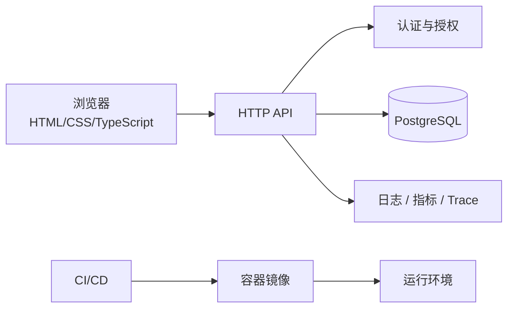
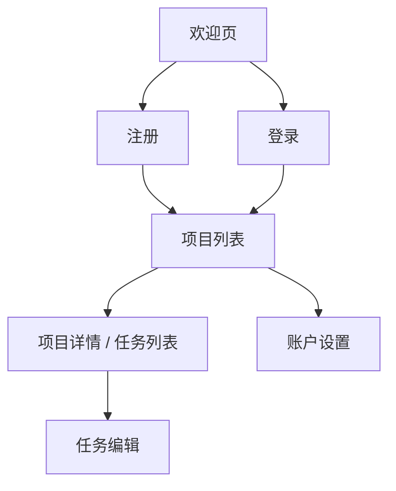
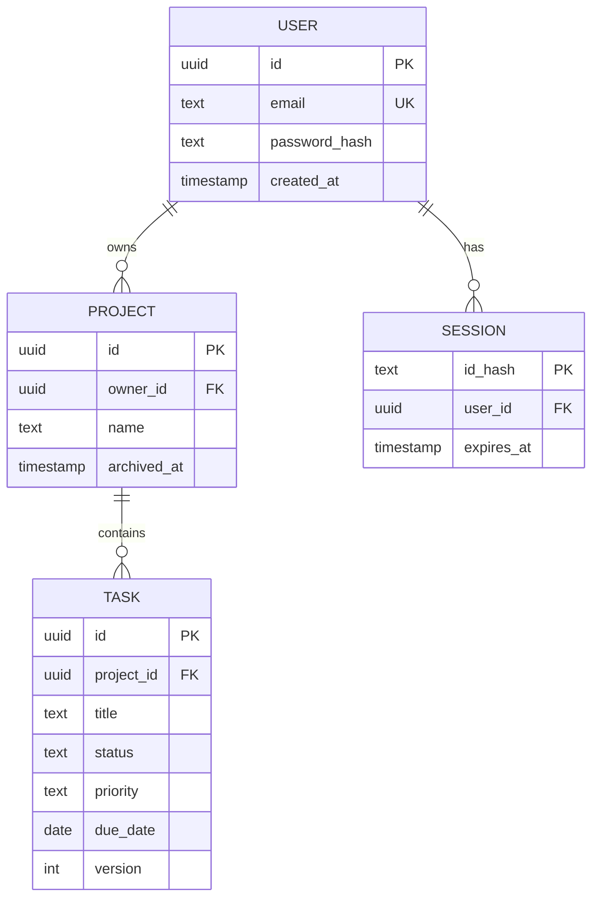
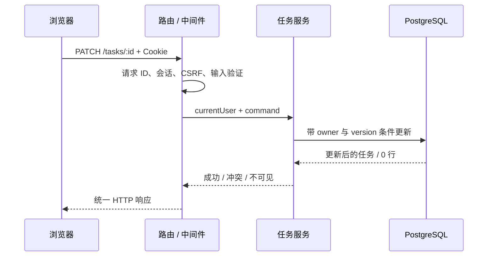
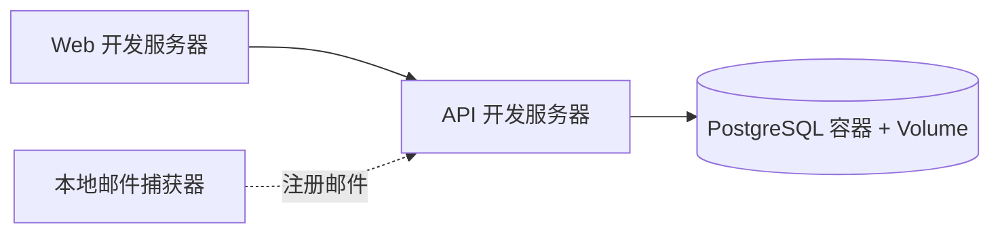
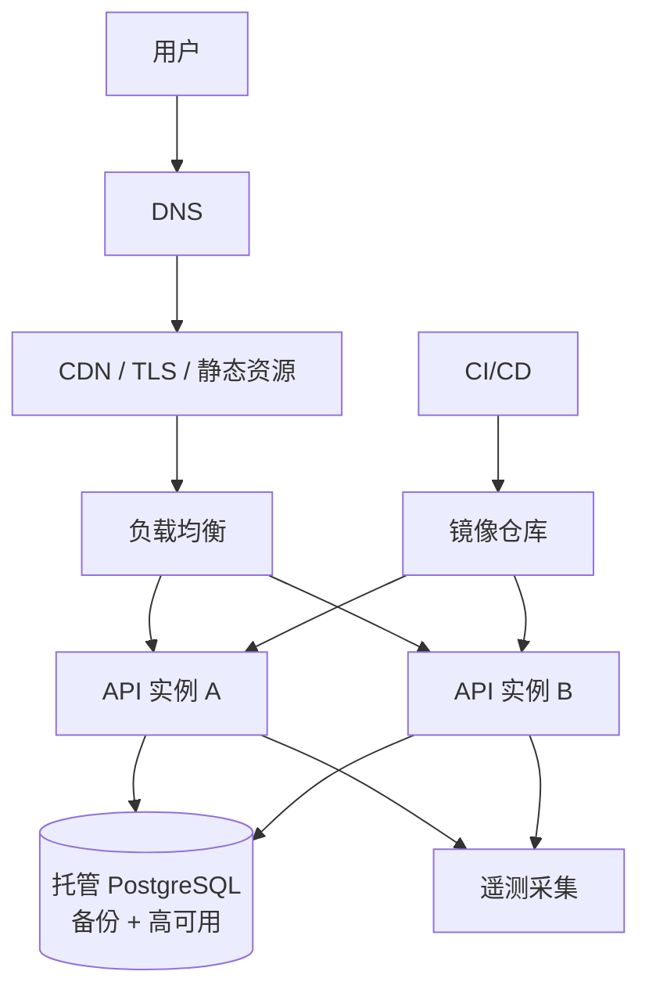
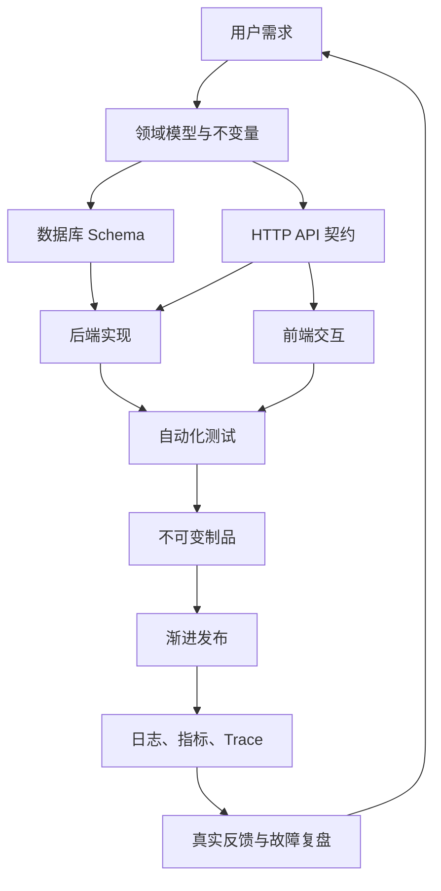

> **本篇目标**
> 用一个可独立完成的“学习任务管理器”串联前面所有章节。重点不是复制一套代码，而是亲历需求、建模、接口、前端、测试、部署和运维之间的因果关系。

---

## 1. 项目简介：StudyFlow

StudyFlow 是一个小型学习任务管理器。用户可以：

- 注册、登录和退出；
- 创建学习项目，例如“学习 Web 基础”；
- 在项目中创建任务；
- 设置任务状态、截止时间和优先级；
- 筛选任务并查看完成进度；
- 在多个浏览器中看到一致数据。

这个项目规模适中，却覆盖完整全栈主线：



---

## 2. 先定 MVP，不要一开始做“大而全”

### MVP 范围

1. 邮箱和密码注册、登录；
2. 每个用户只能管理自己的项目和任务；
3. 项目可创建、改名、归档；
4. 任务可创建、编辑、完成、删除；
5. 可按状态筛选，按截止时间排序；
6. 页面刷新后数据仍存在；
7. 有基本错误处理、测试和部署。

### 明确不做

- 社交关注；
- 团队协作；
- 实时聊天；
- 付费订阅；
- 手机原生应用；
- AI 自动拆任务；
- 复杂离线同步。

写“不做什么”能保护项目边界。完成一个小而完整的系统，比同时开工十项功能更能形成能力闭环。

---

## 3. 把需求写成可验收行为

模糊需求：“用户可以管理任务。”

可验收需求：

```text
给定用户已经登录，且拥有一个学习项目
当用户输入非空标题并创建任务
那么页面显示新任务
并且刷新页面后任务仍存在
而另一个用户无法读取或修改该任务
```

关键验收标准：

| 编号 | 行为 | 验收条件 |
|---|---|---|
| A1 | 注册 | 合法邮箱可注册；重复邮箱被明确拒绝 |
| A2 | 登录 | 正确凭据建立会话；错误凭据不泄露账户是否存在 |
| P1 | 创建项目 | 标题 1–100 字；自动归属当前用户 |
| T1 | 创建任务 | 标题必填；状态初始为 `todo` |
| T2 | 完成任务 | 只能从允许状态转换，并记录完成时间 |
| S1 | 数据隔离 | 用户 A 对用户 B 的资源请求返回不可用结果 |
| R1 | 可靠性 | 重复提交不会意外创建两份相同操作结果 |

这些标准会直接指导 Schema、接口和测试。

---

## 4. 用户旅程与页面



页面最少包含：

- `/register`：邮箱、密码、确认密码；
- `/login`：邮箱、密码；
- `/projects`：项目列表、创建项目；
- `/projects/:id`：任务列表、筛选、创建和编辑；
- `/settings`：退出全部会话、修改密码。

优先让没有 JavaScript 特效的基本流程清晰可用，再增加加载骨架、乐观更新和动画。

---

## 5. 领域模型与不变量

核心实体：用户、项目、任务、会话。



必须保持的不变量：

- 邮箱规范化后唯一；
- 密码只保存高成本哈希，不保存明文或可逆密文；
- 项目必须有所有者；
- 任务必须属于一个真实项目；
- 任务状态只能是 `todo`、`doing`、`done`；
- 完成状态与 `completed_at` 语义一致；
- 用户只能操作自己的项目及其任务；
- 并发编辑不能静默覆盖。

参见 [4.2 表、主键、外键与数据建模](/blog/4-2-表-主键-外键与数据建模)。

---

## 6. 数据库 Schema 草案

以下以 PostgreSQL 为例，省略了部分索引和迁移工具语法：

```sql
CREATE TABLE users (
  id UUID PRIMARY KEY,
  email TEXT NOT NULL,
  password_hash TEXT NOT NULL,
  created_at TIMESTAMPTZ NOT NULL DEFAULT CURRENT_TIMESTAMP,
  CONSTRAINT users_email_normalized_unique UNIQUE (email)
);

CREATE TABLE projects (
  id UUID PRIMARY KEY,
  owner_id UUID NOT NULL REFERENCES users(id) ON DELETE CASCADE,
  name TEXT NOT NULL CHECK (char_length(name) BETWEEN 1 AND 100),
  archived_at TIMESTAMPTZ,
  created_at TIMESTAMPTZ NOT NULL DEFAULT CURRENT_TIMESTAMP
);

CREATE TABLE tasks (
  id UUID PRIMARY KEY,
  project_id UUID NOT NULL REFERENCES projects(id) ON DELETE CASCADE,
  title TEXT NOT NULL CHECK (char_length(title) BETWEEN 1 AND 200),
  description TEXT NOT NULL DEFAULT '',
  status TEXT NOT NULL DEFAULT 'todo'
    CHECK (status IN ('todo', 'doing', 'done')),
  priority TEXT NOT NULL DEFAULT 'normal'
    CHECK (priority IN ('low', 'normal', 'high')),
  due_date DATE,
  completed_at TIMESTAMPTZ,
  version INTEGER NOT NULL DEFAULT 1,
  created_at TIMESTAMPTZ NOT NULL DEFAULT CURRENT_TIMESTAMP,
  updated_at TIMESTAMPTZ NOT NULL DEFAULT CURRENT_TIMESTAMP,
  CHECK (
    (status = 'done' AND completed_at IS NOT NULL)
    OR (status <> 'done' AND completed_at IS NULL)
  )
);

CREATE INDEX projects_owner_created_idx
  ON projects (owner_id, created_at DESC);

CREATE INDEX tasks_project_status_due_idx
  ON tasks (project_id, status, due_date, id);
```

邮箱写入前要统一规则，例如去掉首尾空白并处理大小写。具体规范需在应用和数据库约束间保持一致。

索引来自访问模式：按所有者列项目、按项目和状态列任务。不要预先为每列建索引，参见 [4.3 索引为什么能加速查询](/blog/4-3-索引为什么能加速查询)。

---

## 7. API 设计

使用 `/api/v1` 作为版本前缀：

| 方法与路径 | 作用 | 成功响应 |
|---|---|---|
| `POST /api/v1/auth/register` | 注册 | `201` |
| `POST /api/v1/auth/login` | 登录 | `204` + 会话 Cookie |
| `POST /api/v1/auth/logout` | 退出 | `204` |
| `GET /api/v1/projects` | 当前用户项目列表 | `200` |
| `POST /api/v1/projects` | 创建项目 | `201` |
| `PATCH /api/v1/projects/:id` | 修改/归档项目 | `200` |
| `GET /api/v1/projects/:id/tasks` | 查询任务 | `200` |
| `POST /api/v1/projects/:id/tasks` | 创建任务 | `201` |
| `PATCH /api/v1/tasks/:id` | 更新任务 | `200` |
| `DELETE /api/v1/tasks/:id` | 删除任务 | `204` |

查询任务示例：

```http
GET /api/v1/projects/4a.../tasks?status=todo&sort=due_date&cursor=...
```

创建成功时返回完整资源和稳定 ID。错误使用统一结构：

```json
{
  "error": {
    "code": "validation_failed",
    "message": "提交内容有误",
    "fields": {
      "title": "标题不能为空"
    },
    "requestId": "req_8bf2"
  }
}
```

不要把 SQL、堆栈和内部路径返回给客户端。

---

## 8. 认证与授权

这个项目可选服务端 Session：

1. 登录成功后生成高熵随机会话 ID；
2. 数据库存 ID 的哈希、用户 ID、过期时间；
3. 浏览器只收到原始 ID 的 Cookie；
4. Cookie 设置 `HttpOnly`、`Secure`、合适的 `SameSite` 和作用域；
5. 服务端每次根据会话识别用户。

每个资源查询都带所有者条件：

```sql
SELECT t.*
FROM tasks t
JOIN projects p ON p.id = t.project_id
WHERE t.id = $task_id
  AND p.owner_id = $current_user_id;
```

不要先按任务 ID 查询，再相信前端传来的 `ownerId`。对象级授权必须在服务端实施，详见 [3.4 身份认证与权限控制](/blog/3-4-身份认证与权限控制) 和 [3.5 Cookie、Session、JWT 与 OAuth](/blog/3-5-cookie-session-jwt-与-oauth)。

若使用 Cookie 认证，所有修改请求要采用合适的 CSRF 防护策略。

---

## 9. 并发更新与幂等

任务带 `version` 字段。客户端编辑时提交它读到的版本：

```sql
UPDATE tasks
SET title = $title,
    status = $status,
    version = version + 1,
    updated_at = CURRENT_TIMESTAMP
WHERE id = $id
  AND project_id = $project_id
  AND version = $expected_version
RETURNING *;
```

影响 0 行时，返回 `409 Conflict`，提示用户数据已被其他页面修改，而不是静默覆盖。

创建操作可接受 `Idempotency-Key`。服务端用当前用户和 Key 建唯一约束，并在重试时返回原结果，避免网络超时导致重复任务。参见 [4.4 事务、并发与隔离级别](/blog/4-4-事务-并发与隔离级别)。

---

## 10. 前端状态怎么分

不要把所有状态塞进一个全局仓库。区分：

| 状态 | 例子 | 建议位置 |
|---|---|---|
| 服务端状态 | 项目、任务 | 请求缓存/数据获取层 |
| URL 状态 | 筛选、排序、游标 | URL 查询参数 |
| 表单状态 | 输入值、字段错误 | 表单组件 |
| 纯 UI 状态 | 弹窗是否打开 | 最近共同父组件 |
| 会话状态 | 当前用户摘要 | 应用级上下文或会话查询 |

加载任务时至少设计四种界面：

- 首次加载；
- 成功且有数据；
- 成功但为空；
- 失败并可重试。

乐观更新可以让勾选任务立即响应，但服务端失败时必须回滚并提示。不要用前端临时状态掩盖服务端是否真的保存成功。

---

## 11. HTML、CSS 与可访问性要求

- 页面使用 `header`、`nav`、`main` 等语义结构；
- 导航使用链接，操作使用按钮；
- 每个输入有可见 `label`；
- 错误信息与字段关联，并在提交后聚焦错误摘要；
- 所有操作可由键盘完成；
- 焦点样式清晰；
- 颜色不是状态的唯一表达；
- 窄屏下任务列表仍可阅读；
- 删除使用确认，但不依赖不可访问的自制弹窗。

参见 [2.6 HTML：内容、结构与语义](/blog/2-6-html-内容-结构与语义) 和 [2.7 CSS：布局、响应式与渲染](/blog/2-7-css-布局-响应式与渲染)。

---

## 12. 项目目录示例

```text
studyflow/
├── apps/
│   ├── web/                # 浏览器应用
│   └── api/                # HTTP API
├── packages/
│   ├── contracts/          # API Schema 与共享类型
│   └── config/             # 可复用工具配置
├── migrations/             # 数据库迁移
├── tests/
│   └── e2e/                # 关键用户旅程
├── Dockerfile
├── compose.yaml
├── package.json
└── README.md
```

不必为了“像大公司”而建立 Monorepo。若你更熟悉单仓库单应用，也可以从更简单结构开始。模块边界应反映责任，不是追求目录层级。

---

## 13. 后端请求流程



路由层处理协议，服务层表达用例，数据访问层封装持久化细节。不要让控制器直接堆满 SQL、邮件和权限判断；也不要为了“分层”创建只转发参数的空壳类。

---

## 14. 输入验证与错误边界

在边界把未知输入解析为可信结构：

```ts
type UpdateTaskInput = {
  title?: string;
  status?: "todo" | "doing" | "done";
  dueDate?: string | null;
  version: number;
};
```

TypeScript 类型不会验证网络 JSON，需要运行时 Schema 验证。还要区分：

- 语法有效：字段类型和格式正确；
- 业务有效：状态转换允许、截止日期符合规则；
- 操作者有权：资源属于当前用户；
- 数据库最终约束：唯一、外键和检查约束仍成立。

错误映射示例：

| 情况 | 状态码 |
|---|---:|
| 未登录 | 401 |
| 已登录但无权做某种全局操作 | 403 |
| 资源不存在或不应暴露其存在 | 404 |
| 版本冲突 | 409 |
| 字段校验失败 | 422 或团队统一的 400 |
| 服务器未知错误 | 500 + request ID |

---

## 15. 测试计划

### 静态检查

- TypeScript 严格模式；
- Lint 和格式；
- 数据库迁移可应用；
- 依赖与秘密扫描。

### 单元测试

- 邮箱规范化；
- 任务状态转换；
- 截止日期和进度计算；
- 输入解析；
- 授权策略的纯逻辑部分。

### 集成测试

- 重复邮箱由数据库约束拒绝；
- 创建项目与所有者在同一事务正确保存；
- 跨用户无法读取和更新；
- `version` 冲突返回 409；
- 级联删除符合设计；
- 会话过期后失效。

### E2E 测试

1. 注册 → 登录 → 创建项目 → 创建任务 → 完成任务；
2. 刷新后数据仍存在；
3. 另一个用户无法访问该任务；
4. 会话过期后回到登录页；
5. 网络错误时页面保留输入并允许重试。

测试之间使用独立用户和数据，不依赖运行顺序。参见 [5.0 测试的层次](/blog/5-0-测试的层次)。

---

## 16. 威胁模型与安全清单

### 要保护什么

- 密码哈希和会话；
- 私人项目与任务；
- 数据库和部署凭据；
- 审计与日志中的个人信息。

### 主要威胁

- SQL 注入；
- XSS 窃取页面数据或代用户操作；
- CSRF；
- 枚举任务 ID 越权；
- 暴力破解和撞库；
- 会话固定、泄漏和过期失效不完整；
- 依赖和 CI/CD 供应链风险。

### 防护

- 参数化 SQL；
- 输出编码与 CSP；
- 服务端对象级授权；
- 密码使用现代专用哈希算法；
- 登录限流与 MFA 扩展能力；
- Cookie 安全属性和 CSRF 防护；
- HTTPS；
- 秘密管理与最小权限；
- 审计关键账户操作；
- 依赖升级与漏洞响应流程。

参见 [3.6 Web 安全基础](/blog/3-6-web-安全基础)。

---

## 17. 暂时不要加 Redis 和微服务

MVP 用一个应用服务和 PostgreSQL 足够。原因：

- 数据量和流量尚未证明缓存必要；
- 单体内的事务和调试更直接；
- 项目目标是完成整个闭环；
- 过早拆分会增加网络、部署和一致性问题。

只有测量发现项目列表或统计查询成为真实瓶颈时，再评估缓存。只有某个业务边界需要独立扩展、发布或团队所有权时，再考虑拆服务。

架构应为当前约束服务，同时保留演进余地，而不是预演想象中的亿级规模。

---

## 18. 本地开发环境

使用容器运行 PostgreSQL，应用可在本机运行以获得快速热更新；也可以全部放入 Compose。



准备脚本应完成：

- 启动依赖；
- 应用迁移；
- 生成明确的开发种子数据；
- 检查端口冲突和必要工具版本；
- 不接触真实生产账户或数据。

README 应让一位新开发者在合理时间内从克隆代码到打开首页。

---

## 19. CI/CD 设计

Pull Request：

```text
安装锁定依赖 → 类型/Lint → 单元测试 → 数据库集成测试
→ 构建 Web/API → E2E → 镜像扫描
```

合并主分支：

```text
构建一次镜像 → 推送不可变 digest → 部署预发布
→ 冒烟测试 → 生产审批/自动门禁 → 金丝雀 → 全量
```

数据库迁移遵循向前兼容；生产同一时间只运行一条部署；发布后检查错误率、延迟、登录成功率和任务创建成功率。参见 [6.1 CI-CD 与可靠发布](/blog/6-1-ci-cd-与可靠发布)。

---

## 20. 最小生产架构



小型个人项目可以从单实例开始，但应保证：

- 自动 TLS；
- 数据库不直接暴露公网；
- 自动备份并演练恢复；
- 应用容器可替换；
- 生产秘密独立管理；
- 错误和可用性有监控；
- 能恢复到上一稳定镜像。

---

## 21. 日志、指标和 SLO

### 结构化日志字段

```text
timestamp, level, service, version, environment,
request_id, trace_id, route, status_code, duration_ms,
user_id_hash, error_code
```

不记录密码、会话 Cookie、完整请求正文。

### 核心指标

- HTTP 请求量、错误率、延迟；
- 登录成功/失败数量；
- 项目和任务创建成功率；
- 数据库连接等待和慢查询；
- 实例 CPU、内存、重启；
- 发布版本维度的错误率。

### 初始 SLO 示例

> 过去 30 天内，已认证用户的任务读取请求中，99.9% 在 500 ms 内返回非 5xx 响应。

定义时还要明确超时、取消、无效请求是否计入。参见 [5.2 日志、指标与链路追踪](/blog/5-2-日志-指标与链路追踪)。

---

## 22. 备份与恢复演练

为数据库定义：

- 每日全量或等效托管备份；
- 连续日志或足够频率的增量恢复点；
- 保留周期；
- 加密和独立删除权限；
- 每月恢复到隔离环境；
- 校验用户、项目、任务数量与关键约束；
- 记录实际 RTO 和 RPO。

不要把包含真实个人数据的恢复副本随意放进开发环境。恢复测试也要遵守数据访问和删除规则。

---

## 23. 分阶段实现路线

### 里程碑 1：静态界面

- 完成页面结构、响应式布局和键盘操作；
- 使用假数据；
- 明确加载、空、错误状态。

### 里程碑 2：数据库与 API

- 建迁移；
- 实现项目和任务 CRUD；
- 写数据库集成测试；
- 加统一错误格式。

### 里程碑 3：认证与数据隔离

- 注册、登录、退出；
- 密码哈希和 Session；
- 每个接口做对象级授权；
- 增加跨用户安全测试。

### 里程碑 4：前后端贯通

- 替换假数据；
- 表单校验、加载和重试；
- 版本冲突处理；
- 完成关键 E2E。

### 里程碑 5：容器与 CI

- 多阶段构建；
- Compose 本地环境；
- 自动检查、测试和镜像扫描；
- 从干净环境验证构建。

### 里程碑 6：上线与观测

- 预发布、生产配置；
- 数据迁移与备份；
- 渐进发布；
- 指标、Trace、仪表盘和告警；
- 完成一次恢复演练。

每个里程碑都应产生一个可运行、可演示的状态。

---

## 24. 上线前检查清单

### 功能

- 所有 MVP 验收标准通过；
- 空状态、错误、超时和重复点击已处理；
- 桌面和移动尺寸可用。

### 数据

- 迁移从空库和上一个版本都能成功；
- 唯一、外键和检查约束存在；
- 备份已恢复验证；
- 没有生产数据进入测试。

### 安全

- HTTPS 与安全 Cookie；
- 密码哈希参数合理；
- 对象级授权测试；
- 参数化 SQL、CSRF、XSS 防护；
- 秘密未出现在 Git、镜像和日志；
- 依赖扫描结果已评估。

### 可靠性

- 健康检查和优雅退出；
- 超时、有限重试、连接池上限；
- 发布与回滚演练；
- 核心指标、告警和 Runbook；
- 故障时有明确降级行为。

---

## 25. 上线后的第一周

不要发布完就离开。每天检查：

- 是否有新错误码或异常堆栈；
- P95/P99 延迟和数据库慢查询；
- 注册、登录、创建任务漏斗；
- 404/401/403 是否异常增长；
- 浏览器和移动端错误分布；
- 备份任务是否成功；
- 容量和费用是否符合预期。

把真实缺陷转成回归测试，把排错缺口转成日志或指标改进。上线不是终点，而是系统开始面对真实环境。

---

## 26. 完成标准

当你能做到下面这些，这个项目才算真正“从需求到上线”：

- 新用户无需指导可完成核心旅程；
- 另一个用户无法访问其数据；
- 刷新、重试和并发编辑不会破坏数据；
- 一次提交可自动构建并通过测试；
- 同一个不可变制品进入生产；
- 发布异常可停止、回滚或前滚；
- 能通过请求 ID/Trace 定位一次失败；
- 数据库可以从备份恢复；
- README 说明本地运行、架构、迁移和部署；
- 你能够解释每个主要技术选择解决了什么问题。

最后一条尤其重要：完成教程不是“代码跑起来”，而是形成从需求到运行系统的因果模型。

---

## 27. 完成 MVP 后的进阶方向

一次只选一个，并先写新的需求与失败模式：

1. **协作项目**：增加成员、邀请和 RBAC，深化授权模型；
2. **实时同步**：用 SSE 或 WebSocket 推送任务变更，处理重连与版本；
3. **离线编辑**：学习 IndexedDB、冲突合并和同步协议；
4. **全文搜索**：先使用 PostgreSQL 能力，再比较专用搜索引擎；
5. **后台提醒**：用队列发送到期通知，设计幂等和重试；
6. **审计历史**：记录谁在何时改变了什么；
7. **性能实验**：生成百万任务，分析索引和分页；
8. **故障演练**：关闭数据库、清空缓存、杀死实例，验证降级与恢复。

实时通信参见 [3.7 WebSocket、SSE 与实时通信](/blog/3-7-websocket-sse-与实时通信)，浏览器离线存储参见 [2.11 浏览器存储、缓存与安全边界](/blog/2-11-浏览器存储-缓存与安全边界)，容量设计参见 [6.2 扩容、负载均衡与高可用](/blog/6-2-扩容-负载均衡与高可用)。

---

## 28. 一张总复盘图



全栈开发不是把前端、后端、数据库和运维知识简单相加，而是理解它们如何围绕同一组用户需求和数据不变量协同工作。

---

## 推荐回看

- [1.4 程序是怎样运行的](/blog/1-4-程序是怎样运行的)
- [1.2 计算机之间的通信：网络](/blog/1-2-计算机之间的通信-网络)
- [2.9 异步、事件循环与 Promise](/blog/2-9-异步-事件循环与-promise)
- [3.4 身份认证与权限控制](/blog/3-4-身份认证与权限控制)
- [4.4 事务、并发与隔离级别](/blog/4-4-事务-并发与隔离级别)
- [5.0 测试的层次](/blog/5-0-测试的层次)
- [5.2 日志、指标与链路追踪](/blog/5-2-日志-指标与链路追踪)
- [6.1 CI-CD 与可靠发布](/blog/6-1-ci-cd-与可靠发布)
