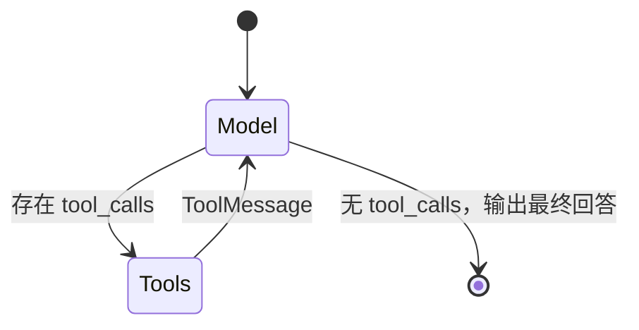
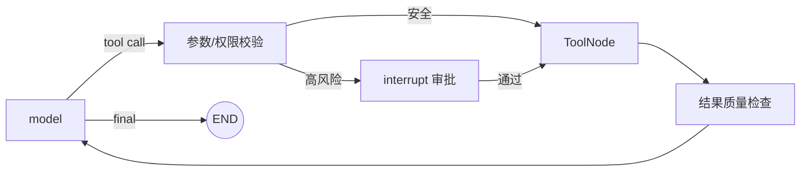

## 1. Agent 的最小闭环

一个工具调用 Agent 通常只做三件事：

1. 模型读取消息和工具说明；
2. 模型决定给最终回答，还是发出 tool call；
3. 若调用工具，将工具结果写回消息，再让模型继续判断。



这就是经典的 ReAct 式循环在工程上的核心。模型负责决策，运行时负责执行与记录；模型本身并不会直接运行 Python 函数。

## 2. 新项目的高层入口：`create_agent`

只需要标准模型—工具循环时，优先使用 LangChain 1.x 的 `create_agent`：

```python
from langchain.agents import create_agent
from langchain.tools import tool


@tool
def get_layer_metadata(layer_id: str) -> dict:
    """读取指定图层的元数据，包括坐标系、要素数和几何类型。"""
    return {
        "layer_id": layer_id,
        "crs": "EPSG:4326",
        "feature_count": 1834,
        "geometry_type": "Polygon",
    }


agent = create_agent(
    model="openai:gpt-5.4-mini",
    tools=[get_layer_metadata],
    system_prompt=(
        "你是 GIS 数据助手。涉及具体图层信息时必须调用工具，"
        "不得猜测坐标系或要素数量。"
    ),
)

result = agent.invoke({
    "messages": [
        {"role": "user", "content": "图层 landuse_2026 有多少个要素？"}
    ]
})
```

`create_agent` 返回的本质上是一个编译后的 LangGraph 图，因此可继续接入持久化、Store 和流式能力。

> **旧教程提示**
> `langgraph.prebuilt.create_react_agent` 在 LangGraph v1 中已弃用。阅读旧文章时应把它理解为历史 API；当前标准入口是 `langchain.agents.create_agent`。

## 3. Tool 与 Node 有什么不同

| 对比项 | Tool | Node |
|---|---|---|
| 谁决定调用 | 通常由模型通过 tool call 选择 | 由图的边、Command 或 Send 调度 |
| 面向谁描述 | 工具名、说明和参数 schema 会交给模型 | 主要面向开发者和运行时 |
| 输入 | 结构化工具参数，可注入 runtime | State、runtime 等 |
| 输出 | ToolMessage 或 Command 等工具结果 | State 更新或 Command |
| 典型用途 | 搜索、查询、计算、业务动作 | 校验、路由、聚合、模型调用、整个阶段 |

同一个业务函数可以被包装为 Tool，也可以由 Node 直接调用。区别不在“函数做了什么”，而在**谁拥有调度权**。

- 若是否调用应由模型根据语义判断，把能力暴露为 Tool；
- 若步骤必须执行、顺序固定或涉及安全边界，把它放在图的 Node 中。

## 4. Tool 说明实际上是 Agent 的接口契约

模型选择工具主要依赖：

- 工具名；
- docstring/description；
- 参数名、类型与说明；
- 当前上下文。

模糊的工具：

```python
@tool
def query(data: str) -> str:
    """查询数据。"""
```

更清楚的工具：

```python
@tool
def search_spatial_layers(
    keyword: str,
    geometry_type: str | None = None,
    limit: int = 10,
) -> list[dict]:
    """按名称或描述检索 GIS 图层。

    仅返回图层目录元数据，不查询图层内的具体要素。
    geometry_type 可为 Point、LineString 或 Polygon。
    limit 必须在 1 到 50 之间。
    """
```

好的 Tool 应满足：

1. 名称表达单一动作；
2. 说明写清何时用、何时不用；
3. 参数范围明确；
4. 返回结构稳定；
5. 错误可被模型理解，但不泄露堆栈和密钥。

工具数量过多时，模型选择准确率和提示成本都会下降。可以按阶段动态开放工具，或用 Router/子 Agent 隔离领域。

## 5. 用 `ToolNode` 手写工具循环

需要精确控制状态、路由或模型节点时，可以使用 LangGraph 的 `ToolNode`：

```python
from langchain.chat_models import init_chat_model
from langchain.tools import tool
from langgraph.graph import MessagesState, StateGraph, START
from langgraph.prebuilt import ToolNode, tools_condition


@tool
def get_feature_count(layer_id: str) -> int:
    """返回指定 GIS 图层的要素总数。"""
    return 1834


tools = [get_feature_count]
model = init_chat_model("openai:gpt-5.4-mini")
model_with_tools = model.bind_tools(tools)


def call_model(state: MessagesState):
    response = model_with_tools.invoke(state["messages"])
    return {"messages": [response]}


builder = StateGraph(MessagesState)
builder.add_node("model", call_model)
builder.add_node("tools", ToolNode(tools))
builder.add_edge(START, "model")

# 若最后一条 AIMessage 有 tool_calls，则去 tools；否则结束
builder.add_conditional_edges("model", tools_condition)
builder.add_edge("tools", "model")

graph = builder.compile()
```

`ToolNode` 会处理工具执行、并行工具调用、错误处理和运行时注入等通用细节。手写这套图的价值不是重复造轮子，而是可以在模型与工具之间加入自己的节点：



## 6. 工具的输入不能只依赖模型参数

有些信息不应暴露给模型自由填写，例如当前用户 ID、数据库连接、tool call ID 和完整 State。应通过运行时注入：

- `ToolRuntime` 可访问 context、state、store、stream writer 等；
- 身份和租户信息由服务端传入；
- 工具内部再做授权，而不是相信模型填的 `user_id`。

概念示例：

```python
from langchain.tools import ToolRuntime, tool


@tool
def list_my_layers(runtime: ToolRuntime) -> list[dict]:
    """列出当前登录用户有权访问的 GIS 图层。"""
    user_id = runtime.context.user_id
    return layer_repository.list_for_user(user_id)
```

工具 schema 中没有 `user_id`，模型就无法借参数越权查看其他用户。

## 7. 工具可以返回 `Command`

工具有时不仅返回文本，还要更新状态或触发交接：

```python
from langchain.messages import ToolMessage
from langchain.tools import ToolRuntime, tool
from langgraph.types import Command


@tool
def select_active_layer(
    layer_id: str,
    runtime: ToolRuntime,
) -> Command:
    """把指定图层设为当前工作图层。"""
    return Command(
        update={
            "active_layer_id": layer_id,
            "messages": [
                ToolMessage(
                    content=f"当前图层已切换为 {layer_id}",
                    tool_call_id=runtime.tool_call_id,
                )
            ],
        }
    )
```

只要模型发出了 tool call，消息历史中就必须有与 `tool_call_id` 对应的 `ToolMessage`，否则后续模型请求可能因消息结构不合法而失败。

若 Tool 返回 `Command` 并更新 `messages`，要确保把这条 ToolMessage 一并写入。

## 8. 工具错误应该交给谁处理

先区分错误类型：

| 错误 | 处理者 | 示例 |
|---|---|---|
| 暂时性基础设施错误 | 运行时重试 | 429、连接重置、短暂超时 |
| 模型可修正的参数错误 | 返回清楚的工具错误给模型 | 日期格式错误、图层不存在 |
| 用户可补充的信息 | interrupt 或下一轮追问 | 缺少目标坐标系 |
| 权限/安全错误 | 确定性代码拒绝并审计 | 无权删除图层 |
| 程序缺陷 | 失败、告警、修复代码 | 未处理的类型错误 |

不要把所有异常都转成一句“工具调用失败”后让模型无限重试。模型需要可行动的信息，系统也需要最大尝试次数。

## 9. Tool Calling 的安全边界

### 9.1 最小能力

与其提供一个万能 `execute_sql(sql)`，更安全的是提供：

- `get_layer_metadata(layer_id)`；
- `search_layers(keyword, limit)`；
- `update_layer_description(layer_id, description)`。

工具越具体，参数越容易校验，权限越容易控制，审计日志也越有意义。

### 9.2 读写分离

查询工具可以相对宽松；写入、删除、发送、付款等工具应：

- 强制鉴权；
- 做参数白名单；
- 使用幂等键；
- 记录操作前后差异；
- 必要时先 interrupt 审批。

### 9.3 工具输出仍是不可信数据

网页、文档和数据库文本可能包含提示注入。把工具结果放进 Prompt 时应标记为“待分析数据”，不能让其中的自然语言覆盖系统规则。

## 10. 常见工作流与 Agent 模式

| 模式 | 结构 | 适合问题 |
|---|---|---|
| Prompt chaining | 多次模型调用串联 | 每一步输出可清晰校验 |
| Routing | 分类后进入不同路径 | 输入领域明确 |
| Parallelization | 多分支并行再聚合 | 可独立处理多个来源/对象 |
| Orchestrator-worker | 模型动态拆任务，worker 执行 | 子任务数量事先未知 |
| Evaluator-optimizer | 生成—评价—修改循环 | 有明确质量标准 |
| Tool-calling Agent | 模型反复选择工具 | 路径无法提前确定 |

设计时应先问：哪些步骤真的需要模型判断？能用确定性代码解决的校验、权限和计算，不必交给 Agent。

## 11. 高层 Agent 与自定义图如何组合

可以把 `create_agent` 生成的 Agent 当作 LangGraph 中的一个节点：

```python
from langchain.agents import create_agent


research_agent = create_agent(model=model, tools=research_tools)


def research_node(state: State):
    result = research_agent.invoke({
        "messages": [{"role": "user", "content": state["research_question"]}]
    })
    return {"research_result": result["messages"][-1].content}
```

外层图控制阶段、审批和持久化；内层 Agent 处理局部开放式问题。这是“确定性外壳 + Agent 内核”的常见结构。

## 12. 官方资料

- [LangChain Agents](https://docs.langchain.com/oss/python/langchain/agents)
- [Tools and ToolNode](https://docs.langchain.com/oss/python/langchain/tools)
- [Workflows and agents](https://docs.langchain.com/oss/python/langgraph/workflows-agents)
- [LangGraph v1 migration guide](https://docs.langchain.com/oss/python/migrate/langgraph-v1)
