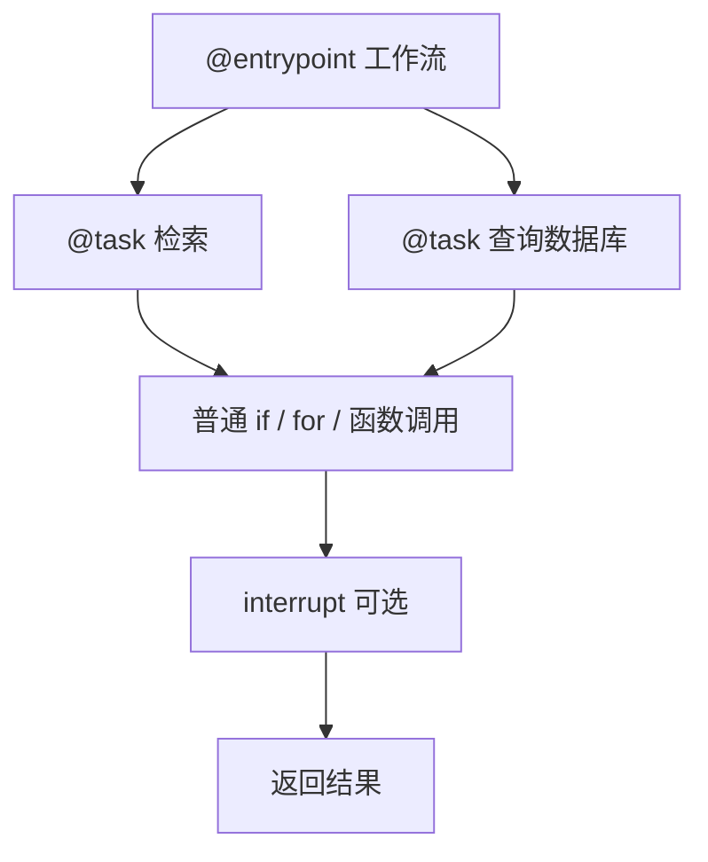

## 1. 为什么还有一套 Functional API

Graph API 要显式声明 State、节点和边，适合控制流复杂、需要可视化的系统。但有些现有 Python 程序已经用 `if`、`for`、函数调用表达得很清楚，只想增加：

- 持久化；
- 故障恢复；
- Human-in-the-loop；
- 流式输出。

Functional API 就是为这种情况准备的。它保留普通 Python 控制流，通过两个装饰器把关键步骤交给 LangGraph 运行时：

- `@entrypoint`：一次工作流的入口和恢复边界；
- `@task`：可被单独记录结果、恢复和并发调度的工作单元。



## 2. 最小示例

```python
from langgraph.checkpoint.memory import InMemorySaver
from langgraph.func import entrypoint, task


@task
def fetch_record(record_id: str) -> dict:
    # 这里可以调用真实 API
    return {"id": record_id, "status": "ready"}


@task
def build_report(record: dict) -> str:
    return f"记录 {record['id']} 的状态为 {record['status']}"


@entrypoint(checkpointer=InMemorySaver())
def workflow(record_id: str) -> str:
    record = fetch_record(record_id).result()
    report = build_report(record).result()
    return report


config = {"configurable": {"thread_id": "report-001"}}
result = workflow.invoke("A-1024", config)
```

调用 `@task` 包装的函数时，得到的是类似 Future 的对象。在同步入口中用 `.result()` 取结果，在异步入口中通常 `await` 它。

## 3. Graph API 与 Functional API 的真实差异

| 维度 | Graph API | Functional API |
|---|---|---|
| 控制流 | 节点与边显式声明 | 使用 Python 的 `if/for/while` |
| 状态 | 显式 State + Reducer | 主要是函数局部变量与返回值 |
| 可视化 | 图结构稳定，容易展示 | 路径运行时产生，不支持同等程度的静态图 |
| Checkpoint 粒度 | 每个 superstep 形成新检查点 | task 结果保存到 entrypoint 关联的检查点 |
| 改造现有代码 | 往往需要重构为图 | 改动较少 |
| 适用重点 | 复杂路由、多分支、共享状态 | 线性或代码式流程、快速加入 durable execution |

两套 API 使用同一个底层运行时，也可以组合。不要根据“哪一种更高级”选择，而要根据流程是否需要显式结构选择。

## 4. 为什么副作用应放进 `@task`

Functional API 在故障或 interrupt 后恢复时，会从 entrypoint 开头重新执行 Python 函数。已经完成并记录的 task 结果可以从 Checkpoint 中重放，而不必再次真正执行。

```python
@task
def charge_order(order_id: str) -> dict:
    return payment_api.charge(
        order_id=order_id,
        idempotency_key=f"charge:{order_id}",
    )


@entrypoint(checkpointer=checkpointer)
def checkout(order: dict):
    # 交给 task，运行时才能保存其结果
    payment = charge_order(order["id"]).result()
    return {"payment": payment}
```

如果直接在 entrypoint 里调用收费接口：

```python
@entrypoint(checkpointer=checkpointer)
def bad_checkout(order: dict):
    payment_api.charge(order["id"])  # 恢复时可能再次调用
```

运行时无法把这次普通函数调用识别为一个独立、可恢复步骤。

即使放进 `@task`，涉及付款、发信、删改数据等外部副作用时仍应使用业务幂等键。Checkpoint 可以减少重复执行，但不能替代外部系统的幂等保证。

## 5. 并发执行任务

同步示例：先创建所有 Future，再逐一取结果，任务就有机会并发调度。

```python
from langgraph.func import entrypoint, task


@task
def inspect_file(path: str) -> dict:
    return {"path": path, "valid": True}


@entrypoint()
def inspect_all(paths: list[str]) -> list[dict]:
    futures = [inspect_file(path) for path in paths]
    return [future.result() for future in futures]
```

不要写成：

```python
results = [inspect_file(path).result() for path in paths]
```

因为每一轮立即等待结果，容易把本可并发的任务串行化。

异步示例：

```python
import asyncio
from langgraph.func import entrypoint, task


@task
async def inspect_file(path: str) -> dict:
    return {"path": path, "valid": True}


@entrypoint()
async def inspect_all(paths: list[str]) -> list[dict]:
    futures = [inspect_file(path) for path in paths]
    return await asyncio.gather(*futures)
```

## 6. 与 interrupt 配合

```python
from langgraph.checkpoint.memory import InMemorySaver
from langgraph.func import entrypoint, task
from langgraph.types import Command, interrupt


@task
def prepare_change(request: dict) -> dict:
    return {"target": request["target"], "operation": "update"}


@entrypoint(checkpointer=InMemorySaver())
def change_workflow(request: dict) -> dict:
    proposal = prepare_change(request).result()
    approved = interrupt({
        "kind": "approval",
        "proposal": proposal,
        "question": "是否执行该变更？",
    })
    return {"proposal": proposal, "approved": bool(approved)}


config = {"configurable": {"thread_id": "change-001"}}

# 第一次调用会暂停
change_workflow.invoke({"target": "layer-7"}, config)

# 用户决定后，使用同一 thread_id 恢复
result = change_workflow.invoke(Command(resume=True), config)
```

恢复时 entrypoint 会从头运行，但 `prepare_change` 已完成的结果可从 Checkpoint 读取。`interrupt()` 的更多规则见 [2.1 Interrupt：Human-in-the-loop](/blog/interrupt-human-in-the-loop)。

## 7. 跨多次调用保留 `previous`

同一 `thread_id` 下，entrypoint 可以读取上一次调用保存的值：

```python
from typing import Any
from langgraph.func import entrypoint


@entrypoint(checkpointer=checkpointer)
def running_total(number: int, *, previous: Any = None) -> int:
    return (previous or 0) + number


config = {"configurable": {"thread_id": "counter-1"}}
running_total.invoke(3, config)  # 3
running_total.invoke(4, config)  # 7
```

如果“返回给调用者的值”和“留给下一轮的值”不同，可以使用 `entrypoint.final`：

```python
@entrypoint(checkpointer=checkpointer)
def workflow(number: int, *, previous: int | None = None):
    previous = previous or 0
    return entrypoint.final(
        value={"previous": previous, "input": number},
        save=previous + number,
    )
```

这相当于把 API 输出与内部短期记忆分开。

## 8. 重试、缓存和超时

task 可拥有自己的运行策略：

```python
from langgraph.func import task
from langgraph.types import RetryPolicy, TimeoutPolicy


@task(
    retry_policy=RetryPolicy(max_attempts=3),
    timeout=TimeoutPolicy(idle_timeout=30),
)
async def call_remote_service(url: str) -> dict:
    return await fetch_json(url)
```

需要注意：

- 不是什么错误都该重试，参数错误和权限错误通常重试无意义；
- 超时与错误处理能力受版本和同步/异步模式影响，写生产代码前应核对当前版本文档；
- 缓存用于复用相同输入的计算结果，Checkpoint 用于恢复某次执行，两者概念不同。

## 9. 何时从 Functional API 升级为显式图

出现以下信号时，Graph API 往往更合适：

- 条件和循环越来越多，控制流难以一眼看清；
- 多个步骤需要读写共享状态；
- 并行结果需要 Reducer 合并；
- 业务方希望查看静态流程图；
- 需要从外部精确检查和修改中间状态；
- 子流程需要作为可复用 Subgraph。

相反，一段线性任务编排若本就清晰，不必为了“看起来像 LangGraph”而强行拆成十几个节点。

## 10. 官方资料

- [Functional API overview](https://docs.langchain.com/oss/python/langgraph/functional-api)
- [Use the Functional API](https://docs.langchain.com/oss/python/langgraph/use-functional-api)
