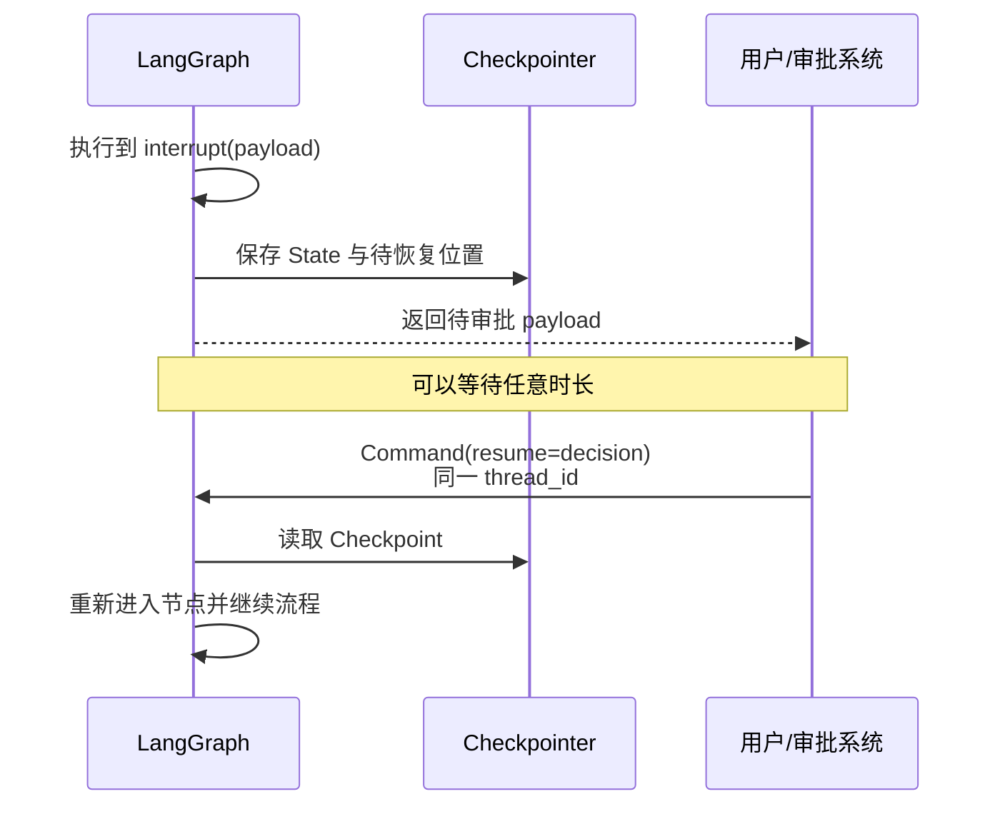

## 1. interrupt 不是普通的 `input()`

`interrupt()` 会让图在节点内部暂停，将一份 JSON 可序列化的请求暴露给外部，并通过 Checkpointer 保存当前位置。外部可以几秒、几小时甚至几天后再提交决定，图使用同一 `thread_id` 恢复。



它适用于外部世界需要参与决策的场景，而不只是“聊天中问用户一个问题”。

## 2. 最小审批流程

```python
from typing_extensions import TypedDict
from langgraph.checkpoint.memory import InMemorySaver
from langgraph.graph import StateGraph, START, END
from langgraph.types import Command, interrupt


class State(TypedDict):
    action: dict
    approved: bool
    result: str


def request_approval(state: State):
    decision = interrupt({
        "kind": "approval",
        "title": "即将执行高风险操作",
        "action": state["action"],
        "allowed_decisions": ["approve", "reject"],
    })
    return {"approved": decision == "approve"}


def execute(state: State):
    if not state["approved"]:
        return {"result": "操作已取消"}
    return {"result": perform_action(state["action"])}


builder = StateGraph(State)
builder.add_node("request_approval", request_approval)
builder.add_node("execute", execute)
builder.add_edge(START, "request_approval")
builder.add_edge("request_approval", "execute")
builder.add_edge("execute", END)
graph = builder.compile(checkpointer=InMemorySaver())

config = {"configurable": {"thread_id": "approval-001"}}

# 第一次执行：到 interrupt 后暂停
paused = graph.invoke(
    {
        "action": {"type": "delete_layer", "layer_id": "L-42"},
        "approved": False,
        "result": "",
    },
    config,
)

# 用户审批后恢复；必须沿用同一个 thread_id
finished = graph.invoke(Command(resume="approve"), config)
```

开发时 `paused` 的传统调用结果中可看到 `__interrupt__`；在较新的 event streaming API 中，可通过 `stream.interrupts` 与 `stream.interrupted` 读取暂停信息。

## 3. 最容易踩坑的语义：恢复时节点从头执行

恢复不是从 Python 的 `interrupt()` 下一行继续。运行时会**从当前节点开头重新执行**，此前已提供的 resume 值在再次走到相应 interrupt 时返回。

```python
def risky_node(state):
    create_order()                 # 恢复时可能再次执行
    approved = interrupt("审批？")
    send_order() if approved else None
```

这段代码可能重复创建订单。

更安全的结构：

```python
def approval_node(state):
    approved = interrupt({"order": state["order"]})
    return {"approved": bool(approved)}


def create_order_node(state):
    if not state["approved"]:
        return {}
    return {
        "order_result": create_order(
            state["order"],
            idempotency_key=state["request_id"],
        )
    }
```

原则是：

- 能放在 interrupt 后面的副作用，不要放在前面；
- 必须放在前面的副作用要幂等；
- 高风险执行最好成为审批后的独立节点。

## 4. interrupt 的四条硬规则

### 4.1 不要用 `try/except` 包住 interrupt

interrupt 通过特殊异常让运行时接管暂停。笼统捕获异常可能把它误当业务错误吞掉。

```python
# 不要这样写
try:
    answer = interrupt(payload)
except Exception:
    answer = default_value
```

如果必须捕获其他错误，应缩小 `try` 的范围，或明确排除运行时中断机制。

### 4.2 不要在同一节点中随意改变 interrupt 顺序

恢复值要与节点内的 interrupt 调用顺序对应。版本升级时把第二个问题挪到第一个之前，可能使已暂停线程将旧答案匹配到错误问题。

多阶段表单更适合拆成多个节点，每个节点一个明确的 interrupt。

### 4.3 payload 与 resume 值应可 JSON 序列化

可以传字符串、数字、布尔、列表和普通字典。不要传数据库连接、函数、文件句柄或复杂运行时对象。

### 4.4 interrupt 前的副作用必须幂等

包括写数据库、发消息、扣款、创建云资源、修改文件等。重复执行不会出问题，才称得上幂等。

## 5. 三种常见 Human-in-the-loop 模式

### 5.1 Approve / Reject

适合发送邮件、发布内容、执行删除或付款。

```python
decision = interrupt({
    "kind": "approval",
    "preview": state["draft"],
    "choices": ["approve", "reject"],
})
```

### 5.2 Review / Edit

用户不只是同意，还可以修改模型产物：

```python
review = interrupt({
    "kind": "edit",
    "draft": state["draft"],
    "schema": {"draft": "string"},
})

return {
    "draft": review["draft"],
    "approved": True,
}
```

外部提交的数据仍必须重新验证长度、格式、权限和业务约束。

### 5.3 补充缺失信息

当模型无法可靠推断关键字段时，暂停向用户提问比“编一个答案”更安全：

```python
answer = interrupt({
    "kind": "clarification",
    "field": "target_crs",
    "question": "目标坐标系是什么？例如 EPSG:4326",
})
```

## 6. 审批界面应该展示什么

仅显示“是否允许？”通常不够。一个可审计的审批 payload 至少应包含：

| 信息 | 目的 |
|---|---|
| 操作类型 | 用户知道系统准备做什么 |
| 目标对象 | 避免批错资源 |
| 参数与变更预览 | 看见实际影响 |
| 风险等级 | 帮助快速判断 |
| 依据/来源 | 理解 Agent 为什么提出此操作 |
| 可选决定 | 防止前后端产生不一致枚举 |
| 请求 ID | 审计和幂等 |

不要把模型的“理由”当作权限证明。审批恢复后，服务端仍要重新检查用户身份、资源归属和权限，因为暂停期间外部状态可能已经改变。

## 7. interrupt 与静态 breakpoint

LangGraph 还允许在编译或运行配置中设置节点前/后的静态中断点。两者用途不同：

- `interrupt()`：业务逻辑的一部分，可携带结构化数据并根据条件触发；
- `interrupt_before/after`：更像调试断点或统一的节点边界暂停。

正式业务审批通常优先使用动态 `interrupt()`，因为请求内容、触发条件和恢复值都更明确。

## 8. 多个 interrupt 的设计

一个运行可能同时或先后产生多个中断。生产 UI 不要假设“永远只有一个待处理问题”，而应基于 interrupt ID 管理：

- 哪个 interrupt 来自哪个节点/子图；
- 哪些已经响应；
- 哪些仍在等待；
- 同一请求能否重复提交；
- 多个审批是否必须全部通过。

如果是并行审批，还应明确采用 AND、OR、法定人数或角色优先级规则，不要让完成顺序隐式决定结果。

## 9. 何时不需要 interrupt

- 只是想让用户继续聊天：普通消息轮次更自然；
- 操作完全可逆且低风险：可直接执行并提供撤销；
- 系统可以用确定性规则自动判断：不要制造无意义人工瓶颈；
- 需要等待固定时间：应使用调度机制，而不是伪造人工审批。

Human-in-the-loop 的目的不是让人点击更多按钮，而是把人放在不确定性、高影响和责任边界真正需要的位置。

## 10. 官方资料

- [Interrupts](https://docs.langchain.com/oss/python/langgraph/interrupts)
- [Persistence](https://docs.langchain.com/oss/python/langgraph/persistence)
