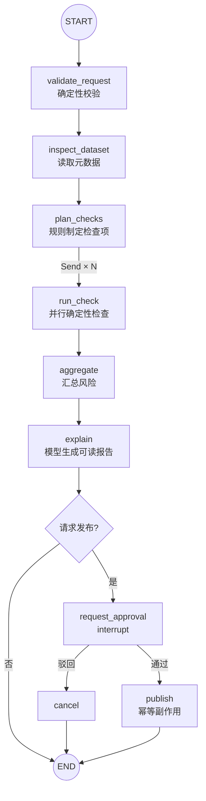

## 1. 案例目标

构建一个“GIS 数据质检与发布 Agent”。用户给出一个数据集 URI，系统需要：

1. 读取元数据；
2. 根据数据类型制定检查项；
3. 并行执行坐标系、几何、属性和拓扑检查；
4. 汇总风险；
5. 用模型把技术发现解释成人能读懂的报告；
6. 如果用户要求发布，必须等待人工审批；
7. 发布动作可重试但不能重复创建资源；
8. 服务中断后能够从 Checkpoint 恢复。

这个案例的重点不是具体 GIS 库，而是如何划分**确定性代码、模型判断、并行任务、人工决策与外部副作用**。

## 2. 为什么不让一个 Agent 包办全部事情

坐标系是否缺失、几何是否合法、字段是否符合规范，都有确定的计算方法。让模型凭文本判断这些事实既昂贵又不可靠。

模型更适合：

- 把检查结果解释给非专业用户；
- 根据证据给出修复建议；
- 对无法硬编码的语义问题辅助判断。

发布权限和审批必须交给普通代码与人。



## 3. State 设计

先定义发现项和稳定的合并规则：

```python
from typing import Annotated, Literal
from typing_extensions import TypedDict


Severity = Literal["info", "warning", "error", "critical"]


class Finding(TypedDict):
    id: str
    check: str
    severity: Severity
    message: str
    evidence: dict


def merge_findings(
    left: list[Finding],
    right: list[Finding],
) -> list[Finding]:
    """按稳定 ID 去重，并排序以消除并行完成顺序的影响。"""
    by_id = {item["id"]: item for item in [*left, *right]}
    return sorted(by_id.values(), key=lambda item: item["id"])


class GISState(TypedDict, total=False):
    # 请求事实
    request_id: str
    dataset_uri: str
    requested_action: Literal["inspect", "publish"]
    target_crs: str | None

    # 中间状态
    metadata: dict
    planned_checks: list[str]
    findings: Annotated[list[Finding], merge_findings]
    risk_level: Literal["low", "medium", "high", "critical"]
    report: str

    # HITL 与副作用
    approved: bool
    reviewer_comment: str
    publish_result: dict
    status: str
```

设计上的几个刻意选择：

- `request_id` 用作审计和发布幂等键；
- `findings` 是结构化事实，不是一段难解析的文本；
- 并行结果按 `id` 去重并排序；
- `report` 是面向人的派生信息，不能覆盖原始 finding；
- 登录用户和数据库连接不放 State，而应通过 `Runtime.context` 注入；
- 大型数据本体不写入 State，只保存 `dataset_uri` 和元数据。

## 4. 运行上下文

```python
from dataclasses import dataclass


@dataclass
class AppContext:
    user_id: str
    tenant_id: str
```

上下文由可信的服务端认证层构造。模型和客户端不能通过修改 State 冒充其他用户。

生产项目还可以在 context 中注入 repository、对象存储客户端等依赖；但要注意这些对象不会被 Checkpoint 序列化，恢复时由新进程重新注入。

## 5. 校验请求

```python
from langgraph.types import Command


def validate_request(state: GISState):
    uri = state["dataset_uri"].strip()

    if not uri.startswith(("s3://", "file://", "https://")):
        raise ValueError("dataset_uri 必须使用允许的 URI 协议")

    if state["requested_action"] not in {"inspect", "publish"}:
        raise ValueError("不支持的 requested_action")

    return {
        "dataset_uri": uri,
        "status": "validated",
    }
```

URI 白名单、文件大小、租户权限等都应在此或专门授权节点中做确定性检查。不要让模型决定一个路径是否安全。

## 6. 读取数据元信息

下面的 `gis_repository` 是业务适配层，实际可由 GDAL、GeoPandas、PostGIS 或云端数据目录实现。

```python
def inspect_dataset(state: GISState):
    metadata = gis_repository.inspect(state["dataset_uri"])

    return {
        "metadata": {
            "format": metadata.format,
            "geometry_type": metadata.geometry_type,
            "feature_count": metadata.feature_count,
            "crs": metadata.crs,
            "bounds": metadata.bounds,
            "fields": metadata.fields,
            "content_hash": metadata.content_hash,
        },
        "status": "inspected",
    }
```

记录 `content_hash` 很重要：审批时用户看到的报告与真正发布的数据必须是同一版本。发布节点应再次核对哈希，防止审批等待期间源文件被替换。

## 7. 用规则制定检查计划

```python
def plan_checks(state: GISState):
    metadata = state["metadata"]
    checks = ["crs", "schema", "geometry_validity"]

    if metadata["geometry_type"] in {"Polygon", "MultiPolygon"}:
        checks.append("polygon_topology")

    if metadata["feature_count"] > 1_000_000:
        checks.append("large_dataset_sampling")

    return {
        "planned_checks": checks,
        "status": "checks_planned",
    }
```

这里使用规则而不是模型，因为检查计划可由几何类型、数据规模和组织规范明确推出。若未来存在模糊的业务语义检查，可以让模型提出候选计划，再由代码限制在允许的检查注册表内。

## 8. 用 `Send` 动态并行检查

每次任务给 worker 一份局部输入：

```python
from typing_extensions import TypedDict
from langgraph.types import Send


class CheckTask(TypedDict):
    request_id: str
    dataset_uri: str
    metadata: dict
    target_crs: str | None
    check_name: str


def dispatch_checks(state: GISState):
    return [
        Send(
            "run_check",
            {
                "request_id": state["request_id"],
                "dataset_uri": state["dataset_uri"],
                "metadata": state["metadata"],
                "target_crs": state.get("target_crs"),
                "check_name": check_name,
            },
        )
        for check_name in state["planned_checks"]
    ]
```

检查注册表：

```python
from collections.abc import Callable


CheckFunction = Callable[..., list[Finding]]

CHECK_REGISTRY: dict[str, CheckFunction] = {
    "crs": check_crs,
    "schema": check_schema,
    "geometry_validity": check_geometry_validity,
    "polygon_topology": check_polygon_topology,
    "large_dataset_sampling": check_large_dataset_sampling,
}


def run_check(state: CheckTask):
    check_name = state["check_name"]
    check_function = CHECK_REGISTRY[check_name]

    findings = check_function(
        uri=state["dataset_uri"],
        metadata=state["metadata"],
        target_crs=state.get("target_crs"),
    )

    # 每个分支只返回自己新增的 findings
    return {"findings": findings}
```

不要根据模型输出动态 import 任意函数。模型最多选择注册表中的白名单名称。

## 9. 汇总风险

```python
SEVERITY_WEIGHT = {
    "info": 0,
    "warning": 1,
    "error": 2,
    "critical": 3,
}


def aggregate(state: GISState):
    findings = state.get("findings", [])
    max_weight = max(
        (SEVERITY_WEIGHT[item["severity"]] for item in findings),
        default=0,
    )

    if max_weight >= 3:
        risk = "critical"
    elif max_weight == 2:
        risk = "high"
    elif max_weight == 1:
        risk = "medium"
    else:
        risk = "low"

    return {
        "risk_level": risk,
        "status": "checks_completed",
    }
```

风险等级由明确规则计算，不能让模型在相同 findings 上今天判高风险、明天判低风险。模型可以解释风险，但不拥有最终安全判定权。

## 10. 用模型生成面向人的解释

```python
import json
from langchain.chat_models import init_chat_model


model = init_chat_model("openai:gpt-5.4-mini", temperature=0)


def explain_findings(state: GISState):
    evidence = {
        "metadata": state["metadata"],
        "findings": state.get("findings", []),
        "risk_level": state["risk_level"],
    }

    response = model.invoke([
        {
            "role": "system",
            "content": (
                "你是 GIS 数据质量分析员。只能依据提供的结构化证据写报告；"
                "不得修改风险等级，不得虚构未执行的检查。"
            ),
        },
        {
            "role": "user",
            "content": (
                "请用中文输出：总体结论、问题列表、影响和修复建议。\n"
                + json.dumps(evidence, ensure_ascii=False)
            ),
        },
    ])

    return {
        "report": str(response.content),
        "status": "report_ready",
    }
```

报告只是证据的表现层。API 最好同时返回结构化 findings，前端和其他程序不必再次解析模型文本。

## 11. 决定是否进入审批

```python
from typing import Literal


def route_after_report(
    state: GISState,
) -> Literal["request_approval", "__end__"]:
    return (
        "request_approval"
        if state["requested_action"] == "publish"
        else "__end__"
    )
```

“只检查”的请求直接结束；“检查并发布”无论风险高低都进入审批。是否允许低风险自动发布属于明确的组织策略，不应让模型自行决定。

## 12. 审批节点

```python
from typing import Literal
from langgraph.types import Command, interrupt


def request_approval(
    state: GISState,
) -> Command[Literal["publish", "cancel"]]:
    review = interrupt({
        "kind": "gis_publish_approval",
        "request_id": state["request_id"],
        "dataset_uri": state["dataset_uri"],
        "content_hash": state["metadata"]["content_hash"],
        "risk_level": state["risk_level"],
        "findings": state.get("findings", []),
        "report": state["report"],
        "allowed_decisions": ["approve", "reject"],
    })

    approved = review["decision"] == "approve"
    return Command(
        update={
            "approved": approved,
            "reviewer_comment": review.get("comment", ""),
            "status": "approved" if approved else "rejected",
        },
        goto="publish" if approved else "cancel",
    )
```

审批 payload 包含内容哈希、风险和原始 findings。恢复后发布节点仍须重新鉴权并核对数据哈希，因为审批期间权限和文件都可能变化。

## 13. 幂等发布节点

```python
from langgraph.runtime import Runtime


def publish(state: GISState, runtime: Runtime[AppContext]):
    # 1. 服务端重新鉴权
    authorization.require_permission(
        user_id=runtime.context.user_id,
        tenant_id=runtime.context.tenant_id,
        action="publish_dataset",
        resource=state["dataset_uri"],
    )

    # 2. 防止审批后数据被替换
    current_hash = gis_repository.content_hash(state["dataset_uri"])
    if current_hash != state["metadata"]["content_hash"]:
        raise DatasetChangedError("数据内容已变化，需要重新质检和审批")

    # 3. 外部系统用稳定 key 防止重复发布
    result = catalog.publish(
        dataset_uri=state["dataset_uri"],
        idempotency_key=f"gis-publish:{state['request_id']}",
        actor_id=runtime.context.user_id,
    )

    return {
        "publish_result": result,
        "status": "published",
    }


def cancel(state: GISState):
    return {"status": "cancelled"}
```

这里形成三道防线：人工同意、恢复时重新授权、外部操作幂等。

## 14. 组装整张图

```python
from langgraph.checkpoint.memory import InMemorySaver
from langgraph.graph import StateGraph, START, END
from langgraph.types import RetryPolicy


def build_graph(checkpointer):
    builder = StateGraph(GISState, context_schema=AppContext)

    builder.add_node("validate_request", validate_request)
    builder.add_node(
        "inspect_dataset",
        inspect_dataset,
        retry_policy=RetryPolicy(max_attempts=3),
    )
    builder.add_node("plan_checks", plan_checks)
    builder.add_node(
        "run_check",
        run_check,
        retry_policy=RetryPolicy(max_attempts=2),
    )
    builder.add_node("aggregate", aggregate)
    builder.add_node(
        "explain_findings",
        explain_findings,
        retry_policy=RetryPolicy(max_attempts=3),
    )
    builder.add_node(
        "request_approval",
        request_approval,
        destinations=("publish", "cancel"),
    )
    builder.add_node("publish", publish)
    builder.add_node("cancel", cancel)

    builder.add_edge(START, "validate_request")
    builder.add_edge("validate_request", "inspect_dataset")
    builder.add_edge("inspect_dataset", "plan_checks")
    builder.add_conditional_edges("plan_checks", dispatch_checks)
    builder.add_edge("run_check", "aggregate")
    builder.add_edge("aggregate", "explain_findings")
    builder.add_conditional_edges("explain_findings", route_after_report)
    builder.add_edge("publish", END)
    builder.add_edge("cancel", END)

    return builder.compile(checkpointer=checkpointer)


# 仅用于本地示例；生产换成持久化 Saver
graph = build_graph(InMemorySaver())
```

`destinations` 主要用于让可视化知道 `Command` 可能跳到哪里，并不替代实际的 `goto`。

## 15. 启动与恢复

```python
from langgraph.types import Command


thread_id = "gis-job-0182"
config = {
    "configurable": {"thread_id": thread_id},
    "max_concurrency": 4,
    "recursion_limit": 30,
}
context = AppContext(user_id="user-42", tenant_id="tenant-a")

initial_state: GISState = {
    "request_id": "req-20260908-0182",
    "dataset_uri": "s3://tenant-a-data/landuse.gpkg",
    "requested_action": "publish",
    "target_crs": "EPSG:4490",
    "findings": [],
    "approved": False,
    "reviewer_comment": "",
    "status": "created",
}

# 第一次运行到 request_approval 暂停
paused = graph.invoke(
    initial_state,
    config,
    context=context,
)

# 用户在 UI 中审阅后，沿用同一 thread_id 恢复
finished = graph.invoke(
    Command(resume={
        "decision": "approve",
        "comment": "问题已确认，不影响本次发布",
    }),
    config,
    context=context,
)
```

生产 API 必须验证当前审批人有权访问这个 thread，不能因为知道 `thread_id` 就允许 resume。

## 16. 把执行进度交给前端

底层 stream mode 示例：

```python
for chunk in graph.stream(
    initial_state,
    config,
    context=context,
    stream_mode=["updates", "messages"],
    version="v2",
):
    if chunk["type"] == "updates":
        for node_name, update in chunk["data"].items():
            print(f"{node_name}: {update.get('status', 'updated')}")
    elif chunk["type"] == "messages":
        # 根据当前版本的 MessagesStreamPart 结构提取文本
        handle_message_event(chunk["data"])
```

面向用户可展示：

```text
✓ 已验证请求
✓ 已读取数据集：1,834 个 Polygon 要素
✓ 5 项质量检查完成
✓ 风险等级：medium
✓ 报告已生成
⏸ 等待发布审批
```

不要把完整 State 或 debug 事件直接发送到浏览器，其中可能有内部 URI、工具参数和敏感元数据。

## 17. 故障策略

| 节点 | 可能错误 | 策略 |
|---|---|---|
| `validate_request` | URI/动作非法 | 不重试，返回明确 4xx 业务错误 |
| `inspect_dataset` | 对象存储短暂失败 | 指数退避重试 |
| `run_check` | 单项计算超时 | 有限重试；必要时记录 incomplete finding |
| `explain_findings` | 模型限流 | 重试或切换 fallback；原始 findings 仍保留 |
| `request_approval` | 等待时间长 | 正常暂停，不视为失败 |
| `publish` | 网络失败 | 相同幂等键重试；内容变化则回到重新质检流程 |

特别注意：如果模型解释失败，系统仍拥有完整结构化检查结果，因此可以降级为模板报告，而不是让整个质检结果丢失。

## 18. 测试重点

```python
def test_polygon_gets_topology_check():
    state = {
        "metadata": {
            "geometry_type": "Polygon",
            "feature_count": 10,
        }
    }
    update = plan_checks(state)
    assert "polygon_topology" in update["planned_checks"]


def test_critical_finding_produces_critical_risk():
    state = {
        "findings": [{
            "id": "crs:missing",
            "check": "crs",
            "severity": "critical",
            "message": "缺少坐标系",
            "evidence": {},
        }]
    }
    assert aggregate(state)["risk_level"] == "critical"


def test_findings_merge_is_order_stable():
    a = {"id": "a", "check": "x", "severity": "info", "message": "a", "evidence": {}}
    b = {"id": "b", "check": "x", "severity": "info", "message": "b", "evidence": {}}
    assert merge_findings([a], [b]) == merge_findings([b], [a])
```

集成测试还应验证：

- 质检请求不会进入审批；
- 发布请求一定进入 interrupt；
- reject 后永不调用 `catalog.publish`；
- resume 前后使用相同 thread 可继续；
- publish 重复执行只创建一个目录资源；
- 审批后文件 hash 变化会阻断发布；
- 不同租户不能读取或恢复彼此 thread；
- 并行检查完成顺序变化不影响最终 findings 顺序。

## 19. 这个案例体现的通用原则

1. **模型负责解释和开放式判断，代码负责事实、权限与硬约束。**
2. **State 保存结构化事实，报告只是派生结果。**
3. **Send 负责动态并行，Reducer 负责确定性合并。**
4. **Checkpoint 提供恢复位置，业务幂等提供重复执行安全。**
5. **interrupt 是持久化审批协议，不是临时弹窗。**
6. **用户身份属于可信 Runtime context，不属于模型可编辑 State。**
7. **先做单图可控流程，再考虑是否真的需要多 Agent。**

## 20. 可以继续扩展的方向

- 把不同检查类别拆为独立 Subgraph；
- 将检查标准放入带版本号的规则库；
- 用 Store 保存用户默认目标坐标系和报告语言；
- 接入 PostgresSaver，实现真正跨重启恢复；
- 用 LangSmith 追踪每个节点的延迟、成本和错误；
- 增加自动修复建议，但修复动作仍需白名单和审批；
- 让前端基于 event streaming 展示任务与子图进度；
- 对历史 Checkpoint 做回放，比较规则版本升级前后的质检差异。

相关笔记：

- [1.1 Reducer、消息状态与并行更新](/blog/reducer-消息状态与并行更新)
- [1.2 条件路由、Command 与 Send](/blog/条件路由-command-与-send)
- [2.0 Persistence：Checkpoint、Thread 与时间旅行](/blog/persistence-checkpoint-thread-与时间旅行)
- [2.1 Interrupt：Human-in-the-loop](/blog/interrupt-human-in-the-loop)
- [3.1 Streaming、Subgraph 与多 Agent](/blog/streaming-subgraph-与多-agent)
- [4.0 错误恢复、测试与生产实践](/blog/错误恢复-测试与生产实践)

## 21. 官方资料

- [Use the Graph API](https://docs.langchain.com/oss/python/langgraph/use-graph-api)
- [Persistence](https://docs.langchain.com/oss/python/langgraph/persistence)
- [Interrupts](https://docs.langchain.com/oss/python/langgraph/interrupts)
- [Fault tolerance](https://docs.langchain.com/oss/python/langgraph/fault-tolerance)
