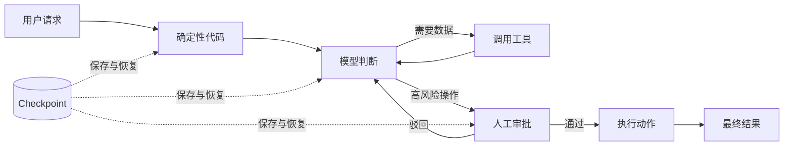
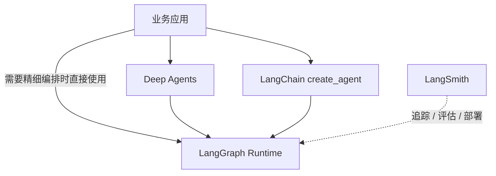
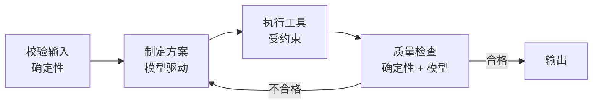
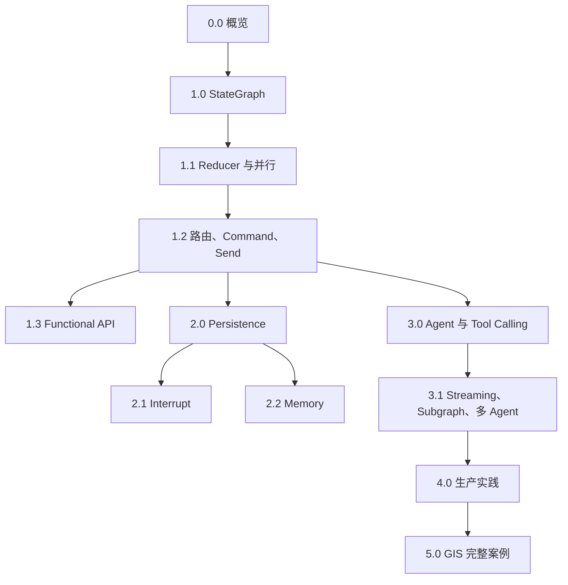

> **版本说明**
> 本组笔记以 **LangGraph 1.x 的 Python API** 为主。LangGraph 的核心图 API 在 1.x 中保持稳定；新项目若只需要常见的工具调用 Agent，应优先使用 LangChain 的 `create_agent`，它底层仍由 LangGraph 驱动。旧教程常见的 `langgraph.prebuilt.create_react_agent` 已弃用。

## 1. 一句话理解 LangGraph

LangGraph 是一个用来编排**有状态、可循环、可暂停、可恢复**任务的运行时。

它并不负责让模型“更聪明”，而是负责让模型与普通代码在一个可控流程里协作：哪一步调用模型、哪一步查数据库、失败后从哪里重试、何时等待人工审批、恢复时沿用哪份状态，都由图明确表达。

如果把大模型看作一个擅长判断但偶尔犯错的员工，那么 LangGraph 更像“工作流制度 + 档案系统 + 调度中心”，而不是另一个大脑。



## 2. 它解决的不是“调用模型”，而是“管理过程”

直接调用模型通常只是一问一答：

```python
response = model.invoke("请分析这份数据")
```

真实系统往往还需要：

- 根据模型判断选择不同工具；
- 工具执行后把结果送回模型，形成循环；
- 多个任务并行处理，再汇总结果；
- 在发送邮件、删数据等动作前暂停并等待审批；
- 服务重启后继续尚未完成的长任务；
- 查看每一步状态，定位 Agent 为什么做出某个决定。

普通的 `if/for/while` 当然也能写这些逻辑，但随着状态、失败恢复和并行分支增加，代码会逐渐变成难以审计的“隐形状态机”。LangGraph 的价值，是把这些原本散落在业务代码里的控制语义统一交给运行时管理。

## 3. LangChain、LangGraph、Deep Agents 与 LangSmith

| 组件 | 核心定位 | 适合解决的问题 |
|---|---|---|
| LangChain | 模型、消息、工具和 Agent 的高层抽象 | 快速搭建标准工具调用 Agent |
| LangGraph | 有状态工作流与 Agent 的底层编排运行时 | 自定义流程、循环、持久化、人工介入 |
| Deep Agents | 建立在 LangGraph 之上的 Agent harness | 规划、子 Agent、文件系统与上下文管理 |
| LangSmith | 可观测、评估、调试与部署平台 | 看清执行轨迹、做离线/在线评估 |

关键关系是：**LangChain 的 `create_agent` 本身运行在 LangGraph 上。**

所以两者不是互斥选择，而是抽象层级不同：



### 什么时候直接用 `create_agent`

- 流程基本就是“模型决定是否调用工具，直到给出答案”；
- 主要需求是提示词、工具、中间件和结构化输出；
- 不需要复杂分支、多个阶段或特殊的状态模型。

### 什么时候直接用 LangGraph

- 流程中既有确定性步骤，也有模型驱动步骤；
- 需要循环、动态并行、人工审批或故障恢复；
- 需要精确控制每个阶段读写哪些状态；
- 多个 Agent 之间存在明确的交接规则；
- 业务要求可审计，不能把整个流程都藏在一次模型调用中。

## 4. 核心抽象：状态、节点、边

LangGraph 最重要的三个概念是：

| 概念 | 含义 | 可以类比为 |
|---|---|---|
| State | 某一时刻任务所知道的全部工作状态 | 一份持续更新的案件档案 |
| Node | 读取状态并返回局部更新的函数 | 一个处理岗位 |
| Edge | 决定下一步执行哪个节点的连接 | 流转规则 |

最小图如下：

```python
from langgraph.graph import StateGraph, START, END
from typing_extensions import TypedDict


class State(TypedDict):
    text: str
    length: int


def count_chars(state: State):
    # 节点返回“更新”，而不是重新构造整个 State
    return {"length": len(state["text"])}


builder = StateGraph(State)
builder.add_node("count_chars", count_chars)
builder.add_edge(START, "count_chars")
builder.add_edge("count_chars", END)

graph = builder.compile()
result = graph.invoke({"text": "LangGraph", "length": 0})
print(result)  # {'text': 'LangGraph', 'length': 9}
```

其中：

- `START` 是虚拟入口；
- `END` 是虚拟出口；
- `compile()` 会检查图结构并生成可执行对象；
- `invoke()` 等待执行完成并返回最终状态；
- `stream()` / `stream_events()` 可以持续返回中间事件。

## 5. LangGraph 最重要的四种能力

### 5.1 Durable execution：可恢复执行

接入 Checkpointer 后，运行时会保存状态快照。进程崩溃、人工暂停或外部系统暂时不可用时，可以从已保存的位置继续，而不是从头重做全部工作。

详见：[2.0 Persistence：Checkpoint、Thread 与时间旅行](/blog/persistence-checkpoint-thread-与时间旅行)。

### 5.2 Human-in-the-loop：人工介入

节点可以调用 `interrupt()` 暂停，并把待审批内容交给外部界面。用户稍后用同一 `thread_id` 提交决定，图再恢复执行。

详见：[2.1 Interrupt：Human-in-the-loop](/blog/interrupt-human-in-the-loop)。

### 5.3 Memory：记忆

- Checkpointer 保存单个会话线程的状态，属于短期记忆；
- Store 保存跨线程共享的用户偏好或事实，属于长期记忆。

详见：[2.2 Memory：短期记忆与长期记忆](/blog/memory-短期记忆与长期记忆)。

### 5.4 Streaming：流式反馈

除了模型 token，LangGraph 还能流式返回节点更新、完整状态、任务进度、检查点和自定义事件。前端因此可以展示“正在检索”“已完成 3/10”等真实进度。

详见：[3.1 Streaming、Subgraph 与多 Agent](/blog/streaming-subgraph-与多-agent)。

## 6. Workflow 与 Agent 的区别

官方文档把两者区分得很清楚：

- **Workflow**：路径大体由代码预先确定；
- **Agent**：模型根据当前上下文动态决定下一步和工具。

两者不是二选一。生产系统常见的是混合模式：外层用确定性工作流约束阶段，某个阶段内部允许 Agent 自主循环。



这种结构通常比“给模型一堆工具，让它自己想办法”更稳定，因为自由度只被放在真正需要判断的局部。

## 7. 推荐学习路线



建议不要一开始就研究多 Agent。先真正理解以下三个问题：

1. 每个节点应该读什么、写什么？
2. 多个更新同时到达时如何合并？
3. 失败或暂停以后，哪些操作允许重新执行？

这三个问题分别对应 State、Reducer 和 Durable execution，也是 LangGraph 最容易被低估的部分。

## 8. 一组常见误解

| 误解 | 更准确的理解 |
|---|---|
| “LangGraph 是把流程画成图的工具” | 图只是表达形式，核心是状态化执行与恢复语义 |
| “用了图就一定是 DAG” | LangGraph 支持环，Agent 的工具调用本身就是循环 |
| “State 就是聊天记录” | 消息只是状态的一种，还可包含任务、错误、证据、审批结果等 |
| “有 Checkpointer 就自动拥有长期记忆” | Checkpointer 是线程级状态；跨线程知识应放 Store |
| “节点执行过就绝不会再执行” | 重试、恢复、时间旅行都可能让节点再次执行，因此副作用要幂等 |
| “多 Agent 一定比单 Agent 强” | 多 Agent 增加路由、上下文隔离和调试成本，只在职责确实可拆分时使用 |

## 9. 官方资料

- [LangGraph overview](https://docs.langchain.com/oss/python/langgraph/overview)
- [Graph API overview](https://docs.langchain.com/oss/python/langgraph/graph-api)
- [LangGraph v1 release notes](https://docs.langchain.com/oss/python/releases/langgraph-v1)
- [LangGraph GitHub repository](https://github.com/langchain-ai/langgraph)
