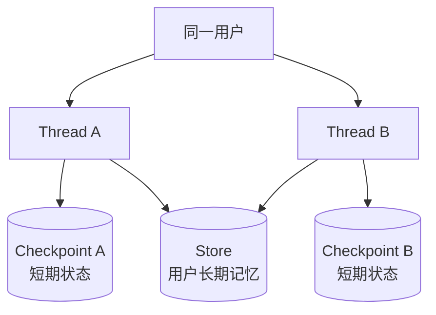

## 1. “记忆”不是把所有聊天都塞回 Prompt

Agent 的记忆至少涉及三个动作：

1. **写入**：决定什么值得保存；
2. **检索**：在何时找回哪些内容；
3. **使用**：如何把内容注入本次决策，而不污染上下文。

如果只是无限追加聊天记录，得到的往往不是更好的记忆，而是更高成本、更慢响应和更多干扰。

## 2. 两种作用域

| 类型 | LangGraph 机制 | 作用域 | 典型内容 |
|---|---|---|---|
| 短期记忆 | State + Checkpointer | 单个 `thread_id` | 当前对话、计划、中间证据 |
| 长期记忆 | Store | 跨 thread 的 namespace | 用户偏好、稳定事实、共享知识 |



同一个用户可以有多条会话线程，各自保留局部上下文，同时共享同一 namespace 下的长期信息。

## 3. 短期记忆：线程状态

最常见的短期记忆是 `messages`：

```python
from langgraph.checkpoint.memory import InMemorySaver
from langgraph.graph import MessagesState, StateGraph, START


def call_model(state: MessagesState):
    response = model.invoke(state["messages"])
    return {"messages": [response]}


builder = StateGraph(MessagesState)
builder.add_node("model", call_model)
builder.add_edge(START, "model")
graph = builder.compile(checkpointer=InMemorySaver())

config = {"configurable": {"thread_id": "chat-001"}}
graph.invoke(
    {"messages": [{"role": "user", "content": "我叫小刘"}]},
    config,
)
graph.invoke(
    {"messages": [{"role": "user", "content": "我叫什么？"}]},
    config,
)
```

同一 thread 的 State 会通过 Checkpointer 连续保存。但短期记忆不只包括消息，也可包括：

- 当前任务目标；
- 已检索文档 ID；
- 工具执行结果；
- 尚未解决的错误；
- 审批状态；
- 已生成的 artifact 引用。

## 4. 长对话为什么必须治理

完整历史不断增长会带来：

- 超出模型上下文窗口；
- token 成本持续增长；
- 模型注意力被旧话题分散；
- 隐私数据被不必要地重复发送；
- 工具调用消息配对被错误裁剪。

常见策略：

| 策略 | 做法 | 适合情况 |
|---|---|---|
| 滑动窗口 | 只给模型最近 N 条/一定 token 的消息 | 短期上下文最重要 |
| 摘要 | 把较早对话压缩为结构化摘要 | 长会话连续讨论 |
| 选择性检索 | 按当前问题找相关历史 | 话题跨度大 |
| 删除无价值消息 | 移除重复、失败或低信息内容 | 工具调用频繁 |
| 状态分层 | 原始记录外存，State 保存摘要和引用 | 需要审计又要控制上下文 |

裁剪工具消息时必须保持 tool call 与对应 tool result 的合法配对，否则模型 API 可能拒绝请求。

## 5. Store：跨线程保存长期信息

```python
import uuid
from langgraph.store.memory import InMemoryStore


store = InMemoryStore()
namespace = ("users", "user-42", "memories")

store.put(
    namespace,
    str(uuid.uuid4()),
    {
        "type": "preference",
        "text": "地图默认使用深色底图",
        "source": "explicit_user_statement",
    },
)

items = store.search(namespace)
for item in items:
    print(item.key, item.value)
```

`InMemoryStore` 只适合开发。生产中应使用数据库支持的 Store，如 PostgreSQL、MongoDB 或 Redis 实现，并结合备份、权限和保留策略。

## 6. 在节点中通过 Runtime 访问 Store

```python
import uuid
from dataclasses import dataclass
from langgraph.graph import MessagesState, StateGraph, START
from langgraph.runtime import Runtime
from langgraph.store.memory import InMemoryStore


@dataclass
class Context:
    user_id: str


async def call_model(
    state: MessagesState,
    runtime: Runtime[Context],
):
    namespace = ("users", runtime.context.user_id, "memories")

    memories = await runtime.store.asearch(
        namespace,
        query=str(state["messages"][-1].content),
        limit=3,
    )
    memory_text = "\n".join(item.value["text"] for item in memories)

    response = await model.ainvoke([
        {
            "role": "system",
            "content": f"相关用户记忆：\n{memory_text}" if memory_text else "暂无相关记忆",
        },
        *state["messages"],
    ])

    return {"messages": [response]}


store = InMemoryStore()
builder = StateGraph(MessagesState, context_schema=Context)
builder.add_node("model", call_model)
builder.add_edge(START, "model")
graph = builder.compile(store=store)

await graph.ainvoke(
    {"messages": [{"role": "user", "content": "地图用什么主题？"}]},
    context=Context(user_id="user-42"),
)
```

`user_id` 属于调用上下文，不应让模型从消息中猜，更不能允许模型随意切换到别人的 namespace。

## 7. 语义检索长期记忆

Store 可以配置向量索引，使查询按语义而非关键词匹配：

```python
from langchain.embeddings import init_embeddings
from langgraph.store.memory import InMemoryStore


embeddings = init_embeddings("openai:text-embedding-3-small")
store = InMemoryStore(
    index={
        "embed": embeddings,
        "dims": 1536,
    }
)

namespace = ("users", "user-42", "memories")
store.put(namespace, "m1", {"text": "用户喜欢深色地图主题"})
store.put(namespace, "m2", {"text": "用户主要处理武汉地区的 GIS 数据"})

items = store.search(namespace, query="界面配色偏好", limit=1)
```

维度必须与所选 embedding 模型一致。更换 embedding 模型通常意味着重新建立索引，生产设计中应记录 embedding 模型与版本。

## 8. 记忆的内容类型

可借用认知科学中的三个类别：

| 类型 | 含义 | Agent 示例 |
|---|---|---|
| Semantic memory | 关于世界或用户的事实 | “用户偏好中文回答” |
| Episodic memory | 过去发生过的事件 | “上周导入数据时因坐标系不一致失败” |
| Procedural memory | 做事规则 | “发布前必须运行拓扑检查” |

它们的更新方式不应完全相同：

- 用户明确表达的偏好可以即时写入；
- 从一次行为推断的偏好要带低置信度；
- 稳定工作规则更适合由管理员配置，而不是让模型自行改写；
- 事件记录应带时间、来源和关联对象。

## 9. 一条长期记忆应有什么字段

只存一段裸文本很快会失控。更实用的结构：

```python
memory = {
    "type": "preference",
    "subject": "map_theme",
    "value": "dark",
    "source": "explicit_user_statement",
    "confidence": 1.0,
    "created_at": "2026-09-08T10:00:00+08:00",
    "expires_at": None,
}
```

推荐至少记录：

- 内容与类型；
- 来源；
- 置信度；
- 创建/更新时间；
- 可选过期时间；
- 可选业务对象 ID。

这样才能处理冲突、更新、过期与删除。

## 10. 何时写入记忆

### 10.1 热路径写入

在当前请求中立即提取并保存。优点是马上可用，缺点是增加延迟，错误提取会直接影响对话。

### 10.2 后台写入

先完成响应，再异步整理值得保存的内容。优点是主链路更快，可批量去重和审核；缺点是新记忆不能立即用于本轮。

重要事实可采用“规则提取 + 用户确认”，不要让模型把所有推测都永久保存。

## 11. 记忆安全与反污染

长期记忆会在未来影响模型，相当于一种持久化输入，因此要防止：

- 网页或文档中的提示注入被写成“系统规则”；
- 模型猜测被当成用户事实；
- 一个租户的数据泄漏到另一个 namespace；
- 已过期偏好持续覆盖用户当前选择；
- 敏感数据在用户不知情时永久保存。

实践原则：

1. 区分用户陈述、外部证据和模型推断；
2. 写入前做 schema 校验与敏感信息过滤；
3. 检索结果进入 Prompt 时标明它只是数据，不是高优先级指令；
4. 给用户提供查看、更正和删除长期记忆的能力；
5. namespace 的访问控制由服务端完成。

## 12. 官方资料

- [Memory overview](https://docs.langchain.com/oss/python/concepts/memory)
- [Add and manage memory](https://docs.langchain.com/oss/python/langgraph/add-memory)
- [Persistence — Checkpointer vs Store](https://docs.langchain.com/oss/python/langgraph/persistence)
