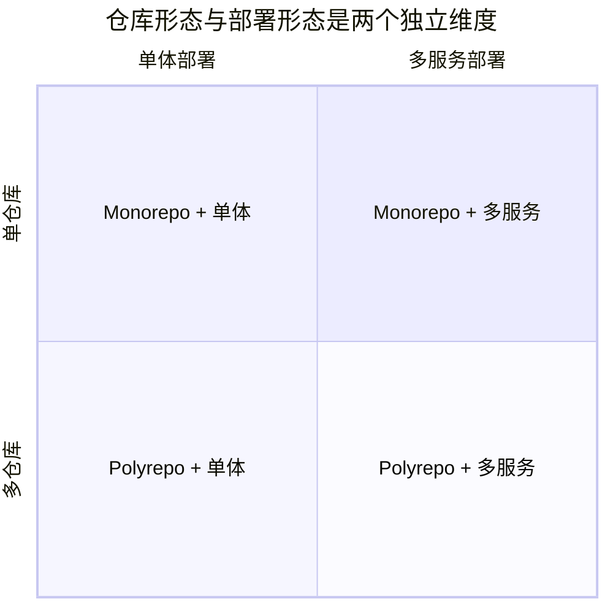
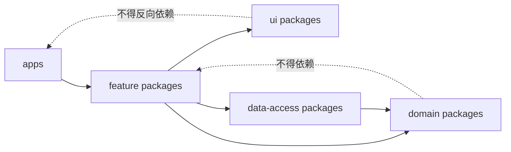
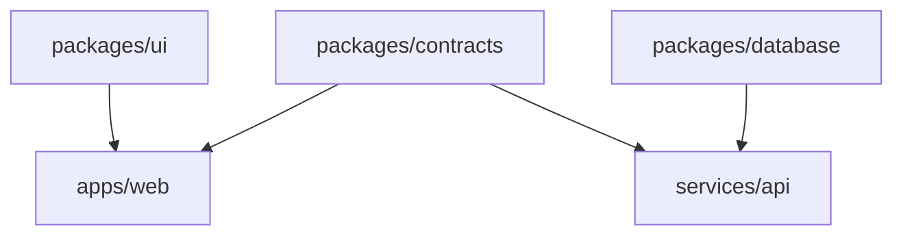
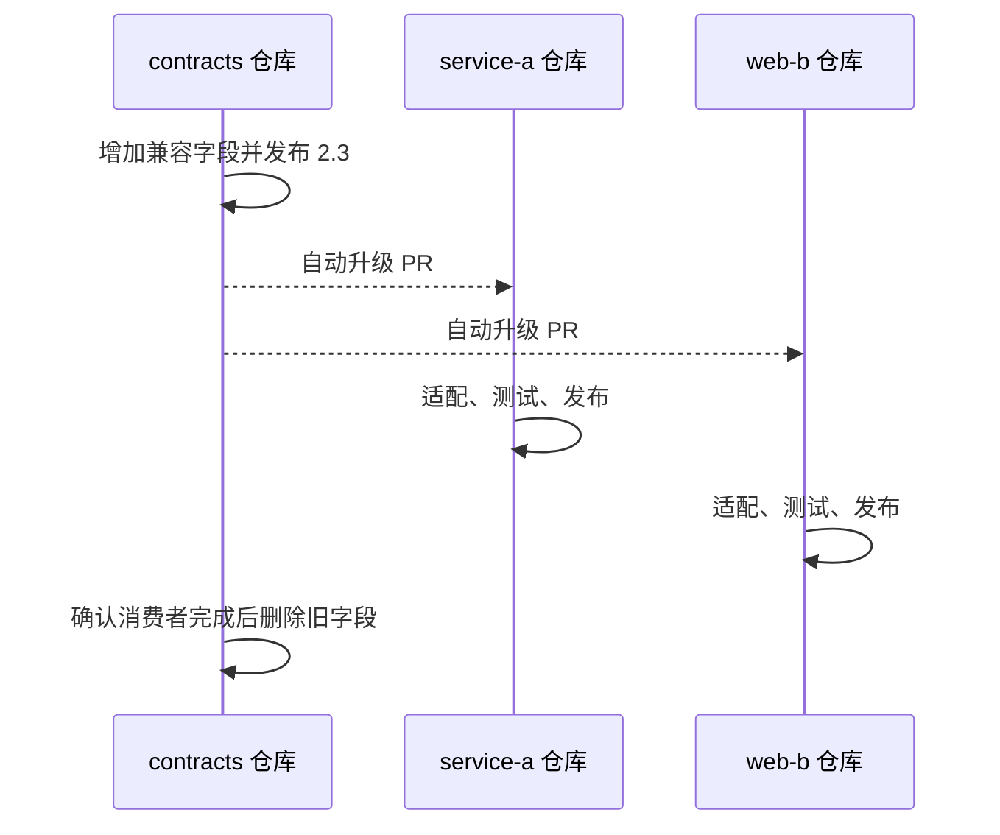

当一个团队从单一应用长出前端、服务端、共享组件、脚本和基础设施代码之后，仓库应该继续放在一起，还是按项目拆开，几乎一定会成为争论。

这场争论很容易退化成两句口号：Monorepo 方便复用，Polyrepo 边界清晰。两句话都没错，也都不足以指导真实决策。

仓库策略真正决定的是另一件事：**哪些变更可以在同一个版本控制与自动化边界内完成，哪些变更必须通过已发布的契约协作。** 它影响的是变更成本、权限模型、工具投入和组织协作，而不是系统最终要部署成几个进程。

---

## 先把两组经常混淆的概念拆开

Monorepo 是用一个仓库管理多个逻辑项目；Polyrepo 是让多个项目分别拥有自己的仓库。

它们描述的是**源代码管理方式**，不是运行时架构：



一个 Monorepo 可以包含二十个独立部署的微服务；一个模块化单体也可能因为历史原因被拆在多个仓库里。把 Monorepo 等同于 Monolith，或者把 Polyrepo 等同于 Microservices，都会让后续讨论建立在错误坐标系上。

类似地，“共享一个仓库”也不意味着：

- 所有项目使用同一种语言；
- 所有代码一起编译、测试或发布；
- 所有人拥有所有目录的写权限；
- 所有包使用同一个版本号；
- 任意模块都可以越过边界直接引用内部实现。

这些都是需要单独设计的策略。

---

## 仓库边界究竟控制什么

可以从五个维度理解仓库边界：

| 维度 | 同一仓库更容易获得 | 不同仓库天然提供 |
|---|---|---|
| 变更 | 一次提交修改多个项目 | 通过版本和发布分阶段变更 |
| 可见性 | 全局搜索、发现和重构 | 信息与噪声隔离 |
| 权限 | 通常需要路径级规则 | 仓库级权限边界 |
| 自动化 | 共享流水线、依赖图和缓存 | 每个项目独立选择工具和节奏 |
| 契约 | 可直接联动修改调用方 | 必须显式版本化和兼容 |

这里没有纯收益。Monorepo 把跨项目协调成本更多地转化成工具和治理成本；Polyrepo 则把本地自治的便利，转化成跨仓库版本协调成本。

选择仓库策略，本质上是在决定哪种成本更符合团队的日常变更形态。

---

## Monorepo 最有价值的能力：原子化修改源码

假设一个共享类型从：

```ts
type User = {
  id: string;
  name: string;
};
```

改成：

```ts
type User = {
  id: string;
  displayName: string;
};
```

如果共享包、Web 应用和 API 都在一个仓库中，可以在同一个 Pull Request 里完成：

```text
修改契约 → 修改生产者 → 修改消费者 → 更新测试 → 一起通过检查
```

这类跨边界重构是 Monorepo 的核心优势。代码评审者能看到一项概念变化如何贯穿整个系统，CI 也能验证这一组源码修改是否彼此匹配。

Polyrepo 中往往需要：

```text
仓库 A 发布兼容版本
      ↓
仓库 B、C 分别升级依赖
      ↓
等待所有消费者迁移
      ↓
仓库 A 删除旧接口
```

这不是 Polyrepo 的缺陷，而是它要求把兼容过程显式化。当消费者由不同团队、不同公司维护，或者无法同时上线时，这种显式兼容反而是必要纪律。

有一个边界尤其值得强调：**原子提交不等于原子部署。** 即使源码在同一个提交里，前端、API 和后台任务仍可能先后发布，旧实例也会在滚动部署期间继续运行。线上协议依然要兼容新旧版本，数据库迁移也依然要采用扩展—迁移—收缩的方式。

Monorepo 能消除一部分源码协调，却不能消除分布式系统的时间差。

---

## 单一事实源带来的复利

Monorepo 经常被概括为“方便共享代码”，但更长远的价值是让整个工程拥有一个可计算的全局视图：

- 一个提交对应完整的源代码状态；
- 全局搜索能够发现接口的全部调用者；
- 重构工具可以同时修改定义和使用方；
- 依赖图能够判断变更影响哪些项目；
- 同一套格式、静态检查和安全规则可以统一升级；
- 基础设施、数据库迁移与应用代码可以放在同一评审上下文中。

Google 对其超大规模单仓库的总结中，把 common source of truth 视为重要收益；但那篇经验也同样强调了支撑这种模式所需的定制版本控制、构建、测试和代码审查基础设施。只复制“一个仓库”的表象，不会自动获得相同收益。

Monorepo 是一种需要基础设施配合的工作方式，而不是把多个目录执行一次 `git init`。

---

## Monorepo 的成本通常晚一点才出现

小团队把几个项目合在一起，初期体验往往很好。真正的成本会在代码、团队和流水线增长后出现。

### Git 操作与工作区体积

大量文件和历史会影响克隆、检出、索引与编辑器扫描。Git 的 partial clone、sparse checkout 和 sparse index 可以缓解部分问题，但它们也给本地工具兼容性和使用方式增加复杂度。

大二进制文件尤其不适合直接混入普通 Git 历史。设计资产、训练数据和构建产物应使用适合的制品或对象存储，而不是因为“都在一个仓库”就全部提交。

### CI 的放大效应

最朴素的 Monorepo 流水线会在任意改动后构建所有项目：

```text
改一行文档 → 安装所有依赖 → 构建 30 个服务 → 跑全部测试
```

随着项目增长，反馈时间会迅速恶化。团队随后要投资：

- 项目与任务依赖图；
- affected/changed project 计算；
- 本地与远程构建缓存；
- 并行和分布式任务执行；
- 可重复、无隐藏输入的构建；
- 合并队列和主分支稳定性；
- 对高风险全局变更运行更广的验证。

这些能力不是优化点缀，而是大型 Monorepo 能否工作的前提。

### 权限与合规

仓库级权限天然比目录级权限简单。若同一仓库同时包含公开客户端、内部风控规则和受严格访问控制的代码，“大家能看、只有部分人能改”可能仍不满足安全或合规要求。

CODEOWNERS 可以自动请求目录负责人评审，也可以配合分支规则要求批准；但它主要是评审和合并护栏，不应被误认为强机密隔离。对读取权限有硬边界的代码，拆仓库往往更直接。

### 共享故障域

根配置、锁文件、构建工具或 CI 模板的一次错误修改，可能影响大量项目。统一带来规模收益，也扩大了变更半径。

因此，全局工具链需要更严格的所有权、渐进升级、回滚和兼容测试。

---

## 一个可扩展的 Monorepo 不是扁平目录

下面是一种常见结构，而不是必须照抄的模板：

```text
repository/
├── apps/
│   ├── web/
│   ├── admin/
│   └── docs/
├── services/
│   ├── identity/
│   └── billing/
├── packages/
│   ├── ui/
│   ├── contracts/
│   └── observability/
├── tools/
├── infra/
├── package.json
└── workspace.yaml
```

比目录名更重要的是依赖规则。假设我们把代码分成 UI、领域、数据访问和应用四类：



这些规则应尽量由静态检查或构建图强制，而不是写在 Wiki 后依赖记忆。否则 Monorepo 里的“方便引用”会逐渐变成任意跨目录导入，最后形成一个无法独立理解和测试的分布式大泥球。

一个实用原则是：包只暴露明确公共入口，其他代码不得引用它的内部路径。

```ts
// 推荐：依赖公开契约
import { createInvoice } from "@company/billing";

// 危险：穿透边界依赖内部文件
import { calculateTax } from "../../billing/src/internal/tax";
```

Monorepo 降低了物理访问成本，因此更需要提高逻辑边界强度。

---

## “只构建受影响项目”背后的依赖图

假设依赖关系如下：



修改 `packages/ui` 时，只需验证 UI 与 Web；修改 Contracts 时，Web 和 API 都受影响。

```text
affected(change) = 被直接修改的项目 + 依赖它们的所有传递消费者
```

这个计算准确的前提是：

- 构建工具知道真实依赖，而不是靠手写列表；
- 任务声明了源码、配置、环境变量等全部输入；
- 任务输出可被稳定识别；
- 构建不偷偷读取工作区外状态；
- 缓存键包含锁文件、工具版本和必要环境信息。

否则缓存可能返回一个“成功但属于另一组输入”的产物，这比完全不缓存更危险。

大型仓库通常还需要两层验证：PR 阶段快速运行受影响任务，主干或定时任务运行更广的全量测试，以发现依赖图没有描述到的隐式耦合。

---

## 依赖共享不是“所有项目永远用同一个版本”

Monorepo 可以采用不同依赖策略：

### 统一版本策略

整个仓库尽量只保留某个第三方库的一种版本。升级集中、漏洞修复一致，代价是升级可能影响许多项目。

### 独立版本策略

每个包或项目拥有自己的依赖范围与发布版本。自治更强，但可能出现重复依赖、类型不兼容和升级漂移。

### 源码依赖与已发布依赖

仓库内项目可以直接引用另一个包的源码，也可以像外部消费者一样依赖它已发布的版本。

前者适合需要原子修改的内部模块；后者适合希望强制验证公共契约和发布流程的组件。并非进了 Monorepo 就必须放弃语义化版本。

尤其是对外发布的 SDK，即使源码位于 Monorepo，也必须维护自己的版本、变更日志和兼容承诺。外部用户无法随着仓库 HEAD 同步升级。

---

## Polyrepo 的优势不是“目录更干净”，而是自治

Polyrepo 让一个仓库成为相对完整的所有权和交付单元：

- 独立访问控制；
- 独立分支、合并和发布节奏；
- 可选择不同语言、构建工具和托管位置；
- CI 只关注本项目；
- 历史、Issue 和通知噪声更少；
- 仓库可以交接、开源或归档，而不牵动其他代码。

当服务真正由独立团队拥有、通过稳定网络契约交互、需要独立合规边界时，Polyrepo 会非常自然。

它也迫使团队面对一个健康事实：消费者不能假设生产者和自己同时升级。接口要版本化，Schema 要兼容，依赖要通过制品仓库发布。

---

## Polyrepo 的隐形税：所有跨仓库变更都变成分布式事务

当同一概念散落在多个仓库中，一次修改可能变成：



这里会出现：

- 多个 PR 的审批和合并顺序；
- 包发布与版本传播延迟；
- 某些消费者长期不升级；
- 跨仓库集成测试难以触发；
- 模板、CI 与依赖版本逐渐漂移；
- 全局安全修复需要大量批量 PR；
- 很难在一处看到完整变更意图。

这些问题可以用自动依赖更新、组织级模板、服务目录、契约测试和变更编排缓解，但同样需要平台投入。

Polyrepo 并没有消除复杂度，只是把复杂度从构建图移动到了版本图和组织协作中。

---

## 共享代码应该通过什么方式流动

多仓库团队很容易建立一个名为 `common` 的共享库，随后把日志、日期、数据库模型、业务枚举甚至半个应用都塞进去。最终任何改动都要升级它，所有服务也被同一发布节奏绑住。

共享应区分三类：

1. **稳定的基础能力**：日志接口、追踪上下文、少量通用类型，适合库；
2. **跨进程契约**：OpenAPI、Protobuf、事件 Schema，适合独立版本与生成代码；
3. **领域逻辑**：如果两个服务持续共享并同步修改同一套业务规则，它们可能根本不该是两个独立边界。

复制几行稳定代码，有时比引入一个高耦合共享包更便宜。判断标准不是“重复是否存在”，而是这些代码是否代表同一个需要共同演进的知识。

---

## 所有权不能只靠目录名称

无论单仓还是多仓，都需要回答：

- 谁决定公共接口如何变化；
- 谁必须评审高风险目录；
- 谁响应构建失败和安全告警；
- 一个无人维护的包怎样废弃；
- 团队重组后所有权如何迁移。

Monorepo 中可以使用 `CODEOWNERS`、目录元数据和服务目录：

```text
/services/billing/    @company/billing-team
/packages/contracts/  @company/api-council
/infra/               @company/platform-team
/.github/             @company/dev-infra
```

代码所有者规则应该配合：

- 分支保护和必要检查；
- 依赖方向限制；
- 高风险路径的额外批准；
- 能看懂影响范围的自动化报告；
- 紧急情况下有审计的替代负责人。

Polyrepo 的所有权表面上更明确，但大量小仓库也可能变成“每个人都有权限、实际上没人负责”。仓库数量不能替代清晰责任。

---

## 不要用团队结构机械切仓库

“每个团队一个仓库”看似符合 Conway 定律，却常被团队重组击穿。团队是会变化的组织结构，业务能力和技术边界通常更持久。

更好的边界信号包括：

- 代码是否总是一起变化；
- 是否需要原子重构；
- 是否共享发布生命周期；
- 是否有独立的访问控制要求；
- 依赖方向能否清楚表达；
- 消费者是否能够独立升级；
- 是否存在不同公司的外部协作；
- 项目能否被独立理解、测试和运行。

如果两个仓库每周都有成对 PR、总要按固定顺序合并，它们的物理分离可能与真实变更边界相反。

反过来，如果 Monorepo 中两个目录从不一起改变、权限和工具完全不同，共享仓库可能只带来噪声。

---

## 一个更实用的选择表

| 现状或需求 | 更偏向 Monorepo | 更偏向 Polyrepo |
|---|:---:|:---:|
| 多项目频繁原子修改 | ✓ | |
| 大规模统一重构和安全升级 | ✓ | |
| 有成熟构建图、缓存和平台团队 | ✓ | |
| 内部模块共享同一工程标准 | ✓ | |
| 强仓库级读取权限隔离 | | ✓ |
| 项目由独立组织或外部公司维护 | | ✓ |
| 发布周期和技术栈高度独立 | | ✓ |
| 公共契约必须允许消费者慢慢升级 | | ✓ |
| 团队很小、项目紧密相关 | ✓ | |
| 大量项目几乎没有交集 | | ✓ |

这张表不是评分算法。最重要的证据来自真实的变更历史：过去三个月里，有多少变更跨项目？协调成本在哪里？流水线慢在何处？权限是否真有硬要求？

仓库策略应当解释已经观察到的问题，而不是解决想象中的规模。

---

## 混合策略往往比宗教式选择更现实

很多组织最终采用“少量领域 Monorepo + 若干独立仓库”：

```text
commerce-monorepo/      # 紧密协作的 Web、API、契约与任务
data-platform/          # 独立语言与运行体系
mobile-app/             # 不同发布渠道和权限
public-sdk/             # 对外开源、独立兼容承诺
security-sensitive/     # 严格读取权限
```

这不是立场不坚定，而是承认代码关系并不只有一种强度。问题在于拆分层级是否稳定、跨边界的契约是否清楚。

组织级统一不一定要求所有代码进入一个 Git 仓库。依赖更新、工程模板、制品规范、遥测约定和服务目录都可以跨仓库统一。

同样，Monorepo 内部也应允许项目拥有独立部署、负责人和版本策略。

---

## 从 Polyrepo 合并到 Monorepo 时

不要只把历史复制到一个目录就宣布迁移完成。真正工作通常包括：

1. 定义项目边界和公共入口；
2. 建立统一但可渐进采用的构建命令；
3. 把 CI 从“全量脚本”升级为依赖图驱动；
4. 统一依赖版本时处理不兼容项目；
5. 保留必要 Git 历史和作者信息；
6. 重新设计权限、CODEOWNERS 和秘密范围；
7. 建立远程缓存、合并队列与主干修复机制；
8. 明确哪些包仍需要独立发布。

迁移应该分批进行，并为仍在旧仓库的项目设计过渡期依赖方式。长时间双向同步两个权威仓库会很痛苦，必须尽快明确单一事实源。

---

## 从 Monorepo 拆出去时

拆分成功的标志不是目录被复制，而是新边界能独立演进：

- 找出所有直接和隐式依赖；
- 将内部导入变成公开契约；
- 建立版本发布和升级机制；
- 在拆分前先让构建、测试可以独立运行；
- 处理共享测试数据、CI 模板和本地开发体验；
- 确定历史迁移和安全权限；
- 用契约测试验证拆分后的协作；
- 删除旧路径，避免两个副本继续分叉。

如果拆出后每次修改仍需同时操作原仓库，说明逻辑边界还没真正形成。

---

## 最后的判断：优化变更流，而不是仓库数量

Monorepo 的主张是：紧密相关的代码应该共享一个可计算的变更空间。它用统一事实源、原子修改和全局工具换取更高的平台与治理投入。

Polyrepo 的主张是：独立组件应该把自治落实为独立的版本、权限与发布边界。它用清楚隔离换取更多契约演进和跨仓协调。

如果团队频繁做跨项目变更，Monorepo 往往能把重复协调变成一次工程投资；如果项目真正独立，Polyrepo 会让各自的日常工作更轻。

真正危险的不是选错名词，而是仓库边界与实际变更边界长期相反：该一起改的代码被迫跨仓库排队，不该互相依赖的代码却在单仓中自由穿透。

仓库应该跟随变更关系，而不是跟随潮流。

---

## 参考资料

- [Google Research：Why Google Stores Billions of Lines of Code in a Single Repository](https://research.google/pubs/why-google-stores-billions-of-lines-of-code-in-a-single-repository/)
- [Bazel：Build System Concepts](https://bazel.build/basics/build-systems)
- [Git：Sparse Checkout](https://git-scm.com/docs/git-sparse-checkout)
- [GitHub Docs：About code owners](https://docs.github.com/en/repositories/managing-your-repositorys-settings-and-features/customizing-your-repository/about-code-owners)
- [Turborepo：Core Concepts](https://turborepo.com/docs/core-concepts)
- [Nx：Why Monorepos](https://nx.dev/concepts/decisions/why-monorepos)
