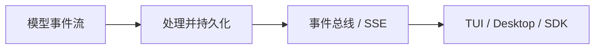
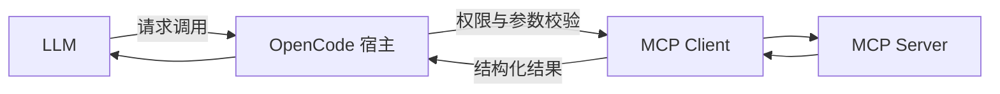
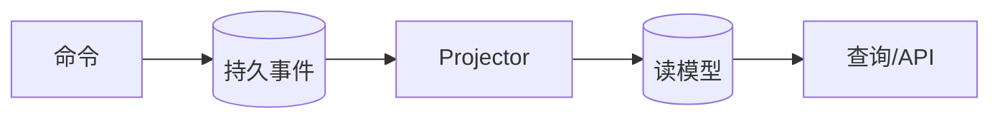

这篇不是词典，而是一张“源码阅读翻译表”：先弄清这些词在一般软件工程中的含义，再看它们在 OpenCode 里具体对应什么。

> **阅读提示**
> 同一个词可能有多层含义。例如“运行时”既可以指 Node.js/Bun，也可以指 OpenCode 用 Effect 组装出来的应用运行环境。读源码时要看上下文。

## 一、程序如何被运行

### 运行时（Runtime）

运行时是程序真正执行时所依赖的环境，负责调度代码、管理内存、提供文件和网络能力，并处理异步任务。

| 运行时 | 提供的典型能力 |
| --- | --- |
| 浏览器 | DOM、Web API、页面渲染 |
| Node.js / Bun | 文件、网络、进程、模块加载 |
| JVM | 字节码执行、垃圾回收、线程管理 |
| Effect Runtime | 在 JS 运行时之上组织服务、错误、并发和资源生命周期 |

OpenCode 的 TypeScript 最终仍由 JavaScript 运行时执行；Effect 不是替代 Bun/Node.js，而是在它们之上提供一套更可控的应用执行模型。详见 [opencode源码解析——Effect运行时与生命周期](/blog/opencode-源码解析-effect-运行时与生命周期)。

### Promise 与 Effect

`Promise<A>` 主要表达“未来可能得到一个 `A`”。Effect 常用下面的类型来描述一次计算：

```ts
Effect<A, E, R>
```

- `A`：成功时得到的值。
- `E`：已知、可处理的错误类型。
- `R`：运行这段程序需要的服务或环境。

例如，“读取会话”不仅可能返回会话，还可能明确失败为 `NotFoundError`，并要求数据库服务存在。Effect 把这些信息放进类型，而不是藏在注释和运行时异常里。

### Service、Layer、ManagedRuntime

| 概念 | 作用 | 可以怎样理解 |
| --- | --- | --- |
| `Service` | 描述模块对外提供的能力 | 一份接口契约 |
| `Layer` | 创建服务及其依赖 | 服务的装配说明 |
| `ManagedRuntime` | 保存装配完成的服务并执行 Effect | 已经启动的应用环境 |

OpenCode 的 `AppLayer` 会把数据库、配置、模型、会话、工具、权限、MCP、LSP 等服务组合起来，再交给 `ManagedRuntime`。这比在每个函数里手工创建并层层传递对象更适合大型应用。

### Fiber、Scope 与中断

- **Fiber**：Effect 管理的轻量并发任务，不等于操作系统线程。
- **Scope**：一组资源和任务的生命周期边界。
- **Finalizer**：Scope 结束时必定执行的清理动作。
- **Interrupt**：协作式取消。被取消的任务会结束，并触发相应清理逻辑。

这套机制适合 LLM 流、工具调用、事件订阅、文件监视器等长时间运行的工作。用户中断任务时，系统需要停止的不只是一个函数，还包括它派生出的相关异步工作。

## 二、应用怎样对外提供能力

### Host、Client、Server

- **Host（主机）**：运行程序的设备或执行环境。它是一种“位置/机器”概念，不等同于客户端或服务器。
- **Client（客户端）**：主动发起请求的一方，例如 TUI、桌面应用或 SDK 调用方。
- **Server（服务器）**：接收请求并提供能力的一方，例如 OpenCode 的 HTTP 服务。

同一台电脑可以同时运行 Client 和 Server。OpenCode 的桌面端可以连接本机服务，也可以通过协议连接其他运行位置，所以不要把“客户端”简单理解成用户电脑，把“服务器”简单理解成云端电脑。

### CLI、TUI、API、SDK

| 概念 | 定义 | OpenCode 中的用途 |
| --- | --- | --- |
| CLI | 通过命令和参数操作程序 | 启动任务、服务或辅助命令 |
| TUI | 在终端中绘制交互界面 | 展示消息流、工具状态和权限询问 |
| API | 服务对外约定的调用协议 | HTTP 路由、请求和响应结构 |
| SDK | 对 API 的编程语言封装 | 让 JS/TS 程序更方便地调用服务 |

`SDK v2` 表示一套客户端 API 版本；它不自动等于本文所说的“Session V2 内核”。判断架构时应该看服务实际调用的是 `SessionPrompt` 还是 `SessionV2.Service`。

### 流式响应与 SSE

模型生成内容不是一次性返回，而是持续产生文本增量、推理片段、工具调用和结束事件。服务端可通过 SSE（Server-Sent Events）把事件沿一条 HTTP 连接持续推送给客户端。



“流式”解决低延迟展示问题；“持久化”解决断线重连和历史恢复问题。两者不能互相替代。

## 三、Agent 领域概念

### Provider、Model、Agent、Tool

| 概念 | 回答的问题 |
| --- | --- |
| Provider | 请求发给哪家模型服务，以及怎样认证和适配协议？ |
| Model | 具体使用哪个模型及其能力、上下文窗口和参数？ |
| Agent | 用什么系统提示、权限、工具和策略完成任务？ |
| Tool | 模型可以请求系统执行哪些确定性操作？ |

模型只生成“我要调用 `read`，参数是某路径”这样的结构化意图；真正读文件的是 OpenCode 的工具实现。这个边界非常重要：模型负责决策，宿主程序负责校验、授权和执行。

### Session、Message、Part、Turn、Step

- **Session**：一次可持续、可恢复的任务容器。
- **Message**：用户或助手的一条结构化消息。
- **Part**：消息里的细粒度内容，如文本、附件、推理、工具调用或步骤边界。
- **Turn**：一次向模型发起请求并消费完整响应的过程。
- **Step**：Agent 循环里的一个执行单位；一次任务可能经过多次模型请求和工具调用。

这些词在不同模块中的结构略有差异，不能仅凭类名猜测。经典结构详见 [opencode源码解析——消息、上下文与压缩](/blog/opencode-源码解析-消息-上下文与压缩)，V2 结构详见 [opencode源码解析——Session V2与事件溯源](/blog/opencode-源码解析-session-v2-与事件溯源)。

### 上下文（Context）与记忆（Memory）

数据库保存的是完整执行记录；模型上下文是每次调用前，从记录中筛选、转换、压缩出来的有限输入。

```text
持久化历史 ≠ 模型当前看到的上下文
```

因此“系统记得某件事”至少有三种可能：数据仍在数据库中、数据仍在本轮模型上下文中、或者数据已经被压缩为摘要。三者不能混为一谈。

## 四、协议与扩展

### LSP：理解代码语义

LSP（Language Server Protocol）规定编辑器和语言服务器怎样交换诊断、定义、引用、符号等信息。

文本搜索只能找到相同字符串；LSP 可以在语言规则允许的范围内判断“这个符号到底指向哪个定义”。不过 LSP 的能力取决于语言服务器和项目是否正确初始化，不能把它当成绝对正确的代码理解器。

### MCP：给模型接入外部工具和资源

MCP（Model Context Protocol）让宿主应用以统一协议连接外部工具、资源和提示服务。OpenCode 在这里扮演 MCP Client；数据库、浏览器或企业服务可以作为 MCP Server。



MCP 并不意味着模型可以直接访问外部系统。请求仍经过 OpenCode 的工具适配、权限判断、执行和结果截断。

### ACP：连接 Agent 与交互客户端

ACP（Agent Client Protocol）关注 Agent 与编辑器/客户端之间的交互约定，例如建立会话、传递消息、展示工具调用和处理权限请求。它与 MCP 的关注点不同：ACP 更偏向“客户端怎样使用 Agent”，MCP 更偏向“Agent 宿主怎样接入工具和上下文”。

### Plugin 与 Skill

- **Plugin**：可执行的扩展代码，可以注册工具或挂入生命周期钩子。
- **Skill**：按需加载的任务说明和配套资源，主要改变 Agent 怎样做事。

Skill 更接近“可复用工作方法”，Plugin 更接近“可执行软件扩展”；两者都能扩展能力，但风险和生命周期不同。

## 五、事件与持久化

### Event、Event Sourcing、Projector、Read Model

- **Event**：已经发生的事实，如“提示已接收”“工具已完成”。
- **Event sourcing（事件溯源）**：把事实事件作为状态演变的依据，而不只保存最终状态。
- **Projector（投影器）**：消费事件并更新便于查询的表。
- **Read model（读模型）**：为列表、详情和上下文查询准备的当前状态视图。



好处是执行过程可回放、可订阅，也能区分“事实已记录”和“后台工作是否已经完成”。代价是系统必须认真处理事件顺序、幂等、投影一致性和恢复策略。

### Durable、Process-local、Idempotency

- **Durable（持久）**：进程退出后仍然存在，例如数据库中的已接收提示。
- **Process-local（进程内）**：只存在于当前进程内，例如某个正在运行的 Fiber 或协调器 Map。
- **Idempotency（幂等）**：相同请求重试多次，效果仍等价于执行一次。

Session V2 先把 prompt 持久化，再唤醒执行器，正是为了让“请求已经被接收”不依赖某个短暂的内存任务。详见 [opencode源码解析——Session V2与事件溯源](/blog/opencode-源码解析-session-v2-与事件溯源)。

## 六、最容易混淆的几组词

| 容易混淆 | 正确区分 |
| --- | --- |
| Runtime 与 JS runtime | Effect Runtime 是应用级执行模型，仍运行在 Bun/Node.js 上 |
| Client 与 Host | Client 是角色，Host 是运行位置 |
| Model 与 Agent | Model 提供生成能力；Agent 组合模型、提示、工具和权限 |
| Tool 与 MCP | Tool 是模型可调用能力；MCP 是其中一类外部能力接入协议 |
| 历史与上下文 | 历史可以完整持久化；上下文是发给模型的有限视图 |
| Event 与当前状态 | Event 是发生过的事实；当前状态通常由事件投影得到 |
| SDK v2 与 Session V2 | 一个是客户端 API 版本，一个是会话执行内核的设计代际 |

## 源码入口

- Effect 应用装配：`packages/opencode/src/effect/app-runtime.ts`
- 经典会话编排：`packages/opencode/src/session/prompt.ts`
- 工具规范：`packages/opencode/src/tool/tool.ts`
- V2 会话接口：`packages/core/src/session.ts`
- V2 持久输入：`packages/core/src/session/input.ts`
- V2 事件投影：`packages/core/src/session/projector.ts`

返回总目录：[00 OpenCode 源码阅读导航](/blog/opencode-源码阅读导航)
