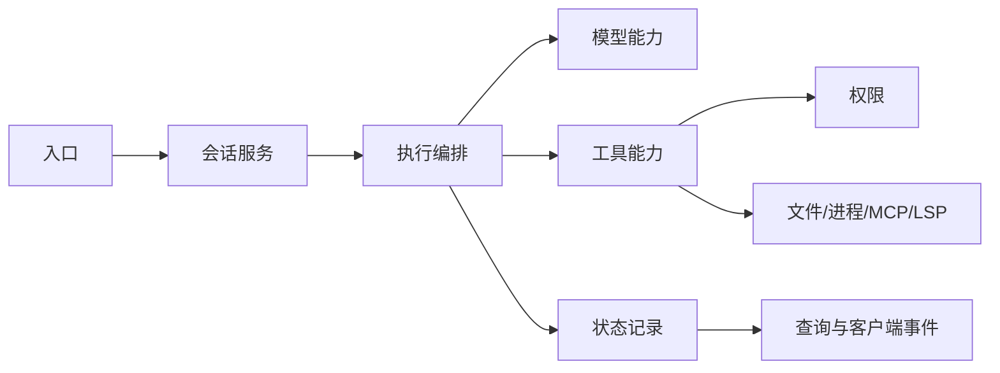
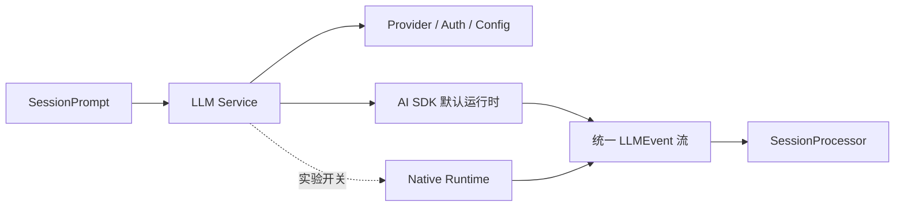
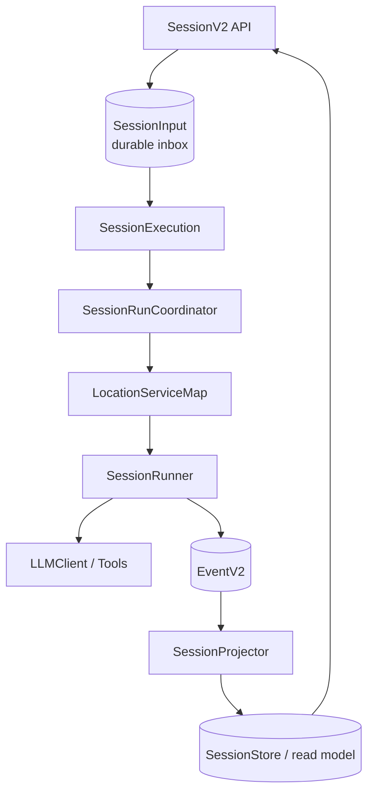

[opencode源码解析——总体概览](/blog/opencode-source-overview) 讨论系统分层；这篇只讨论模块边界：每个模块拥有哪部分事实、依赖谁，以及为什么不能随意合并。

## 1. 模块边界的核心问题

读一个模块时，可以连续问四个问题：

1. 它拥有哪类状态？
2. 它接受什么输入、产生什么输出？
3. 它调用谁，谁又调用它？
4. 出错、中断或重启后，责任落在哪一层？

用这四个问题看 OpenCode，会发现系统并不是按“文件操作、网络操作、模型操作”简单分类，而是按生命周期和一致性边界拆分。

## 2. 经典栈的主要模块

### 2.1 入口与实例

| 模块 | 主要职责 | 关键边界 |
| --- | --- | --- |
| `src/index.ts` | 解析命令并注册 CLI/TUI/serve/MCP/ACP 等入口 | 不直接实现 Agent 循环 |
| `src/server` | Hono 路由、请求校验、SSE/API 输出 | 把业务委托给 Service |
| `src/effect/app-runtime.ts` | 组合应用级 Layer，提供执行 Effect 的 Runtime | 负责装配，不拥有会话业务 |
| `src/project` | 解析项目、工作树和实例上下文 | 隔离不同目录的配置与资源 |

经典栈采用“全局应用运行时 + 项目实例上下文”。很多调用从普通 Promise/API 边界进入 Effect，再在当前 Instance 中取得目录、worktree 和相关服务。

### 2.2 会话与执行

| 模块 | 主要职责 | 关键输出 |
| --- | --- | --- |
| `Session` | 会话和消息的查询、写入、事件 | Session、Message、Part |
| `SessionPrompt` | 接收 prompt、创建用户消息、驱动主循环 | 最终 Assistant Message |
| `SessionRunState` | 保证同一 session 的运行状态协调 | 正在运行或复用中的任务 |
| `SessionProcessor` | 消费模型流，把事件写成 Part | text/reasoning/tool/step 等状态 |
| `SessionCompaction` | 判断上下文溢出、创建并执行压缩 | 摘要和压缩边界 |
| `SessionSummary` | 汇总会话变更和文件 diff | 面向 UI 的摘要信息 |

`SessionPrompt` 是编排者，但不应该亲自实现模型协议或文件读写。它只决定“现在该调用谁、结果是否足以结束”。

### 2.3 模型相关模块

| 模块 | 职责 |
| --- | --- |
| `Provider` | 找到模型、Provider 配置和能力信息 |
| `LLM` | 组合 system/messages/tools/参数并发起流式请求 |
| AI SDK runtime | 默认的多 Provider 调用实现 |
| Native runtime | 实验性、只覆盖部分 Provider 的另一条执行路径 |
| `LLMEvent` | 把不同底层运行时归一为处理器能消费的事件 |

这里的深模块思想是：上层只理解统一事件，不需要知道 Anthropic、OpenAI 或另一套 runtime 的每个协议差异。

### 2.4 工具与权限

| 模块 | 职责 |
| --- | --- |
| `Tool.Def` | 定义名称、描述、参数 schema 和执行函数 |
| `ToolRegistry` | 收集内置、配置目录和插件工具，并按模型筛选 |
| `SessionTools` | 加入上下文、权限、钩子和 MCP 工具，适配给模型 SDK |
| `Permission` | 合并并评估 allow/ask/deny 规则，等待用户答复 |
| `Truncate` | 控制工具输出大小，避免撑爆模型上下文 |
| `SessionProcessor` | 保存工具调用从 pending 到 completed/error 的过程 |

工具模块的详细数据流见 [opencode源码解析——工具、权限与MCP](/blog/opencode-源码解析-工具-权限与-mcp)。

### 2.5 外部能力

| 模块 | 连接的外部世界 | 为什么独立 |
| --- | --- | --- |
| `MCP` | 外部 MCP Servers | 有连接、认证、协议转换和资源生命周期 |
| `LSP` | 各语言服务器 | 与项目语言、进程和工作目录绑定 |
| `Plugin` | 本地/第三方插件 | 需要发现、加载和生命周期钩子 |
| `Snapshot` | Git 支持的变更快照 | 与消息文本不是同一种状态 |
| `Format` | 修改后的代码格式化 | 需要按语言和配置选择命令 |
| `Question` | Agent 向用户请求结构化回答 | 需要跨执行流等待 UI 回应 |

## 3. Session V2 的模块重分配

V2 没有简单复制 `SessionPrompt`，而是把“接收、调度、执行、记录、查询”拆开。

| 模块 | 拥有的责任 | 特别注意 |
| --- | --- | --- |
| `SessionV2` | 会话 API 和 prompt admission | `prompt` 成功表示输入已接收，不一定表示已执行完 |
| `SessionInput` | 未处理输入的 durable inbox | 区分 `steer` 与 `queue`，记录 admitted/promoted 序号 |
| `SessionExecution` | 只按 session ID 发出 resume/wake/interrupt | 不携带目录级服务 |
| `SessionRunCoordinator` | 当前进程中同一 session 的串行拥有权 | 不同 session 可并发；不是分布式锁 |
| `LocationServiceMap` | 按目录/workspace 懒加载服务集合 | 工具、配置、文件能力不会串项目 |
| `SessionRunner` | 提升输入、调用模型、结算工具、决定下一轮 | 每个 provider turn 显式调用一次 `llm.stream` |
| `EventV2` | 保存并广播发生过的 durable facts | 事件顺序是正确恢复的基础 |
| `SessionProjector` | 把事件投影到可查询表 | 投影不是事实源本身 |
| `SessionStore` | 查询 session/message/context 读模型 | 不负责编排执行 |

详见 [opencode源码解析——Session V2与事件溯源](/blog/opencode-源码解析-session-v2-与事件溯源)。

## 4. 五条最重要的依赖方向

### 4.1 入口依赖业务服务，业务服务不依赖界面

TUI、Desktop、HTTP handler 都可以触发会话，但会话核心不应引用某个具体 UI 组件。否则增加一个新客户端就要改 Agent loop。

### 4.2 编排器依赖工具抽象，不依赖具体工具

编排器只需要一张“工具名 → 可调用定义”的表。`read`、`bash`、MCP 工具甚至插件工具都通过相同边界进入模型层，因此新增工具通常不需要修改 loop。

### 4.3 工具依赖权限服务，模型不能直接批准自己

权限是宿主系统的安全策略，不是 prompt 中的一句建议。模型可以请求工具，却不能把自己的输出当成用户授权。

### 4.4 写模型与读模型分离

V2 通过事件记录状态变化，再由 Projector 更新查询表。这样执行端更关注“发布了什么事实”，API 更关注“当前怎样高效查询”。两者通过事件 schema，而不是共享一大块可变对象来耦合。

### 4.5 全局调度与 location 能力分离

`SessionExecution` 只认识 session ID；真正的 Runner、工具、配置和文件系统由 session 的 location 决定。这样未来把某个 location 放到另一执行节点时，路由边界已经存在。

## 5. 同步边界、异步边界、持久边界

判断一个调用是否可靠，不能只看函数返回值，还要看它跨了哪种边界。

| 边界 | 示例 | 失败后的含义 |
| --- | --- | --- |
| 同步内存调用 | 参数转换、规则匹配 | 当前调用立即失败，没有持久状态 |
| 异步进程内调用 | Fiber、工具执行、LLM stream | 进程退出可能中断，需要清理或恢复 |
| 持久化调用 | 写 Message、Event、SessionInput | 成功后重启仍可观察 |
| 外部网络调用 | Provider、MCP | 可能出现超时、重复请求和未知结果 |

V2 的 `prompt -> admit -> wake` 顺序很典型：先跨持久边界，再做可失败的进程内调度。

## 6. 模块之间用什么“语言”沟通

| 边界 | 交换的数据 |
| --- | --- |
| Client → Server | HTTP/ACP 请求、SDK 类型 |
| Session → LLM | system parts、模型消息、tool definitions |
| LLM → Processor/Runner | `LLMEvent` 流 |
| Model → Tool | tool name、call ID、schema 化参数 |
| Tool → Model | 结构化结果、文本输出、附件、错误 |
| Runtime → UI | 消息/事件更新、SSE 数据 |
| Event → Projector | 带 session 和顺序信息的 durable event |

边界数据越稳定，上下游越容易独立演进。`LLMEvent` 和 `Tool.Def` 的价值，就在于把变化频繁的 Provider/工具实现挡在统一接口后面。

## 7. 设计上的取舍

### 收益

- Provider、工具、UI 可以相对独立地扩展。
- 执行过程结构化，支持流式 UI、恢复、审计和调试。
- Effect 让依赖、错误、取消和资源生命周期更显式。
- V2 的 durable inbox 与事件投影为可靠执行打下基础。

### 成本

- 同一个业务动作会跨多个服务，初读源码不如单体函数直观。
- 经典与 V2 共存期间，名字和数据结构容易混淆。
- 事件溯源需要严格处理顺序、幂等、投影与恢复。
- Effect 的服务、Layer、Scope、Fiber 有额外学习成本。

模块化不是让代码“看起来更分散”，而是在变化、错误和生命周期真正不同的位置建立边界。OpenCode 的复杂度主要来自它同时管理模型流、真实工具、长生命周期会话和多个客户端，这些边界是其复杂度的结果，而不是纯粹的架构装饰。

## 8. 按问题定位源码

| 想回答的问题 | 先看哪里 |
| --- | --- |
| 请求怎样进入经典 Agent loop？ | `packages/opencode/src/session/prompt.ts` |
| 模型事件怎样变成消息片段？ | `packages/opencode/src/session/processor.ts` |
| 工具怎样注册和过滤？ | `packages/opencode/src/tool/registry.ts` |
| 权限为何弹窗或拒绝？ | `packages/opencode/src/permission/index.ts` |
| V2 prompt 为什么不容易丢？ | `packages/core/src/session/input.ts` |
| 同一 session 怎样避免并行乱序？ | `packages/core/src/session/run-coordinator.ts` |
| V2 当前状态从哪里查？ | `packages/core/src/session/store.ts`、`projector.ts` |
| 目录相关服务怎样隔离？ | `packages/core/src/location-layer.ts` |

## 源码基线

本文依据 OpenCode `1.17.8`、commit `355a0bc`。模块边界处于演进期，阅读新版本时优先核对 `AppLayer`、`SessionV2.Interface`、`LocationServiceMap` 和实际 HTTP handlers 的依赖。

返回总目录：[00 OpenCode 源码阅读导航](/blog/opencode-源码阅读导航)
